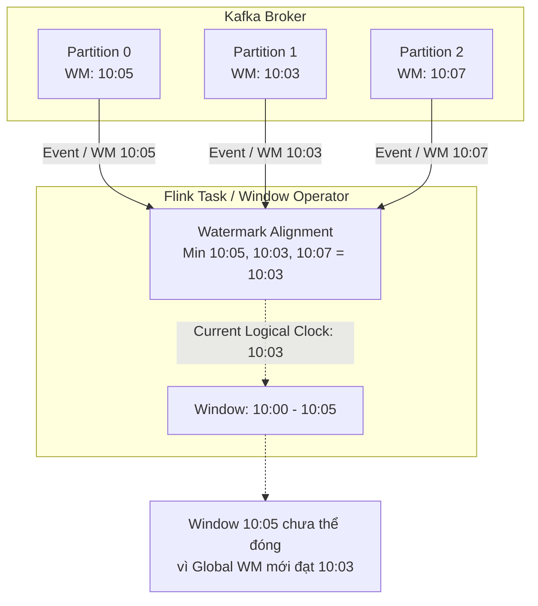
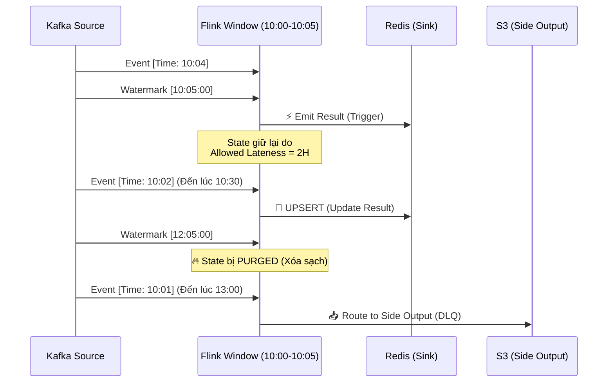

Trong các hệ thống phân tích dữ liệu luồng (Stream Processing), việc tính toán aggregate (tổng, trung bình, count) chỉ là phần ngọn. Câu hỏi nền tảng và hóc búa nhất mà mọi kiến trúc sư dữ liệu phải đối mặt là: **"Khi nào thì hệ thống biết chắc chắn rằng một Window (khung thời gian) ĐÃ ĐÓNG và có thể tự tin xuất kết quả ra ngoài?"**.

Trong một mạng phân tán thực tế, dữ liệu không bao giờ hoàn hảo. Hiện tượng **Clock Skew** (lệch đồng hồ) trên thiết bị mobile, nghẽn mạng 5G, đứt cáp quang, hay lỗi Garbage Collection (GC) ở các hệ thống upstream khiến dữ liệu đến muộn hoặc sai thứ tự (Out-of-order) là điều không thể tránh khỏi.

Để giải quyết bài toán định tuyến thời gian này, Apache Flink đã triển khai khái niệm **Watermarks** - một trong những thiết kế thanh lịch nhất kế thừa từ Google Dataflow model.

---

## 1. Nghịch lý Thời gian trong Hệ thống Phân tán (Time Semantics)

Trước khi bàn về Watermark, chúng ta phải rạch ròi 3 trục thời gian trong Stream Processing:

- **Event Time:** Thời điểm sự kiện *thực sự xảy ra* tại thiết bị nguồn (ví dụ: client click mua hàng lúc `10:00:05 AM`). Timestamp này được nhúng (embed) thẳng vào payload JSON/Protobuf. Đây là **chân lý khách quan** duy nhất để phân tích dữ liệu chính xác.
- **Processing Time:** Thời điểm node Worker của Flink nhận được sự kiện, đo bằng đồng hồ hệ thống của JVM.
- **Ingestion Time:** Thời điểm sự kiện đi vào Broker (ví dụ: Kafka `LogAppendTime`).

> [!CAUTION] Cạm bẫy của Processing Time
> Nếu sử dụng Processing Time cho các báo cáo tài chính, một sự cố rớt mạng 5 phút ở upstream sẽ đẩy toàn bộ doanh thu của khung `10:00` sang `10:05`. Ở quy mô hàng triệu TPS, điều này làm hỏng hoàn toàn các mô hình Machine Learning Real-time và gây sai lệch nghiêm trọng cho báo cáo doanh thu. Đóng dấu **Event Time** là tiêu chuẩn bắt buộc cho Data Consistency.

---

## 2. Watermarks: Cỗ máy Thời gian của Flink (Logical Clock)

### Bản chất Vật lý của Watermarks

Trong hệ thống Flink, luồng dữ liệu không sắp xếp ngoan ngoãn theo thứ tự tăng dần (`[10:01] -> [10:03] -> [10:02]`). 

**Watermark(t)** là một Control Event (tín hiệu điều khiển) chạy ngầm xen kẽ với luồng dữ liệu chính (Data Stream). Nó là một lời thề của hệ thống: *"Tôi đoan chắc rằng toàn bộ các sự kiện có Event Time <= t đã đến đủ. Sẽ không còn dữ liệu nào cũ hơn t đi qua đây nữa!"*.

Khi Watermark tiến qua ngưỡng cuối cùng của một Window (ví dụ: `10:05:00`), Window Operator của Flink sẽ đóng cửa sổ `[10:00 - 10:05]`, trigger hàm tính toán, và dọn dẹp state.

### Cơ chế Watermark Alignment (Đồng bộ Mực nước)

Một Flink Task thường nhận dữ liệu từ nhiều upstream partitions (ví dụ: Kafka có 30 partitions). Làm sao Task biết nên lấy Watermark nào?

Quy tắc sinh tồn của Flink: **Watermark của một Operator luôn là MIN của tất cả các input channels.**



---

## 3. Kiến trúc Xử lý Late Data (Late Data Architecture)

Khi sử dụng Heuristic Watermarks (vd: cho phép trễ 5 giây), bất kỳ dữ liệu nào đến sau khi Watermark đã vượt qua Window sẽ bị coi là **Late Data**. Flink cung cấp 3 lớp phòng thủ cho dữ liệu trễ:

### Lớp 1: Bỏ qua (Drop) - Mặc định
Dữ liệu trễ sẽ bị drop thẳng tay. Phù hợp cho các use-case cần siêu tốc độ và chấp nhận sai số (ví dụ: đếm view TikTok, metric monitoring).

### Lớp 2: Allowed Lateness (Khoan hồng)
Cấu hình `.allowedLateness(Time.hours(2))` cho phép Window dù đã emit kết quả, nhưng **State** của nó (lưu trên RAM hoặc RocksDB) vẫn được giữ lại thêm 2 tiếng. 
- Khi Late Data chui vào, Flink sẽ tính toán lại.
- Flink phóng ra một bản ghi **UPSERT / Retraction** để cập nhật kết quả. Sink của bạn (như PostgreSQL, Apache Iceberg) bắt buộc phải hỗ trợ phép MERGE/UPSERT dựa trên Primary Key.

### Lớp 3: Side Output (Dead Letter Queue)
Nếu dữ liệu trễ tận 3 tiếng (vượt cả Allowed Lateness), Window State đã bị xóa sạch (Purged). Ta dùng **Side Output** bắt luồng dữ liệu "chết" này và xả ra S3 / GCS để chạy Batch Job (như Spark) backfill vào ngày hôm sau.



---

## 4. Mã Nguồn Thực Chiến (Executable Configuration)

Đoạn code Flink Java API chuẩn mực cho hệ thống Production, kết hợp Watermark Strategy, chống Idleness và bắt Side Output.

```java
import org.apache.flink.api.common.eventtime.WatermarkStrategy;
import org.apache.flink.connector.kafka.source.KafkaSource;
import org.apache.flink.connector.kafka.source.enumerator.initializer.OffsetsInitializer;
import org.apache.flink.streaming.api.datastream.SingleOutputStreamOperator;
import org.apache.flink.streaming.api.windowing.assigners.TumblingEventTimeWindows;
import org.apache.flink.streaming.api.windowing.time.Time;
import org.apache.flink.util.OutputTag;
import java.time.Duration;

// 1. Cấu hình Kafka Source (Modern API)
KafkaSource<String> source = KafkaSource.<String>builder()
    .setBootstrapServers("kafka-broker:9092")
    .setTopics("transaction-events")
    .setGroupId("fraud-detect-group")
    .setStartingOffsets(OffsetsInitializer.latest())
    .setValueOnlyDeserializer(new SimpleStringSchema())
    .build();

// 2. Định nghĩa Watermark Strategy chuẩn mực
WatermarkStrategy<String> watermarkStrategy = WatermarkStrategy
    .<String>forBoundedOutOfOrderness(Duration.ofSeconds(10)) // Bù trừ mạng trễ 10s
    .withTimestampAssigner((event, timestamp) -> extractEventTime(event))
    .withIdleness(Duration.ofMinutes(1)); // 🔥 CRITICAL: Chống Watermark Stall

// 3. Side Output Tag (DLQ)
final OutputTag<String> lateDataTag = new OutputTag<String>("late-data"){};

// 4. Định tuyến Window với Late Data Handling
SingleOutputStreamOperator<Result> resultStream = env
    .fromSource(source, watermarkStrategy, "Kafka Source")
    .keyBy(event -> extractUserId(event))
    .window(TumblingEventTimeWindows.of(Time.minutes(5)))
    .allowedLateness(Time.hours(2))      // Lưu State 2 tiếng
    .sideOutputLateData(lateDataTag)     // Dữ liệu > 2 tiếng đẩy vào DLQ
    .process(new AggregateTransactionFunction());

// 5. Physical Execution Sinks
resultStream.sinkTo(new PostgresUpsertSink()); // Main Sink: UPSERT
resultStream.getSideOutput(lateDataTag).sinkTo(new S3DeadLetterSink()); // DLQ Sink: APPEND
```

---

## 5. Rủi ro Vận hành & Trade-offs (Real-world Incidents)

Trong thực tế thiết kế hệ thống tại Uber hay Netflix, các Data Engineer phải liên tục đánh đổi và khắc phục các thảm họa liên quan đến Watermark:

### 🚨 Incident 1: Watermark Stall (Đứng hình hệ thống)
- **Tình huống:** Flink Window không xuất data. Dashboard real-time đóng băng.
- **Nguyên nhân:** Do cơ chế *Watermark Alignment (Min)*. Nếu có 1 Kafka partition không có dữ liệu mới (ví dụ: partition của một khu vực người dùng đi ngủ ban đêm), Watermark của partition đó sẽ đứng yên. Flink tính MIN, kéo theo Global Watermark của toàn bộ task đứng yên. Không một Window nào được trigger.
- **Khắc phục:** BẮT BUỘC phải dùng `.withIdleness(Duration.ofMinutes(1))`. Hàm này thông báo cho Flink: *"Nếu partition này không có data trong 1 phút, hãy phớt lờ nó đi, đừng lấy nó làm chuẩn MIN nữa"*.

### 🚨 Incident 2: Memory Explosion & OOMKilled (Tràn RAM)
- **Tình huống:** Job Flink Crash liên tục kèm mã lỗi `JVM OOMKilled`. Checkpoint duration tăng từ vài giây lên vài tiếng.
- **Nguyên nhân:** Set `allowedLateness` quá cao (ví dụ: 7 ngày). Flink phải gồng mình serialize/deserialize và giữ trạng thái (State) của hàng triệu khóa (Keys) suốt 7 ngày trong RocksDB và RAM. Hệ quả là State Bloat (phình to dữ liệu).
- **Trade-off:** Kiến trúc sư phải đàm phán với Business: 
  - *Latency vs State Size:* Thay vì lưu state 7 ngày trên hệ thống Real-time (rất đắt đỏ), chỉ set Allowed Lateness là 1 tiếng. Những data trễ hơn 1 tiếng sẽ đẩy ra S3 (Side Output) để chạy Spark Batch Job sửa lỗi (Lambda Architecture / Kappa fallback).

---

## Nguồn Tham Khảo (References)

* [Apache Flink Official Docs: Timely Stream Processing](https://nightlies.apache.org/flink/flink-docs-stable/docs/concepts/time/)
* [Streaming Systems: The What, Where, When, and How of Large-Scale Data Processing - Tyler Akidau](https://www.oreilly.com/library/view/streaming-systems/9781491983867/)
* [Uber Engineering: Real-Time Data Pipeline using Flink](https://www.uber.com/en-VN/blog/)
* [Stateful Stream Processing with RocksDB - Flink Forward](https://flink-forward.org/)
