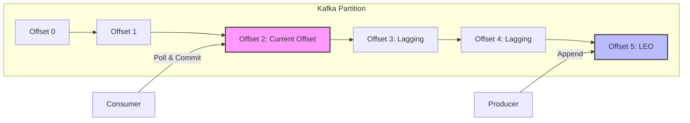
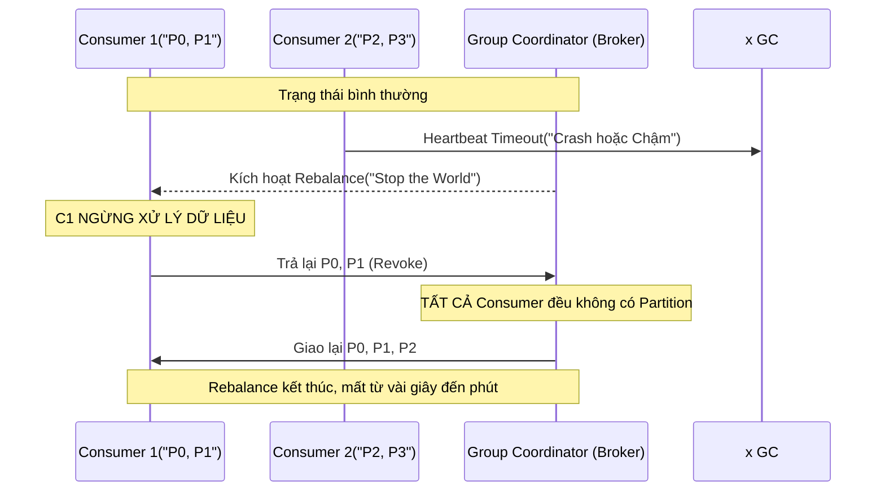

Trong môi trường phân tán Real-time Streaming xử lý hàng triệu message mỗi giây (như tại Uber, Netflix, Databricks), hai cơn ác mộng lớn nhất mà mọi Data Engineer và SRE phải đối mặt khi vận hành Apache Kafka chính là **Consumer Lag** (Độ trễ tiêu thụ) và **Consumer Rebalance Storm** (Bão tái phân bổ). Hai hiện tượng này không chỉ là những cảnh báo độc lập mà thường tạo thành một **vòng lặp chết chóc (cascading failure)**: Lag dẫn đến Rebalance, và Rebalance lại làm Lag tăng đột biến, cuối cùng dẫn đến gián đoạn dịch vụ diện rộng (Stop-the-World).

Bài viết này mổ xẻ sâu vào bản chất vật lý của hai hiện tượng này, phân tích các Trade-offs của các giao thức Rebalance, và cung cấp các cấu hình/patterns thực chiến từ các hệ thống quy mô lớn để khắc phục triệt để.

---

## 1. Bản chất Vật lý của Consumer Lag

Trong kiến trúc Kafka, Consumer không "được đẩy" (push) dữ liệu mà nó phải "kéo" (poll) dữ liệu về từ Broker. 

**Consumer Lag** là độ chênh lệch (delta) giữa hai con trỏ (pointers) trên một Partition:
1. **Log End Offset (LEO):** Vị trí của Message mới nhất được Producer ghi vào Partition.
2. **Current Offset:** Vị trí của Message cuối cùng mà Consumer Group đã xử lý và `commit` thành công lên Kafka (cụ thể là ghi vào internal topic `__consumer_offsets`).



*Lag trong trường hợp trên = LEO (5) - Current Offset (2) = 3 messages.*

### Phân loại Lag: Healthy vs. Unhealthy
- **Healthy Lag (Lag đàn hồi):** Do hiện tượng **Spike** (lưu lượng tăng đột biến, ví dụ: Uber x10 cuốc xe vào đêm giao thừa). Đồ thị Lag tăng lên dạng chóp bu rồi giảm dần về 0 khi Consumer bắt kịp. Hệ thống vẫn đang xử lý bình thường.
- **Unhealthy Lag (Lag tuyến tính):** Đường đồ thị Lag cắm đầu đi lên một góc 45 độ và không bao giờ giảm. Nguyên nhân cốt lõi là **Throughput của Consumer < Throughput của Producer**. 

### Nút thắt cổ chai (Bottlenecks) gây ra Unhealthy Lag
Sự chênh lệch Throughput thường không đến từ việc CPU hay RAM của Consumer yếu, mà đến từ **I/O Bound** trong code xử lý.
- Gọi API ngoại vi (3rd-party REST API) quá chậm.
- Ghi (Sink) dữ liệu vào Database từng dòng một (Row-by-row) thay vì dùng Batch Insert.
- Cấu hình `max.poll.records` quá lớn nhưng tài nguyên xử lý luồng không đủ, dẫn đến Timeout.

---

## 2. Rebalance Storm: Vòng Lặp Chết Chóc (Cascading Failure)

Để chia tải xử lý, nhiều Consumer tham gia vào một **Consumer Group**. Kafka quy định: **Một Partition chỉ được đọc bởi tối đa MỘT Consumer trong cùng một Group tại một thời điểm.** 

Khi có sự thay đổi về thành viên (Thêm Consumer, Bớt Consumer do crash), Kafka Group Coordinator sẽ kích hoạt **Rebalance** (Tái phân bổ Partition).

### Vấn đề của Giao thức Eager Rebalancing (Old Default)
Trong các phiên bản Kafka trước đây (sử dụng Eager Rebalance), quá trình này diễn ra theo mô hình **Stop-The-World**:



**Hậu quả:** Trong suốt thời gian Rebalance, không có bất kỳ một Consumer nào được phép xử lý dữ liệu. Nếu Group có hàng trăm Consumers (như ở Netflix), cả hệ thống sẽ phải ngưng đọng. Dữ liệu từ Producer vẫn đổ vào ầm ầm -> **Lag tăng vọt.**

### Bão Rebalance (Rebalance Storm) xảy ra như thế nào?
Giả sử code Consumer của bạn dính phải 1 logic I/O quá chậm (ví dụ: Gọi API mất 1s/message). 

1. Consumer A lấy về `max.poll.records = 500`.
2. Do logic chậm, Consumer A mất **500 giây** để xử lý xong mẻ này.
3. Trong khi đó, cấu hình `max.poll.interval.ms` (thời gian tối đa giữa 2 lần gọi hàm `poll()`) chỉ là **300 giây (5 phút)**.
4. Quá 5 phút mà Consumer A chưa `poll()` lại, Broker đánh giá A đã "chết lâm sàng".
5. Broker kích hoạt Rebalance, tước Partition của A giao cho Consumer B.
6. A xử lý xong sau 500s, gửi Commit Offset. Broker từ chối (bắn lỗi `CommitFailedException`).
7. A giật mình, cố gắng Re-join vào Group -> Lại kích hoạt Rebalance lần 2.
8. B vừa nhận Partition cũng mất 500s để xử lý -> Vòng lặp Rebalance chết chóc lặp lại vô tận.

---

## 3. Các Mô Hình Kiến Trúc Khắc Phục Triệt Để ở Big Tech

Việc khắc phục đòi hỏi phải hiểu rõ Trade-offs giữa tính khả dụng (Availability) và tính nhất quán (Consistency). Dưới đây là các kỹ thuật thực chiến ở các tập đoàn như Uber, Netflix, Databricks.

### 3.1. Chặn Đứng Stop-The-World bằng Incremental Cooperative Rebalancing
Từ Kafka 2.4 (KIP-429), Kafka giới thiệu một bước tiến vượt bậc: **Cooperative Rebalancing**.

Thay vì "Tịch thu tất cả, chia lại từ đầu", cơ chế mới hoạt động theo kiểu "Thương lượng từng phần":
- Broker tính toán và chỉ yêu cầu các Consumer trả lại ĐÚNG NHỮNG PARTITION CẦN CHUYỂN GIAO.
- Các Consumer không bị ảnh hưởng (đang giữ các Partition khác) **VẪN TIẾP TỤC XỬ LÝ DỮ LIỆU**. Hệ thống không bao giờ bị đứng hình 100%.

**Thực thi:**
Chỉ cần đổi tham số cấu hình trên Consumer Client:
```properties
partition.assignment.strategy=org.apache.kafka.clients.consumer.CooperativeStickyAssignor
```

### 3.2. Chống Bão khi Deploy (Rolling Update) với Static Membership
Khi bạn deploy ứng dụng Consumer trên Kubernetes bằng Rolling Update, Pod cũ bị hủy (Leave Group) -> Rebalance. Pod mới lên (Join Group) -> Rebalance. Deploy 100 Pods sinh ra 200 lần Rebalance! Đây là lý do kiến trúc Streaming thường rất kỵ việc scale-down.

**Giải pháp (KIP-345): Static Membership.**
Bạn cấp cho Consumer một danh tính cố định thông qua `group.instance.id`.
Khi Pod bị hủy, Kafka KHÔNG kích hoạt Rebalance ngay lập tức. Broker chờ trong khoảng `session.timeout.ms`. Nếu Pod khởi động lại và báo danh với đúng ID cũ đó, Broker mỉm cười giao lại Partition cũ cho nó, ngầm hiểu đây chỉ là "gián đoạn tạm thời", hoàn toàn **không ảnh hưởng đến các Consumer khác**.

**Cấu hình trên Kubernetes / Terraform:**
```yaml
env:
  - name: POD_NAME
    valueFrom:
      fieldRef:
        fieldPath: metadata.name
  # Truyền POD_NAME vào group.instance.id trong code
```
```properties
group.instance.id=${POD_NAME}
session.timeout.ms=120000 # Chờ 2 phút cho Pod khởi động xong
```

### 3.3. Xử lý I/O Heavy: Tách Luồng Poll và Luồng Xử Lý [Pause/Resume Pattern]
Nếu bạn bị dính lỗi `max.poll.interval.ms` do xử lý quá chậm, tăng tham số này lên quá cao (ví dụ: 30 phút) là một Bad Practice vì nó làm chậm quá trình phát hiện Consumer thực sự bị sập.

**Kiến trúc tối ưu:** Tách biệt luồng I/O mạng của Kafka ra khỏi luồng xử lý Business Logic.
- **Main Thread (Kafka Poll Thread):** Chỉ có nhiệm vụ `poll()` dữ liệu nhanh nhất có thể, duy trì nhịp tim, đẩy record vào một Buffer nội bộ (Queue).
- **Worker Threads (Thread Pool):** Kéo dữ liệu từ Buffer ra xử lý.
- **Pause/Resume Pattern:** Để chống tràn RAM (OOM) khi Worker làm không kịp, Main Thread sẽ gọi API `consumer.pause(partitions)` để ngừng kéo data mới từ Broker, nhưng VẪN GỌI `poll()` để duy trì tín hiệu sống. Khi Buffer vơi đi, gọi `consumer.resume(partitions)`.

```python
# Pseudo-code minh họa kiến trúc Pause/Resume bằng Python (confluent-kafka)
while True:
    if internal_queue.qsize() > MAX_QUEUE_SIZE:
        # Hàng đợi đầy -> Tạm dừng kéo data, nhưng vẫn gọi poll() để giữ kết nối
        consumer.pause(consumer.assignment())
    else:
        # Buffer đã vơi -> Tiếp tục kéo
        consumer.resume(consumer.assignment())
        
    msg = consumer.poll(1.0)
    if msg is not None:
        internal_queue.put(msg) # Đẩy vào queue cho Worker Threads xử lý
```

*Trade-off: Cách này đòi hỏi bạn phải tự quản lý logic Commit Offset bằng tay (Manual Commit) cực kỳ cẩn thận sau khi Worker xử lý xong để đảm bảo At-Least-Once, dễ sinh lỗi trùng lặp (Duplicates) nếu không có cơ chế Idempotent ở Sink.*

---

## 4. Kiến Trúc Giám Sát (Monitoring & Observability)

Không thể mù mờ với Consumer Lag. Bạn cần giám sát ở tầng Infrastructure.

### Đừng dùng Offset Sensor đơn giản, hãy dùng LinkedIn Burrow
Các hệ thống đơn giản chỉ trừ LEO cho Current Offset và báo động khi Lag > 10,000. Điều này sinh ra vô số **Cảnh báo giả (False Positives)** mỗi khi có Flash Sale (Healthy Lag).

**Burrow** (phát triển bởi LinkedIn) cung cấp khả năng đánh giá trạng thái Lag theo **cửa sổ thời gian trượt (Sliding Window)** thay vì con số tĩnh:
- **Trạng thái OK:** Lag có thể lớn, nhưng Offset của Consumer VẪN ĐANG TĂNG chứng tỏ nó vẫn đang làm việc và xử lý kịp.
- **Trạng thái WARNING:** Lag tăng, tốc độ Consumer Offset đang chậm dần.
- **Trạng thái ERROR:** Consumer hoàn toàn không dịch chuyển Offset trong nhiều phút (Bị sập hoặc dính Rebalance Storm).

Nếu dùng stack **Prometheus + Grafana + Kafka Exporter**, hãy viết PromQL dựa trên đạo hàm để đo tốc độ tăng Lag (Rate of change) thay vì giá trị tuyệt đối.

---

## Nguồn Tham Khảo (References)

1. **[KIP-429: Kafka Consumer Incremental Cooperative Rebalancing][https://cwiki.apache.org/confluence/display/KAFKA/KIP-429%3A+Kafka+Consumer+Incremental+Cooperative+Rebalancing]** - Tài liệu thiết kế chính thức của Apache Kafka về cơ chế Rebalance mới, khắc phục sự cố Stop-The-World.
2. **[KIP-345: Introduce static membership protocol to reduce consumer rebalances][https://cwiki.apache.org/confluence/display/KAFKA/KIP-345%3A+Introduce+static+membership+protocol+to+reduce+consumer+rebalances]** - Giải pháp cấu hình `group.instance.id` tối quan trọng cho K8s Deployments.
3. **[LinkedIn Engineering: Burrow - Kafka Consumer Monitoring Reinvented][https://engineering.linkedin.com/blog/2015/06/burrow-kafka-consumer-monitoring-reinvented]** - Bài toán phân tích False Positives trong giám sát Lag và giải pháp thiết kế kiến trúc Burrow.
4. **[Confluent Blog: Everything You Need to Know About Kafka Rebalance](https://www.confluent.io/blog/kafka-rebalance-protocol-static-membership/]** - Phân tích chi tiết vòng đời Rebalance Protocol.
5. **Designing Data-Intensive Applications (Martin Kleppmann)** - Chương 11: Stream Processing - Tổng quan kiến trúc của Log-based message brokers.
