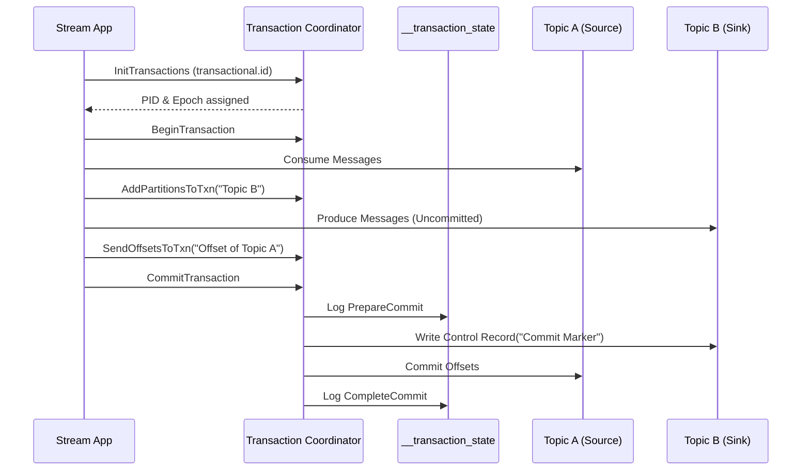
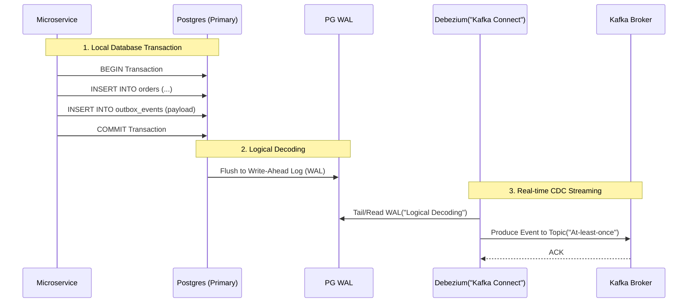

Trong thiết kế hệ thống phân tán (Distributed Systems), một trong những bài toán kinh điển và khó nhằn nhất là đảm bảo **Exactly-Once Semantics (EOS - Xử lý chính xác một lần)**. Làm thế nào để đảm bảo một sự kiện (ví dụ: trừ tiền tài khoản) không bị thất lạc (Data Loss) và cũng không bị xử lý nhân đôi (Duplicate Processing) khi network chập chờn, máy chủ crash, hoặc rớt kết nối Database?

Bài viết này mổ xẻ kiến trúc vật lý bên dưới hai mảnh ghép quan trọng nhất để đạt được sự toàn vẹn dữ liệu trong Data Streaming:
1. Cơ chế **Idempotent Producer** và **Transactions** bên trong Apache Kafka.
2. Mẫu thiết kế **Transactional Outbox Pattern** kết hợp Change Data Capture (CDC) để xử lý bài toán Dual-Write.

---

## 1. Apache Kafka Exactly-Once Semantics (EOS) Architecture

Trước Kafka 0.11, Kafka chỉ hỗ trợ *At-least-once* (Ít nhất một lần) hoặc *At-most-once* (Tối đa một lần). Việc Retry khi không nhận được ACK từ Broker dễ dàng dẫn đến Duplicate. Để đạt được EOS, Kafka đã thiết kế lại giao thức truyền thông bằng hai cơ chế cốt lõi.

### 1.1. Idempotent Producer (Single-Partition)

Ý tưởng của Idempotent Producer vay mượn từ giao thức TCP. Nó giúp Producer có thể gửi lại (Retry) một gói tin bao nhiêu lần tùy ý mà Broker vẫn đảm bảo không bị ghi trùng lặp trên một Partition.

**Kiến trúc thực thi vật lý:**
- Khi khởi tạo, Producer được Broker cấp một **Producer ID (PID)** duy nhất và một `epoch`.
- Mỗi batch tin nhắn gửi đi được gắn một **Sequence Number** (bắt đầu từ 0 và tăng dần).
- Tại Kafka Broker, mỗi Partition duy trì một bảng map trong bộ nhớ (Memory) ghi lại `Sequence Number` lớn nhất đã nhận được từ mỗi `PID`.
- Khi Broker nhận một batch, nó kiểm tra:
  - Nếu `SeqNum == LastSeqNum + 1`: Chấp nhận ghi vào Log.
  - Nếu `SeqNum <= LastSeqNum`: Đây là bản sao bị trùng (Duplicate do Retry), Broker âm thầm bỏ qua và trả về `ACK`.
  - Nếu `SeqNum > LastSeqNum + 1`: Báo lỗi `OutOfOrderSequenceException` (Có khoảng trống dữ liệu bị mất).

**Cấu hình thực chiến (Kafka Properties):**
Từ Kafka 3.0, tính năng này được **bật mặc định**. Nếu dùng bản cũ, bạn cấu hình:
```properties
enable.idempotence=true
# Các cấu hình ngầm định tự động ép buộc khi bật idempotence:
acks=all
max.in.flight.requests.per.connection<=5
retries=2147483647
```

### 1.2. Kafka Transactions (Multi-Partition & Read-Process-Write)

Idempotence chỉ giải quyết bài toán P2P (Point-to-Point) trên một Partition. Nhưng trong Stream Processing (Kafka Streams, Flink), luồng dữ liệu luôn là **Read - Process - Write**. Bạn đọc dữ liệu từ Topic A, biến đổi, ghi vào Topic B, và cuối cùng phải Commit Offset của Topic A. 

Nếu ứng dụng crash giữa chừng, bạn có thể đã ghi vào Topic B nhưng chưa commit Offset Topic A. Khi restart, ứng dụng sẽ đọc lại và sinh ra duplicate ở Topic B.

Để giải quyết, Kafka triển khai **Kafka Transactions** dựa trên biến thể của giao thức **Two-Phase Commit (2PC)**, được điều phối bởi **Transaction Coordinator** và lưu trạng thái vào topic nội bộ `__transaction_state`.



**Cách hoạt động của Marker Records:**
Khi Producer ghi dữ liệu trong Transaction, dữ liệu thực tế **ngay lập tức** được nối (append) vào log của Topic B trên đĩa, nhưng nó vô hình với Consumer. Khi giao dịch Commit, Transaction Coordinator sẽ ghi một **Control Record** (Marker) đặc biệt vào cuối partition của Topic B.

**Cấu hình Consumer để tránh "đọc bẩn" (Dirty Read):**
Nếu không cấu hình, Consumer mặc định sẽ đọc mọi thứ. Để Consumer chỉ đọc các message đã được Commit, bạn BẮT BUỘC phải dùng:
```properties
isolation.level=read_committed
```
Bên dưới, Broker sẽ duy trì một con trỏ gọi là **LSO (Last Stable Offset)**. Consumer chỉ được phép fetch dữ liệu nhỏ hơn LSO.

---

## 2. The Dual-Write Problem & Transactional Outbox Pattern

Dù Kafka EOS hoàn hảo, nó chỉ nằm gọn trong ranh giới cụm Kafka. Thực tế trong kiến trúc Microservices, hệ thống thường đối mặt với **Dual-Write**: 
1. `INSERT` dữ liệu đơn hàng vào PostgreSQL.
2. `PRODUCE` sự kiện `OrderCreated` vào Kafka để service Inventory trừ kho.

Nếu không dùng Distributed Transaction (ví dụ: XA Protocol - vốn cực kỳ chậm), lỗi mạng ở bước 2 sẽ dẫn đến **Bất đồng bộ trạng thái (State Inconsistency)**: Database có đơn hàng, nhưng Kafka không có event, kho không được trừ.

### 2.1. Kiến trúc Transactional Outbox kết hợp CDC (Debezium)

Giải pháp tiêu chuẩn ngành (Industry Standard) để giải quyết Dual-Write là **Transactional Outbox Pattern** kết hợp với Change Data Capture (CDC). Thay vì ứng dụng trực tiếp gọi API Kafka, ứng dụng sẽ ghi sự kiện vào một bảng tạm `outbox_events` nằm chung trong một ACID Database Transaction cùng với dữ liệu nghiệp vụ.



**Code thực chiến (PostgreSQL):**
Thay vì quản lý bảng Outbox truyền thống, bạn có thể dùng một bảng cực kỳ đơn giản:
```sql
CREATE TABLE outbox_events (
    id UUID PRIMARY KEY DEFAULT gen_random_uuid(),
    aggregate_type VARCHAR(255) NOT NULL,
    aggregate_id VARCHAR(255) NOT NULL,
    type VARCHAR(255) NOT NULL,
    payload JSONB NOT NULL,
    created_at TIMESTAMP DEFAULT NOW()
);
```
*Lưu ý:* Debezium sẽ đọc trực tiếp từ Write-Ahead Log (WAL) thông qua `pgoutput` plugin. Do đó, ngay khi Transaction được Commit xuống đĩa, Debezium sẽ bắt được sự kiện gần như tức thời (Sub-millisecond latency) mà **không cần Polling (`SELECT`)** gây sập DB.

---

## 3. Systemic Trade-offs & Operational Risks (Lỗi Thực Chiến)

Mọi giải pháp thiết kế hệ thống đều đòi hỏi sự đánh đổi. EOS và Outbox Pattern mang lại độ tin cậy tuyệt đối, nhưng cái giá phải trả không hề rẻ.

### 3.1. Consumer Lag do Zombie Transactions (Kafka)
**Triệu chứng:** Khi dùng `isolation.level=read_committed`, Consumer bỗng dưng ngừng tiêu thụ dữ liệu (Lag tăng đột biến) dù Producer vẫn đang đẩy dữ liệu vào.
**Root Cause (Nguyên nhân):** Một Transaction bị "treo" (Zombie Transaction) do Producer crash mà không báo Abort, hoặc Transaction Coordinator gặp lỗi. Khi đó, con trỏ **LSO (Last Stable Offset)** bị khóa chặt tại vị trí của Transaction đang treo đó. Dù có hàng triệu message mới được gửi vào thuộc các Transaction khác, Consumer cũng không thể đọc vượt qua LSO.
**Giải pháp:** 
- Đặt `transaction.timeout.ms` (mặc định 1 phút) hợp lý để Broker tự động Abort các giao dịch treo.
- Theo dõi metrics `kafka.coordinator.transaction:type=transaction-coordinator-metrics,name=transaction-rate`.

### 3.2. Write Amplification & WAL Bloat (Outbox Pattern)
**Triệu chứng:** Đĩa cứng của Database tăng đột biến (Disk Full), Replicas bị lag cấu hình CDC.
**Root Cause:** Mô hình Outbox sinh ra tình trạng **Write Amplification (Khuếch đại ghi)**. Một thao tác chèn đơn hàng khiến DB phải ghi vào `orders`, ghi vào bảng `outbox_events`, sau đó ghi cả hai thao tác này vào WAL, đẩy WAL qua mạng cho Replica, và đẩy WAL cho Debezium. Nếu Debezium bị lỗi mạng và ngưng đọc, PostgreSQL sẽ giữ lại toàn bộ WAL file chưa được tiêu thụ, gây tràn đĩa.
**Giải pháp:** 
- Implement cơ chế dọn dẹp bảng Outbox (cronjob xóa dữ liệu định kỳ).
- Monitor Replication Slot Size. Đặt `max_slot_wal_keep_size` trong PostgreSQL để phòng hờ trường hợp Debezium rớt quá lâu, DB thà drop replication slot còn hơn là sập đĩa.

### 3.3. Hiệu năng & Throughput (Latency Overhead)
Giao thức Two-Phase Commit trong Kafka yêu cầu nhiều round-trips mạng tới Transaction Coordinator. Cấu hình `acks=all` và `min.insync.replicas=2` ép dữ liệu phải được replicate sang tối thiểu 1 Broker khác trước khi báo thành công. Việc này tăng **Latency** lên đáng kể.
**Hệ quả:** Đối với các hệ thống Clickstream Tracking hoặc IoT Telemetry với lưu lượng hàng triệu RPS, áp dụng EOS là tự sát. **Chỉ dùng EOS và Outbox cho Core Business (Thanh toán, Trừ tiền, Quản lý kho)**. Với Log và Analytics, *At-least-once* là quá đủ.

---

## 4. Idempotent Consumer: Mảnh Ghép Cuối Cùng

Debezium (hoặc bất kỳ hệ thống outbox relay nào) cung cấp *At-least-once delivery* khi đẩy dữ liệu vào Kafka. Tức là, nếu Debezium gửi event vào Kafka, Kafka nhận được nhưng gói ACK báo về bị rớt mạng, Debezium sẽ gửi lại.

Điều này nghĩa là **Consumer ở đích đến phải là Idempotent (Miễn nhiễm với trùng lặp)**.
Ví dụ: Thay vì cập nhật DB dạng tương đối:
```sql
-- SAI: Không Idempotent, chạy 2 lần sẽ bị trừ tiền 2 lần
UPDATE accounts SET balance = balance - 100 WHERE id = 1;
```
Hãy thiết kế Consumer xử lý theo kiểu tuyệt đối (Upsert/SCD) hoặc sử dụng bảng `processed_messages` để chặn trùng lặp:
```sql
-- ĐÚNG: Idempotent bằng cách dùng khóa chính
INSERT INTO processed_messages (event_id) VALUES ('msg_123') ON CONFLICT DO NOTHING;
-- Nếu INSERT thành công, mới tiến hành trừ tiền.
```

## 5. Nguồn Tham Khảo (References)

1. **Confluent Blog:** [Exactly-Once Semantics are Possible: Here’s How Apache Kafka Does it](https://www.confluent.io/blog/exactly-once-semantics-are-possible-heres-how-apache-kafka-does-it/)
2. **Uber Engineering:** [Reliable Processing with Apache Flink and Kafka](https://www.uber.com/en-VN/blog/reliable-processing-with-apache-flink-and-kafka/)
3. **Debezium Official Docs:** [Reliable Microservices Data Exchange With the Outbox Pattern](https://debezium.io/blog/2019/02/19/reliable-microservices-data-exchange-with-the-outbox-pattern/)
4. **Sách:** *Designing Data-Intensive Applications* (Martin Kleppmann) - Chapter 9: Consistency and Consensus.
5. **Sách:** *Streaming Systems* (Tyler Akidau).
