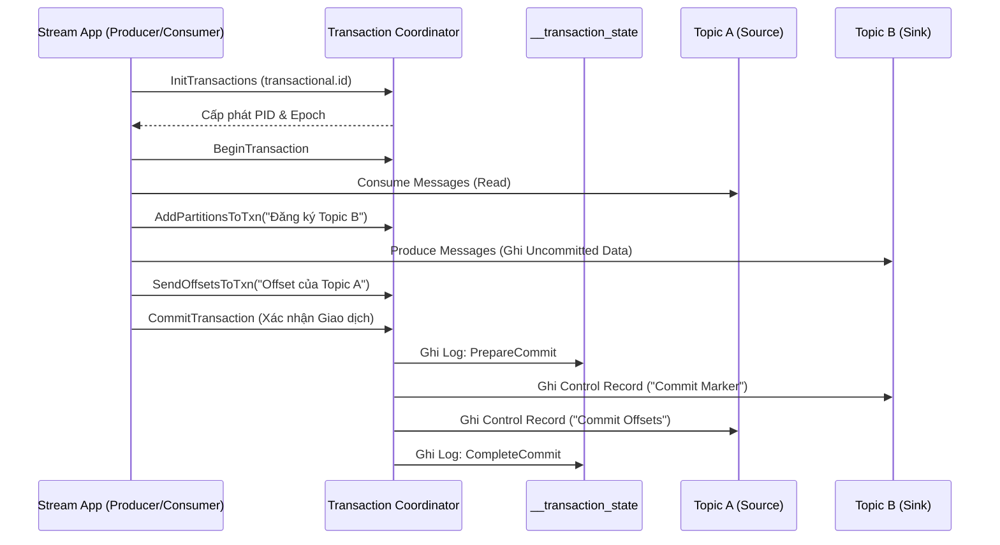
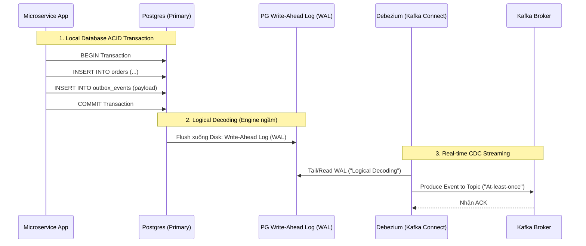

Trong thiết kế hệ thống phân tán (Distributed Systems), một trong những bài toán kinh điển và khó nhằn nhất là đảm bảo **Exactly-Once Semantics (EOS - Xử lý chính xác một lần)**. Làm thế nào để đảm bảo một sự kiện mang tính sống còn (ví dụ: trừ tiền tài khoản ngân hàng) không bị thất lạc (Data Loss) và cũng tuyệt đối không bị xử lý nhân đôi (Duplicate Processing) khi network chập chờn, máy chủ crash, hoặc rớt kết nối Database?

Bài viết này mổ xẻ kiến trúc vật lý bên dưới hai mảnh ghép quan trọng nhất để đạt được sự toàn vẹn dữ liệu tuyệt đối (Absolute Data Integrity) trong Data Streaming:
1. Cơ chế **Idempotent Producer** và **Transactions** bên trong Apache Kafka.
2. Mẫu thiết kế **Transactional Outbox Pattern** kết hợp Change Data Capture (CDC) để xử lý bài toán **Dual-Write**.

---

## 1. Apache Kafka Exactly-Once Semantics (EOS) Architecture

Trước Kafka 0.11, Kafka chỉ hỗ trợ *At-least-once* (Ít nhất một lần) hoặc *At-most-once* (Tối đa một lần). Việc Producer thực hiện Retry khi không nhận được gói tin ACK (Acknowledge) từ Broker do lỗi mạng rất dễ dẫn đến Duplicate Messages. 

Để đạt được EOS, Kafka đã phải thiết kế lại hoàn toàn giao thức truyền thông bằng hai cơ chế cốt lõi.

### 1.1. Idempotent Producer (Chống Trùng Lặp ở Cấp Độ Partition)

Ý tưởng của Idempotent Producer vay mượn từ giao thức TCP. Nó giúp Producer có thể gửi lại (Retry) một gói tin bao nhiêu lần tùy ý, mà Broker vẫn đảm bảo gói tin đó không bao giờ bị ghi trùng lặp trên một Partition vật lý.

**Kiến trúc thực thi vật lý:**
1. Khi khởi tạo, Producer được Kafka Broker cấp một **Producer ID (PID)** duy nhất và một `Epoch` (để chặn các Zombie Producer cũ sống lại).
2. Mỗi batch tin nhắn gửi đi được Producer gắn một **Sequence Number** (Số thứ tự bắt đầu từ 0 và tăng dần).
3. Tại Kafka Broker, mỗi Partition duy trì một bảng Hash Map trong bộ nhớ (RAM) ghi lại `Sequence Number` lớn nhất đã nhận được từ mỗi `PID`.
4. Khi Broker nhận một batch mới, nó kiểm tra:
   - Nếu `SeqNum == LastSeqNum + 1`: Chấp nhận ghi vào Disk Log.
   - Nếu `SeqNum <= LastSeqNum`: Đây là bản sao bị trùng (Duplicate do thao tác Retry mạng). Broker âm thầm bỏ qua, không ghi vào đĩa, nhưng vẫn trả về `ACK` cho Producer.
   - Nếu `SeqNum > LastSeqNum + 1`: Báo lỗi `OutOfOrderSequenceException` (Có khoảng trống dữ liệu bị mất trên đường truyền).

**Cấu hình Thực chiến (Kafka Client Properties):**
Từ Kafka 3.0, tính năng này được **Bật Mặc Định**. 
```properties
# Kích hoạt tính năng Idempotence
enable.idempotence=true

# MA THUẬT: Khi bật idempotence, Kafka tự động ép buộc các cấu hình sau:
acks=all
max.in.flight.requests.per.connection<=5
retries=2147483647 # (Max Integer - Retry vô hạn)
```

### 1.2. Kafka Transactions (Atomic Multi-Partition & 2PC)

Idempotence chỉ giải quyết được bài toán Point-to-Point trên MỘT Partition. Nhưng trong Stream Processing (Kafka Streams, Flink), luồng dữ liệu luôn là **Read - Process - Write**. 
Bạn đọc dữ liệu từ Topic A (Input), biến đổi nó, ghi vào Topic B (Output), và cuối cùng phải Commit Offset của Topic A để báo hiệu đã xử lý xong. 

Nếu ứng dụng Crash giữa chừng, bạn có thể đã ghi dữ liệu vào Topic B nhưng chưa kịp Commit Offset ở Topic A. Khi Restart, ứng dụng sẽ đọc lại đoạn chưa Commit và sinh ra Duplicate ngầm ở Topic B.

Để giải quyết, Kafka triển khai **Kafka Transactions** dựa trên một biến thể của giao thức **Two-Phase Commit (2PC)**, được điều phối bởi **Transaction Coordinator** và lưu trạng thái vào topic nội bộ `__transaction_state`.



**Cách hoạt động của Marker Records:**
Khi Producer ghi dữ liệu trong Transaction, dữ liệu thực tế **ngay lập tức** được nối (Append) vào cuối file Log của Topic B trên ổ cứng. Tuy nhiên, nó hoàn toàn **Vô hình** với các Consumer ở hạ nguồn. Chỉ khi giao dịch được Commit, Transaction Coordinator mới ghi một **Control Record** (Marker) đặc biệt vào Topic B báo hiệu dữ liệu đã sẵn sàng.

**Cấu hình Consumer chống "Đọc bẩn" (Dirty Read):**
Nếu không cấu hình, Consumer mặc định sẽ đọc toàn bộ dữ liệu (kể cả Uncommitted data). Để Consumer chỉ đọc các message đã được Commit Marker xác nhận, bạn BẮT BUỘC phải dùng:
```properties
# Yêu cầu Consumer lờ đi các message chưa hoàn tất giao dịch
isolation.level=read_committed
```
Bên dưới hệ điều hành, Kafka Broker sẽ duy trì một con trỏ gọi là **LSO (Last Stable Offset)**. Consumer chỉ được phép Fetch dữ liệu nằm dưới vạch LSO này.

---

## 2. Bài toán Dual-Write & Transactional Outbox Pattern

Dù Kafka EOS hoàn hảo đến mấy, nó cũng chỉ nằm gọn trong ranh giới của cụm Kafka. Thực tế trong kiến trúc Microservices, hệ thống thường đối mặt với bài toán **Dual-Write** kinh điển: 
1. Ứng dụng `INSERT` dữ liệu đơn hàng vào PostgreSQL.
2. Ứng dụng `PRODUCE` sự kiện `OrderCreated` vào Kafka để service Inventory trừ kho.

Nếu không dùng Distributed Transaction (ví dụ: XA Protocol - vốn cực kỳ chậm và gây Deadlock), một cú rớt mạng (Network blip) ở bước 2 sẽ dẫn đến thảm họa **Bất đồng bộ trạng thái (State Inconsistency)**: Database có ghi nhận đơn hàng, nhưng Kafka không có Event, kho hàng không bao giờ được trừ.

### 2.1. Kiến trúc Transactional Outbox kết hợp CDC (Debezium)

Giải pháp tiêu chuẩn ngành (Industry Standard) để đập tan Dual-Write là **Transactional Outbox Pattern** kết hợp với Change Data Capture (CDC). Thay vì ứng dụng trực tiếp gọi API Kafka (vốn có rủi ro rớt mạng), ứng dụng sẽ ghi sự kiện đó vào một bảng tạm tên là `outbox_events` nằm chung trong một ACID Database Transaction cùng với dữ liệu nghiệp vụ chính.



**Code Thực chiến (Tạo bảng Outbox trên PostgreSQL):**
```sql
CREATE TABLE outbox_events (
    id UUID PRIMARY KEY DEFAULT gen_random_uuid(),
    aggregate_type VARCHAR(255) NOT NULL, -- Ví dụ: 'Order'
    aggregate_id VARCHAR(255) NOT NULL,   -- Ví dụ: 'ord_12345'
    type VARCHAR(255) NOT NULL,           -- Ví dụ: 'OrderCreated'
    payload JSONB NOT NULL,               -- Chứa toàn bộ nội dung Event
    created_at TIMESTAMP DEFAULT NOW()
);
```
*Lưu ý hệ thống:* Công cụ Debezium sẽ đọc trực tiếp từ Write-Ahead Log (WAL) thông qua plugin `pgoutput` của Postgres. Do đó, ngay khi Transaction được Commit xuống đĩa vật lý, Debezium sẽ bắt được sự kiện gần như tức thời (Sub-millisecond latency) mà **Không cần phải chạy lệnh Polling (`SELECT`)** gây nặng DB.

---

## 3. Systemic Trade-offs & Operational Risks (Rủi Ro Vận Hành)

Mọi giải pháp thiết kế hệ thống đều đòi hỏi sự đánh đổi. EOS và Outbox Pattern mang lại độ tin cậy tuyệt đối, nhưng cái giá phải trả về Hiệu năng (Performance) không hề rẻ.

### 3.1. Consumer Lag do "Zombie Transactions" (Lỗi Kafka LSO)
**Triệu chứng:** Khi dùng `isolation.level=read_committed`, Consumer bỗng dưng ngừng tiêu thụ dữ liệu hoàn toàn. Chỉ số Consumer Lag tăng dựng đứng chạm trần dù Producer vẫn đang đẩy dữ liệu ầm ầm.
**Root Cause (Căn nguyên):** Một Transaction bị "Treo" [Zombie Transaction] do Producer bị Crash/OOM mà không kịp gửi lệnh Abort, hoặc bản thân Transaction Coordinator gặp lỗi. Khi đó, con trỏ **LSO (Last Stable Offset)** bị khóa chặt vĩnh viễn tại vị trí của Transaction đang treo đó. Kể cả có hàng triệu message mới được gửi vào thuộc các Transaction khác thành công đi nữa, Consumer cũng bị block cứng, không thể đọc vượt qua vạch LSO.
**Giải pháp Kỹ thuật:** 
- Đặt tham số `transaction.timeout.ms` (mặc định 1 phút) hợp lý để Broker tự động Abort các giao dịch treo lơ lửng.
- Thiết lập cảnh báo Prometheus/Grafana cho Metrics: `kafka.coordinator.transaction:type=transaction-coordinator-metrics,name=transaction-rate`.

### 3.2. Write Amplification & WAL Bloat (Lỗi Tràn Đĩa Outbox)
**Triệu chứng:** Dung lượng đĩa cứng của Database tăng đột biến (Disk Full 100%). Các node Replicas bị tụt hậu (Lag) trầm trọng.
**Root Cause:** Mô hình Outbox sinh ra tình trạng **Write Amplification (Khuếch đại thao tác ghi)**. Một thao tác đặt hàng khiến DB phải ghi vào `orders`, ghi vào bảng `outbox_events`, sau đó ghi cả hai thao tác này vào WAL, đẩy WAL qua mạng cho Replica, và lại đẩy WAL cho Debezium. 
Nếu Debezium bị lỗi mạng và ngưng đọc, PostgreSQL sẽ buộc phải giữ lại **Toàn bộ WAL file** chưa được tiêu thụ để chờ Debezium quay lại. Điều này gây tràn đĩa cứng Database.
**Giải pháp Kỹ thuật:** 
- Triển khai Worker ngầm (Cronjob) định kỳ xóa dữ liệu cũ trong bảng `outbox_events` để giải phóng không gian (Debezium chỉ đọc WAL, không cần dữ liệu cũ trong bảng).
- Đặt giới hạn `max_slot_wal_keep_size` trong PostgreSQL. Nếu Debezium rớt quá lâu, DB thà Drop replication slot đó đi để cứu đĩa cứng còn hơn là sập toàn bộ hệ thống.

### 3.3. Hiệu năng & Throughput (Đánh đổi Latency)
Giao thức Two-Phase Commit (2PC) trong Kafka yêu cầu rất nhiều vòng lặp mạng (Network Round-trips) tới Transaction Coordinator. Cấu hình bắt buộc `acks=all` và `min.insync.replicas=2` ép dữ liệu phải được Replicate sang tối thiểu 1 Broker khác trước khi báo thành công. Việc này làm tăng **Latency** lên đáng kể (từ 2ms lên 20-50ms).
**Hệ quả:** Đối với các hệ thống Clickstream Tracking hoặc IoT Telemetry với lưu lượng hàng triệu RPS, áp dụng EOS là tự sát. **Chỉ dùng EOS và Outbox Pattern cho Core Business (Thanh toán, Trừ tiền, Quản lý kho, Order)**. Với hệ thống Logging và Analytics, *At-least-once* là quá đủ.

---

## 4. Idempotent Consumer: Mảnh Ghép Cuối Cùng

Phải nhớ rõ: Debezium (hoặc bất kỳ công cụ CDC nào) chỉ cung cấp *At-least-once delivery* khi đẩy dữ liệu từ Outbox vào Kafka. Tức là, nếu Debezium gửi Event vào Kafka, Kafka nhận thành công nhưng gói ACK báo về bị rớt mạng, Debezium sẽ ngỡ là thất bại và tiến hành Gửi lại (Retry) gói tin y hệt.

Điều này có nghĩa là kiến trúc chỉ hoàn hảo khi **Consumer ở đích đến phải là Idempotent (Miễn nhiễm với sự trùng lặp)**.

```sql
-- ANTI-PATTERN: Không Idempotent. Chạy 2 lần sẽ bị trừ tiền 2 lần!
UPDATE accounts SET balance = balance - 100 WHERE id = 1;
```

**Cách thiết kế Consumer Idempotent:** 
Sử dụng Upsert (ON CONFLICT) kết hợp với bảng phụ `processed_messages` để chặn trùng lặp tuyệt đối ở tầng Database cuối cùng:
```sql
-- ĐÚNG: Đảm bảo Idempotent bằng khóa chính Event_ID
INSERT INTO processed_messages (event_id) VALUES ('msg_123') 
ON CONFLICT DO NOTHING;

-- Application Code: Nếu kết quả INSERT ở trên trả về affected_rows = 1, 
-- thì mới tiến hành thực thi UPDATE trừ tiền. Nếu bằng 0, lờ đi.
```

## 5. Nguồn Tham Khảo (References)

1. **Confluent Engineering Blog:** [Exactly-Once Semantics are Possible: Here’s How Apache Kafka Does it](https://www.confluent.io/)
2. **Debezium Official Docs:** [Reliable Microservices Data Exchange With the Outbox Pattern](https://debezium.io/blog/)
3. **Sách Kỹ Thuật:** *Designing Data-Intensive Applications* (Martin Kleppmann) - Chapter 9: Consistency and Consensus (Giảng giải chi tiết về 2PC và Distributed Transactions).
4. **Uber Engineering Blog:** [Reliable Processing with Apache Flink and Kafka](https://www.uber.com/en-VN/blog/)
