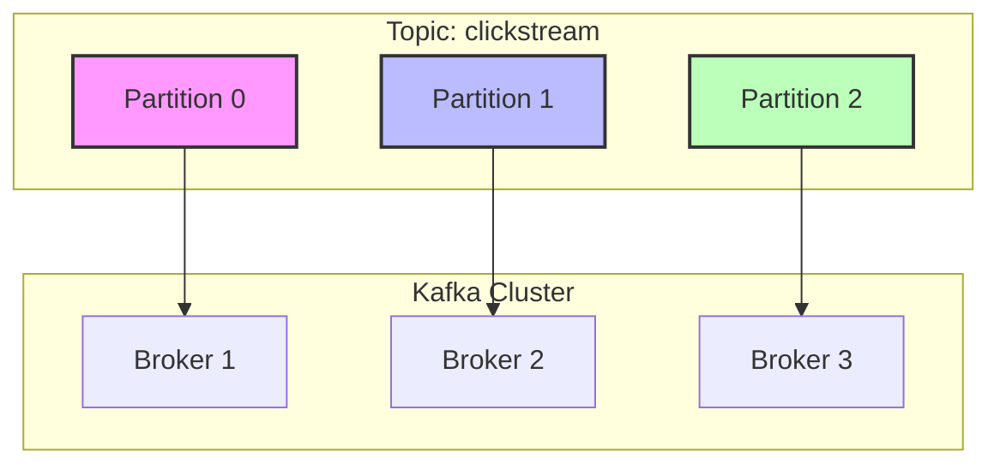
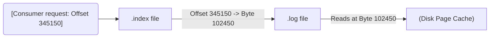

Khi xây dựng các hệ thống xử lý dữ liệu thời gian thực (Real-time Streaming) ở quy mô hàng triệu events/giây, Apache Kafka thường là xương sống của toàn bộ kiến trúc. Tuy nhiên, sự mạnh mẽ của Kafka không tự nhiên mà có, nó bắt nguồn từ một thiết kế "chia để trị" (divide-and-conquer) cực kỳ thông minh ở tầng lưu trữ.

Thay vì nhìn Kafka dưới góc độ một Message Queue thông thường, trong bài viết này, chúng ta sẽ phân tích **Topics** và **Partitions** dưới góc nhìn của một Kỹ sư Hệ thống (System Engineer): Chúng được lưu trữ vật lý như thế nào trên đĩa cứng? Cơ chế Indexing hoạt động ra sao để đạt độ trễ O(1)? Và tại sao việc cấu hình sai số lượng Partition có thể dẫn đến thảm họa sập cụm (Cluster Outage)?

---

## 1. Kiến trúc Logic: Topics và Partitions

Ở tầng ứng dụng (Application Layer), **Topic** là một không gian tên (namespace) logic dùng để phân loại luồng sự kiện (Ví dụ: `orders_topic`, `clickstream_topic`). Đặc tính cốt lõi của Topic là **Append-only** (chỉ ghi nối thêm) và **Multi-subscriber** (cho phép nhiều nhóm Consumer cùng đọc một dữ liệu độc lập).

Tuy nhiên, một Topic logic sẽ nhanh chóng chạm ngưỡng giới hạn I/O của một máy chủ (Broker) vật lý nếu không được phân mảnh. Đó là lúc **Partition** ra đời.

**Partition** là đơn vị vật lý của sự song song hóa (Unit of Parallelism). Một Topic được chia thành nhiều Partitions, và các Partitions này được phân tán rải rác trên nhiều Brokers trong cụm (Cluster).



*Đặc tính cốt lõi của Partition:*
- **Tính thứ tự cục bộ (Local Ordering):** Kafka **CHỈ** đảm bảo thứ tự tuyến tính tuyệt đối (Strict Ordering) cho các message nằm **trong cùng một Partition**. Không có gì đảm bảo thứ tự giữa Partition 0 và Partition 1.
- **Tính bất biến (Immutability):** Message khi đã ghi vào Partition sẽ không thể bị thay đổi.
- **Offset:** Mỗi message trong một Partition được định danh bởi một chuỗi số nguyên tăng dần gọi là `Offset`.

---

## 2. Kiến trúc Thực thi Vật lý (Physical Execution)

Nếu chúng ta SSH vào một máy chủ Kafka Broker và liệt kê thư mục lưu trữ (thường là `/var/lib/kafka/data`), chúng ta sẽ không thấy một file nào tên là "Topic". Thay vào đó, mỗi Partition được biểu diễn bằng một thư mục riêng biệt (VD: `clickstream-0`, `clickstream-1`).

Để tránh việc phải load một file khổng lồ vào RAM, Kafka tiếp tục chia nhỏ Partition thành các **Segments** (Đoạn). Mặc định, mỗi Segment có kích thước 1GB (cấu hình `segment.bytes`).

Bên trong thư mục của một Partition, bạn sẽ thấy 3 loại file cốt lõi cho mỗi Segment:

```text
/var/lib/kafka/data/clickstream-0/
├── 00000000000000000000.log        # Segment 1 (Đã đóng)
├── 00000000000000000000.index
├── 00000000000000000000.timeindex
├── 00000000000000345123.log        # Active Segment (Đang ghi)
├── 00000000000000345123.index
└── 00000000000000345123.timeindex
```

### 2.1. Phân phẫu cấu trúc Segment
1. **`.log` (Data File):** Chứa payload nhị phân thô của message. Tên của file (VD: `...345123.log`) chính là **Base Offset** - offset của message đầu tiên nằm trong file này. File này được ghi nối tiếp xuống đĩa (Sequential I/O), tận dụng tối đa Page Cache của Linux để đạt thông lượng đọc/ghi khổng lồ.
2. **`.index` (Offset Index):** Là một *Sparse Index* (Chỉ mục thưa). Nó ánh xạ Offset của message sang **Vị trí Byte vật lý (Physical Byte Position)** trong file `.log`. Giúp Consumer nhảy (seek) đến một Offset cụ thể với tốc độ O(1) hoặc O(log N) mà không cần quét toàn bộ file.
3. **`.timeindex` (Time Index):** Ánh xạ Timestamp của message sang Offset. Cực kỳ hữu dụng khi ứng dụng muốn Replay dữ liệu từ một khoảng thời gian cụ thể (VD: "Đọc lại dữ liệu từ 2 tiếng trước").



Chỉ có Segment có offset lớn nhất mới là **Active Segment** (cho phép ghi). Các đoạn cũ hơn là Read-only. Khi dữ liệu quá hạn (dựa theo `retention.ms`), Kafka sẽ xóa thẳng tay toàn bộ các file `.log` và `.index` của Segment đó, giúp quá trình Garbage Collection ổ đĩa diễn ra tức thời (O(1) deletion) thay vì phải đi tìm và xóa từng dòng.

---

## 3. Ràng buộc Song song hóa & Consumer Groups

Số lượng Partition chính là **Giới hạn trên (Upper Bound)** của mức độ song song phía Consumer.

Kafka quy định nguyên tắc **1-1 Mapping** cực kỳ khắt khe: **Trong một Consumer Group, một Partition chỉ có thể được tiêu thụ bởi tối đa MỘT Consumer Instance tại một thời điểm.** 
Điều này ngăn chặn Race-condition và đảm bảo tính Ordering cục bộ.

- Nếu số Consumer < số Partition: Một Consumer sẽ phải "gánh" nhiều Partitions.
- Nếu số Consumer == số Partition: Cân bằng tải hoàn hảo, mỗi Consumer xử lý 1 Partition.
- Nếu số Consumer > số Partition: Các Consumer dư thừa sẽ bị **Idle (Ngồi chơi)**, lãng phí Compute Node (Pod/EC2).

=> *Sự đánh đổi:* Bạn không thể tăng tốc độ đọc dữ liệu (Scale Out Consumer) vượt quá số lượng Partition mà Topic đang có.

---

## 4. Rủi ro Vận hành (Operational Risks) & Trade-offs Hệ thống

### 4.1. Sự cố "Hot Partition" (Data Skew)
**Nguyên nhân:** Producer thường sử dụng `Key-based Partitioning` (`Hash(Key) % num_partitions`) để đảm bảo các event của cùng một thực thể (VD: cùng `user_id`) luôn vào cùng một Partition. Tuy nhiên, nếu phân phối của Key không đều (VD: User "Anonymous" chiếm 80% traffic), một Partition cụ thể sẽ phình to bất thường.
**Hậu quả:** 
- Một Broker chứa Hot Partition bị quá tải CPU/Network, trong khi các Broker khác nhàn rỗi.
- Consumer gánh Hot Partition bị ngộp, gây ra hiện tượng **Consumer Lag** cục bộ.
**Cách xử lý:** 
- Thêm *Salt* vào Key: `hash(user_id + random_uuid_if_anonymous)`.
- Thay đổi chiến lược sang `Sticky Partitioner` (batching dữ liệu đều đặn) nếu không thực sự cần Ordering theo Key.

### 4.2. Thảm họa "Too Many Partitions"
Đây là một **Anti-pattern** kinh điển khi các kỹ sư cố gắng "future-proof" bằng cách tạo 1000 Partitions cho mỗi Topic.

**Đánh đổi (Trade-offs):**
1. **Open File Handle Limits:** 1000 Partitions x 3 Replicas x 3 Files (log, index, timeindex) = ~9000 files mở đồng thời. Có thể gây lỗi `Too many open files` cấp độ OS trên Linux.
2. **Spike In Replication Latency:** Broker phải quản lý quá nhiều threads để đồng bộ dữ liệu (fetch) giữa các Replicas, làm tăng độ trễ mạng chéo (Cross-node latency).
3. **Leader Election Storm:** Khi một Broker "chết", hàng ngàn Partitions mất Leader. Controller (Zookeeper hoặc KRaft) phải tốn nhiều giây (thậm chí phút) để bầu lại Leader mới cho từng Partition. Trong suốt khoảng thời gian đó, Topic bị văng vào trạng thái Unvailable (Không thể ghi/đọc).
4. **OOMKilled ở Client:** Mỗi Partition đều yêu cầu Producer/Consumer cấp phát một lượng RAM buffer nhất định. 1000 Partitions có thể làm JVM của Client phình to và bị Kubernetes OOMKilled ngay lập tức.

---

## 5. Thực chiến & Best Practices (FinOps)

### 5.1. Công thức tính số lượng Partition tối thiểu
Đừng đoán bừa. Hãy dùng công thức (Nguồn: Confluent):

`Num_Partitions = Max(Target_Throughput / Producer_Throughput_Per_Partition, Target_Throughput / Consumer_Throughput_Per_Partition)`

*Ví dụ:*
- Target (Mục tiêu): Hệ thống cần tải 1000 MB/s.
- Một Producer đơn lẻ ghi được max 50 MB/s vào 1 Partition.
- Một Consumer xử lý (parse JSON, ghi vào DB) max 20 MB/s từ 1 Partition.
- Tính toán: `Max(1000/50, 1000/20) = Max(20, 50) = 50 Partitions.` (Nên làm tròn lên số chia hết cho số lượng Broker, ví dụ: 54 hoặc 60).

### 5.2. IaC (Infrastructure as Code)
Trong môi trường Production, tuyệt đối không dùng Kafka CLI (bash script) hay UI để tạo Topic thủ công. Hãy quản lý chúng bằng Terraform để kiểm soát vòng đời và cấu hình (Configuration Drift).

```hcl
# Terraform cấu hình chuẩn cho một Kafka Topic
resource "kafka_topic" "clickstream_events" {
  name               = "clickstream_events_v1"
  replication_factor = 3    # Đảm bảo High Availability
  partitions         = 60   # Đã được tính toán dựa trên Throughput

  config = {
    "retention.ms"                      = "259200000"  # Giữ dữ liệu 3 ngày (FinOps: Giảm chi phí EBS)
    "segment.bytes"                     = "1073741824" # 1GB/segment (Chuẩn hóa cho I/O)
    "cleanup.policy"                    = "delete"
    "min.insync.replicas"               = "2"          # Bảo vệ dữ liệu (Quorum), đi kèm acks=all ở Producer
    "unclean.leader.election.enable"    = "false"      # Ưu tiên Consistency hơn Availability
  }
}
```

---

## Nguồn Tham Khảo (References)
1. **Confluent Blog**: [How to choose the number of topics/partitions in a Kafka cluster?](https://www.confluent.io/blog/how-choose-number-topics-partitions-kafka-cluster/)
2. **Gwen Shapira, Todd Palino et al.** - *Kafka: The Definitive Guide (2nd Edition, O'Reilly)*.
3. **LinkedIn Engineering**: [Kafka: a Distributed Messaging System for Log Processing](http://notes.stephenholiday.com/Kafka.pdf).
4. **AWS Architecture Blog**: [Best practices for sizing Amazon MSK clusters](https://aws.amazon.com/blogs/big-data/best-practices-for-sizing-amazon-msk-clusters/).
5. **Redpanda & AutoMQ Tech Blogs**: Chuyên sâu về Kafka Storage Segment & Sparse Indexes.
