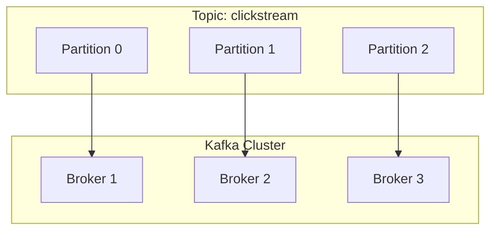

Khi xây dựng các hệ thống xử lý dữ liệu thời gian thực (Real-time Streaming) ở quy mô hàng triệu events/giây, Apache Kafka thường là xương sống của toàn bộ kiến trúc. Tuy nhiên, sự mạnh mẽ của Kafka không tự nhiên mà có, nó bắt nguồn từ một thiết kế "chia để trị" (divide-and-conquer) cực kỳ thông minh ở tầng lưu trữ và sự tích hợp sâu sát với tầng hệ điều hành.

Thay vì nhìn Kafka dưới góc độ một Message Queue thông thường, trong bài viết này, chúng ta sẽ phân tích **Topics** và **Partitions** dưới góc nhìn của Kỹ sư Hệ thống (System Engineer): Chúng được lưu trữ vật lý như thế nào? Bí quyết Zero-Copy và Page Cache là gì? Và tại sao cấu hình sai Partition có thể dẫn đến thảm họa sập cụm (Cluster Outage)?

---

## 1. Kiến trúc Logic: Topics và Partitions

Ở tầng ứng dụng, **Topic** là một không gian tên (namespace) logic dùng để phân loại luồng sự kiện (Ví dụ: `orders_topic`, `clickstream_topic`). Đặc tính cốt lõi của Topic là **Append-only** (chỉ ghi nối thêm) và **Multi-subscriber** (cho phép nhiều nhóm Consumer cùng đọc một dữ liệu độc lập).

Tuy nhiên, một Topic logic sẽ nhanh chóng chạm ngưỡng giới hạn I/O của một máy chủ (Broker) vật lý nếu không được phân mảnh. Đó là lúc **Partition** ra đời.

**Partition** là đơn vị vật lý của sự song song hóa (Unit of Parallelism). Một Topic được chia thành nhiều Partitions, và các Partitions này được phân tán rải rác trên nhiều Brokers trong cụm (Cluster).



*Đặc tính cốt lõi của Partition:*
- **Tính thứ tự cục bộ (Local Ordering):** Kafka **CHỈ** đảm bảo thứ tự tuyến tính (Strict Ordering) cho các message nằm **trong cùng một Partition**.
- **Tính bất biến (Immutability):** Message khi đã ghi vào Partition sẽ không thể bị thay đổi.
- **Offset:** Mỗi message trong một Partition được định danh bởi một chuỗi số nguyên tăng dần gọi là `Offset`.

---

## 2. Kiến trúc Thực thi Vật lý (Physical Execution)

Nếu chúng ta SSH vào một Broker và liệt kê thư mục lưu trữ (thường là `/var/lib/kafka/data`), mỗi Partition được biểu diễn bằng một thư mục riêng biệt (VD: `clickstream-0`, `clickstream-1`).

Để tránh việc phải load một file khổng lồ vào RAM, Kafka tiếp tục chia nhỏ Partition thành các **Segments** (Đoạn). Mặc định, mỗi Segment có kích thước 1GB.

```text
/var/lib/kafka/data/clickstream-0/
├── 00000000000000000000.log        # Segment 1 (Đã đóng)
├── 00000000000000000000.index
├── 00000000000000000000.timeindex
├── 00000000000000345123.log        # Active Segment (Đang ghi)
├── 00000000000000345123.index
└── 00000000000000345123.timeindex
```

### 2.1. Phân phẫu cấu trúc Segment
1. **`.log` (Data File):** Chứa payload nhị phân thô của message. Tên của file chính là **Base Offset** - offset của message đầu tiên nằm trong file này. File này được ghi nối tiếp xuống đĩa (Sequential I/O), nhanh hơn hàng trăm lần so với Random I/O.
2. **`.index` (Offset Index):** Là một *Sparse Index* (Chỉ mục thưa). Nó ánh xạ Offset của message sang **Vị trí Byte vật lý (Physical Byte Position)** trong file `.log`. Giúp Consumer nhảy (seek) đến một Offset cụ thể với tốc độ O(1).
3. **`.timeindex` (Time Index):** Ánh xạ Timestamp của message sang Offset. Cực kỳ hữu dụng khi ứng dụng muốn Replay dữ liệu từ một khoảng thời gian cụ thể.

---

## 3. Bí Mật Của Hiệu Năng: Page Cache và Zero-Copy

Tại sao Kafka có thể xử lý hàng triệu message mỗi giây dù vẫn lưu trữ trên ổ đĩa? Bí quyết nằm ở sự "hợp tác" tuyệt đối với nhân hệ điều hành (OS Kernel).

### 3.1. Page Cache (Bộ đệm Hệ điều hành)
Thay vì tự cấp phát một Application Cache khổng lồ trên JVM (làm tăng nguy cơ dừng hệ thống do Garbage Collection), Kafka giao phó toàn bộ việc caching cho OS.
Hệ điều hành Linux sử dụng toàn bộ RAM trống để làm **Page Cache**. Khi Producer ghi dữ liệu xuống đĩa, thực chất nó được ghi vào Page Cache trước. Nếu Consumer bám sát ngay phía sau (healthy consumer), nó sẽ đọc dữ liệu trực tiếp từ RAM (Page Cache) mà đĩa cứng không hề bị chạm tới.

### 3.2. Zero-Copy Architecture
Khi Consumer yêu cầu đọc dữ liệu, trong các hệ thống truyền thống, data phải đi qua 4 lần copy:
*Disk -> OS Kernel Buffer -> Application Buffer (User Space) -> Socket Buffer (Kernel) -> NIC (Network Card).*

Kafka sử dụng kỹ thuật **Zero-Copy** thông qua system call `sendfile()` (Java NIO). Dữ liệu được đẩy trực tiếp từ Page Cache ra Network Socket, bỏ qua hoàn toàn bước copy vào bộ nhớ của ứng dụng Kafka (User Space).
*Kết quả:* Disk -> Page Cache -> NIC. Giảm thiểu tuyệt đối việc sử dụng CPU và Context Switching, cho phép Kafka đạt tốc độ xấp xỉ băng thông tối đa của card mạng.

---

## 4. Ràng buộc Song song hóa & Consumer Groups

Số lượng Partition chính là **Giới hạn trên (Upper Bound)** của mức độ song song phía Consumer.

Kafka quy định nguyên tắc **1-1 Mapping** khắt khe: **Trong một Consumer Group, một Partition chỉ có thể được tiêu thụ bởi tối đa MỘT Consumer Instance tại một thời điểm.** 

- Nếu số Consumer < số Partition: Một Consumer sẽ phải "gánh" nhiều Partitions.
- Nếu số Consumer > số Partition: Các Consumer dư thừa sẽ bị **Idle (Ngồi chơi)**, lãng phí Compute Node.

=> *Sự đánh đổi:* Bạn không thể tăng tốc độ đọc dữ liệu vượt quá số lượng Partition mà Topic đang có.

---

## 5. Rủi ro Vận hành (Operational Risks) & Trade-offs Hệ thống

### 5.1. Sự cố "Hot Partition" (Data Skew)
**Nguyên nhân:** Producer thường sử dụng `Key-based Partitioning` (`Hash(Key) % num_partitions`). Nếu phân phối của Key không đều (VD: User "Anonymous" chiếm 80% traffic), một Partition cụ thể sẽ phình to bất thường.
**Hậu quả:** Một Broker chứa Hot Partition bị quá tải CPU/Network, Consumer gánh Hot Partition bị ngộp, gây ra hiện tượng **Consumer Lag** cục bộ.
**Cách xử lý:** Thêm *Salt* vào Key: `hash(user_id + random_uuid_if_anonymous)`, hoặc đổi sang Sticky Partitioner.

### 5.2. Thảm họa "Too Many Partitions"
Đây là một **Anti-pattern** kinh điển khi các kỹ sư cố gắng "future-proof" bằng cách tạo 1000 Partitions cho mỗi Topic.

**Đánh đổi (Trade-offs):**
1. **Open File Handle Limits:** 1000 Partitions x 3 Replicas x 3 Files (log, index, timeindex) = ~9000 files mở đồng thời. Dễ gây lỗi `Too many open files`.
2. **Replication Latency:** Broker phải quản lý quá nhiều threads để đồng bộ dữ liệu (fetch) giữa các Replicas.
3. **Leader Election Storm:** Khi một Broker "chết", hàng ngàn Partitions mất Leader. Việc bầu Leader mới mất nhiều giây, làm Topic bị văng vào trạng thái Unvailable.
4. **OOMKilled ở Client:** 1000 Partitions có thể làm JVM của Client phình to (vì yêu cầu bộ nhớ đệm cho mỗi partition) và bị Kubernetes OOMKilled ngay lập tức.

---

## 6. Thực chiến & Best Practices (FinOps)

### 6.1. Công thức tính số lượng Partition tối thiểu
Hãy dùng công thức (Nguồn: Confluent):
`Num_Partitions = Max(Target_Throughput / Producer_Throughput_Per_Partition, Target_Throughput / Consumer_Throughput_Per_Partition)`

*Ví dụ:* Cần tải 1000 MB/s. Producer ghi max 50 MB/s. Consumer đọc max 20 MB/s.
Tính toán: `Max(1000/50, 1000/20) = Max(20, 50) = 50 Partitions.` (Nên làm tròn lên số chia hết cho số lượng Broker, ví dụ: 60).

### 6.2. IaC (Infrastructure as Code)
Tuyệt đối không dùng Kafka CLI (bash script) hay UI để tạo Topic thủ công trên Production. Hãy quản lý chúng bằng Terraform.

```hcl
# Terraform cấu hình chuẩn cho một Kafka Topic
resource "kafka_topic" "clickstream_events" {
  name               = "clickstream_events_v1"
  replication_factor = 3    # Đảm bảo High Availability
  partitions         = 60   # Đã được tính toán dựa trên Throughput

  config = {
    "retention.ms"                      = "259200000"  # Giữ dữ liệu 3 ngày (FinOps: Giảm chi phí EBS)
    "segment.bytes"                     = "1073741824" # 1GB/segment (Chuẩn hóa cho I/O)
    "cleanup.policy"                    = "delete"
    "min.insync.replicas"               = "2"          # Bảo vệ dữ liệu (Quorum), đi kèm acks=all ở Producer
    "unclean.leader.election.enable"    = "false"      # Ưu tiên Consistency hơn Availability
  }
}
```

---

## Nguồn Tham Khảo [References]
*   [How to choose the number of topics/partitions in a Kafka cluster? - Confluent Blog](https://www.confluent.io/blog/how-choose-number-topics-partitions-kafka-cluster/)
*   **Kafka: The Definitive Guide (2nd Edition, O'Reilly)** - Gwen Shapira, Todd Palino et al.
*   [Kafka: a Distributed Messaging System for Log Processing - LinkedIn Engineering](http://notes.stephenholiday.com/Kafka.pdf)
*   [Kafka Zero-Copy Architecture - IBM Developer](https://developer.ibm.com/articles/j-zerocopy/)
