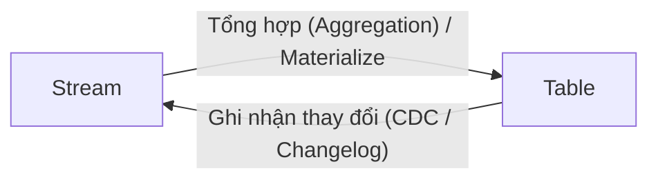
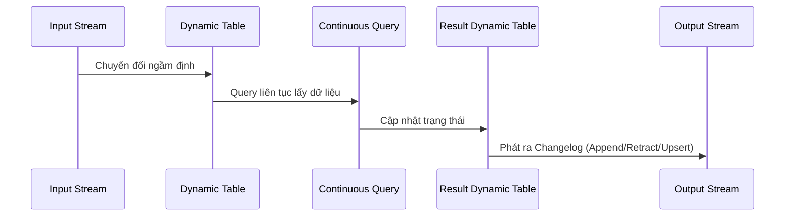

Trong lĩnh vực hệ thống phân tán và Data Engineering hiện đại, đặc biệt là trong xử lý dữ liệu luồng (stream processing), **Stream-Table Duality (Tính lưỡng tính Dòng - Bảng)** là một nguyên lý vô cùng quan trọng. Nó định nghĩa mối liên hệ sâu sắc giữa hai dạng thức biểu diễn dữ liệu phổ biến nhất: **Stream** (luồng sự kiện) và **Table** (bảng trạng thái).

Hiểu một cách đơn giản, nguyên lý này khẳng định rằng: **Một Stream (dòng chảy sự kiện) có thể được tổng hợp thành một Table (bảng trạng thái hiện tại), và ngược lại, mọi sự thay đổi trên một Table đều có thể được phát ra thành một Stream.** Đây là nền tảng cốt lõi của các công nghệ xử lý luồng mạnh mẽ nhất hiện nay như Apache Kafka (Kafka Streams, ksqlDB) và Apache Flink.

## 1. Bản chất của Stream và Table

Trước khi đi sâu vào tính lưỡng tính, chúng ta cần phân biệt rõ đặc tính cơ bản của Stream và Table.

| Đặc điểm | Stream (Luồng) | Table (Bảng) |
| :--- | :--- | :--- |
| **Bản chất** | Một chuỗi các sự kiện (events) xảy ra theo thời gian. | Trạng thái (state) tại một thời điểm nhất định. |
| **Tính chất** | Vô hạn (Unbounded), liên tục, và bất biến (Immutable). Không thể xóa một sự kiện đã xảy ra. | Hữu hạn (Bounded), có thể thay đổi (Mutable). Hỗ trợ Insert, Update, Delete. |
| **Phép ẩn dụ (Analogy)** | Cuốn sổ cái kế toán (Ledger), ghi lại lịch sử mọi giao dịch (ví dụ: Nạp 100k, Rút 20k). | Bảng sao kê số dư (Balance), chỉ thể hiện số tiền hiện tại (ví dụ: Còn 80k). |
| **Góc nhìn thời gian** | Sự phát triển của dữ liệu **qua thời gian** (Data over time). | Ảnh chụp nhanh (Snapshot) của dữ liệu **tại một thời điểm** (Data at a point in time). |
| **Truy vấn** | Truy vấn trên dữ liệu chuyển động (Push/Continuous Query). | Truy vấn trên dữ liệu tĩnh (Pull/Ad-hoc Query). |

## 2. Giải mã Tính lưỡng tính (The Duality)

Tính lưỡng tính ở đây có nghĩa là: **Stream và Table thực chất chỉ là hai mặt của cùng một đồng xu dữ liệu.** Chúng có thể chuyển hóa qua lại cho nhau mà không làm mất thông tin (nếu lưu trữ đầy đủ lịch sử).



### 2.1. Từ Stream sang Table (Stream as a Table)

Hãy tưởng tượng một ván cờ vua. **Stream** chính là danh sách các nước đi (Ví dụ: `1. e4 e5`, `2. Nf3 Nc6`). Bạn không thể nhìn vào danh sách này để biết ngay bàn cờ đang trông như thế nào. Nhưng nếu bạn bắt đầu từ một bàn cờ trống, và **phát lại (replay)** từng nước đi theo đúng thứ tự, bạn sẽ có được trạng thái cuối cùng của bàn cờ. Bàn cờ đó chính là **Table**.

Trong xử lý dữ liệu:
* Một Stream chứa các sự kiện `INSERT`, `UPDATE`, `DELETE`.
* Quá trình áp dụng liên tiếp các sự kiện này vào một kho lưu trữ trạng thái (State Store) gọi là quá trình **Materialization** (vật chất hóa).
* Kết quả ta thu được là một Table chứa dữ liệu mới nhất ứng với mỗi khóa (Key).

> [!TIP]
> Việc xây dựng Table từ Stream là nền tảng cho khái niệm **Event Sourcing**, nơi nguồn chân lý (Source of Truth) không phải là trạng thái hiện tại (Database table) mà là cuốn sổ ghi log các sự kiện.

### 2.2. Từ Table sang Stream (Table as a Stream)

Ngược lại, hãy xem xét một Table trong cơ sở dữ liệu truyền thống (như MySQL, PostgreSQL). Nếu bạn muốn biết Table này đã thay đổi như thế nào qua thời gian, bạn có thể quan sát từng hành động `INSERT`, `UPDATE`, `DELETE` được thực hiện trên Table.

Chuỗi các hành động làm thay đổi Table đó, được sắp xếp theo thời gian, chính là một **Changelog Stream**.
* Mỗi khi một dòng được thêm vào Table, một sự kiện "Insert" xuất hiện trên Stream.
* Mỗi khi một dòng bị sửa, sự kiện "Update" xuất hiện (có thể bao gồm giá trị cũ và giá trị mới).
* Mỗi khi một dòng bị xóa, sự kiện "Delete" (hay Tombstone) xuất hiện.

> [!NOTE]
> Khái niệm biến Table thành Stream được ứng dụng rộng rãi qua các công cụ **Change Data Capture (CDC)** như Debezium, giúp trích xuất liên tục các thay đổi từ database thành các message trên Kafka.

## 3. Ứng dụng trong Kafka Streams

Kafka Streams là thư viện Java của Apache Kafka, trong đó thiết kế API được mô phỏng trực tiếp từ nguyên lý Stream-Table Duality. Trong Kafka Streams, chúng ta có hai cấu trúc dữ liệu chính:

1. **KStream (Kafka Stream):** Biểu diễn một luồng sự kiện (Stream). Bất kỳ bản ghi nào thêm vào KStream đều được coi là dữ liệu mới (Insert only). KStream không có khái niệm Update.
2. **KTable (Kafka Table):** Biểu diễn một Changelog stream. Các bản ghi có cùng một khóa (Key) sẽ đè lên nhau (Upsert). Nếu nhận được một giá trị `null` cho một Key đã tồn tại, điều đó đồng nghĩa với lệnh `DELETE`.

**Ví dụ về KStream và KTable:**

Giả sử chúng ta có luồng dữ liệu theo thứ tự gửi đến Kafka như sau: `("Alice", 1)`, `("Alice", 3)`, `("Bob", 2)`.

* **Nếu đọc dưới dạng KStream:** Bạn sẽ thấy 3 sự kiện độc lập. Hàm tính tổng các giá trị sẽ đi qua: 1, sau đó 1+3=4, sau đó thêm Bob.
* **Nếu đọc dưới dạng KTable:** `("Alice", 3)` được xem là một bản cập nhật đè lên `("Alice", 1)`. Trạng thái hiện tại của bảng sẽ là: Alice=3, Bob=2.

```java
// Khởi tạo StreamBuilder
StreamsBuilder builder = new StreamsBuilder();

// 1. Định nghĩa KStream từ một topic
KStream<String, String> userClicks = builder.stream("user-clicks-topic");

// 2. Chuyển KStream thành KTable bằng cách nhóm theo Key và tổng hợp (Count)
// Quá trình này biến Stream thành Table
KTable<String, Long> userClickCounts = userClicks
    .groupByKey()
    .count(Materialized.as("clicks-count-store"));

// 3. Chuyển KTable trở lại thành Stream để ghi ra topic khác
// Quá trình này biến Table thành Stream (Changelog stream)
userClickCounts
    .toStream()
    .to("user-clicks-count-output-topic");
```

## 4. Ứng dụng trong Apache Flink (Dynamic Tables)

Apache Flink sử dụng khái niệm **Dynamic Tables (Bảng Động)** trong Flink SQL và Table API để hiện thực hóa tính lưỡng tính này.

* Một **Continuous Query** (Truy vấn liên tục) chạy trên một Stream đầu vào.
* Đầu vào được Flink coi như một bảng đang thay đổi theo thời gian (Dynamic Table).
* Kết quả của truy vấn liên tục lại tạo ra một Dynamic Table mới.
* Dynamic Table này liên tục được thay đổi, nên nó lại phát ra một Stream (Changelog stream) ở đầu ra.



**Các loại Changelog stream đầu ra trong Flink:**
1. **Append-only stream:** Nếu truy vấn chỉ sinh ra các sự kiện mới (VD: Filter, Map, Window aggregation). Bảng kết quả chỉ được thêm vào (INSERT), không bao giờ sửa đổi.
2. **Retract stream:** Một luồng gồm hai loại thông báo: thêm (add) và thu hồi (retract). Khi bảng kết quả bị cập nhật, Flink phát ra một lệnh retract cho giá trị cũ và một lệnh add cho giá trị mới.
3. **Upsert stream:** Yêu cầu bảng có khóa chính (Primary Key). Các thay đổi được mô tả dưới dạng Upsert (Update hoặc Insert) hoặc Delete dựa trên khóa đó.

## 5. Ý nghĩa thiết kế hệ thống (Why it matters?)

Hiểu rõ Stream-Table Duality mang lại lợi ích khổng lồ khi kiến trúc các hệ thống dữ liệu:

1. **Khả năng phục hồi (Fault Tolerance):** Nếu một hệ cơ sở dữ liệu gặp sự cố, bạn hoàn toàn có thể khôi phục lại trạng thái cuối cùng (Table) bằng cách phát lại (replay) toàn bộ luồng sự kiện (Stream) từ một hệ thống lưu trữ bền bỉ như Kafka.
2. **Microservices & Event-Driven:** Chia sẻ trạng thái giữa các Microservices bằng Database chung thường gây thắt cổ chai (bottleneck) và coupling. Thay vào đó, một service thay đổi dữ liệu sẽ sinh ra một Stream (CDC), các services khác tiêu thụ Stream đó và tự tạo lập các bảng trạng thái local (Materialized Views) phù hợp với nhu cầu truy vấn của mình (CQRS pattern).
3. **Sự kết hợp giữa Xử lý thời gian thực và Batch:** Bằng cách coi Table như là một snapshot của Stream ở một thời điểm, các nền tảng Data Lakehouse (như Apache Hudi, Iceberg) và các hệ thống stream xử lý cho phép chúng ta vừa truy vấn Ad-hoc (Batch) trên Table, vừa xử lý liên tục trên log của Table đó.

## Tổng Kết

**Stream-Table Duality** là nguyên lý nền tảng hợp nhất thế giới của dữ liệu ở trạng thái nghỉ (Data at Rest) và dữ liệu đang di chuyển (Data in Motion). Một Bảng (Table) đơn giản chỉ là kết quả vật chất hóa của một Luồng (Stream) tại thời điểm hiện tại; trong khi một Luồng (Stream) chính là bản ghi chi tiết quá trình tiến hóa lịch sử của một Bảng (Table).

Việc áp dụng triết lý này mở ra khả năng thiết kế hệ thống dữ liệu nhất quán, chịu lỗi cao, và đáp ứng được các yêu cầu khắt khe của quy trình xử lý luồng thời gian thực.

## Tài Liệu Tham Khảo

* [Apache Flink Architecture - Flink Documentation](https://nightlies.apache.org/flink/flink-docs-stable/)
* [Kafka: a Distributed Messaging System for Log Processing - LinkedIn (NetDB 2011)](http://notes.stephenholiday.com/Kafka.pdf)
* **Streaming Systems: The What, Where, When, and How of Large-Scale Data Processing - Tyler Akidau**
* [Exactly-Once Semantics in Apache Kafka - Confluent Blog](https://www.confluent.io/blog/exactly-once-semantics-are-possible-heres-how-apache-kafka-does-it/)
* [Stateful Stream Processing with RocksDB - Flink Forward](https://flink-forward.org/)
