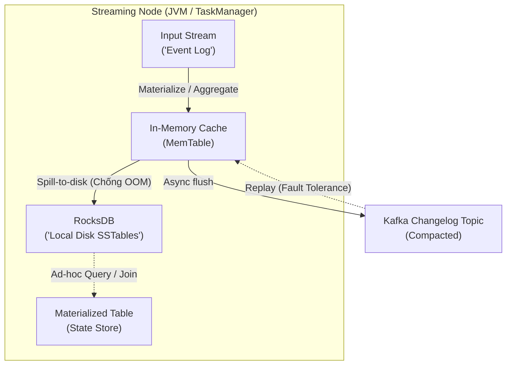

Trong thiết kế hệ thống phân tán xử lý luồng (Distributed Stream Processing), **Stream-Table Duality (Tính lưỡng tính Dòng - Bảng)** không đơn thuần là một khái niệm trừu tượng hàn lâm. Nó là nguyên lý vật lý (Physical Principle) chi phối toàn bộ cách dữ liệu được lưu trữ, truyền tải, và phục hồi (Fault Tolerance) dưới nền tảng của các cỗ máy khổng lồ như Apache Kafka và Apache Flink. 

Đứng ở góc độ một Data Engineer/System Architect, mọi State Store, mọi cơ chế Change Data Capture (CDC), và mọi phép Join trong streaming đều là hệ quả trực tiếp của nguyên lý này. Về mặt kiến trúc:
- **Stream (Dòng chảy):** Là *sự tiến hóa của dữ liệu theo thời gian* (Data over time). Mang đặc tính Immutable (Bất biến), Append-only (Chỉ ghi nối), và Unbounded (Vô hạn).
- **Table (Bảng):** Là *hình chiếu trạng thái tại một thời điểm* (Snapshot/Data at rest). Mang đặc tính Mutable (Có thể cập nhật) và Bounded (Hữu hạn).

> Mọi Bảng (Table) đều có thể được tái tạo hoàn hảo bằng cách Replay một Dòng (Stream) từ con số 0. Ngược lại, mọi sự thay đổi (Mutate) trên Bảng đều sẽ phát sinh ra một Dòng sự kiện (Changelog/Redo Log).

---

## 1. Kiến trúc Thực thi Vật lý (Physical Execution Mechanisms)

### 1.1. Từ Stream sang Table: Materialization & State Store

Giả sử bạn cần tính tổng số tiền giao dịch theo từng `user_id` từ một luồng giao dịch liên tục. Về bản chất, bạn đang thực hiện thao tác **Materialize** (Vật chất hóa) một Stream (luồng sự kiện) thành một Table (Bảng số dư hiện tại). Ở tầng vật lý, hệ thống không thể lưu trữ Table này trên RAM mãi mãi, vì khi số lượng user lên tới hàng chục triệu, hệ thống sẽ sập do tràn bộ nhớ (`OOMKilled`).

Thay vào đó, các framework như Kafka Streams hay Flink nhúng một Embedded Key-Value Database (tiêu chuẩn công nghiệp hiện tại là **RocksDB**) trực tiếp vào memory space của ứng dụng Stream Processing (JVM).



Dữ liệu mới đến sẽ đi vào bộ đệm trên RAM (MemTable). Khi MemTable đầy, nó sẽ xả xuống đĩa cứng (Spill-to-disk) dưới dạng SSTables (Sorted String Tables) của RocksDB. Table mà developer thao tác thực chất chỉ là giao diện truy vấn ảo (Virtual View) phủ lên trên cấu trúc vật lý này.

### 1.2. Từ Table sang Stream: Changelog & Log Compaction

Khi bạn cập nhật một record trên Database vật lý (ví dụ: `UPDATE balances SET amount = 100 WHERE id = 1`), Database Engine (Postgres/MySQL) sẽ ghi nhận hành động này vào một nhật ký hệ thống (như Write-Ahead Log - WAL trong PostgreSQL hoặc Binlog trong MySQL).

Sử dụng các công cụ CDC (như **Debezium**), chúng ta "Tóm" (Tail) các file log này và biến nó thành một Stream đẩy vào Kafka. Luồng này gọi là **Changelog Stream** (Luồng thay đổi).

Để Changelog Stream không dài ra vô hạn làm nghẽn đĩa cứng, Kafka sử dụng cơ chế **Log Compaction**. Một Background Thread (Cleaner) của Kafka Broker sẽ định kỳ quét các Segment, so sánh các Key. Nó sẽ **chỉ giữ lại thông điệp mới nhất (Latest value) cho mỗi Key**, và tự động xóa bỏ (Tombstone) các giá trị cũ.

**Cấu hình Kafka Topic thực chiến cho Changelog (Terraform):**
```hcl
resource "kafka_topic" "balance_changelog" {
  name               = "balance-changelog-topic"
  replication_factor = 3
  partitions         = 12
  config = {
    # KÍCH HOẠT TÍNH NĂNG TABLE -> STREAM NÉN
    "cleanup.policy"       = "compact"
    
    # Thời gian giữ lại Delete Marker (Tombstone) trước khi xóa hẳn vật lý
    "delete.retention.ms"  = "86400000" # 24 giờ
    
    # Kích hoạt độ trễ để tránh Compaction chạy liên tục gây tốn CPU
    "min.compaction.lag.ms"= "3600000"  # 1 giờ
    "segment.bytes"        = "1073741824" # 1GB / Segment
  }
}
```

---

## 2. Hiện thực hóa trong Apache Flink [Dynamic Tables]

Apache Flink nâng tầm Stream-Table Duality thành khái niệm **Dynamic Tables**. Khi bạn viết một câu truy vấn SQL (`Continuous Query`) chạy liên tục trên một luồng dữ liệu, Flink ngầm định tạo ra Dynamic Tables. Đầu ra của câu truy vấn này tiếp tục là một Dynamic Table khác.

Tùy thuộc vào thao tác SQL (Ví dụ: Lọc vs. Gom nhóm), Flink sẽ tự động phát ra các loại Stream vật lý khác nhau để đồng bộ State:
1. **Append-only Stream:** Nếu query không có cập nhật trạng thái (ví dụ `SELECT * FROM Stream WHERE amt > 100`), kết quả chỉ sinh ra dòng mới. Không cần State.
2. **Retract Stream / Upsert Stream:** Nếu query có Aggregation (`GROUP BY`), khi một nhóm cập nhật giá trị từ 50 lên 150, Flink sẽ gửi một message mang cờ `[-] 50` [Retract - Thu hồi giá trị cũ] và một message mang cờ `[+] 150` (Insert - Chèn giá trị mới]. 

**Flink SQL Thực chiến kết nối với Debezium (CDC) -> Elasticsearch:**
```sql
-- 1. Khai báo Input Stream từ MySQL thông qua Debezium CDC
CREATE TABLE mysql_orders_cdc (
  order_id INT,
  user_id INT,
  amount DECIMAL(10, 2),
  order_status STRING,
  PRIMARY KEY (order_id) NOT ENFORCED
) WITH (
  'connector' = 'mysql-cdc',
  'hostname' = 'db.internal.svc',
  'port' = '3306',
  'username' = 'flink_user',
  'password' = '${secret:flink_password}',
  'database-name' = 'ecommerce',
  'table-name' = 'orders'
);
-- 2. Khai báo Output Table (Materialized View) trỏ thẳng vào Elasticsearch
CREATE TABLE user_spend_summary (
  user_id INT,
  total_spend DECIMAL(10, 2),
  PRIMARY KEY (user_id) NOT ENFORCED
) WITH (
  'connector' = 'elasticsearch-7',
  'hosts' = 'http://es:9200',
  'index' = 'user_summary'
);

-- 3. Flink sẽ tự động biên dịch câu SQL này thành Pipeline vật lý:
-- Stream (CDC) -> Dynamic Table (Group By) -> Upsert Stream -> Elasticsearch
INSERT INTO user_spend_summary
SELECT 
  user_id,
  SUM(amount) as total_spend
FROM mysql_orders_cdc
WHERE order_status = 'COMPLETED'
GROUP BY user_id;
```

---

## 3. Hiện thực hóa trong Kafka Streams (KStream & KTable)

Kafka Streams API thể hiện tính lưỡng tính này tinh tế nhất qua hai Data Structures cốt lõi:
- **`KStream<K, V>`**: Mỗi record là một sự kiện độc lập (Insert-only / Append-only).
- **`KTable<K, V>`**: Mỗi record là một bản cập nhật trạng thái dựa trên Key (Upsert). `null` value ứng với lệnh Delete (Tombstone).

Sức mạnh kỹ thuật cao nhất nằm ở quá trình **Materialization**. Khi bạn tạo một `KTable` từ một `KStream` (ví dụ thông qua `.groupByKey().count()`), Kafka Streams tự động tạo ra một **State Store** (RocksDB by default) lưu trên ổ đĩa của Container đang chạy. Đồng thời, nó lén tạo ra một internal topic có cấu hình `cleanup.policy=compact` trên Broker, đóng vai trò là Changelog. 
Nếu Node Kafka Streams bị sập (Crash), ổ đĩa local bị hủy, Node mới được Spin up sẽ đọc lại toàn bộ Changelog topic này để khôi phục State Store về đúng trạng thái trước khi chết.

**Tối ưu State Store Config trong Kafka Streams (Java API):**
```java
Properties props = new Properties();
props.put(StreamsConfig.APPLICATION_ID_CONFIG, "fraud-detection-app");
props.put(StreamsConfig.BOOTSTRAP_SERVERS_CONFIG, "kafka-broker:9092");

// TỐI QUAN TRỌNG: Tối ưu RocksDB để tránh Write Amplification khi materialize KTable
props.put(StreamsConfig.ROCKSDB_CONFIG_SETTER_CLASS_CONFIG, CustomRocksDBConfig.class);
props.put(StreamsConfig.TOPOLOGY_OPTIMIZATION_CONFIG, StreamsConfig.OPTIMIZE);

StreamsBuilder builder = new StreamsBuilder();
KStream<String, Transaction> txStream = builder.stream("transactions");

// Lưỡng tính Dòng -> Bảng: Materialize Stream thành KTable
KTable<String, Long> userTxCount = txStream
    .groupByKey[)
    .count(Materialized.<String, Long, KeyValueStore<Bytes, byte[]>>as("user-tx-count-store")
        // BẬT CACHE: Gộp [Batch] nhiều update trên RAM trước khi đẩy xuống Changelog,
        // giúp giảm tải Network I/O cực mạnh.
        .withCachingEnabled() 
        // Bật tính năng đồng bộ (Backup) dữ liệu xuống Changelog topic trên Broker
        .withLoggingEnabled(Collections.emptyMap())); 
```

---

## 4. Systemic Trade-offs & Rủi ro Vận hành (Operational Risks)

Lưu trữ Table (State) trong các hệ thống Streaming là một con dao hai lưỡi. Dưới đây là những cạm bẫy thiết kế và cách xử lý (Troubleshooting) khi chạy hệ thống quy mô lớn.

### 4.1. Cạm bẫy State Store Bloat (Phình to Trạng thái) & OOMKilled
- **Triệu chứng:** Khi luồng sự kiện chứa quá nhiều Key duy nhất (ví dụ: bạn nhóm theo `Session_ID` của khách vãng lai thay vì `User_ID`), kích thước KTable lớn dần vô hạn. Ổ cứng của Container chạy Flink/Kafka Streams bị báo `No space left on device`, hoặc JVM bị hệ điều hành chém `OOMKilled` do Off-heap Memory của RocksDB phình to nuốt sạch RAM.
- **Giải pháp:**
  - Áp dụng **Time-To-Live (TTL)**. Trong Flink, cấu hình tham số `table.exec.state.ttl` để hệ thống tự động dọn dẹp các State cũ.
  - Chuyển từ *Global Window* (Lưu mãi mãi) sang *Sliding/Tumbling Window* để State được chủ động xóa đi sau khi cửa sổ đóng.
  - Khống chế bộ nhớ RocksDB: Giới hạn `Block Cache` và `Write Buffer Manager` của RocksDB dùng chung toàn cục (Shared Memory) thay vì để nó tự tung tự tác cấp phát cho từng State Store.

### 4.2. Write Amplification (Khuếch đại Ghi) trong Changelog
- **Triệu chứng:** Mỗi sự thay đổi nhỏ trên KTable (ví dụ biến đếm count tăng từ 1 lên 2, 2 lên 3 trong cùng một mili-giây) đều lập tức kích hoạt một thao tác ghi (Produce) xuống Changelog topic. Hậu quả là Network I/O bị thắt cổ chai, IOPS của ổ cứng trên Kafka Broker tăng vọt, hệ thống chạy rùa bò.
- **Giải pháp:** Kích hoạt cơ chế **In-Memory Caching** trước khi xả xuống (Spill) Changelog. Trong Kafka Streams là hàm `.withCachingEnabled()`. Dữ liệu sẽ được gộp (Batch) lại trên bộ nhớ, và chỉ ghi trạng thái cuối cùng xuống Changelog (Ví dụ: nhảy thẳng từ 1 lên 100 thay vì ghi 100 thông điệp tăng dần liên tiếp).

### 4.3. Consumer Lag do Reprocessing Storm (Bão Phục Hồi)
- **Triệu chứng:** Khi một Node Kafka Streams chết, Kubernetes tự động tạo Pod mới. Tuy nhiên, Pod mới cần khôi phục lại KTable (State Store) từ Changelog topic trước khi có thể xử lý luồng chính. Quá trình Replay này phải tải hàng trăm GB dữ liệu qua mạng dẫn đến hệ thống mất hàng giờ mới khởi động xong (*Cold Start Problem*). Consumer Lag tăng dựng đứng chạm nóc.
- **Giải pháp:** Thiết lập cơ chế **Standby Replicas** (`num.standby.replicas=1` trong Kafka Streams). Một Node phụ ở Availability Zone khác luôn duy trì sẵn bản sao của RocksDB (*Shadow State Store*) bằng cách lẳng lặng đọc từ Changelog. Khi Node chính chết, Node phụ lập tức Promote lên thành Active mà không cần Replay từ đầu. 
- **Đánh đổi (Trade-off):** Tốn gấp đôi dung lượng ổ đĩa (Disk) và CPU để chạy Standby Node.

---

## 5. Nguồn Tham Khảo (References)

1. **Streaming Systems: The What, Where, When, and How of Large-Scale Data Processing** - Tyler Akidau (O'Reilly). *Chương 1 & 2 phân tích kinh điển về nguyên lý Dòng và Bảng.*
2. [Confluent Blog: Streams and Tables in Apache Kafka: Two Sides of the Same Coin][https://www.confluent.io/]
3. [Apache Flink Architecture: Dynamic Tables][https://nightlies.apache.org/flink/flink-docs-stable/docs/dev/table/concepts/dynamic_tables/]
4. [Kafka Streams Architecture & State Management](https://docs.confluent.io/]
