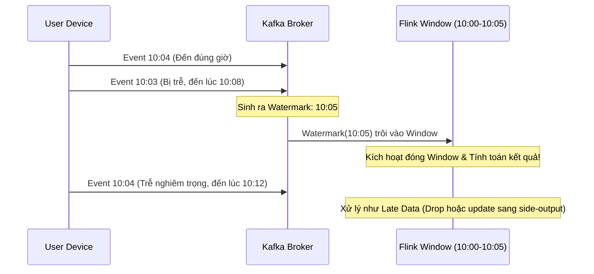

Khác với Batch Processing—nơi dữ liệu tĩnh (Bounded Data) nằm yên trên các node HDFS hay S3 chờ được quét qua—**Streaming Processing** đối mặt với một dòng sự kiện vô tận (Unbounded Data). Dữ liệu chảy qua các engine phân tán, trạng thái (State) được cập nhật liên tục trên RAM, và kết quả được phát ra với độ trễ (Latency) tính bằng mili-giây.

Trong môi trường thực chiến của một Data Engineer, xây dựng hệ thống Streaming không chỉ là dựng Apache Kafka hay viết vài dòng code Apache Flink. Nó là cuộc chiến chống lại **Out-of-order data** (dữ liệu đến trễ), **State Bloat** (phình to trạng thái bộ nhớ), và đảm bảo **Exactly-Once Semantics** (Không mất mát, không trùng lặp) trong một mạng phân tán cực kỳ hỗn loạn.

---

## 1. Thời Gian Trong Streaming (The Domains of Time)

Tyler Akidau (cha đẻ của Google Dataflow) đã chỉ ra rằng: Để một hệ thống Streaming đạt được độ chính xác (Correctness) tương đương hệ thống Batch, chúng ta phải tách biệt hoàn toàn hai khái niệm thời gian:

1. **Event Time (Thời gian sự kiện):** Mốc thời gian thực tế mà sự kiện xảy ra tại thiết bị phát (Ví dụ: `created_at` timestamp trên điện thoại của user).
2. **Processing Time (Thời gian xử lý):** Mốc thời gian (Wall-clock time) khi Worker Node (như Flink TaskManager) nhận được và bắt đầu xử lý sự kiện đó.

### Vấn Đề "The Skew" (Độ Trễ Phân Tán)
Trong môi trường thực tế, **Processing Time luôn đi lùi so với Event Time**, và khoảng cách này (gọi là Skew) dao động một cách điên rồ do Network Latency, nghẽn cổ chai I/O, thiết bị mất sóng 3G, hoặc hệ thống bị GC (Garbage Collection) pause.

Nếu bạn thiết kế hệ thống tính toán hóa đơn tài chính (Ví dụ: Tổng chi tiêu trong ngày của user) dựa trên Processing Time, dữ liệu sẽ bị sai lệch hoàn toàn mỗi khi mạng chậm. Do đó, các hệ thống lõi **bắt buộc phải sử dụng Event Time**.

---

## 2. Giải Quyết Dữ Liệu Đến Trễ: Watermarks & Windowing

Làm sao tính tổng doanh thu của "khung giờ 10:00 - 10:05" khi sự kiện xảy ra lúc 10:04 bị rớt mạng và tới tận 10:15 mới đến máy chủ? Hệ thống không thể giữ Window mở mãi mãi (vì sẽ tràn RAM), nhưng cũng không thể đóng cửa sổ quá sớm (vì sẽ tính thiếu tiền).

### Dấu Gờ Nước (Watermarks)
**Watermark** là một control message ẩn do hệ thống (như Flink) sinh ra, chảy song song cùng luồng dữ liệu. Một Watermark mang giá trị thời gian `T` có ý nghĩa như một bản cam kết: *"Hệ thống tin rằng sẽ không còn sự kiện nào có Event Time nhỏ hơn T đi đến nữa (hoặc nếu có đến, chúng sẽ bị coi là Late Data)"*.



**Trade-offs (Đánh đổi) khi cấu hình Watermark:**
- **Watermark chặt chẽ (Đợi ít):** Báo cáo Real-time cực nhanh (Low Latency). Đánh đổi: Độ chính xác giảm vì vứt bỏ quá nhiều sự kiện trễ.
- **Watermark lỏng lẻo (Đợi lâu):** Độ chính xác (Correctness) cực cao. Đánh đổi: State Size (dung lượng RAM) phình to vì Flink phải giữ Window trong bộ nhớ rất lâu để chờ dữ liệu.

*Mã cấu hình Watermark xử lý trễ tối đa 5 giây bằng Flink SQL:*
```sql
CREATE TABLE user_clicks (
    user_id STRING,
    click_time TIMESTAMP(3),
    -- Khai báo Event Time và cấu hình Watermark trễ 5 giây (Bounded-out-of-orderness)
    WATERMARK FOR click_time AS click_time - INTERVAL '5' SECOND 
) WITH (
    'connector' = 'kafka',
    'topic' = 'clicks',
    'properties.bootstrap.servers' = 'localhost:9092'
);
```

---

## 3. Kiến Trúc Thực Thi (Architecture of Apache Flink)

Flink hoạt động theo mô hình **Master - Worker**:
- **JobManager (Master):** Điều phối luồng thực thi, quản lý Checkpoints và phân bổ tài nguyên.
- **TaskManagers (Workers):** Thực thi các hàm logic (Operators), giữ State (Trạng thái) và trao đổi dữ liệu qua lại.

### Stateful Processing & Bài toán OOM
Streaming không chỉ là "chạy qua rồi bỏ". Để tính *Distinct Users* trong 24 giờ, Flink phải "nhớ" trạng thái (lưu tập hợp ID). Khi lượng State lên tới hàng trăm GB (State Bloat), lưu trên Heap Memory của JVM sẽ chắc chắn dẫn tới **OOMKilled** (Out of Memory).

**Giải pháp vật lý:** Flink nhúng engine **RocksDB** (một Key-Value store tối ưu cho việc ghi nhanh bằng kiến trúc LSM-Tree) vào trong từng TaskManager. Thay vì lưu trên RAM, State được ghi xuống đĩa cứng cục bộ (Local Disk/SSD) của node. Nhờ vậy, Flink có thể xử lý State lên tới hàng Terabytes.

---

## 4. Ngữ Nghĩa Exactly-Once (Exactly-Once Semantics - EOS)

Trong kịch bản chuyển tiền ngân hàng, nếu một Node Flink bị sập giữa chừng, nó sẽ restart và đọc lại (Replay) data từ Kafka. Làm sao để đảm bảo dòng tiền không bị cộng 2 lần (Duplicate) vào Database đích? Hệ thống phải đạt được **End-to-End Exactly-Once**.

Cơ chế này đạt được nhờ 2 thuật toán lõi:

### 4.1. Distributed Checkpointing (Thuật toán Chandy-Lamport)
Định kỳ, JobManager sẽ bơm các **Checkpoint Barriers** (các điểm đánh dấu) vào luồng dữ liệu. Khi Barrier đi qua một Operator, Operator đó sẽ tự động "chụp ảnh" (Snapshot) trạng thái hiện tại trong RocksDB của nó và đẩy (upload) lên một bộ lưu trữ an toàn (AWS S3 / HDFS). Nếu hệ thống sập, toàn bộ đồ thị tính toán sẽ Rollback về đúng mốc Barrier gần nhất.

### 4.2. Two-Phase Commit (2PC) với Hệ thống Đích (Kafka Sink)
Để đảm bảo Downstream không lưu kết quả rác nếu Flink sập trước khi Checkpoint hoàn thành, Flink kết hợp với Transaction API của Kafka qua giao thức 2PC:
- **Phase 1 (Pre-commit):** Flink xử lý data và ghi kết quả vào Kafka Sink, nhưng đánh dấu ở trạng thái `uncommitted` (ẩn đi). Các ứng dụng đọc (Consumers) chưa được phép nhìn thấy data này.
- **Phase 2 (Commit):** Khi tất cả các TaskManagers đã báo cáo hoàn thành việc đẩy State Snapshot lên S3 (Checkpoint Success), Barrier cuối cùng sẽ kích hoạt lệnh `commit` transaction trên Kafka. Lúc này, dữ liệu thực sự được Materialized (Hiển thị) cho hệ thống đọc.

---

## 5. Rủi Ro Vận Hành & Sự Cố Thực Tế (Production Incidents)

Làm hệ thống Streaming đồng nghĩa với việc trực chiến các sự cố hệ thống phân tán:

### 5.1. Cartesian Explosion (Vụ nổ tích Đề-Các) trong Stream Join
- **Sự cố:** Một kỹ sư viết câu lệnh `JOIN` 2 luồng Kafka (A và B) mà quên không khai báo Time Window (Interval Join). Theo thiết kế, Flink buộc phải lưu *toàn bộ* lịch sử của Stream A và Stream B vào RocksDB mãi mãi để chờ ghép cặp.
- **Hệ quả:** Disk Usage (EBS/SSD) của TaskManager tăng vọt lên 100% chỉ trong vài giờ. Node bị Crash. Checkpoint phình to đến mức timeout. Cluster sập toàn diện.
- **Cách khắc phục:** Bắt buộc luôn thiết lập ranh giới thời gian cho State (State Time-To-Live - TTL).
```sql
-- Flink SQL: Đặt giới hạn hủy State sau 24 giờ
SET 'table.exec.state.ttl' = '24 h'; 
```

### 5.2. Nút Thắt Cổ Chai (Data Skew & Hot Partitions)
- **Sự cố:** Group By (Partition) theo `customer_id`. Tuy nhiên, một khách hàng siêu lớn (Ví dụ: Sự kiện từ thiết bị Apple) chiếm tới 80% tổng lưu lượng. Toàn bộ 80% này bị đẩy về một Node duy nhất xử lý, khiến CPU node này kịch trần 100%, trong khi các nodes khác nằm chơi.
- **Khắc phục:** Áp dụng kỹ thuật **Salting** (Thêm khóa ngẫu nhiên). Ví dụ: Nhóm theo `customer_id + random(1, 10)` để băm đều tải ra 10 nodes (Local Aggregation), sau đó mới tổng hợp lại ở bước cuối cùng (Global Aggregation).

### 5.3. Checkpoint Timeout due to Slow I/O
- **Sự cố:** Hệ thống báo lỗi liên tục `Checkpoint expired before completing`. 
- **Nguyên nhân:** Kích thước State quá lớn (Hàng GB), việc nén (RocksDB compaction) và tải State từ Local Disk lên S3 tốn quá nhiều thời gian, vượt qua mức timeout cho phép (ví dụ 10 phút).
- **Khắc phục:** Sử dụng **Incremental Checkpoints** (Chỉ snapshot phần data thay đổi - Delta) thay vì Full Checkpoints, và đảm bảo Disk sử dụng chuẩn SSD NVMe tốc độ cao.

---

## 6. Kết Luận

Streaming Processing không chỉ là câu chuyện chuyển động tác tính toán từ "Chạy 1 ngày 1 lần" sang "Chạy ngay lập tức". Nó đòi hỏi Data Engineer phải tư duy lại toàn bộ về sự bất biến [Immutability], Trạng thái không thời gian (Time Domains) và khả năng chịu lỗi (Fault Tolerance) cực độ. Khi làm chủ được kiến trúc Streaming, bạn đang trao cho doanh nghiệp vũ khí mạnh mẽ nhất: **Ra quyết định phản xạ với thị trường ngay tại khoảnh khắc hiện tại.**

## Nguồn Tham Khảo (References)
* **Streaming 101/102 (Tyler Akidau):** Nền tảng triết lý cốt lõi về Event Time vs Processing Time. [Link][https://www.oreilly.com/radar/the-world-beyond-batch-streaming-101/]
* **Apache Flink Architecture:** Cơ chế Checkpointing, thuật toán Chandy-Lamport và quản lý State. [Link][https://nightlies.apache.org/flink/flink-docs-stable/]
* **Exactly-Once Semantics (Confluent Blog):** Đi sâu vào kiến trúc Transactional API (2PC) của Kafka & Flink. [Link](https://www.confluent.io/blog/exactly-once-semantics-are-possible-heres-how-apache-kafka-does-it/]
* **Designing Data-Intensive Applications** - Martin Kleppmann (Chương 11: Stream Processing).
