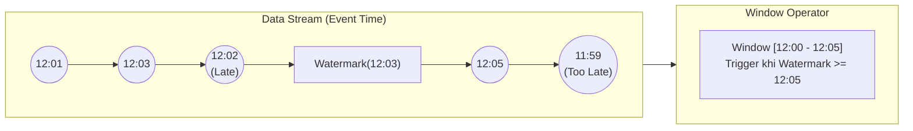

Trong các hệ thống phân tán (Distributed Systems), yếu tố thời gian luôn là một biến số hỗn loạn. Dữ liệu từ các thiết bị di động, IoT, hay Microservices hiếm khi đến Message Broker (Kafka, Kinesis) theo đúng thứ tự thời gian thực tế (out-of-order) do sự cố mạng, độ trễ truyền dẫn (network delay), hoặc thiết bị mất kết nối tạm thời rồi đẩy dữ liệu bù.

Bài toán đặt ra cho các hệ thống Stream Processing (như Apache Flink, Spark Structured Streaming) là: **Làm sao hệ thống biết được khi nào thì ĐÃ NHẬN ĐỦ dữ liệu của một khung giờ (Window) để kích hoạt (trigger) tính toán và xuất kết quả?**

Khái niệm **Watermark** (Dấu chuẩn thời gian) được sinh ra để giải quyết nghịch lý này. Dưới góc nhìn của một Staff Data Engineer, Watermark không chỉ là một mốc thời gian đơn thuần—nó là cơ chế cốt lõi (Core Heuristic) kiểm soát vòng đời của **State Memory** (Bộ nhớ Trạng thái) và trực tiếp định đoạt giới hạn vật lý của toàn bộ hệ thống Streaming.

## 1. Nghịch lý Thời gian: Event Time vs Processing Time

Trước khi đi sâu vào hệ thống vật lý, chúng ta cần phân biệt rõ hai khái niệm thời gian:

- **Event Time (Thời gian sự kiện):** Timestamp gắn liền với bản ghi tại thời điểm nó được sinh ra ở thiết bị nguồn (VD: User click vào nút Mua hàng lúc `12:00:05`).
- **Processing Time (Thời gian xử lý):** Timestamp của đồng hồ hệ thống trên máy chủ (Worker Node) lúc nó thực sự nhận được và xử lý sự kiện đó.

Sự chênh lệch giữa hai cột mốc này gọi là **Event Time Skew** hay **Data Lateness**. Một sự kiện sinh ra lúc `12:00:05` có thể bị kẹt ở Network Shuffle hoặc do app offline, và chỉ bay đến Engine lúc `12:05:00`. Nếu Engine tiến hành gom nhóm (Windowing) theo `Processing Time`, dữ liệu sẽ bị tính sai lệch vào khung giờ 12:05 (làm sai lệch số liệu doanh thu giờ 12:00). Do đó, các hệ thống chuẩn doanh nghiệp luôn sử dụng `Event Time` để đảm bảo tính toàn vẹn (Accuracy/Correctness).

## 2. Watermark dưới góc nhìn Kiến trúc Thực thi (Physical Execution)

Theo định nghĩa từ cuốn sách kinh điển *Streaming Systems* (Tyler Akidau), Watermark là một "đồng hồ logic" (Logical Clock) trôi dọc theo DAG (Directed Acyclic Graph) của luồng xử lý.

Khi một Watermark có giá trị `W` đi qua một Operator, nó phát ra một lời cam kết cấp hệ thống:
> *"Tôi giả định (heuristic) rằng từ giờ trở đi, sẽ không có thêm bất kỳ sự kiện nào có Event Time < W chạy tới Operator này nữa."*

Khi Watermark `W` vượt qua ngưỡng kết thúc của một Event-Time Window (ví dụ Window từ 12:00 đến 12:05), Window đó sẽ được đóng lại, tiến hành tính toán kết quả (Aggregation), và **quan trọng nhất**: Giải phóng State (State Cleanup) khỏi bộ nhớ (RocksDB hoặc JVM Heap).

### Sơ đồ: Dữ liệu Out-of-order và Watermark


*Sự kiện 11:59 đến sau khi Watermark 12:03 đã phát hành sẽ được coi là Late Data.*

### Sự lan truyền Watermark trong DAG (Watermark Propagation)

Trong thực tế, một Operator ở hạ nguồn (như `WindowJoin`) thường nhận dữ liệu từ nhiều Upstream Task (ví dụ: các Kafka Partitions khác nhau). Vậy Watermark của Operator hạ nguồn đó sẽ được tính như thế nào?

Nguyên tắc cốt lõi: **Watermark của một Downstream Operator = `MIN` (Tất cả Watermark của các Upstream Channel).**

Việc lấy `MIN()` đảm bảo rằng Downstream Operator không bị "cầm đèn chạy trước ô tô". Nó phải chờ luồng phân vùng dữ liệu chậm nhất bắt kịp trước khi ra quyết định đóng Window.

## 3. Cấu hình Code Thực chiến (Show, Don't Tell)

Trong môi trường phân tán (Internet), không bao giờ có **Perfect Watermark**. Chúng ta buộc phải sử dụng **Heuristic Watermark** bằng cách thiết lập một độ trễ cố định (Bounded Out-of-Orderness). 

Công thức chung: `Watermark = MAX(Event Time nhận được) - Bounded_Delay`

### Apache Flink (Java API)
Dưới đây là một pattern chuẩn Enterprise để định nghĩa Watermark và xử lý Late Data:

```java
// 1. Khai báo Watermark Strategy với độ trễ cho phép là 10 giây
WatermarkStrategy<Event> strategy = WatermarkStrategy
        .<Event>forBoundedOutOfOrderness(Duration.ofSeconds(10))
        .withTimestampAssigner((event, timestamp) -> event.getEventTime())
        // Rất quan trọng: Chống kẹt Watermark do Idle Partition
        .withIdleness(Duration.ofMinutes(1)); 

// 2. Khai báo Output Tag cho dữ liệu quá trễ (Dead Letter Queue)
OutputTag<Event> lateDataTag = new OutputTag<Event>("late-data"){};

// 3. Áp dụng vào luồng và cấu hình Window
SingleOutputStreamOperator<Result> windowedStream = stream
        .assignTimestampsAndWatermarks(strategy)
        .keyBy(event -> event.getUserId())
        .window(TumblingEventTimeWindows.of(Time.minutes(5)))
        // Cho phép hé cửa thêm 2 phút sau khi Watermark đã đi qua
        .allowedLateness(Time.minutes(2))
        // Dữ liệu đến sau 2 phút đó sẽ bị tống vào Side Output
        .sideOutputLateData(lateDataTag)
        .process(new MyWindowFunction());

// 4. Thu thập Late Data để ghi ra S3/Kafka vá lỗi sau này
DataStream<Event> lateStream = windowedStream.getSideOutput(lateDataTag);
```

## 4. Systemic Trade-offs & Sự cố Vận hành (Real-world Incidents)

Việc cấu hình `Bounded_Delay` (hay `allowedLateness`) chính là hành động vặn nút điều chỉnh trên một chiếc cân thăng bằng giữa **Độ trễ hệ thống (Latency)** và **Tính đầy đủ của số liệu (Completeness/Accuracy)**. Nếu setup sai lầm, bạn sẽ phải trả giá bằng việc hệ thống đổ vỡ toàn tập.

### Sự cố 1: State Bloat và JVM OOMKilled
- **Bối cảnh:** Lo sợ mất dữ liệu do thiết bị IoT offline lâu, một Data Engineer cấu hình Bounded Delay của Watermark lên tới `24 hours`.
- **Hệ lụy hệ thống:** Do Watermark bị kéo lùi lại 24 tiếng, Engine **KHÔNG ĐƯỢC PHÉP** giải phóng bất kỳ Window nào trong vòng 24 giờ qua (vì chúng chưa hết hạn - expire). Mọi dữ liệu bay vào hệ thống đều phải được giữ lại trong bộ nhớ (State Backend).
- **Sự cố:** Khi lưu lượng tăng đột biến, hệ thống bị nghẽn Memory (State Bloat), dẫn tới hiện tượng `JVM OOMKilled` (Out of Memory) đối với Heap State, hoặc Disk Full đối với RocksDB. Các nhịp GC Pause kéo dài hàng phút, làm sập toàn bộ Pipeline.
- **Khắc phục:** Giữ Bounded Delay ở mức tối thiểu gọn nhẹ (ví dụ 10 giây - 1 phút) để xả State nhanh. Những dữ liệu trễ hơn mức này sẽ được đẩy qua cơ chế **Late Data Handling (Side Outputs)** thay vì ôm tất cả trong State.

### Sự cố 2: Bài toán Idle Partition (Watermark bị kẹt)
- **Bối cảnh:** Một Kafka Topic được chia làm 50 Partitions. Vào ban đêm, lưu lượng ít, Partition số `49` hoàn toàn không có dòng sự kiện nào chảy qua (Idle).
- **Hệ lụy hệ thống:** Quay lại Sơ đồ lấy `MIN()` ở trên. Do Partition `49` không có event mới, Watermark của nó không tăng (mãi đứng im ở `12:00`). Điều này kéo theo Watermark của toàn bộ Downstream cũng đứng im ở `12:00`.
- **Sự cố:** Các Window bị treo vĩnh viễn và không bao giờ được trigger xuất kết quả, dù cho 49 Partitions kia dữ liệu vẫn đang đổ về. Sinh ra hiện tượng "No output, no error".
- **Khắc phục:** Bắt buộc phải cấu hình `.withIdleness()` trong Flink. Nếu một Partition không có dữ liệu sau một khoảng thời gian (ví dụ 1 phút), Flink sẽ đánh dấu nó là "Idle" và tạm thời loại bỏ partition đó khỏi phép tính `MIN()`, giúp hệ thống tiếp tục tiến về phía trước.

## 5. Xử lý Late Data: Khi Dữ liệu Đến Sau Khi Window Đóng

Điều gì xảy ra khi một event "thiên nga đen" vẫn đến sau khi Watermark đã đi qua (bao gồm cả Bounded Delay)? Hệ thống cung cấp 3 cơ chế ứng phó:

1. **Drop (Bỏ qua mặc định):** Sự kiện bị vứt bỏ lập tức. Rất an toàn cho RAM, giảm tải hệ thống, phổ biến cho các Dashboard Real-time không yêu cầu chính xác tuyệt đối từng con số lẻ.
2. **Side Output (Khuyên dùng):** Định tuyến (Route) những sự kiện "trễ tàu" này sang một luồng phụ (Side Output) như được cấu hình trong mã Java phía trên. Sau đó ghi ra raw S3 bucket. Cuối ngày, một tiến trình Batch (như Airflow + Spark) sẽ chạy để quét luồng này và vá lại dữ liệu (Lambda Architecture/Kappa Architecture).
3. **Allowed Lateness (Update/Retraction):** Chấp nhận "hé cửa" thêm một khoảng thời gian ngắn [ví dụ 2 phút]. Khi dữ liệu muộn bay vào, hệ thống sẽ mở lại state, tính toán lại, và bắn ra một bản ghi **Update** để ghi đè kết quả cũ. 
   > *Trade-off Kiến trúc:* Cơ sở dữ liệu hạ nguồn (Sink) **bắt buộc** phải hỗ trợ Upsert (như Apache Iceberg, Apache Hudi, DynamoDB). Nếu Sink của bạn là Append-only (như ghi Kafka không có compaction), việc update sẽ tạo ra dữ liệu trùng lặp (Duplicate Data).

## 6. Nguồn Tham Khảo (References)

- **Sách:** *Streaming Systems: The What, Where, When, and How of Large-Scale Data Processing* - Tyler Akidau.
- **Apache Flink Official Docs:** [Timestamps and Watermarks][https://nightlies.apache.org/flink/flink-docs-stable/docs/dev/datastream/event-time/generating_watermarks/]
- **Apache Flink Official Docs:** [Windows and Late Data][https://nightlies.apache.org/flink/flink-docs-stable/docs/dev/datastream/operators/windows/]
- **Decodable Blog:** [Understanding Apache Flink Watermarks][https://decodable.co/blog]
- **Netflix TechBlog:** Tham chiếu kiến trúc Data Mesh quản lý Iceberg Snapshots và Data High Watermarks trong xử lý trễ ([Data Mesh - A Data Movement and Processing Platform](https://netflixtechblog.com/data-mesh-a-data-movement-and-processing-platform-netflix-694d502d9996]).
