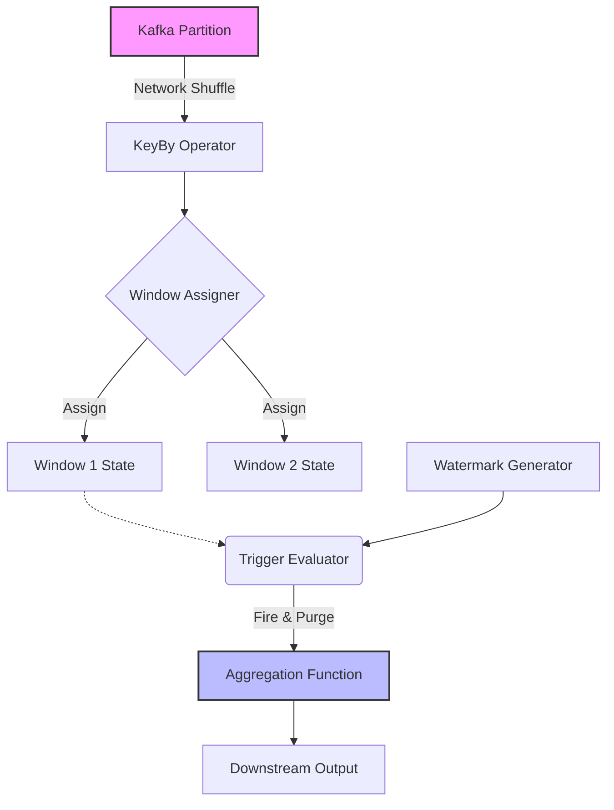

Khi xử lý luồng dữ liệu vô hạn (Unbounded Data), bài toán không nằm ở việc tính toán, mà nằm ở việc **quản lý trạng thái (State Management)**. Vì bộ nhớ vật lý (RAM/Disk) là hữu hạn, bạn không thể giữ toàn bộ dữ liệu trên memory chờ đến khi stream kết thúc. 

**Windowing** về mặt vật lý là cơ chế cấp phát, lưu trữ, và giải phóng vùng nhớ (State) theo các lát cắt thời gian. Khái niệm này luôn đi kèm với **Watermarks** – tín hiệu thu dọn rác (Garbage Collection signal) để hệ thống biết khi nào có thể an toàn đóng cửa sổ, xuất kết quả, và xóa State để tránh `OOMKilled`.

Bài viết này mổ xẻ sâu vào kiến trúc thực thi của Windowing, các đánh đổi hệ thống (Trade-offs), và cách thiết kế để chống lại các thảm họa tràn bộ nhớ trong môi trường Production.

---

## 1. Kiến trúc Thực thi Vật lý (Physical Execution)

Trong các hệ thống phân tán như Apache Flink hay Kafka Streams, luồng thực thi của một Windowing Operator bao gồm 3 thành phần cốt lõi:

1. **Window Assigner**: Khi một Record (sự kiện) đi vào, Assigner sẽ định tuyến (route) nó vào một hoặc nhiều Bucket (Cửa sổ). Nếu Record thuộc về nhiều cửa sổ (ví dụ: Sliding Window), dữ liệu gốc không được copy thành nhiều bản, mà State Backend (như RocksDB) sẽ tạo ra nhiều index point trỏ tới nó để tối ưu I/O.
2. **Trigger**: Là bộ đánh giá điều kiện (Condition Evaluator) chạy sau mỗi record hoặc mỗi khi Watermark tiến lên. Trigger quyết định xem Window đã đủ điều kiện để tính toán (Fire) và xóa State (Purge) hay chưa.
3. **State Backend**: Nơi lưu trữ dữ liệu của các Window đang mở (In-flight Windows). Tùy chọn In-memory (Heap) cho tốc độ siêu nhanh nhưng dễ OOM, hoặc RocksDB (Spill-to-disk) đánh đổi CPU/IO lấy sự ổn định.


*(Kiến trúc thực thi luồng Windowing và State Evaluation)*

---

## 2. Các Chiến lược Chia Cửa Sổ & Systemic Trade-offs

### 2.1. Tumbling Windows (Cửa sổ cuộn)

Tumbling Windows cắt stream thành các đoạn cố định, không chồng lấp. Một Record chỉ thuộc về **duy nhất** một window.


*(Tumbling Window. Nguồn: Apache Flink)*

- **Đánh đổi hệ thống (Trade-off):** Thân thiện với bộ nhớ nhất. Số lượng active state chỉ tương đương với số lượng Key $\times$ 1 (một window đang mở trên mỗi key). Thông lượng (Throughput) cao nhất vì ít phải phân nhánh (Routing).
- **Physical Impact:** Cực kỳ tối ưu cho các bài toán Aggregation liên tục như Count, Sum vì hệ thống có thể áp dụng `ReduceFunction` (tính gộp ngay lập tức) thay vì lưu trữ toàn bộ records thô vào ListState.

**Thực chiến Flink SQL (Tính tổng doanh thu mỗi 5 phút):**
```sql
SELECT 
    window_start, window_end, 
    store_id, SUM(revenue) as total_rev
FROM TABLE(
    TUMBLE(TABLE pos_transactions, DESCRIPTOR(event_time), INTERVAL '5' MINUTES)
)
GROUP BY window_start, window_end, store_id;
```

### 2.2. Sliding Windows (Cửa sổ trượt)

Các cửa sổ có cùng độ dài nhưng có thể chồng lấp. Slide step (bước trượt) quy định tần suất tạo cửa sổ mới.


*(Sliding Window. Nguồn: Apache Flink)*

- **Đánh đổi hệ thống (Trade-off):** Đây là cơn ác mộng về **Event Amplification** (Khuếch đại sự kiện). Nếu bạn cấu hình `Size = 1 giờ` và `Slide = 1 phút`, mỗi record mới tới sẽ được assign vào $60$ cửa sổ đồng thời. Điều này đồng nghĩa với việc Write I/O vào State Backend bị nhân lên gấp 60 lần, CPU cũng phải làm việc gấp 60 lần khi Trigger đánh giá.
- **Physical Impact:** Nếu dùng RocksDB State Backend, I/O disk sẽ bị ngẽn nghiêm trọng (Disk I/O Bound). Cần tuning kĩ RocksDB Block Cache và Write Buffer.

**Cấu hình Flink DataStream API Java (Di chuyển trung bình):**
```java
stream
    .keyBy(SensorData::getDeviceId)
    // Cửa sổ 10 phút, trượt 1 phút -> Record thuộc về 10 Windows
    .window(SlidingEventTimeWindows.of(Time.minutes(10), Time.minutes(1)))
    // Dùng AggregateFunction (Pre-aggregation) thay vì ProcessWindowFunction
    // để tránh lưu toàn bộ cục dữ liệu thô vào bộ nhớ
    .aggregate(new AverageAggregate());
```

### 2.3. Session Windows (Cửa sổ phiên)

Gom nhóm dựa trên hoạt động. Nếu một khóa (Key) không có event mới trong khoảng `session_gap`, window sẽ bị đóng.


*(Session Window. Nguồn: Apache Flink)*

- **Đánh đổi hệ thống (Trade-off):** Phức tạp nhất trong thực thi vì Session Window mang tính chất **Mergeable Window** (Cửa sổ có thể gộp lại). Khi hai event gần nhau xuất hiện, hệ thống phải liên tục thao tác Read-Modify-Write trên State Backend để *merge* các vùng nhớ lại thành một Session dài hơn. Quá trình này ngốn CPU cực mạnh do serialization/deserialization.
- **Physical Impact:** State không được thu hồi theo thời gian cố định. Rất dễ dính OOM (Out Of Memory) nếu một con bot liên tục spam event cách nhau `< session_gap`, khiến một window kéo dài bất tận và bành trướng kích thước (State Bloat).

---

## 3. Watermarks & Cơ chế xử lý Late Data

Trong môi trường phân tán, Event Time (thời gian phát sinh sự kiện) và Processing Time (thời gian máy chủ tính toán) luôn có một độ trễ (Skew). Mạng chập chờn, GC Pauses, hay Mobile rớt mạng khiến dữ liệu đến không theo thứ tự (Out-of-order).

**Watermark ($W$)** là một biến toàn cục mang ý nghĩa Heuristic: *"Hệ thống cam kết (một cách tương đối) rằng sẽ không có sự kiện nào có Event Time $t < W$ xuất hiện nữa"*.
Khi Watermark vượt qua thời gian kết thúc của cửa sổ $T_{end}$, cửa sổ được phép **Fire (xuất kết quả)** và **Purge (Xóa State)** để giải phóng bộ nhớ.

Tuy nhiên, sự đời hiếm khi hoàn hảo. Dữ liệu trễ (Late Data - $t < W$) vẫn có thể xuất hiện sau khi State đã bị dọn dẹp. Chúng ta xử lý bằng cách nào?

### 3.1. Allowed Lateness (Cho phép trễ)
Thay vì xóa State ngay lập tức khi Watermark đi qua, ta giữ lại (retain) State trong một khoảng `allowed_lateness`. Nếu Late Data rớt vào, Window sẽ Trigger thêm lần nữa (Retract & Accumulate) để cập nhật kết quả.

- **Rủi ro:** Giữ lại State quá lâu đồng nghĩa với việc State Backend phình to. Nếu `allowed_lateness = 1 day`, bạn đang lưu rác của 24h qua trong Disk/RAM. RocksDB Compaction sẽ trở thành nút thắt cổ chai, gây rớt Throughput hệ thống trầm trọng (Backpressure).

```java
// Flink: Cho phép trễ 30 phút, sau 30 phút rớt vào Side Output
OutputTag<Event> lateTag = new OutputTag<Event>("late-data"){};

WindowedStream<Event, String, TimeWindow> windowedStream = stream
    .keyBy(Event::getUserId)
    .window(TumblingEventTimeWindows.of(Time.minutes(5)))
    .allowedLateness(Time.minutes(30)) // Giữ State thêm 30 phút
    .sideOutputLateData(lateTag);     // Hết 30 phút đẩy ra Dead Letter Queue
```

### 3.2. Side Outputs (Mô hình Dead-Letter Queue)
Sự kiện đến quá trễ (sau cả `allowed_lateness`) sẽ bị rẽ nhánh sang một luồng phụ (Side Output) để đẩy xuống kho lạnh lưu trữ rẻ tiền (S3, GCS) thay vì làm sập luồng tính toán chính. Sau đó, batch processing (ví dụ: Spark) sẽ tiến hành Reconcile (đối soát) lại dữ liệu cuối ngày.

---

## 4. Operational Risks & Real-world Incidents (Các thảm họa Production)

### 4.1. Incident 1: "Idle Partitions" gây kẹt Watermark và tràn RAM
**Hiện tượng:** Một cụm Flink bỗng dưng bùng nổ Memory và `OOMKilled` hàng loạt TaskManager, mặc dù lưu lượng dữ liệu không tăng. Window kết quả không chịu xuất ra.
**Root Cause (Căn nguyên):** Khi bạn đọc từ một Kafka Topic có 100 Partitions, Watermark của Operator sẽ lấy $\min(Watermark_{p1}, ..., Watermark_{p100})$. Nếu có 1 Partition bị "đứng yên" (Idle - không có dữ liệu nào mới vào), Watermark của Partition đó sẽ kẹt vĩnh viễn ở một mốc thời gian cũ. Dẫn đến Global Watermark không thể tịnh tiến. 
Hậu quả là các Window không bao giờ được Fire & Purge. State phình to nuốt chửng toàn bộ Heap Memory.
**Cách khắc phục (Remediation):** Cấu hình Watermark Idle Timeout.
```java
// Đánh dấu partition là idle nếu không có sự kiện mới sau 10 giây
WatermarkStrategy
    .<Event>forBoundedOutOfOrderness(Duration.ofSeconds(5))
    .withIdleness(Duration.ofSeconds(10));
```

### 4.2. Incident 2: Thảm họa Cartesian Explosion trong Sliding Window
**Hiện tượng:** CPU Usage tăng 100%, Checkpoint timeout, ứng dụng bị ngẽn cục bộ (Backpressure).
**Root Cause:** Data Engineer thiết kế Sliding Window có $Size = 24h$, $Slide = 1s$. 1 Event được nhân bản vào $24 \times 60 \times 60 = 86400$ windows đồng thời. ListState phình to khủng khiếp.
**Cách khắc phục:** 
1. Không sử dụng Windowing trực tiếp. Thay vào đó lưu data vào Kafka, và dùng In-memory K-V Database (Redis/Aerospike) để tra cứu (Time-series aggregations).
2. Tối ưu kiến trúc thành **Two-phase Aggregation**: Tumbling window nhỏ ($1s$) tính trước tổng cục bộ (Pre-aggregation), sau đó mới trượt (Sliding) trên các cửa sổ $1s$ đã được nén nhỏ để tính ra mốc $24h$.

### 4.3. Incident 3: Data Skew và OOM trên Session Window
**Hiện tượng:** TaskManager xử lý Key "khách hàng VIP" bị sập liên tục.
**Root Cause:** Một con cào dữ liệu (Crawler/Bot) liên tục nhả event vào hệ thống bằng UserID của "khách hàng VIP". Mật độ event dày đặc khiến Session Gap không bao giờ đạt được. Session Window của Key này mở ra và kéo dài vô tận, gom hàng triệu event vào ListState.
**Cách khắc phục:** Custom Trigger. Không chỉ Trigger dựa trên Session Gap, mà buộc (Force fire) Trigger & Purge nếu Window State vượt quá $N$ phần tử hoặc quá thời gian tối đa tuyệt đối (Max Absolute Duration).

```java
// Ví dụ logic Custom Trigger ép đóng Session Window nếu lớn hơn 1000 items
public TriggerResult onElement(Event element, long timestamp, TimeWindow window, TriggerContext ctx) {
    long count = ctx.getPartitionedState(countDescriptor).value();
    if (count > 1000) {
        ctx.getPartitionedState(countDescriptor).clear();
        return TriggerResult.FIRE_AND_PURGE; // Ép đóng cửa sổ cứu RAM!
    }
    return TriggerResult.CONTINUE;
}
```

---

## 5. Nguồn Tham Khảo (References)

*   **Streaming Systems** - Tyler Akidau, Slava Chernyak, Reuven Lax (O'Reilly). *Một cuốn kinh thánh về Watermarks và Late Data.*
*   [Apache Flink Official Architecture: Windows & Watermarks](https://nightlies.apache.org/flink/flink-docs-stable/docs/dev/datastream/operators/windows/)
*   [Handling Late Data in Flink - Confluent Docs & Engineering Blogs](https://docs.confluent.io/platform/current/streams/developer-guide/dsl-api.html#windowing)
*   [Uber Engineering: Real-time Data Processing with Flink](https://www.uber.com/en-VN/blog/data-engineering/)
