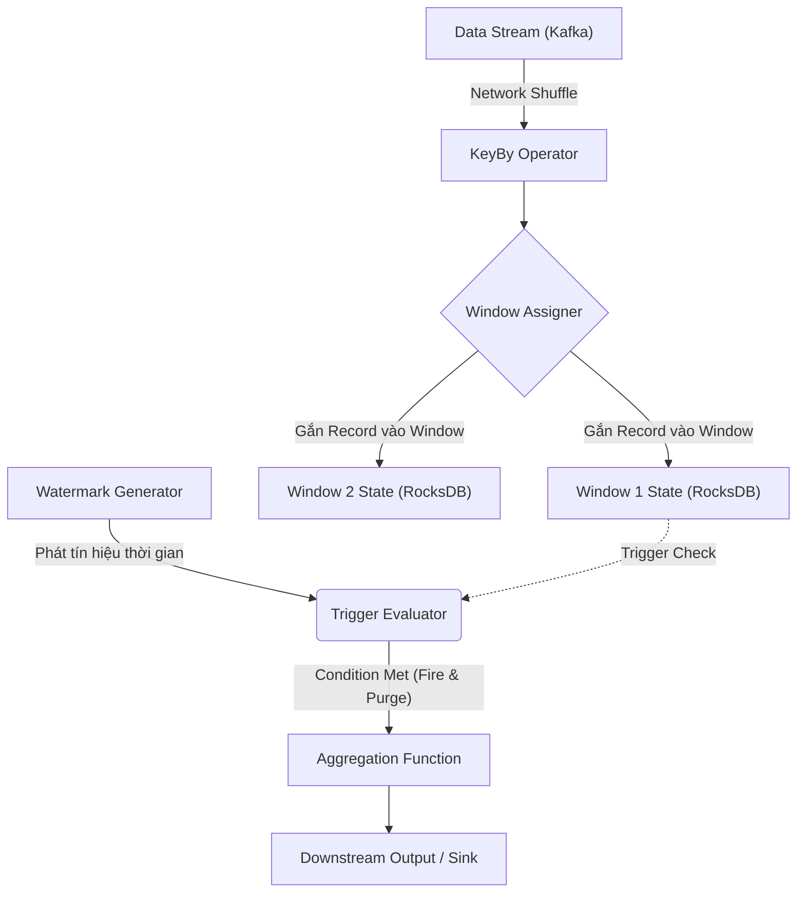

Khi xử lý luồng dữ liệu vô hạn (Unbounded Data), bài toán kỹ thuật không nằm ở việc tính toán `SUM` hay `COUNT`, mà nằm ở việc **Quản lý trạng thái (State Management)**. Vì bộ nhớ vật lý (RAM/Disk) là hữu hạn, bạn không thể giữ toàn bộ luồng sự kiện vĩnh viễn trên memory chờ đến khi hệ thống ngắt kết nối. 

**Windowing** về mặt vật lý là cơ chế cấp phát, lưu trữ, và giải phóng vùng nhớ (State) theo các lát cắt thời gian. Khái niệm này luôn đi kèm với **Watermarks** – một tín hiệu thu dọn rác (Garbage Collection signal) để hệ thống biết khi nào có thể an toàn đóng cửa sổ, xuất kết quả, và giải phóng bộ nhớ để tránh thảm họa tràn RAM (`OOMKilled`).

Bài viết này mổ xẻ sâu vào kiến trúc thực thi của Windowing, các đánh đổi hệ thống (Trade-offs) khốc liệt, và cách thiết kế để chống lại các sự cố Production.

## 1. Kiến trúc Thực thi Vật lý (Physical Execution Architecture)

Trong các hệ thống phân tán nhạy cảm với độ trễ (như Apache Flink, Kafka Streams), luồng thực thi của một Windowing Operator bao gồm 3 Engine lõi chạy song song:



1. **Window Assigner (Bộ định tuyến):** Khi một sự kiện đi vào, Assigner sẽ quyết định nhét nó vào một hoặc nhiều Bucket (Cửa sổ). Nếu một sự kiện thuộc về nhiều cửa sổ, dữ liệu gốc không bị copy thành nhiều bản trên RAM, mà State Backend sẽ tạo ra nhiều Index points trỏ tới nó để tối ưu Disk I/O.
2. **Trigger (Bộ kích hoạt):** Là một vòng lặp kiểm tra (Evaluator) chạy ngầm sau mỗi sự kiện hoặc mỗi khi Watermark tịnh tiến. Trigger quyết định xem Window đã đủ điều kiện để tính toán (Fire) và xóa rác (Purge) hay chưa.
3. **State Backend:** Nơi neo giữ dữ liệu của các Window đang mở (In-flight Windows). Việc chọn In-memory (Heap) cho tốc độ siêu nhanh (nhưng dễ chết OOM) hay RocksDB (Ghi xuống đĩa cứng để đổi CPU/IO lấy sự ổn định) là quyết định sống còn của Data Engineer.

## 2. Chiến lược Chia Cửa Sổ & Systemic Trade-offs

Ba loại Windowing phổ biến không đơn thuần là cú pháp code, chúng định hình cấu trúc dữ liệu trên bộ nhớ.

### 2.1. Tumbling Windows (Cửa sổ cuộn)
Cắt stream thành các đoạn thời gian cố định, không chồng lấp. Mỗi sự kiện thuộc về **DUY NHẤT** một window.
- **Đánh đổi hệ thống (Trade-off):** Thân thiện với bộ nhớ nhất. Số lượng Active State trên mỗi khóa (Key) luôn là $1$. Thông lượng (Throughput) cao nhất vì không phải phân nhánh hay tính toán lặp.
- **Physical Impact:** Cực kỳ tối ưu. Hệ thống áp dụng được hàm tính gộp tức thì (`ReduceFunction`) ngay khi dữ liệu vào, tránh việc phải ôm toàn bộ dữ liệu thô (Raw Records) đẩy xuống đĩa cứng.

```sql
-- Flink SQL Thực chiến: Tính tổng doanh thu mỗi 5 phút bằng Tumbling
SELECT 
    window_start, window_end, 
    store_id, SUM(revenue) as total_rev
FROM TABLE(
    TUMBLE(TABLE pos_transactions, DESCRIPTOR(event_time), INTERVAL '5' MINUTES)
)
GROUP BY window_start, window_end, store_id;
```

### 2.2. Sliding Windows (Cửa sổ trượt)
Các cửa sổ chồng lấp lên nhau. Slide step (Bước trượt) quy định tần suất tạo cửa sổ mới.
- **Đánh đổi hệ thống (Trade-off):** Đây là cơn ác mộng về **Event Amplification (Khuếch đại sự kiện)**. Nếu bạn cấu hình `Size = 1 giờ` và `Slide = 1 phút`, mỗi record mới tới sẽ được assign vào $60$ cửa sổ đồng thời. Điều này đồng nghĩa với việc Disk I/O Write vào RocksDB bị nhân lên gấp 60 lần.
- **Physical Impact:** Rất dễ làm sập cụm do thắt cổ chai I/O. Cần thiết kế "Pre-aggregation" (Tính tổng sơ bộ) trước khi đưa vào cửa sổ trượt dài.

### 2.3. Session Windows (Cửa sổ phiên)
Gom nhóm dựa trên hành vi hoạt động. Nếu một user không click chuột trong vòng 30 phút (Session Gap), window bị đóng.
- **Đánh đổi hệ thống (Trade-off):** Phức tạp nhất vì nó mang bản chất **Mergeable Window**. Khi 2 sự kiện rời rạc bỗng xuất hiện một sự kiện thứ 3 nối giữa, hệ thống phải thực hiện thao tác *Read-Modify-Write* nặng nề để GỘP 2 cửa sổ nhỏ thành 1 cửa sổ lớn.
- **Physical Impact:** Rất dễ bị "State Bloat" (Phình to trạng thái). Nếu một bot liên tục ping cách nhau 29 phút, cửa sổ của user đó sẽ kéo dài bất tận, nuốt chửng toàn bộ RAM của TaskManager.

## 3. Watermarks & Quản trị dữ liệu trễ (Late Data)

Trong phân tán, Event Time (Giờ trên máy người dùng) và Processing Time (Giờ trên Server) luôn lệch nhau do mạng lag. Dữ liệu bị đảo lộn thứ tự (Out-of-order).

**Watermark ($W$)** là một biến Heuristic toàn cục: *"Hệ thống cam kết (chắc chắn đến 99%) rằng sẽ không có sự kiện nào có Event Time $t < W$ rớt vào nữa"*.
Khi Watermark vượt qua thời gian kết thúc của cửa sổ $T_{"end"}$, cửa sổ được phép **Fire (xuất số liệu)** và **Purge (Xóa sạch State)**.

Tuy nhiên, 1% sự kiện lạc loài (Late Data) đến trễ sau khi cửa sổ đã bị xóa thì xử lý ra sao?

### 3.1. Allowed Lateness (Cho phép trễ)
Thay vì xóa State ngay khi Watermark vượt qua, ta giữ lại bộ nhớ thêm một khoảng `allowed_lateness`. Nếu Late Data rớt vào, Window sẽ tính toán lại (Retract) và cập nhật số liệu.

```java
// Kỹ thuật Flink: Cho phép trễ 30 phút, nếu trễ hơn đẩy ra Side Output (DLQ)
OutputTag<Event> lateTag = new OutputTag<Event>("late-data"){};

WindowedStream<Event, String, TimeWindow> windowedStream = stream
    .keyBy(Event::getUserId)
    .window(TumblingEventTimeWindows.of(Time.minutes(5)))
    .allowedLateness(Time.minutes(30)) // Kéo dài tuổi thọ của State trên đĩa
    .sideOutputLateData(lateTag);     // Hết 30 phút, đẩy ra Dead Letter Queue
```
**Rủi ro hệ thống:** Nếu cấu hình `allowed_lateness = 7 days`, bạn đang bắt hệ thống ôm toàn bộ lịch sử giao dịch của 7 ngày trên đĩa cứng RocksDB. Điều này dẫn đến quá trình Compaction của RocksDB bị quá tải, gây nghẽn cổ chai.

## 4. Operational Risks & Real-world Incidents (Các thảm họa Production)

### 4.1. Incident 1: "Idle Partitions" gây kẹt Watermark và Tràn RAM
- **Hiện tượng:** Cụm Flink bỗng nhiên bùng nổ Memory và `OOMKilled`. Window không xuất kết quả.
- **Root Cause:** Khi đọc Kafka 100 Partitions, Watermark = $\min(W_{"p1"}, ..., W_{"p100"})$. Nếu một Partition bị "đứng yên" (Idle - không có data mới), Watermark của partition đó kẹt ở quá khứ. Kéo theo Global Watermark không thể tăng lên. Cửa sổ không bao giờ được đóng, State phình to vô hạn.
- **Giải pháp:** Cấu hình **Idleness Timeout** để Flink phớt lờ partition chết.
```java
// Cấu hình Watermark bỏ qua partition chết sau 10 giây
WatermarkStrategy
    .<Event>forBoundedOutOfOrderness(Duration.ofSeconds(5))
    .withIdleness(Duration.ofSeconds(10)); // Ma thuật cứu OOM
```

### 4.2. Incident 2: Thảm họa Cartesian trong Sliding Window
- **Hiện tượng:** CPU 100%, Checkpoint sập do Backpressure.
- **Root Cause:** Cấu hình Sliding Window $Size = 24h$, $Slide = 1s$. Một sự kiện bị nhân bản vào 86,400 windows.
- **Giải pháp:** Bỏ Windowing trong Flink. Bắn dữ liệu thô vào In-memory Database (như Redis/Pinot) và Query theo dạng Time-series Aggregation.

### 4.3. Incident 3: Bot spam làm sập Session Window
- **Hiện tượng:** Key của "khách hàng" nào đó làm rớt Node.
- **Root Cause:** Crawler spam liên tục khiến Session Gap không bao giờ đạt được ngưỡng đóng.
- **Giải pháp:** Viết **Custom Trigger** ép đóng cửa sổ nếu vượt giới hạn.

```java
// Custom Trigger: Ép đóng Session Window cứu RAM
public TriggerResult onElement[Event element, long timestamp, TimeWindow window, TriggerContext ctx] {
    long count = ctx.getPartitionedState(countDescriptor).value();
    if (count > 1000) { // Giới hạn an toàn tuyệt đối
        ctx.getPartitionedState(countDescriptor).clear();
        return TriggerResult.FIRE_AND_PURGE; // Phá vỡ Session Gap, ép xóa
    }
    return TriggerResult.CONTINUE;
}
```

## Nguồn Tham Khảo (References)

* **Streaming Systems** - Tyler Akidau (Sách gối đầu giường về Watermarks của kỹ sư Google).
* [Apache Flink Architecture: Windows & Watermarks](https://nightlies.apache.org/flink/flink-docs-stable/docs/dev/datastream/operators/windows/)
* [Handling Late Data in Flink - Confluent Engineering Blogs](https://docs.confluent.io/)
* [Uber Engineering: Real-time Data Processing with Flink](https://www.uber.com/en-VN/blog/data-engineering/)
