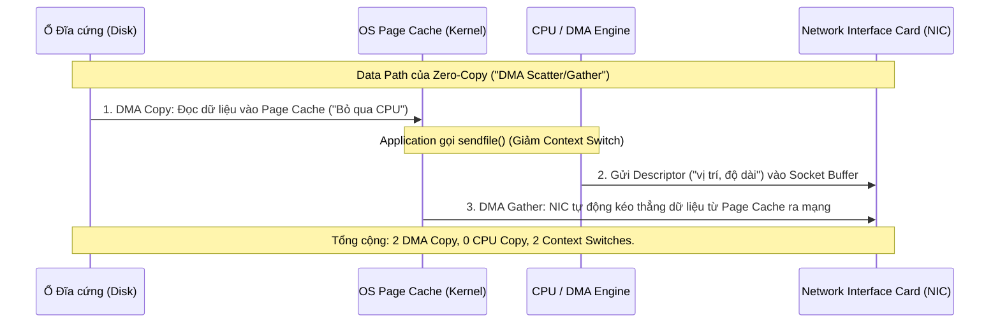

Bỏ qua các định nghĩa sách giáo khoa, **Zero-Copy** ở mức độ hệ thống (OS-level) không có nghĩa là "không copy dữ liệu". Thay vào đó, nó là một chiến lược thiết kế nhằm triệt tiêu hoàn toàn **CPU Copy** (Việc CPU phải tự tay chép dữ liệu) và giảm thiểu **Context Switches** (Chuyển đổi ngữ cảnh) bằng cách ủy quyền quá trình vận chuyển byte cho phần cứng chuyên dụng (Direct Memory Access - DMA). 

Trong các hệ thống Data-Intensive như Apache Kafka, Zero-Copy chính là "lằn ranh sinh tử" quyết định việc Broker của bạn có thể đẩy 10 GB/s throughput nhàn hạ hay sẽ bị crash với lỗi `JVM OOMKilled` và CPU kịch trần 100%.

---

## 1. Kiến trúc Thực thi Vật lý (Physical Execution)

### 1.1. Cổ chai của I/O truyền thống
Trong mô hình I/O truyền thống (dùng POSIX `read()` và `write()`), để gửi một file từ ổ đĩa ra network socket, luồng dữ liệu phải đi qua một hành trình thảm họa:

1. **DMA Copy:** Disk -> OS Kernel Buffer (Page Cache).
2. **CPU Copy:** OS Kernel Buffer -> User-space Application (JVM Heap).
3. **CPU Copy:** User-space Application -> OS Socket Buffer.
4. **DMA Copy:** OS Socket Buffer -> Network Card (NIC).

Tiến trình này đòi hỏi **4 lần Context Switch** (chuyển qua lại giữa User Mode và Kernel Mode) và **4 lần Copy dữ liệu** (trong đó có 2 lần CPU phải nai lưng ra làm). Sự cồng kềnh này tạo ra một cổ chai khổng lồ về Memory Bandwidth và lãng phí CPU Cycles cực kỳ lớn.

### 1.2. Giải pháp Zero-Copy với `sendfile()`
Kafka giải quyết bài toán này bằng system call `sendfile()` (trên Linux) kết hợp với phần cứng card mạng (NIC) có hỗ trợ **DMA Scatter/Gather**.



Ở cơ chế này, CPU chỉ làm nhiệm vụ quản lý Metadata (File descriptors, offsets). Toàn bộ payload dữ liệu khổng lồ sẽ "chảy" trực tiếp từ OS Page Cache thẳng xuống Card mạng. Ứng dụng (JVM của Kafka) hoàn toàn không "chạm" vào các byte này.

### 1.3. Bổ trợ bằng Memory-Mapped Files (`mmap`)
Bên cạnh `sendfile()` dùng để chuyển data, Kafka còn sử dụng `mmap` để đọc các file Time-Index. `mmap` ánh xạ (map) trực tiếp một file trên đĩa vào vùng nhớ ảo (Virtual Memory) của tiến trình. Application có thể đọc/ghi file này như thao tác trên một mảng byte trong RAM mà không cần gọi hàm `read()` hay `write()`, giảm đáng kể overhead khi tra cứu (lookup) offset.

---

## 2. Hiện thực hóa trong Hệ sinh thái Java (Implementation)

Trong Java, cơ chế `sendfile` được bọc dưới lớp abstraction `java.nio.channels.FileChannel.transferTo()`. Kafka tận dụng triệt để hàm này để phục vụ quá trình Fetch Data của Consumer.

Dưới đây là một đoạn code mô phỏng cách Kafka áp dụng NIO Zero-copy để bypass JVM Heap, chống Garbage Collection (GC) pauses:

```java
import java.io.RandomAccessFile;
import java.net.InetSocketAddress;
import java.nio.channels.FileChannel;
import java.nio.channels.SocketChannel;

public class ZeroCopyRouter {
    public static void streamDataToConsumer(String logFilePath, String clientIp, int port) throws Exception {
        // 1. Mở file log của partition (Nhưng KHÔNG load nội dung vào RAM của JVM)
        try (RandomAccessFile file = new RandomAccessFile(logFilePath, "r");
             FileChannel fileChannel = file.getChannel[);
             // 2. Mở kết nối TCP tới Consumer
             SocketChannel socketChannel = SocketChannel.open(new InetSocketAddress(clientIp, port))) {
            
            long position = 0;
            long count = fileChannel.size();
            
            // 3. ZERO-COPY EXECUTION: Gọi trực tiếp OS-level sendfile() under the hood
            // Bỏ qua hoàn toàn việc tạo byte[] buffer trong JVM (Zero Heap Allocation]
            long bytesTransferred = fileChannel.transferTo(position, count, socketChannel);
            
            System.out.println("Transferred " + bytesTransferred + " bytes directly via DMA.");
        }
    }
}
```

Nhờ thiết kế này, một Kafka Broker có thể được cấp phát máy chủ 64GB RAM vật lý, nhưng chỉ cần cấu hình `Xmx=6GB` cho JVM Heap. Toàn bộ 58GB RAM dư thừa sẽ được nhường lại cho Linux OS để làm Page Cache (Cache dữ liệu đọc/ghi đĩa).

---

## 3. Rủi ro Vận hành và Điểm Gãy (Operational Risks & Real-world Incidents)

Zero-Copy là một "kiến trúc thủy tinh" (Fragile architecture). Nếu bạn vi phạm các nguyên tắc Data-in-transit, hệ thống sẽ tự động Fallback (Chuyển lùi) về cơ chế Standard I/O truyền thống, kéo theo sự sụp đổ của toàn bộ Cluster.

### Incident 1: CPU Spike do Message Format Down-conversion
Một ngày đẹp trời, CPU của cụm Kafka tăng từ 15% lên 99%. Nguyên nhân: Một team Backend mới deploy một Consumer dùng thư viện Kafka Client quá cũ (VD: version 0.10) trong khi Broker đang lưu trữ file theo định dạng `message.format.version=3.0`.
- **Chuyện gì xảy ra?** Broker phát hiện sự chênh lệch format. Nó không thể dùng Zero-Copy được nữa. Broker buộc phải kéo toàn bộ block dữ liệu từ Kernel lên User Space (JVM Heap), **giải mã (deserialize)**, convert từng message sang format v0.10 cũ, cấp phát buffer mới rồi mới gửi đi.
- **Hệ quả:** CPU bốc cháy. JVM văng lỗi OOM (Out Of Memory) do rác cấp phát ồ ạt tạo ra Stop-The-World GC. Broker bị đánh văng khỏi Cluster.
- **Khắc phục:** Cấu hình cứng format version trên broker để từ chối các client quá cũ, hoặc bắt buộc team Backend cập nhật thư viện.

```properties
# file: server.properties (Kafka Broker)
log.message.format.version=3.4
```

### Incident 2: SSL/TLS giết chết Zero-Copy
Khi bạn cấu hình mã hóa bảo mật SSL/TLS (`security.protocol=SSL`) giữa Broker và Consumer.
- **Sự cố:** Để mã hóa khối dữ liệu (AES), CPU bắt buộc phải kéo dữ liệu từ Page Cache lên JVM, dùng khóa bí mật (Secret Key) để mã hóa, sau đó mới đẩy xuống Socket. Zero-Copy chính thức bị vô hiệu hóa. Hiệu năng network của Kafka có thể sụt giảm tới 50% khi bật SSL.
- **Khắc phục:** Các Data Platform lớn sử dụng **kTLS (Kernel TLS)** được hỗ trợ trên Linux kernel 4.15+ và Java 17+. kTLS đẩy việc mã hóa xuống tầng Kernel hoặc offload thẳng cho phần cứng card mạng (Hardware Offloading NIC). Kafka 3.0+ đã hỗ trợ kTLS để hồi sinh Zero-Copy trên đường truyền bảo mật.

### Incident 3: Bất đồng bộ về Định dạng Nén (Compression Mismatch)
Luật bất thành văn của Kafka: **"Dumb Broker, Smart Client"**. Producer tự nén batch [snappy, lz4, zstd] rồi mới đẩy lên. Broker coi batch đó là một cục Binary Payload đen ngòm và ghi thẳng xuống đĩa. Tuy nhiên, nếu bạn cấu hình `compression.type` sai:

```yaml
# KHÔNG BAO GIỜ làm điều này trên Production:
# Producer gửi Snappy, nhưng Topic bị cấu hình ép nén lại bằng GZIP.
apiVersion: kafka.strimzi.io/v1beta2
kind: KafkaTopic
metadata:
  name: heavy-traffic-topic
spec:
  config:
    compression.type: gzip # Phá vỡ Zero-Copy!
```
Broker sẽ phải giải nén (Decompress) Snappy, rồi nén lại (Compress) bằng GZIP trước khi lưu. **Best Practice:** Luôn đặt `compression.type=producer` trên Broker để bảo toàn nguyên trạng stream.

---

## 4. Ý Nghĩa Tài Chính (FinOps)

Sự tồn tại của Zero-Copy ảnh hưởng trực tiếp tới bài toán kinh tế (FinOps) của hạ tầng Data:
- **Scale-up thay vì Scale-out vô tội vạ:** Vì Kafka offload hoàn toàn tác vụ I/O cho DMA và Page Cache, hệ thống hiếm khi bị Compute Bound (Nghẽn CPU). Kỹ sư Data không cần thuê các Instance dòng Compute-Optimized (C5, C6g) đắt tiền của AWS. Các dòng Storage-Optimized (I3en, Im4gn) hoặc Memory-Optimized (R5) với băng thông mạng (Network Bandwidth) cao sẽ tiết kiệm hàng ngàn USD mỗi tháng.
- **Tối đa hóa năng lực 1 Node:** Nhờ Zero-Copy, một Broker đơn lẻ (với NVMe SSD) có thể đẩy 2-3 Gbps network traffic một cách nhẹ nhàng.

## Nguồn Tham Khảo (References)
* **IBM Developer**: [Efficient data transfer through zero copy][https://developer.ibm.com/articles/j-zerocopy/] (Bài viết nền tảng kinh điển về system calls).
* **Confluent Engineering**: [Kafka's Zero-Copy Architecture & Network Optimizations][https://www.confluent.io/blog/kafka-zero-copy-architecture/].
* **Linux Man Pages**: [sendfile(2] — Linux manual page](https://man7.org/linux/man-pages/man2/sendfile.2.html).
* **Designing Data-Intensive Applications** - Martin Kleppmann (Chương 11).
