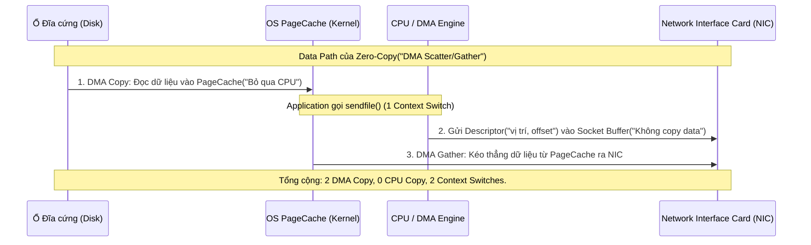

Bỏ qua các định nghĩa sách giáo khoa, Zero-Copy ở mức độ hệ thống không có nghĩa là "không copy dữ liệu". Thay vào đó, đây là chiến lược triệt tiêu hoàn toàn **CPU Copy** và **Context Switches** bằng cách ủy quyền quá trình vận chuyển byte cho phần cứng (Direct Memory Access - DMA). Trong các hệ thống Data-Intensive như Kafka, Zero-Copy chính là lằn ranh sinh tử quyết định việc Broker của bạn có thể đẩy 10 GB/s throughput hay sẽ bị crash với lỗi `JVM OOMKilled` và CPU kịch trần 100%.

## Kiến trúc Thực thi Vật lý (Physical Execution)

Trong mô hình I/O truyền thống (POSIX `read()` và `write()`), để gửi một file từ ổ đĩa ra network socket, hệ thống phải trải qua **4 lần Context Switch** giữa User Space và Kernel Space, kèm theo **4 lần Copy** (2 lần DMA Copy, 2 lần CPU Copy). Sự cồng kềnh này tạo ra một cổ chai khổng lồ về Memory Bandwidth và CPU Cycles.

Zero-Copy giải quyết bài toán này bằng system call `sendfile()` (trên Linux) kết hợp với phần cứng (NIC) có hỗ trợ **DMA Scatter/Gather**.



Ở cơ chế này, CPU chỉ làm nhiệm vụ quản lý Metadata (File descriptors, offsets). Toàn bộ payload dữ liệu (có thể lên tới hàng Terabytes) sẽ "chảy" trực tiếp từ OS PageCache thẳng xuống Card mạng (NIC). Ứng dụng (như JVM của Kafka) hoàn toàn không "chạm" vào các byte này.

## Hiện thực hóa trong Hệ sinh thái Java & Kafka (Implementation)

Trong Java, Zero-Copy được bọc dưới lớp abstraction `java.nio.channels.FileChannel.transferTo()`. Kafka tận dụng triệt để hàm này để phục vụ quá trình Fetch Data của Consumer.

Dưới đây là một đoạn code mô phỏng cách Kafka/Data Router áp dụng NIO Zero-copy để bypass JVM Heap, chống Garbage Collection (GC) pauses:

```java
import java.io.RandomAccessFile;
import java.net.InetSocketAddress;
import java.nio.channels.FileChannel;
import java.nio.channels.SocketChannel;

public class ZeroCopyRouter {
    public static void streamDataToConsumer(String logFilePath, String clientIp, int port) throws Exception {
        // 1. Mở file log của partition (Không load nội dung vào RAM)
        try (RandomAccessFile file = new RandomAccessFile(logFilePath, "r");
             FileChannel fileChannel = file.getChannel();
             // 2. Mở kết nối TCP tới Consumer
             SocketChannel socketChannel = SocketChannel.open(new InetSocketAddress(clientIp, port))) {
            
            long position = 0;
            long count = fileChannel.size();
            
            // 3. ZERO-COPY EXECUTION: OS-level sendfile() under the hood
            // Bỏ qua hoàn toàn việc tạo byte[] buffer trong JVM (Zero Heap Allocation)
            long bytesTransferred = fileChannel.transferTo(position, count, socketChannel);
            System.out.println("Transferred " + bytesTransferred + " bytes directly via DMA.");
        }
    }
}
```

Bởi vì dữ liệu đi theo đường `Disk -> PageCache -> NIC`, JVM của Kafka chỉ chứa các object metadata rất nhỏ. Một Kafka Broker có thể được cấp phát 32GB RAM vật lý, nhưng chỉ cấu hình `Xmx=4GB` hoặc `6GB` cho JVM Heap. Toàn bộ phần RAM dư thừa (26GB+) sẽ được nhường lại cho Linux để làm OS PageCache.

## Rủi ro Vận hành và Điểm Gãy (Operational Risks & Real-world Incidents)

Zero-Copy là một "kiến trúc thủy tinh" (fragile architecture). Nếu vi phạm các nguyên tắc Data-in-transit, hệ thống sẽ tự động fallback về cơ chế Standard I/O, kéo theo sự sụp đổ của toàn bộ Cluster (Thảm họa sập hệ thống dây chuyền).

### 1. Incident: CPU Spike & OOM do Message Format Down-conversion
Nếu Consumer đang chạy một version Kafka Client quá cũ (VD: version 0.10) trong khi Broker lưu trữ định dạng `message.format.version=2.0`, Broker buộc phải đọc dữ liệu từ PageCache vào User Space, **giải mã (deserialize)**, convert sang format cũ, rồi ghi lại ra buffer mới để gửi. Zero-Copy chính thức bị phá vỡ.
- **Hậu quả:** CPU load từ 10% nhảy vọt lên 95%. Memory cấp phát ồ ạt gây ra GC Pause (Stop-The-World) liên tục. Zookeeper / KRaft báo timeout và loại Broker đó ra khỏi ISR (In-Sync Replicas). 
- **Khắc phục:** Ép buộc các Consumer phải nâng cấp Client version, hoặc cấu hình cứng format version trên broker.

```properties
# file: server.properties (Kafka Broker)
# Đảm bảo broker lưu trữ cùng định dạng với consumer để giữ Zero-Copy
log.message.format.version=3.4
inter.broker.protocol.version=3.4
```

### 2. Sự ngắt quãng của SSL/TLS trên Application Layer
Để mã hóa dữ liệu qua SSL/TLS bằng JVM, CPU phải kéo dữ liệu từ kernel space lên user space, thực hiện mã hóa bằng khóa bảo mật, lưu ra buffer mới, rồi đẩy ngược xuống kernel space. Lúc này Zero-Copy bị triệt tiêu hoàn toàn. Chi phí CPU để mã hóa AES có thể làm giảm Throughput tới 40%-50%.
- **Giải pháp phần cứng:** Sử dụng **kTLS (Kernel TLS)** trên các nhân Linux đời mới (Linux 4.15+). kTLS đẩy việc mã hóa (Crypto) trực tiếp vào Kernel Space hoặc ủy quyền cho phần cứng NIC (Hardware Offloading). Từ Kafka 3.0+, hệ thống hỗ trợ Java 17+ có thể tận dụng kTLS để kích hoạt lại Zero-Copy ngay cả trên đường truyền bảo mật.

### 3. Bất đồng bộ về Định dạng Nén (Compression Mismatch)
Một nguyên tắc tối thượng trong Kafka là **"Dumb Broker, Smart Client"**. Producer tự nén batch (snappy, lz4, zstd) và đẩy lên. Broker chỉ coi batch đó là một cục Binary Payload và ghi nguyên khối xuống đĩa (Zero-Copy writes). Tuy nhiên, nếu bạn cấu hình `compression.type` trên Broker khác với Producer, Broker phải bung nén và nén lại.

```yaml
# KHÔNG BAO GIỜ làm điều này trên diện rộng (Mất Zero-copy):
# Topic A: Producer nén bằng Snappy, nhưng Broker cấu hình ép nén lại bằng GZIP.
apiVersion: kafka.strimzi.io/v1beta2
kind: KafkaTopic
metadata:
  name: heavy-traffic-topic
spec:
  partitions: 100
  replicas: 3
  config:
    compression.type: gzip # Sẽ phá vỡ zero-copy nếu Producer gửi Snappy/LZ4
```
**Best Practice:** Đặt `compression.type=producer` trên Broker để bảo toàn nguyên trạng byte stream.

## Tối ưu Chi phí (FinOps)

Việc tối ưu được Zero-Copy ảnh hưởng trực tiếp tới bài toán kinh tế (FinOps):
- **Scale-up vs Scale-out:** Bằng cách offload I/O cho DMA và PageCache, Kafka hiếm khi bị Compute Bound. Bạn không cần phải thuê các EC2 Instance dòng Compute-Optimized (như C5, C6g) đắt đỏ. Các dòng Storage-Optimized (I3en, Im4gn) hoặc Memory-Optimized (R5) với băng thông mạng cao sẽ mang lại giá trị lớn hơn nhiều.
- **Giảm số lượng Broker:** Khi không phải gánh CPU Copy, một Broker đơn lẻ có thể push 1-2 Gbps network traffic. Nếu phá vỡ Zero-copy, bạn có thể phải giảm Throughput Profile xuống hoặc phải tăng số lượng Node lên gấp 3-4 lần để xử lý cùng một lượng I/O.

## Nguồn Tham Khảo (References)
* **IBM Developer (Sathish K. Palaniappan)**: [Efficient data transfer through zero copy](https://developer.ibm.com/articles/j-zerocopy/). Một trong những bài viết kinh điển nhất về kiến trúc DMA và system calls.
* **Confluent Engineering**: [Kafka's Zero-Copy Architecture & Network Optimizations](https://www.confluent.io/blog/kafka-zero-copy-architecture/).
* **Designing Data-Intensive Applications (Martin Kleppmann)** - Chapter 11: Stream Processing (Log-based Message Brokers).
* **Linux Man Pages**: [sendfile(2) — Linux manual page](https://man7.org/linux/man-pages/man2/sendfile.2.html).
