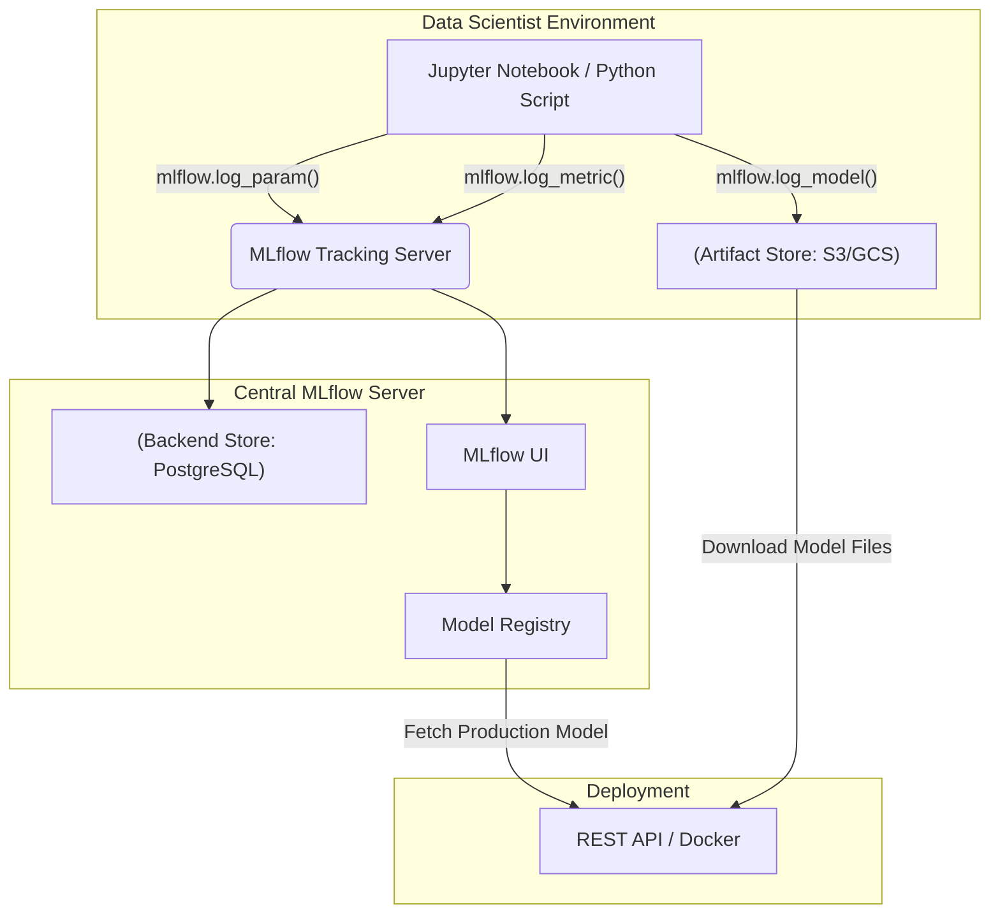

Nếu bạn từng tham gia huấn luyện các mô hình Machine Learning, chắc hẳn bạn đã trải qua những tình huống "dở khóc dở cười" này:
- Bạn chạy thử nghiệm 50 phiên bản mô hình khác nhau với đủ loại tham số (learning rate, batch size, epochs). Đến cuối tuần, bạn tìm được một mô hình có độ chính xác cao nhất nhưng hoàn toàn bất lực vì... không nhớ nổi mình đã dùng cấu hình nào để chạy nó.
- Mã nguồn chạy mượt mà trên laptop của bạn, nhưng khi đưa lên server production của công ty thì sập liên tục do lệch phiên bản thư viện (hội chứng "it works on my machine").
- Việc quản lý phiên bản mô hình được làm thủ công bằng cách lưu file với những cái tên như `model_v1_final.pkl`, rồi `model_v1_final_chot.pkl`.

Trong thế giới kỹ nghệ phần mềm truyền thống, chúng ta có Git để quản lý phiên bản code. Còn trong thế giới Học máy, chúng ta có **MLflow** — một nền tảng mã nguồn mở sinh ra để quản lý toàn bộ vòng đời của mô hình Machine Learning (ML Lifecycle), đóng vai trò là xương sống cho các hệ thống MLOps hiện đại.


## Bốn trụ cột công nghệ của MLflow

Được phát triển ban đầu bởi Databricks, MLflow được thiết kế theo triết lý độc lập với thư viện (framework-agnostic). Bạn có thể thoải mái sử dụng nó với TensorFlow, PyTorch, Scikit-learn, hay thậm chí là các mô hình ngôn ngữ lớn ([LLM](/concepts/6-ai-ml/genai-ml/llm/)) thông qua 4 thành phần cốt lõi:

### 1. MLflow Tracking (Lưu vết thử nghiệm)
Đây là một "cuốn nhật ký tự động" cho mọi lượt chạy (run) huấn luyện mô hình. Nó tự động ghi nhận các tham số đầu vào (parameters), các chỉ số đánh giá đầu ra (metrics - như Loss, Accuracy qua từng epoch), mã nguồn Git commit và các file kết quả vật lý (artifacts - như file model `.pkl`, hình ảnh biểu đồ ROC).

### 2. MLflow Projects (Đóng gói mã nguồn)
Giúp đóng gói code phân tích dữ liệu và huấn luyện theo một định dạng chuẩn hóa (sử dụng môi trường Conda hoặc Docker). Nhờ vậy, bất kỳ ai trong team cũng có thể chạy lại chính xác đoạn code đó trên máy tính của họ với cùng một kết quả mà không sợ lỗi môi trường.

### 3. MLflow Models (Đóng gói mô hình)
Định nghĩa một cấu trúc thư mục chuẩn cho các mô hình học máy. Một thư mục MLflow Model sẽ chứa file trọng số mô hình cùng một file mô tả cách sử dụng nó. Nhờ tính chuẩn hóa này, bạn có thể dễ dàng triển khai mô hình lên nhiều môi trường khác nhau như chạy batch trên [Apache Spark](/concepts/3-integration/batch-processing/apache-spark/), hoặc dựng REST API trên Docker.

### 4. Model Registry (Kho quản lý phiên bản tập trung)
Đóng vai trò như một "GitHub dành cho models". Nó cung cấp một giao diện tập trung để quản lý các phiên bản mô hình, theo dõi lịch sử cập nhật và kiểm soát trạng thái vòng đời của chúng (đang thử nghiệm - Staging, đang chạy thực tế - Production, hay đã lưu trữ - Archived).

---

## Luồng vận hành của MLflow dưới hậu trường

Hãy cùng xem dữ liệu và mô hình di chuyển thế nào trong một hệ thống sử dụng MLflow:


### 1. Giai đoạn Huấn luyện (Tracking)
Data Scientist viết code huấn luyện mô hình và tích hợp MLflow API. Chỉ với vài dòng lệnh, thậm chí chỉ cần bật tính năng tự động ghi nhận `mlflow.autolog()`, hệ thống sẽ tự động gửi mọi thông tin về máy chủ MLflow Server.
```python
import mlflow
import mlflow.sklearn
from sklearn.ensemble import RandomForestRegressor

# Tự động log toàn bộ tham số, metrics và model
mlflow.autolog()

with mlflow.start_run(run_name="Random_Forest_Experiment"):
    model = RandomForestRegressor(n_estimators=100, max_depth=5)
    model.fit(X_train, y_train)
    # Kết thúc block 'with', MLflow tự động lưu model và metrics lên server
```

### 2. Giai đoạn Quản lý (Registry)
Khi mở giao diện web (UI) của MLflow, bạn sẽ thấy danh sách tất cả các lượt chạy được trực quan hóa bằng biểu đồ trực quan. Khi tìm ra lượt chạy tốt nhất, bạn chỉ cần bấm nút **Register Model** và đặt tên cho nó (ví dụ: `House_Pricing_Model`). Sau đó, bạn có thể chuyển trạng thái của mô hình sang `Production`.

### 3. Giai đoạn Triển khai (Deployment)
Các ứng dụng backend hoặc API Gateway chỉ cần gọi đến MLflow API để kéo về mô hình có nhãn `Production` mới nhất và phục vụ người dùng. Team phát triển phần mềm không cần phải tự tay copy các file mô hình hay cài đặt lại thư viện thủ công nữa.

---

## Điểm mạnh và điểm yếu

### Điểm mạnh (Pros)
* **Cực kỳ dễ tiếp cận**: Bạn có thể tự dựng một server MLflow local trên máy tính cá nhân chỉ với câu lệnh `mlflow ui` trong vòng vài giây.
* **Hỗ trợ đa dạng công nghệ**: Chạy tốt với hầu hết các ngôn ngữ lập trình phổ biến (Python, R, Java) và mọi thư viện học máy.
* **Cộng đồng lớn mạnh**: Được hậu thuẫn bởi Databricks và có hàng nghìn doanh nghiệp lớn tin dùng, trở thành tiêu chuẩn thực tế (de-facto standard) của ngành MLOps.

### Điểm yếu (Cons)
* **Không phải là công cụ lập lịch (Scheduler)**: MLflow không giúp bạn lên lịch tự động chạy pipeline định kỳ (nhiệm vụ đó vẫn thuộc về các công cụ như [Apache Airflow](/concepts/3-integration/orchestration/apache-airflow/) hoặc Prefect).
* **Phân quyền bảo mật ở bản open-source còn hạn chế**: Bản miễn phí của MLflow không hỗ trợ các tính năng quản lý quyền truy cập nâng cao (RBAC). Nếu cần tính năng này, doanh nghiệp thường phải nâng cấp lên phiên bản thương mại của Databricks hoặc tự thiết kế các lớp bảo mật bổ sung.

## Khi nào nên dùng

### Nên dùng:
* Khi làm việc nhóm từ 2 kỹ sư Machine Learning trở lên và cần một công cụ cộng tác, chia sẻ thí nghiệm tập trung.
* Khi cần quản lý vòng đời và phiên bản của hàng chục, hàng trăm mô hình khác nhau từ Staging đến Production.
* Khi muốn đóng gói mã nguồn và mô hình chuẩn hóa để dễ dàng tái lặp (reproducible) trên bất kỳ máy chủ nào.

### Không nên dùng:
* Khi làm dự án nghiên cứu cá nhân siêu nhỏ hoặc không có nhu cầu đưa mô hình học máy vào vận hành thực tế (inference).
* Khi toàn bộ hạ tầng của doanh nghiệp đã đồng bộ hoàn chỉnh trên một đám mây khép kín như AWS SageMaker hay Vertex AI và không muốn vận hành thêm một công cụ tự host.

### Lời khuyên xương máu khi triển khai (Best Practices)
* **Tách biệt Storage lưu trữ**: Trong môi trường thực tế, hãy cấu hình MLflow lưu trữ metadata (các con số, tham số nhẹ) vào một cơ sở dữ liệu quan hệ (Backend Store như PostgreSQL). Còn đối với các file mô hình nặng (Artifact Store), hãy đẩy chúng lên các kho lưu trữ đám mây như AWS S3 hoặc Google [Cloud Storage](/concepts/2-storage/cloud-data-platform/cloud-storage/) để tránh làm tràn ổ cứng server.
* **Tự động hóa bằng Webhooks**: Thiết lập các webhook để khi một mô hình được chuyển trạng thái sang `Production` trong Model Registry, hệ thống sẽ tự động kích hoạt đường ống CI/CD để build Docker và deploy bản cập nhật lên Kubernetes.
* **Tận dụng thẻ phân loại (Tags)**: Hãy đặt tag rõ ràng cho mỗi lượt chạy (ví dụ: phiên bản tập dữ liệu sử dụng, tên người thực hiện) để sau này dễ dàng tìm kiếm và đối chiếu.

---


---

## Khái niệm liên quan

* MLOps (Machine Learning Operations)
* [Model Serving](/concepts/6-ai-ml/genai-ml/model-serving/)
* LLMOps

---

## Trọng tâm ôn luyện phỏng vấn

### 1. Phân biệt vai trò của Backend Store và Artifact Store trong kiến trúc MLflow?
* **Mục đích của người phỏng vấn**: Đánh giá hiểu biết của bạn về thiết kế hệ thống (System Design) khi triển khai MLflow ở quy mô doanh nghiệp.
* **Gợi ý trả lời**:
  * **Backend Store** là cơ sở dữ liệu quan hệ (như PostgreSQL hay MySQL). Nó được dùng để lưu trữ các thông tin nhẹ có cấu trúc như: tên thử nghiệm, siêu tham số đầu vào, điểm số metrics qua từng epoch, thông tin định danh mô hình. Việc lưu trữ trên DB giúp hệ thống truy vấn và hiển thị biểu đồ so sánh cực kỳ nhanh.
  * **Artifact Store** là hệ thống lưu trữ tệp tin (như AWS S3, Google Cloud Storage, hoặc MinIO). Nó được dùng để chứa các file vật lý có dung lượng lớn như file trọng số mô hình (`.pkl`, `.pb`, `.pt`), hình ảnh biểu đồ, file cấu hình môi trường... Việc tách biệt này giúp MLflow Server không bị quá tải ổ cứng và có thể lưu trữ dữ liệu vô hạn trên các Object Storage giá rẻ.

### 2. MLflow Model Registry giúp giải quyết rạn nứt giao tiếp giữa đội ngũ Data Science và đội ngũ Software Engineering như thế nào?
* **Mục đích của người phỏng vấn**: Đánh giá tư duy tối ưu hóa quy trình vận hành sản phẩm (Operations) của bạn.
* **Gợi ý trả lời**:
  * Trước đây, khi Data Scientist huấn luyện xong mô hình, họ thường gửi file qua Google Drive cho kỹ sư phần mềm kèm một file text mô tả các thư viện cần cài đặt. Quy trình thủ công này rất dễ xảy ra lỗi lệch phiên bản môi trường.
  * Với Model Registry, MLflow cung cấp một cổng API chuẩn hóa. Kỹ sư phần mềm chỉ cần viết code yêu cầu hệ thống tự động tải mô hình đang được gán nhãn `production` mới nhất. MLflow sẽ trả về file mô hình cùng file môi trường (`conda.yaml`) chuẩn chỉ. Khi Data Scientist cập nhật mô hình mới trên giao diện UI của MLflow, hệ thống backend của ứng dụng sẽ tự động nhận diện và cập nhật theo mà không cần phải thay đổi một dòng code nào của phần mềm.

### 3. Có thể dùng MLflow để theo dõi (track) các thử nghiệm trên các Mô hình Ngôn ngữ Lớn (LLM) không? Nếu có thì khác biệt gì so với ML truyền thống?
* **Mục đích của người phỏng vấn**: Đánh giá mức độ cập nhật của bạn đối với các xu hướng công nghệ GenAI mới nhất.
* **Gợi ý trả lời**:
  * Hoàn toàn được. MLflow cung cấp các tính năng hỗ trợ riêng cho LLM gọi là MLflow LLM Tracking.
  * Điểm khác biệt lớn nhất là đối tượng cần lưu vết: Thay vì lưu các chỉ số toán học truyền thống như Loss hay Accuracy, trong LLM Tracking, chúng ta cần lưu vết các cấu trúc câu lệnh (Prompt templates), các tham số sinh từ (`temperature`, `top_p`, `max_tokens`) và câu trả lời đầu ra của AI. 
  * Ngoài ra, MLflow còn hỗ trợ tích hợp các độ đo đánh giá chất lượng câu trả lời đặc thù của LLM (như đo lường độ ảo giác, tính thân thiện, độ chính xác của câu trả lời) sử dụng phương pháp LLM-as-a-judge để chấm điểm tự động.

---

## Xem thêm các khái niệm liên quan
* [Tác nhân AI (AI Agent)](/concepts/6-ai-ml/genai-ml/ai-agent/)
* [Phân tách văn bản - Chunking and Chunking Strategy](/concepts/6-ai-ml/genai-ml/chunking/)
* [Cửa sổ ngữ cảnh - Context Window](/concepts/6-ai-ml/genai-ml/context-window/)

## Tài liệu tham khảo

1. [Databricks - MLflow Guide and Integration](https://docs.databricks.com/en/mlflow/index.html)
2. [AWS - Amazon SageMaker Integration with MLflow](https://docs.aws.amazon.com/sagemaker/latest/dg/mlflow.html)
3. [Azure - Manage Machine Learning Models with MLflow](https://learn.microsoft.com/en-us/azure/machine-learning/concept-mlflow)
4. [Snowflake - Snowpark ML Model Registry Overview](https://docs.snowflake.com/en/developer-guide/snowpark-ml/index)
5. [Google Cloud - Vertex AI and MLOps Core Platform Guide](https://cloud.google.com/vertex-ai/docs/start/introduction-mlops)

---

## English summary

MLflow is an open-source platform dedicated to managing the Machine Learning lifecycle (MLOps). It offers four primary components: Tracking (for logging parameters, metrics, and code versions), Projects (for standardizing code packaging), Models (for standardized model deployment), and Model Registry (for centralized versioning and lifecycle management). By decoupling metadata storage (Backend Store) from heavy file storage (Artifact Store), MLflow enables reproducible data science, seamless collaboration between data and engineering teams, and robust production deployments, making it the industry standard for both traditional ML and modern LLM operations.