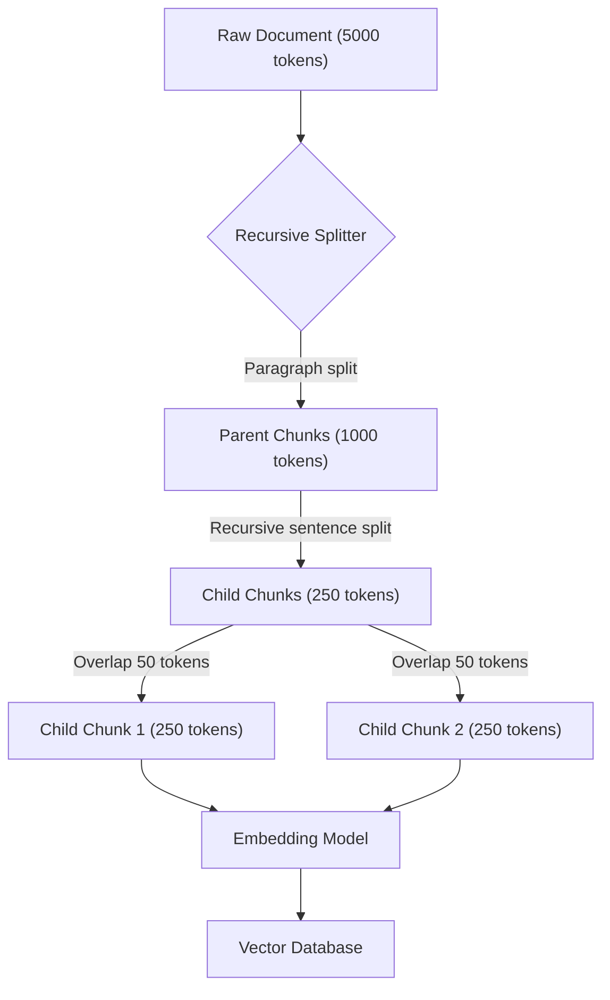

Khi xây dựng các ứng dụng Trí tuệ nhân tạo tạo sinh (GenAI), đặc biệt là các hệ thống trả lời câu hỏi dựa trên tài liệu doanh nghiệp sử dụng kiến trúc [RAG](/concepts/6-ai-ml/genai-ml/rag/), việc xử lý dữ liệu đầu vào đóng vai trò quyết định. Một trong những bước tiền xử lý quan trọng nhất là **Chunking (Phân tách văn bản)**. Kỹ thuật này không chỉ giúp mô hình "nuốt" trôi các tài liệu dài mà còn trực tiếp ảnh hưởng đến độ chính xác của tìm kiếm ngữ nghĩa và chất lượng câu trả lời từ LLM.

## Chunking: Nghệ thuật "chia để trị" văn bản trong kỷ nguyên GenAI

Nói một cách đơn giản, **Chunking** là hành động chia nhỏ một tài liệu văn bản dài (như sách, file PDF, trang web, báo cáo tài chính) thành các đoạn ngắn hơn, có kích thước tối ưu (gọi là các *chunks*). 

Mỗi mảnh nhỏ sau khi được cắt ra sẽ đại diện cho một ý tưởng cụ thể và được gửi qua mô hình [Embedding](/concepts/6-ai-ml/genai-ml/embedding-models/) để chuyển đổi thành một vector độc lập trước khi lưu trữ vào [Cơ sở dữ liệu Vector](/concepts/6-ai-ml/genai-ml/vector-database/). Khi người dùng đặt câu hỏi, hệ thống sẽ thực hiện tìm kiếm ngữ nghĩa để tìm ra các chunks liên quan nhất, thay vì phải gửi toàn bộ tài liệu khổng lồ cho mô hình ngôn ngữ lớn (LLM).

## Tại sao chúng ta không thể nhồi nhét tài liệu nguyên bản vào AI?

Có ba nguyên nhân vật lý và kỹ thuật cốt lõi buộc chúng ta phải phân tách văn bản:

1. **Giới hạn vật lý của mô hình Embedding**: Các mô hình nhúng phổ biến (như `text-embedding-ada-002` của OpenAI hay các mô hình HuggingFace) đều có giới hạn cứng về độ dài chuỗi ký tự đầu vào `(Max Sequence Length/Token limit)`. Nếu bạn đưa vào một tài liệu dài vượt quá giới hạn này (ví dụ: > 8192 tokens), mô hình sẽ lặng lẽ cắt bỏ phần nội dung thừa phía sau, gây mất mát dữ liệu nghiêm trọng.
2. **Hiện tượng "loãng" ngữ nghĩa (Semantic Dilution)**: Một vector nhúng giống như một không gian có số chiều cố định. Nếu bạn cố ép mô hình nhúng cả một cuốn sách dài 50 trang vào một vector duy nhất, vector đó sẽ chứa một mớ hỗn độn nhiều ý tưởng khác nhau. Khi người dùng hỏi về một chi tiết nhỏ, thuật toán tìm kiếm khoảng cách Vector sẽ không đủ độ nhạy để nhận diện ra tài liệu đó nữa.
3. **Giới hạn Context Window của LLM**: Việc gửi một lượng lớn văn bản không liên quan vào prompt của LLM không chỉ làm tăng chi phí API một cách chóng mặt mà còn gây ra hiện tượng nhiễu thông tin. AI dễ bị hiện tượng "Lost in the middle" (quên mất thông tin nằm ở giữa tài liệu) và tăng nguy cơ sinh ra ảo giác (hallucination).

## Hai trụ cột cốt lõi: Chunk Size và Chunk Overlap

Mọi chiến lược phân tách văn bản đều xoay quanh hai tham số cơ bản sau:
* **Chunk Size (Kích thước khối)**: Số lượng ký tự `(Character)` hoặc `Token` tối đa được phép xuất hiện trong một khối dữ liệu. Kích thước này cần được cân bằng theo nguyên tắc Goldilocks: không quá to để tránh loãng ngữ nghĩa, nhưng cũng không quá nhỏ để giữ đủ bối cảnh.
* **Chunk Overlap (Độ chồng lấp)**: Số lượng từ hoặc ký tự ở phần cuối của khối trước được giữ lại và lặp lại ở phần đầu của khối tiếp theo. Độ chồng lấp này đóng vai trò như một chiếc cầu nối ngữ nghĩa, giúp đảm bảo các câu văn dài hoặc các ý nghĩa liên tục không bị chặt đứt làm đôi một cách thô bạo ở ranh giới vết cắt. Tỉ lệ overlap an toàn thường dao động trong khoảng **10% - 20%** kích thước chunk.

## Sơ đồ hóa quy trình Recursive Chunking với Overlap

Dưới đây là mô hình kiến trúc của một luồng xử lý phân tách tài liệu dạng Parent-Child Chunking kết hợp Overlap:

## Các chiến lược phân tách văn bản phổ biến

### 1. Cắt theo kích thước cố định (Fixed-size Chunking)
Đây là cách tiếp cận thô sơ nhất. Hệ thống cứ đếm đủ số ký tự hoặc token quy định là thực hiện một nhát cắt.
* *Đặc điểm*: Cứ 500 ký tự cắt 1 nhát, chồng lấp 50 ký tự.
* *Ưu điểm*: Cực kỳ nhanh, thuật toán siêu đơn giản.
* *Nhược điểm*: Dễ làm đứt mạch ý nghĩa của câu (ví dụ: từ "Apple" bị chia đôi thành "Ap" ở chunk trước và "ple" ở chunk sau).

### 2. Cắt đệ quy theo ký tự (Recursive Character Text Splitting)
Đây được coi là "tiêu chuẩn vàng" và là lựa chọn mặc định trong các thư viện lớn như LangChain hay LlamaIndex.
* *Đặc điểm*: Thuật toán sẽ cố gắng cắt văn bản dựa trên danh sách các dấu phân cách từ lớn đến nhỏ (như dấu xuống dòng kép `\n\n` đại diện cho đoạn văn, dấu xuống dòng đơn `\n`, dấu chấm câu `. `, khoảng trắng ` `, và ký tự thô).
* *Ưu điểm*: Tôn trọng cấu trúc ngữ pháp tự nhiên, giữ cho các câu văn và đoạn văn được trọn vẹn nhất có thể.

### 3. Cắt theo cấu trúc tài liệu (Structural Chunking)
Chiến lược này phân tích cấu trúc định dạng của file để thực hiện phân tách.
* *Đặc điểm*: Sử dụng các thẻ tiêu đề HTML (`<h1>`, `<h2>`) hoặc tiêu đề Markdown (`#`, `##`) để cắt nhỏ tài liệu.
* *Ưu điểm*: Rất thích hợp cho tài liệu kỹ thuật, hướng dẫn sử dụng, nơi mỗi mục tiêu đề đã tự đóng gói một chủ đề ngữ nghĩa riêng biệt.

### 4. Cắt theo ngữ nghĩa (Semantic Chunking)
Đây là phương pháp nâng cao, sử dụng mô hình học máy để tìm điểm cắt.
* *Đặc điểm*: Tính toán khoảng cách vector nhúng giữa các câu liên tiếp. Khi khoảng cách này vượt qua một ngưỡng nhất định (chủ đề đã thay đổi), thuật toán sẽ thực hiện cắt.
* *Ưu điểm*: Tạo ra các khối văn bản có tính nhất quán về mặt nội dung cực kỳ cao.
* *Nhược điểm*: Tốn thời gian tính toán và chi phí gọi API cao.

## Kinh nghiệm thực chiến khi thiết kế Chunking (Best Practices)

* **Chọn đơn vị Token thay vì Character**: Ký tự chỉ đơn thuần là chữ cái, trong khi Token mới là đơn vị ngôn ngữ thực tế mà LLM và mô hình Embedding tiếp nhận. Việc đếm theo Token thông qua các thư viện như `tiktoken` giúp kiểm soát chính xác dung lượng dữ liệu truyền đi, tránh việc vượt quá giới hạn của mô hình một cách vô tình.
* **Gắn kèm Metadata**: Khi chia cắt tài liệu lớn thành hàng trăm mảnh nhỏ, hãy luôn đính kèm các siêu dữ liệu cho từng chunk như `{"source": "bao_cao.pdf", "page": 15, "chapter": 3}`. Điều này giúp dễ dàng lọc kết quả hoặc truy ngược nguồn gốc văn bản.
* **Giải quyết bài toán mất kết nối thông tin toàn cục**: Việc cắt nhỏ làm đứt mạch liên kết các đại từ. Chunk 1 viết: *"Google đã phát hành Gemini"*, chunk 2 bị cắt ra chỉ còn: *"Họ hy vọng nó sẽ thay đổi cuộc chơi"*. Nếu chỉ tìm thấy chunk 2, LLM sẽ không biết "Họ" là ai. Kỹ thuật **Parent Document Retrieval** sẽ giải quyết việc này bằng cách dùng chunk nhỏ (Child) để tìm kiếm nhưng lấy chunk lớn (Parent) chứa nó để đưa vào prompt cho LLM.

## Khi nào nên dùng

* **Nên dùng:**
  * Khi thiết kế các pipeline nạp dữ liệu (data ingestion) cho hệ thống RAG cần xử lý tài liệu phi cấu trúc dài.
  * Khi tối ưu hóa chất lượng tìm kiếm ngữ nghĩa và giảm bớt ảo giác của LLM bằng các phân mảnh dữ liệu phù hợp.
* **Không nên dùng:**
  * Xử lý dữ liệu bảng biểu có cấu trúc rõ ràng (như SQL, CSV). Với loại dữ liệu này, việc giữ nguyên vẹn từng dòng hoặc đối tượng JSON sẽ hiệu quả hơn.

## Điểm mạnh (Pros)

### Điểm mạnh (Pros)
* **Độ tập trung ngữ nghĩa tối đa:** Giúp Vector Database tìm đúng phân đoạn trả lời chính xác cho câu hỏi của người dùng.
* **Tiết kiệm chi phí token:** Chỉ gửi các phần văn bản liên quan nhất cho LLM thay vì bắt nó đọc cả cuốn sách dày cộp, giúp giảm đáng kể chi phí gọi API.

### Điểm yếu (Cons)
* **Chia cắt cấu trúc tổng thể:** Các mối quan hệ mang tính hệ thống bắc cầu nằm rải rác ở đầu và cuối tài liệu sẽ bị chặt đứt.
* **Tăng gánh nặng cơ sở dữ liệu:** Một tài liệu gốc duy nhất có thể biến thành hàng ngàn bản ghi vector, đòi hỏi dung lượng lưu trữ lớn hơn cho Vector DB.

## Trọng tâm ôn luyện phỏng vấn

### 1. Tại sao Chunk Overlap lại quan trọng trong Chunking Strategy? Điều gì xảy ra nếu Overlap = 0?
* **Gợi ý trả lời**:
  * Nếu không có overlap (Overlap = 0), điểm cắt có thể rơi vào ngay giữa một câu chứa thông tin quan trọng. Việc chia cắt chủ ngữ ở chunk trước và vị ngữ ở chunk sau sẽ khiến cả hai chunk đó mất đi ý nghĩa trọn vẹn khi chuyển đổi sang vector.
  * Overlap đóng vai trò như một cửa sổ trượt giữ lại ngữ cảnh liên kết. Nó đảm bảo các thông tin liền mạch ở vùng giáp ranh được giữ lại đầy đủ ở cả hai khối kề nhau, giúp mô hình embedding tạo ra các vector phản ánh chính xác ý nghĩa của văn bản.

### 2. Kỹ thuật Parent-Child Chunking hoạt động thế nào và nó giải quyết bài toán đánh đổi nào?
* **Gợi ý trả lời**:
  * Kỹ thuật này giải quyết nghịch lý: *"Chunk nhỏ thì tìm kiếm vector chính xác nhưng thiếu ngữ cảnh cho LLM, trong khi chunk lớn thì nhiều ngữ cảnh nhưng tìm kiếm kém nhạy"*.
  * Cách hoạt động: Tài liệu ban đầu được cắt thành các khối lớn (Parent Chunks), sau đó mỗi Parent Chunk tiếp tục được chia nhỏ thành các khối con (Child Chunks). Chúng ta chỉ mang các Child Chunks đi tạo vector và lưu vào Vector Database. Khi người dùng đặt câu hỏi, hệ thống tìm kiếm vector trên các Child Chunks nhỏ này để đạt độ chính xác cao nhất. Tuy nhiên, trước khi gửi thông tin cho LLM sinh câu trả lời, hệ thống sẽ tự động tra cứu ngược lại để lấy toàn bộ nội dung của Parent Chunk tương ứng. Nhờ đó, LLM có đầy đủ bối cảnh rộng để trả lời mà không lo bị cụt thông tin.

### 3. Sự khác biệt giữa việc đếm Chunk size bằng "Character" (Ký tự) và "Token" là gì? Cái nào tốt hơn?
* **Gợi ý trả lời**:
  * Ký tự là đếm từng chữ cái đơn lẻ. Token là đơn vị ngôn ngữ mà LLM thực sự tiếp nhận (có thể là một từ hoặc một phần của từ). Thông thường, 1 token tiếng Anh tương đương với khoảng 4 ký tự. Tuy nhiên, với tiếng Việt, một từ có dấu phức tạp có thể bị phân tách thành nhiều tokens nhỏ hơn.
  * Sử dụng đơn vị **Token** luôn luôn tốt hơn. Lý do là giới hạn đầu vào của cả mô hình Embedding và LLM đều được tính bằng Token. Việc đếm theo Token (thông qua các thư viện như `tiktoken`) giúp chúng ta kiểm soát chính xác dung lượng dữ liệu truyền đi, tránh việc vượt quá giới hạn của mô hình một cách vô tình.

## Xem thêm các khái niệm liên quan
* [Tác nhân AI (AI Agent)](/concepts/6-ai-ml/genai-ml/ai-agent/)
* [Cửa sổ ngữ cảnh - Context Window](/concepts/6-ai-ml/genai-ml/context-window/)
* [Các mô hình nhúng - Embedding Models](/concepts/6-ai-ml/genai-ml/embedding-models/)

## Tài liệu tham khảo

* [Google Cloud - Use RAG in Vertex AI and Document Processing](https://cloud.google.com/vertex-ai/docs/generative-ai/agent-engine/use-rag)
* [AWS - Retrieval-Augmented Generation (RAG) Best Practices](https://aws.amazon.com/what-is/retrieval-augmented-generation/)
* [Azure Microsoft - Cosmic DB Vector Search and Chunking](https://azure.microsoft.com/en-us/blog/introducing-vector-search-in-azure-cosmos-db/)
* [Databricks - Document Preparation and Vector Search Chunking](https://docs.databricks.com/en/generative-ai/vector-search.html)
* [Pinecone - Chunking Strategies for LLM Applications](https://www.pinecone.io/learn/chunking-strategies/)
* [LangChain - Text Splitters Concept Guide](https://python.langchain.com/docs/concepts/text_splitters/)

## English Summary

Chunking Strategy is the fundamental text preprocessing step in Retrieval-Augmented Generation (RAG) pipelines. It involves breaking down lengthy unstructured documents into smaller, manageable segments (chunks) prior to vector embedding. This is necessary because embedding models and LLMs have strict token limits and suffer from semantic dilution if applied to overly long texts. While fixed-size chunking is simple, Recursive Character Splitting combined with an optimal "Chunk Overlap" is the industry standard, ensuring sentences remain intact and semantic continuity is preserved across chunks. Balancing chunk size is crucial: smaller chunks yield higher retrieval precision, whereas larger chunks provide richer context for the LLM to generate comprehensive answers. Advanced techniques, such as Parent-Child Chunking (or Parent Document Retrieval), decoupling retrieval resolution from generation context, offer the best of both worlds.
