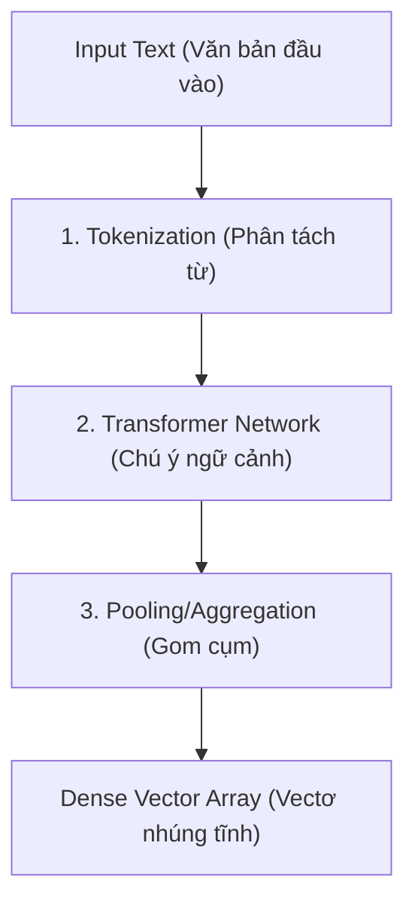
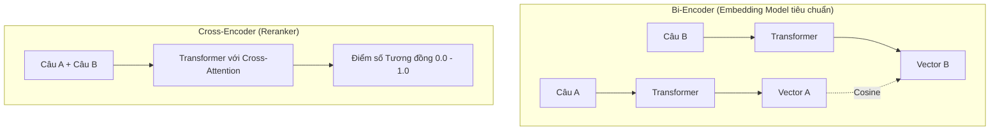

Máy tính là một cỗ máy xử lý số học thuần túy. Nó không thể trực tiếp đọc hiểu các văn bản, ngắm nhìn các bức ảnh hay lắng nghe các file âm thanh theo cách tự nhiên của con người. Để máy tính có thể "hiểu" và xử lý được các dạng dữ liệu phi cấu trúc này, chúng ta cần một chiếc cầu nối dịch thuật đặc biệt. 

Chiếc cầu nối đó chính là **Các mô hình nhúng (Embedding Models)** – một trong những mảnh ghép công nghệ quan trọng nhất đứng sau sự bùng nổ của Trí tuệ Nhân tạo thế hệ mới (GenAI), các hệ thống tìm kiếm ngữ nghĩa (Semantic Search) và [RAG](/concepts/6-ai-ml/genai-ml/rag/) (Retrieval-Augmented Generation).


## Bản chất toán học của một mô hình nhúng

Về mặt toán học, một **Embedding Model** là một hàm số phi tuyến tính $f(x) \rightarrow \mathbb{R}^d$. Trong đó, đầu vào $x$ là một chuỗi các ký tự (tokens) và đầu ra là một không gian vectơ dày đặc (dense vector) có số chiều cố định $d$ (thường là 384, 768 hoặc 1536 chiều tùy mô hình).

Mô hình này sở hữu hàng triệu hoặc hàng tỷ tham số (weights) được tối ưu hóa thông qua quá trình lan truyền ngược (backpropagation). Mục tiêu tối thượng của quá trình này là đảm bảo rằng: nếu hai đoạn văn bản $x_1$ và $x_2$ có nội dung tương đồng về mặt ngữ nghĩa, thì khoảng cách hình học giữa hai vectơ đầu ra $f(x_1)$ và $f(x_2)$ trong không gian đa chiều phải cực kỳ gần nhau. Ngược lại, nếu chúng không liên quan, chúng sẽ bị đẩy ra xa nhau.

## Lịch sử tiến hóa: Từ One-Hot Encoding đến Contextual Embedding

Để thấy rõ tầm quan trọng của Embedding Models, chúng ta hãy cùng nhìn lại chặng đường tiến hóa của các phương pháp biểu diễn ngôn ngữ cho máy tính:

1. **One-Hot Encoding**: Phương pháp sơ khai nhất, coi mỗi từ trong từ điển là một vectơ độc lập chứa toàn số 0 và duy nhất một số 1 (Ví dụ: `chó = [1, 0, 0]`, `mèo = [0, 1, 0]`). Cách này khiến kích thước vectơ bùng nổ cực lớn khi từ điển phình to. Nghiêm trọng hơn, các vectơ này hoàn toàn trực giao với nhau, khiến máy tính không cách nào biết được "chó" và "mèo" có mối liên quan mật thiết hơn là "chó" và "máy bay".
2. **TF-IDF / Bag of Words**: Phương pháp đếm tần suất xuất hiện của từ. Dù cải tiến hơn, nhưng nó hoàn toàn bỏ qua thứ tự của từ ngữ và ngữ cảnh xung quanh câu văn. Nó bất lực trước các hiện tượng từ đồng nghĩa (synonyms) hoặc từ đa nghĩa (polysemy).
3. **Word2Vec / GloVe (Static Word Embedding)**: Thế hệ mô hình nhúng tĩnh đầu tiên ra đời. Chúng nén thông tin vào các vectơ dày đặc (Dense Vectors) chỉ khoảng vài trăm chiều nhưng chứa đầy số thực. Đây là lúc máy tính bắt đầu thực hiện được các phép toán ngữ nghĩa kinh điển: *vectơ("Vua") - vectơ("Đàn ông") + vectơ("Đàn bà") $\approx$ vectơ("Nữ hoàng")*.
4. **Transformer-based (Contextual Embedding)**: Các mô hình hiện đại ngày nay như BERT hay các API của OpenAI. Chúng tạo ra các vectơ nhúng động dựa trên ngữ cảnh. Từ "bank" trong cụm "river bank" (bờ sông) sẽ có một vectơ nhúng hoàn toàn khác với từ "bank" trong cụm "bank account" (tài khoản ngân hàng), phản ánh chính xác đa nghĩa của từ tùy thuộc vào các từ bao quanh nó.

## Quy trình hoạt động bên trong một mô hình nhúng hiện đại

Mặc dù có nhiều kiến trúc khác nhau, nhưng quy trình chuyển đổi văn bản của các mô hình nhúng Transformer hiện đại thường trải qua 3 bước chính:



1. **Phân tách từ (Tokenization)**: Văn bản đầu vào được chia nhỏ thành các mảnh nhỏ gọi là [token](/concepts/6-ai-ml/genai-ml/token/) (có thể là từ hoặc cụm ký tự).
2. **Transformer Network**: Các token được đưa qua các lớp Transformer. Tại đây, cơ chế Self-Attention sẽ giúp các token "giao tiếp" và ảnh hưởng lẫn nhau để xác định ngữ cảnh chính xác của toàn câu.
3. **Gom cụm (Pooling)**: Mô hình sẽ tổng hợp các vectơ riêng lẻ của từng token thành một vectơ duy nhất đại diện cho cả câu: lấy trung bình cộng (Mean Pooling) hoặc lấy riêng vectơ của token đặc biệt `[CLS]` ở đầu câu. Pooling chuyển đổi biểu diễn động của một chuỗi thành một vectơ tĩnh có số chiều cố định, phù hợp để lưu trữ và so sánh khoảng cách trong [Cơ sở dữ liệu Vector](/concepts/6-ai-ml/genai-ml/vector-database/).

## Contrastive Learning: Huấn luyện mô hình nhúng bằng sự đối chiếu

Làm thế nào để dạy cho một mô hình nơ-ron biết mối liên kết ngữ nghĩa giữa các câu? Chúng ta áp dụng phương pháp **Học đối chiếu (Contrastive Learning)**.

Triết lý của Contrastive Learning rất đơn giản: *"Dạy mô hình bằng cách kéo những thứ giống nhau lại gần và đẩy những thứ khác nhau ra xa"*. Để làm được điều này, chúng ta sử dụng các hàm mất mát (loss functions) đặc biệt như **Triplet Loss** hoặc **InfoNCE Loss**. Quá trình huấn luyện mô hình sẽ trải qua các bước sau:

1. **Chuẩn bị dữ liệu dạng bộ ba (Triplets)**:
   * **Anchor (Neo)**: Câu gốc cần so sánh (ví dụ: *"Làm sao để nấu phở?"*).
   * **Positive (Tích cực)**: Câu có cùng ý nghĩa (ví dụ: *"Công thức nấu phở bò ngon tại nhà."*).
   * **Negative (Tiêu cực)**: Câu không liên quan (ví dụ: *"Dự báo thời tiết Hà Nội hôm nay."*).
2. **Truyền thuận (Forward Pass)**: Cả 3 câu này được đưa qua cùng một mạng Transformer (như BERT). Mạng sẽ xuất ra 3 vectơ nhúng tương ứng: $V_A$, $V_P$, và $V_N$.
3. **Tính toán Loss**: Sử dụng công thức Triplet Loss:
   $$L = \max(0, \text{Distance}(V_A, V_P) - \text{Distance}(V_A, V_N) + \text{margin})$$
   Hàm này sẽ phạt nặng mô hình nếu khoảng cách giữa câu Neo ($V_A$) và câu Tiêu cực ($V_N$) nhỏ hơn khoảng cách giữa câu Neo ($V_A$) và câu Tích cực ($V_P$) cộng với một khoảng biên an toàn (`margin`).
4. **Cập nhật trọng số**: Thuật toán Gradient Descent sẽ cập nhật các trọng số của mạng Transformer sao cho ở các vòng lặp tiếp theo, $V_A$ và $V_P$ xích lại gần nhau hơn, còn $V_N$ bị đẩy xa hơn.

## So sánh kiến trúc: Bi-Encoder vs Cross-Encoder

Trong thiết kế hệ thống tìm kiếm thông tin ngữ nghĩa, chúng ta phân biệt hai loại kiến trúc mô hình chính: **Bi-Encoder** (Mô hình nhúng tiêu chuẩn) và **Cross-Encoder** (Mô hình chấm điểm tương tác chéo).



* **Bi-Encoder**: Xử lý độc lập Câu A và Câu B qua mạng nơ-ron để tạo ra hai vectơ tĩnh, sau đó mới tính độ tương đồng bằng Cosine Similarity. Đây chính là kiến trúc của các Embedding Model. Nó cực kỳ nhanh vì có thể tính toán trước và lưu trữ vectơ.
* **Cross-Encoder**: Nạp đồng thời cả Câu A và Câu B nối liền nhau vào mạng Transformer. Điều này cho phép cơ chế Attention của mô hình phân tích mối quan hệ chéo sâu sắc giữa từng từ của Câu A với từng từ của Câu B (*Cross-Attention*). Mô hình này cho kết quả chính xác vượt trội nhưng không tạo ra vectơ tĩnh để lưu trữ. Mọi so sánh phải chạy trực tiếp qua mạng nơ-ron tại thời điểm tìm kiếm, làm hiệu năng giảm mạnh. Do đó, Cross-Encoder thường chỉ được dùng làm mô hình xếp hạng lại (**[Reranker](/concepts/6-ai-ml/genai-ml/reranker/)**) cho Top-50 hay Top-100 kết quả từ Vector DB.

## Thực hành: Tinh chỉnh (Fine-tune) và Sử dụng Embedding Model

### 1. Sinh vectơ nhúng bằng Sentence-Transformers

Với thư viện `sentence-transformers` trong Python, bạn có thể dễ dàng tạo ra các vectơ nhúng ngữ nghĩa chất lượng cao bằng các mô hình mã nguồn mở:

```python
from sentence_transformers import SentenceTransformer, util

# Tải mô hình nhúng mã nguồn mở phổ biến
model = SentenceTransformer('all-MiniLM-L6-v2')

# Các câu văn đầu vào
sentences = ["Mèo đang ngủ trên ghế", "Chó đang chạy ngoài sân", "Con mèo đang lim dim ngủ"]

# Sinh các vectơ nhúng (embeddings)
embeddings = model.encode(sentences)

# Kiểm tra kích thước vectơ
print("Kích thước:", embeddings.shape) # Kết quả: (3, 384) -> 3 câu, mỗi câu là 1 vectơ 384 chiều

# Tính toán độ tương đồng ngữ nghĩa (Cosine Similarity)
cosine_scores = util.cos_sim(embeddings, embeddings)
print(f"Độ tương đồng giữa câu 1 và câu 3: {cosine_scores[0][2]:.4f}")
```

### 2. Tự fine-tune Embedding Model với dữ liệu chuyên ngành

Nếu bạn đang xây dựng một ứng dụng cho các lĩnh vực đặc thù có nhiều thuật ngữ chuyên ngành (Y tế, Luật, nội bộ doanh nghiệp), bạn có thể tự tinh chỉnh mô hình:

```python
from sentence_transformers import SentenceTransformer, InputExample, losses
from torch.utils.data import DataLoader

# 1. Load mô hình cơ sở pre-trained từ HuggingFace
model = SentenceTransformer('distilbert-base-nli-mean-tokens')

# 2. Tạo tập dữ liệu huấn luyện nội bộ dạng cặp (Anchor, Positive)
train_examples = [
    InputExample(texts=['Lỗi 404', 'Không tìm thấy trang web yêu cầu']),
    InputExample(texts=['Lỗi 500', 'Máy chủ gặp sự cố nội bộ hệ thống']),
]
train_dataloader = DataLoader(train_examples, shuffle=True, batch_size=2)

# 3. Chọn hàm Loss (MultipleNegativesRankingLoss cực kỳ hiệu quả cho bài toán này)
train_loss = losses.MultipleNegativesRankingLoss(model=model)

# 4. Huấn luyện tinh chỉnh mô hình
model.fit(train_objectives=[(train_dataloader, train_loss)], epochs=3, warmup_steps=10)
```

## Những Best Practices và cạm bẫy thiết kế

* **Huấn luyện với Hard Negatives**: Khi huấn luyện, nếu chỉ đưa vào những ví dụ tiêu cực quá dễ phân biệt (ví dụ: Anchor="Nấu phở bò", Negative="Thời tiết hôm nay"), mô hình sẽ học rất hời hợt. Hãy đưa vào các mẫu **Hard Negatives** – những câu trông rất giống nhưng thực tế lại khác nghĩa (ví dụ: Anchor="Cách nấu phở bò", Hard Negative="Cách nấu phở gà").
* **Chọn đúng mô hình ngôn ngữ**: Hãy cẩn thận khi dùng các mô hình nhúng chỉ được huấn luyện bằng tiếng Anh cho các ứng dụng tiếng Việt. Bạn nên ưu tiên chọn các mô hình đa ngôn ngữ (Multilingual) hoặc các mô hình tối ưu riêng cho tiếng Việt.
* **Đồng bộ Pooling và Metric**: Đảm bảo sử dụng đúng phương pháp Pooling (Mean Pooling hoặc CLS Pooling) và hàm đo khoảng cách (Cosine, L2 hoặc Dot Product) mà mô hình đó đã được thiết kế và huấn luyện. Chọn sai metric sẽ khiến kết quả bị lệch hướng hoàn toàn.

## Khi nào nên dùng

* **Nên dùng:**
  * Khi cần xây dựng kho dữ liệu tìm kiếm tương đồng ngữ nghĩa lớn cho hàng triệu bản ghi (sử dụng Bi-Encoder để tạo các vector tĩnh lưu vào Vector DB).
  * Khi phát triển các hệ thống RAG cần đối khớp ngữ nghĩa giữa câu hỏi người dùng và đoạn tài liệu tham chiếu.
  * Khi thực hiện các tác vụ gom cụm văn bản hoặc phân loại dữ liệu phi cấu trúc theo ngữ nghĩa.
* **Không nên dùng:**
  * Khi yêu cầu độ tương tác chéo cực cao giữa hai văn bản ở quy mô dữ liệu rất nhỏ (dưới 100 bản ghi), hãy sử dụng [Reranker (Cross-Encoder)](/concepts/6-ai-ml/genai-ml/reranking/) trực tiếp.
  * Khi chỉ xử lý các truy vấn từ khóa hoặc lọc theo ID chính xác tuyệt đối (SKU sản phẩm, mã vạch).

## Điểm mạnh và điểm yếu (Trade-offs)

### Điểm mạnh (Pros)
* **Giải quyết bài toán tìm kiếm ngữ nghĩa**: Hiểu sâu sắc từ đồng nghĩa, trái nghĩa, ngữ cảnh sử dụng từ mà các hệ thống từ khóa BM25 truyền thống chào thua.
* **Tìm kiếm xuyên ngôn ngữ**: Có thể ánh xạ các ngôn ngữ khác nhau vào cùng một không gian vector để thực hiện so khớp.
* **Hiệu năng cao**: Tốc độ tìm kiếm bằng phép đo Cosine trên Vector DB đạt mức mili-giây với hàng triệu bản ghi nhờ tính toán offline trước.

### Điểm yếu (Cons)
* **Không phân tích ngữ cảnh chéo**: Do hai văn bản được xử lý hoàn toàn độc lập, Bi-Encoder có thể bỏ sót các mối liên hệ ngữ nghĩa chi tiết ở tầng từ vựng.
* **Làm mờ thông tin chính xác**: Các từ khóa đặc thù (mã SKU, mã lỗi) thường bị hòa tan vào không gian ngữ nghĩa tổng thể. Vì vậy, tìm kiếm bằng mô hình nhúng nên được kết hợp với tìm kiếm từ khóa truyền thống (gọi là *[Hybrid Search](/concepts/6-ai-ml/genai-ml/hybrid-search/)*).

## Trọng tâm ôn luyện phỏng vấn

### 1. Phân biệt sự khác nhau kiến trúc giữa Bi-Encoder và Cross-Encoder. Tại sao trong Vector Database chúng ta chỉ dùng Bi-Encoder?
* **Gợi ý trả lời**: Bi-Encoder xử lý độc lập hai văn bản đầu vào thông qua mạng nơ-ron để tạo ra hai vectơ tĩnh riêng biệt. Do các vectơ này là cố định và độc lập, chúng ta có thể tính toán trước cho toàn bộ kho dữ liệu lớn và lưu vào Vector DB để tìm kiếm nhanh bằng Cosine Similarity. Ngược lại, Cross-Encoder nhận đồng thời cả hai văn bản nối liền nhau vào mô hình và sử dụng cơ chế Cross-Attention để phân tích mối quan hệ chéo giữa từng từ của hai câu. Điều này giúp Cross-Encoder có độ chính xác rất cao nhưng lại không sinh ra các vectơ độc lập để lưu trữ trước. Vì lý do hiệu năng và yêu cầu lưu trữ, chúng ta chỉ có thể dùng Bi-Encoder để lưu vào Vector DB, còn Cross-Encoder chỉ được dùng làm bước xếp hạng lại (Re-ranker) sau khi đã lọc ra một nhóm nhỏ kết quả tiềm năng.

### 2. Triplet Loss hoạt động như thế nào trong việc huấn luyện một Embedding Model?
* **Gợi ý trả lời**: Triplet Loss huấn luyện mô hình bằng cách so sánh một bộ ba dữ liệu gồm: Anchor (câu gốc), Positive (câu tương đồng ngữ nghĩa) và Negative (câu không liên quan). Hàm mất mát Triplet Loss sẽ tính toán khoảng cách hình học trong không gian đa chiều giữa các vectơ đầu ra. Mục tiêu của nó là cập nhật trọng số của mạng nơ-ron sao cho khoảng cách giữa Anchor và Positive ngày càng thu hẹp lại, đồng thời đẩy khoảng cách giữa Anchor và Negative ra xa hơn một khoảng biên an toàn (`margin`) được thiết lập trước.

### 3. Phân biệt sự khác nhau giữa Word Embeddings tĩnh (Word2Vec) và Contextual Embeddings động (BERT).
* **Gợi ý trả lời**: Word Embeddings tĩnh như Word2Vec gán cố định cho mỗi từ duy nhất một vectơ số thực, không quan tâm đến ngữ cảnh sử dụng từ đó (ví dụ từ \"đường\" trong \"đường ăn\" và \"đường đi\" có chung một vectơ giống hệt nhau). Trong khi đó, Contextual Embeddings động như BERT sử dụng cơ chế Attention để liên tục cập nhật và tính toán vectơ của từ dựa trên các từ xung quanh. Nhờ vậy, từ \"đường\" trong hai ngữ cảnh trên sẽ có hai vectơ hoàn toàn khác nhau, giúp máy tính nắm bắt ngữ nghĩa chính xác hơn.

## Xem thêm các khái niệm liên quan
* [Tác nhân AI (AI Agent)](/concepts/6-ai-ml/genai-ml/ai-agent/)
* [Phân tách văn bản - Chunking and Chunking Strategy](/concepts/6-ai-ml/genai-ml/chunking/)
* [Cửa sổ ngữ cảnh - Context Window](/concepts/6-ai-ml/genai-ml/context-window/)

## Tài liệu tham khảo

* [Google Cloud - Vertex AI Text Embeddings API Overview](https://cloud.google.com/vertex-ai/docs/generative-ai/embeddings/get-text-embeddings)
* [AWS - Embeddings in Machine Learning Deep Dive](https://aws.amazon.com/what-is/embeddings-in-machine-learning/)
* [Databricks - Semantic Search with Vector Embeddings](https://www.databricks.com/glossary/vector-embeddings)
* [Confluent - Understanding Vector Embeddings](https://www.confluent.io/blog/understanding-vector-embeddings-and-vector-databases/)
* [Sentence-BERT: Sentence Embeddings using Siamese BERT-Networks](https://aclanthology.org/D19-1410/) - Nils Reimers and Iryna Gurevych (EMNLP 2019).
* [Sentence Transformers - Official Documentation](https://www.sbert.net/docs/quickstart.html) - Documentation for training and using SBERT models.

## English Summary

Embedding Models are deep learning representation models that map unstructured data (text, images) into dense, low-dimensional vector representations in a continuous semantic space. While traditional models like Word2Vec produced static vectors, modern transformer-based models (such as BERT or commercial APIs) leverage self-attention to generate contextualized embeddings. For information retrieval and Vector Databases, models are typically trained as Bi-Encoders using Contrastive Learning (e.g., Triplet Loss or InfoNCE Loss), pulling semantically related inputs together and pushing unrelated ones apart. Although Bi-Encoders are less accurate than Cross-Encoders (which perform cross-attention over input pairs), they allow offline pre-computation, making them the required architecture for building fast, scalable semantic search and RAG systems.