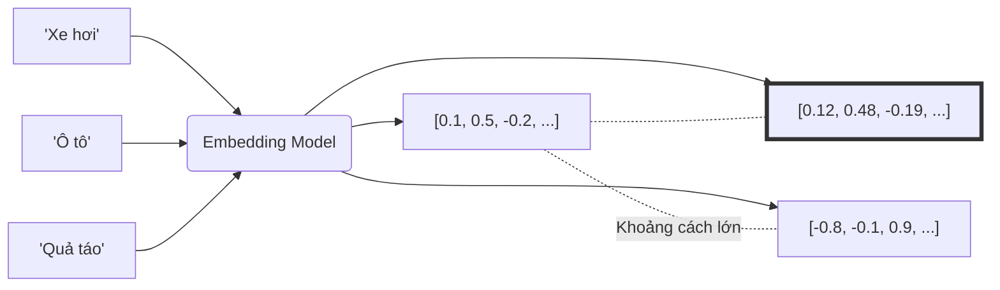

Hãy tưởng tượng bạn đang cố gắng giải thích cho một người nước ngoài không biết tiếng Việt hiểu thế nào là "xe hơi". Thay vì cố gắng định nghĩa bằng các từ ngữ phức tạp, bạn đưa cho họ một loạt các tấm thẻ ghi điểm số:
* Mức độ có bánh xe: **9/10**
* Mức độ chạy bằng động cơ: **10/10**
* Mức độ bay được trên trời: **0/10**

Từ những điểm số đó, người kia có thể dễ dàng hình dung ra hình dáng và chức năng của chiếc xe hơi, thậm chí so sánh nó với "ô tô" hay "xe đạp".

Trong thế giới của Trí tuệ Nhân tạo, **Vectơ nhúng (Embeddings)** chính là những "tấm thẻ điểm số" như thế. Chúng là các mảng chứa các số thực (ví dụ: `[0.12, -0.45, 0.88, ...]`) dùng để biểu diễn ngữ nghĩa của các dữ liệu phi cấu trúc (như từ ngữ, câu văn, hình ảnh hay âm thanh) dưới dạng mà máy tính có thể hiểu và tính toán được.

## Bản dịch số học của thế giới phi cấu trúc

Về mặt kỹ thuật, **Embeddings** là một dạng biểu diễn dữ liệu dày đặc (dense representation). Thay vì lưu trữ từ vựng dưới dạng các chuỗi ký tự (strings) rời rạc vốn không mang giá trị toán học, chúng ta chuyển đổi chúng thành các tọa độ điểm trong một không gian hình học đa chiều (thường từ hàng trăm đến hàng nghìn chiều).

Mặc dù con người không thể trực tiếp giải nghĩa xem con số tại chiều thứ 15 đại diện cho điều gì, nhưng sự kết hợp tổng hòa của tất cả các chiều số thực này sẽ tạo nên một "dấu vân tay ngữ nghĩa" độc nhất vô nhị cho thực thể đó.

## Tại sao chúng ta cần nén thông tin thành những vectơ đặc?

Thuật toán máy tính và mạng nơ-ron hoạt động hoàn toàn bằng các phép tính đại số. Chúng không thể thực hiện phép cộng, trừ, nhân, chia trên các chuỗi ký tự chữ cái trực tiếp được.

Trước khi kỹ thuật nhúng ra đời, các kỹ sư thường sử dụng hai giải pháp:

1. **One-Hot Vectors**: Mỗi từ trong từ điển được đại diện bằng một mảng khổng lồ có chiều dài bằng tổng số từ vựng hiện có, chứa toàn số 0 và duy nhất một số 1 ở vị trí của từ đó. Phương pháp này có hai hạn chế lớn:
   * **Tăng kích thước dữ liệu (Bùng nổ số chiều)**: Với từ điển gồm 100.000 từ, mỗi từ biểu diễn bằng một vector 100.000 chiều, gây lãng phí tài nguyên lưu trữ và tính toán.
   * **Mất thông tin mối quan hệ**: Về mặt toán học, khoảng cách giữa vectơ "vua" và "hoàng hậu" cũng trực giao và bằng đúng khoảng cách giữa "vua" và "máy tính" (tích vô hướng bằng 0). Máy tính không có cách nào biết được "vua" và "hoàng hậu" có mối liên hệ mật thiết với nhau.
2. **Tần suất từ (TF-IDF)**: Dựa trên việc đếm tần suất xuất hiện của từ. Tuy nhiên, phương pháp này làm mất hoàn toàn cấu trúc ngữ cảnh và không nhận diện được các từ đồng nghĩa (như "xe hơi" và "ô tô").

Vectơ nhúng (Embeddings) ra đời nhằm giải quyết các hạn chế trên. Chúng có kích thước cố định vừa phải (thường từ 384 đến 1536 chiều) và bảo tồn nguyên vẹn các mối quan hệ ngữ nghĩa trong thực tế.

## Kiến trúc và Nguyên lý hoạt động của Embeddings

Nguyên lý cốt lõi của embeddings dựa trên một định lý trực quan: **Sự tương đồng về hình học phản ánh sự tương đồng về ngữ nghĩa**.

Nếu hai thực thể có ý nghĩa giống hoặc liên quan chặt chẽ đến nhau (như "chó" và "cún"), vectơ của chúng sẽ nằm rất sát nhau trong không gian đa chiều. Ngược lại, những từ hoàn toàn không liên quan (như "ô tô" và "quả táo") sẽ nằm ở các góc rất xa nhau.


Đặc tính thú vị nhất của không gian nhúng là khả năng thực hiện các phép toán đại số mang ý nghĩa thực tế:
$$\vec{\text{Vua}} - \vec{\text{Đàn ông}} + \vec{\text{Phụ nữ}} \approx \vec{\text{Nữ hoàng}}$$

## Cách đo lường sự tương đồng ngữ nghĩa

Khi đã chuyển đổi các thực thể thành vectơ, chúng ta có thể sử dụng các công thức toán học quen thuộc để đo lường khoảng cách giữa chúng:

* **Cosine Similarity (Độ tương đồng Cosine)**: Đo góc giữa hai vectơ (giá trị từ -1 đến 1). Góc càng nhỏ (Cosine càng gần 1) chứng tỏ hướng của hai vectơ càng giống nhau, tức ngữ nghĩa càng tương đồng. Đây là phép đo phổ biến nhất trong thực tế.
* **Dot Product (Tích vô hướng)**: Thể hiện sự kết hợp giữa góc và độ dài của hai vectơ.
* **Euclidean Distance (Khoảng cách L2)**: Đo khoảng cách đường thẳng nối giữa hai điểm đầu mút của vectơ trong không gian.

## Nhìn trực quan: Ví dụ cụ thể trong không gian 2D

Để con người dễ hình dung, hãy đơn giản hóa không gian nhúng về chỉ còn 2 chiều: Chiều ngang (mức độ là Thú cưng) và Chiều dọc (mức độ là Dã thú). Khi đó, các loài động vật sẽ có các vectơ tọa độ như sau:

* **Mèo** = `[0.9, 0.1]` (Rất thân thiện, ít hoang dã)
* **Cún** = `[0.95, 0.1]` (Rất thân thiện, ít hoang dã)
* **Hổ** = `[0.1, 0.9]` (Ít thân thiện, rất hoang dã)
* **Sư tử** = `[0.1, 0.85]` (Ít thân thiện, rất hoang dã)

Bạn có thể dễ dàng nhận thấy tọa độ của Mèo và Cún rất sát nhau, tạo thành một nhóm. Hổ và Sư tử nằm ở một góc khác.

Dưới đây là đoạn code Python ngắn sử dụng thư viện `numpy` để tính toán độ tương đồng Cosine giữa hai vectơ Mèo và Hổ:
```python
import numpy as np
from numpy.linalg import norm

vec_meo = np.array([0.9, 0.1])
vec_ho = np.array([0.1, 0.9])

# Công thức tính Cosine Similarity
cosine = np.dot(vec_meo, vec_ho) / (norm(vec_meo) * norm(vec_ho))
print(f"Độ tương đồng Cosine: {cosine:.2f}") 
# Kết quả trả về khoảng 0.19, xác nhận hai thực thể này rất khác nhau
```

## Các nguyên tắc quan trọng và lỗi cần tránh

### Các nguyên tắc thiết kế quan trọng
* **Lập chỉ mục chuyên biệt (Vector [Indexing](/concepts/2-storage/database-storage/indexing/))**: Các vectơ nhúng có dung lượng lưu trữ khá lớn. Khi số lượng bản ghi lên tới hàng triệu, việc quét tuần tự để so sánh khoảng cách là bất khả thi. Bạn bắt buộc phải sử dụng các cơ sở dữ liệu vectơ chuyên dụng (Vector Databases) như pgvector, Qdrant, Pinecone hoặc Milvus để lập chỉ mục và tìm kiếm nhanh chóng.
* **Chuẩn hóa vectơ (Normalization)**: Hãy luôn chuẩn hóa độ dài của các vectơ nhúng về bằng 1 (L2 Normalization). Khi độ dài đã được đưa về 1, phép tính Dot Product phức tạp sẽ tương đương hoàn toàn với phép Cosine Similarity, giúp GPU xử lý các câu lệnh tìm kiếm nhanh hơn gấp nhiều lần.

### Các hạn chế và sai lầm thường gặp
* **So sánh chéo các mô hình khác nhau**: Mỗi mô hình nhúng (ví dụ mô hình của OpenAI và mô hình của Cohere) tự định hình một không gian toán học hoàn toàn khác nhau. Bạn không bao giờ được phép tính khoảng cách giữa một vectơ được tạo bởi mô hình của OpenAI với một vectơ tạo bởi mô hình của Cohere.
* **Can thiệp thủ công vào các chiều số**: Việc tự ý sửa đổi một vài con số cụ thể trong vectơ nhúng với hy vọng cải thiện độ chính xác là hoàn toàn vô nghĩa. Các thuộc tính trong không gian nhúng là thuộc tính ẩn, không thể diễn giải đơn lẻ theo cách hiểu của con người.

## Khi nào nên dùng

* **Nên dùng:**
  * Khi cần xây dựng các ứng dụng xử lý ngôn ngữ tự nhiên (NLP) như phân loại văn bản, dịch máy, hoặc phân tích cảm xúc.
  * Khi phát triển các tính năng tìm kiếm ngữ nghĩa, so khớp câu hỏi người dùng với tài liệu nội bộ trong các hệ thống RAG.
  * Khi xử lý dữ liệu phi cấu trúc (văn bản, âm thanh, hình ảnh) và cần chuyển hóa chúng thành dạng biểu diễn số học dày đặc để huấn luyện các mô hình Machine Learning.
* **Không nên dùng:**
  * Khi các bài toán của bạn chỉ yêu cầu tìm kiếm chính xác tuyệt đối (như tìm kiếm mã số định danh, biển số xe, mã SKU sản phẩm).
  * Khi không có đủ tài nguyên tính toán (CPU/GPU) để chạy các mô hình nhúng và độ trễ chuyển đổi dữ liệu thô là một trở ngại lớn đối với ứng dụng thời gian thực.

## Điểm mạnh (Pros)

### Điểm mạnh (Pros)
* **Diễn đạt xuất sắc ý nghĩa ngữ nghĩa:** Diễn đạt xuất sắc ý nghĩa ngữ nghĩa của dữ liệu, tự động liên kết các từ đồng nghĩa mà không cần định nghĩa trước.
* **Cầu nối đa phương thức (Multimodal):** Có thể nhúng cả văn bản lẫn hình ảnh vào chung một không gian vectơ (ví dụ mô hình CLIP), cho phép tìm kiếm hình ảnh bằng các câu lệnh mô tả.

### Điểm yếu (Cons)
* **Yêu cầu phần cứng cao:** Đòi hỏi năng lực xử lý phần cứng cao (CPU/GPU) để chuyển đổi dữ liệu thô thành vectơ thông qua các mô hình học sâu.
* **Mất tính diễn giải (Interpretability):** Chúng ta chỉ biết hai vectơ ở gần nhau chứ không thể giải thích rõ ràng tại sao mô hình lại tính ra như vậy.
* **Không phù hợp cho tìm kiếm chính xác:** Kém hiệu quả đối với các bài toán tìm kiếm chính xác tuyệt đối (Exact Match) như tìm mã lỗi hệ thống, số điện thoại hay số tài khoản.

## Trọng tâm ôn luyện phỏng vấn

### 1. Tại sao One-Hot Encoding lại gặp vấn đề về "Curse of Dimensionality" (Bùng nổ số chiều), và Embeddings giải quyết nó như thế nào?
* **Gợi ý trả lời**: Trong One-Hot Encoding, mỗi từ vựng được đại diện bởi một chiều độc lập. Khi số lượng từ vựng của hệ thống lên tới hàng trăm nghìn từ, kích thước vectơ của mỗi từ sẽ phình to tương ứng, tạo thành một ma trận vô cùng thưa thớt (Sparse Matrix - chứa hầu hết các số 0) làm cạn kiệt bộ nhớ RAM. Đồng thời, do các vectơ này trực giao hoàn toàn với nhau, máy tính không thể đo lường độ tương đồng ngữ nghĩa giữa các từ. Embeddings giải quyết vấn đề này bằng cách nén không gian biểu diễn thành các vectơ đặc (Dense Vectors) có kích thước cố định nhỏ (như 768 chiều). Thông qua quá trình học sâu, các giá trị số thực trong các chiều này biểu diễn các đặc trưng ẩn, giúp giữ nguyên vẹn mối quan hệ hình học giữa các từ đồng nghĩa mà không bị phình to kích thước khi thêm từ mới.

### 2. Sự khác biệt giữa phép toán Dot Product và Cosine Similarity là gì? Việc chuẩn hóa (normalize) vectơ mang lại lợi ích gì?
* **Gợi ý trả lời**: Cosine Similarity chỉ quan tâm đến "góc" giữa hai vectơ (độ hướng của chúng), trong khi Dot Product tính toán kết hợp cả góc lẫn độ dài của hai vectơ. Khi chúng ta thực hiện chuẩn hóa độ dài của các vectơ về bằng 1 (L2 Normalization), độ dài của mọi vectơ trong không gian đều bằng nhau. Lúc này, phép tính Dot Product sẽ cho ra kết quả hoàn toàn trùng khớp với Cosine Similarity. Điều này mang lại lợi thế cực kỳ lớn về mặt điện toán vì phép toán nhân ma trận vô hướng (Dot Product) được các phần cứng như GPU/TPU tối ưu hóa để chạy nhanh hơn rất nhiều so với phép tính căn bậc hai phức tạp trong công thức Cosine Similarity truyền thống.

### 3. Làm thế nào để giải quyết vấn đề từ vựng nằm ngoài từ điển (Out-Of-Vocabulary - OOV) khi tạo Embeddings?
* **Gợi ý trả lời**: Đối với các mô hình nhúng cổ điển như Word2Vec hay GloVe, các từ nằm ngoài từ điển huấn luyện sẽ không có vectơ và thường được gán cho một vectơ mặc định (ví dụ `<UNK>`), làm mất đi ngữ nghĩa thực. Để khắc phục điều này, các kiến trúc hiện đại sử dụng thuật toán phân tách từ con (Subword Tokenization) như Byte-Pair Encoding (BPE) hay WordPiece (được dùng trong BERT/GPT). Các thuật toán này chia nhỏ các từ mới hoặc từ hiếm gặp thành các gốc từ hoặc tiền tố/hậu tố quen thuộc (ví dụ "unhappy" thành "un" và "happy"), từ đó vẫn biểu diễn được ngữ nghĩa của từ mới dựa trên tổ hợp của các từ con đã biết.

## Khái niệm liên quan

* [Mô hình nhúng (Embedding Models)](/concepts/6-ai-ml/genai-ml/embedding-models/) - Khám phá các loại mô hình nhúng phổ biến.
* [Tìm kiếm ngữ nghĩa (Semantic Search)](/concepts/6-ai-ml/genai-ml/semantic-search/) - Ứng dụng embeddings trong việc tìm kiếm thông tin theo ngữ nghĩa.
* [Vector Database](/concepts/6-ai-ml/genai-ml/vector-database/) - Cách lưu trữ và truy vấn hiệu quả hàng triệu vectơ nhúng.

## Xem thêm các khái niệm liên quan
* [Tác nhân AI (AI Agent)](/concepts/6-ai-ml/genai-ml/ai-agent/)
* [Phân tách văn bản - Chunking and Chunking Strategy](/concepts/6-ai-ml/genai-ml/chunking/)
* [Cửa sổ ngữ cảnh - Context Window](/concepts/6-ai-ml/genai-ml/context-window/)

## Tài liệu tham khảo

* [Google Cloud - Text Embeddings Overview](https://cloud.google.com/vertex-ai/docs/generative-ai/embeddings/get-text-embeddings)
* [AWS - What are Embeddings in Machine Learning?](https://aws.amazon.com/what-is/embeddings-in-machine-learning/)
* [Databricks - Vector Embeddings Glossary](https://www.databricks.com/glossary/vector-embeddings)
* [Confluent - Understanding Vector Embeddings](https://www.confluent.io/blog/understanding-vector-embeddings-and-vector-databases/)
* [GloVe: Global Vectors for Word Representation](https://nlp.stanford.edu/pubs/glove.pdf) - Jeffrey Pennington, Richard Socher, and Christopher D. Manning (2014 paper).
* [Efficient Estimation of Word Representations in Vector Space](https://arxiv.org/abs/1301.3781) - Tomas Mikolov et al. (The foundational Word2Vec paper).

## English Summary

Embeddings are dense, numerical vectors residing in a high-dimensional continuous space, representing the latent semantic features of unstructured data (text, images, audio). Created by deep learning models, they replace inefficient one-hot encoding by capturing context and synonyms—words with similar meanings are mapped geometrically close to one another. The similarity between embeddings is typically calculated using Cosine Similarity or Dot Product. They are the backbone of modern NLP, forming the foundation for Semantic Search, Retrieval-Augmented Generation ([RAG](/concepts/6-ai-ml/genai-ml/rag/)), and Recommender Systems.