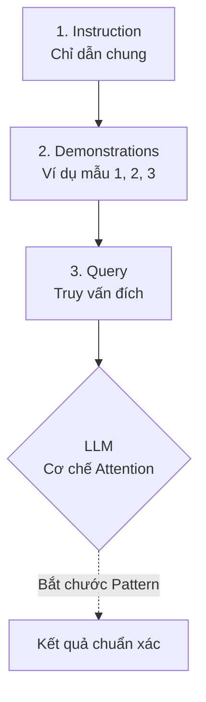

Khi dạy một đứa trẻ nhận biết các loại trái cây, thay vì ngồi đọc một loạt định dạng lý thuyết dài dòng về vỏ, hạt hay lá, cách nhanh nhất là chỉ vào quả táo và nói: *"Đây là quả táo"*, chỉ vào quả cam và nói: *"Đây là quả cam"*. Sau khi quan sát vài ví dụ thực tế đó, đứa trẻ sẽ tự khắc nhận biết được các loại quả tương tự.

Trong thế giới Kỹ nghệ Gợi ý (Prompt Engineering) cho các Mô hình ngôn ngữ lớn ([LLM](/concepts/6-ai-ml/genai-ml/llm/)), chúng ta cũng áp dụng một phương pháp tương tự mang tên **Few-shot Prompting (Học qua vài ví dụ)**. Kỹ thuật này giúp mô hình hiểu rõ "luật chơi" của bạn và trả về kết quả chính xác theo đúng định dạng mong muốn mà không đòi hỏi phải huấn luyện lại mô hình một cách tốn kém.

## Từ "học vẹt" đến khả năng tự suy luận: Bản chất của Few-shot Prompting

Để hiểu rõ Few-shot Prompting, hãy so sánh nó với người anh em *Zero-shot Prompting*. Nếu Zero-shot là việc yêu cầu mô hình làm bài kiểm tra ngay lập tức mà không cho ôn tập trước, thì Few-shot chính là việc cung cấp cho nó 2-3 bài giải mẫu để nó nắm bắt được cách chấm điểm cũng như cấu trúc trả lời.

Về bản chất, bạn sẽ chèn trực tiếp các cặp bài toán và lời giải mẫu (thường từ 1 đến 5 ví dụ) vào chuỗi văn bản gửi cho LLM. Mô hình sẽ phân tích các điểm tương đồng, quy luật cấu trúc từ các ví dụ này. Khi gặp câu hỏi thực tế ở cuối prompt, nó sẽ tự động hoàn thành theo đúng khuôn mẫu đã học được. Điểm đặc biệt là quá trình này diễn ra hoàn toàn dựa trên cửa sổ ngữ cảnh ([Context Window](/concepts/6-ai-ml/genai-ml/context-window/)) chứ không hề thay đổi các trọng số (weights) của mạng nơ-ron.

## Dưới nắp ca-pô: Cơ chế In-Context Learning hoạt động ra sao?

Cơ sở khoa học của Few-shot Prompting nằm ở khái niệm **In-Context Learning (ICL)** (Học trong ngữ cảnh) — một đặc tính bộc phát (emergent capability) chỉ xuất hiện ở các mô hình ngôn ngữ quy mô lớn với hàng tỷ tham số.

Khi nhận được các ví dụ mẫu, các lớp Transformer không hề tiến hành cập nhật tham số thuật toán Gradient Descent như cách huấn luyện truyền thống. Thay vào đó, qua cơ chế **Attention** (Chú ý), mô hình sẽ tự động xây dựng một ánh xạ tuyến tính nội bộ giữa không gian Input và Output, tạo ra một "rãnh trượt" ngữ nghĩa. Khi từ khóa câu hỏi cuối cùng xuất hiện, xác suất dự đoán các [token](/concepts/6-ai-ml/genai-ml/token/) tiếp theo sẽ bị uốn nắn mạnh mẽ đi vào quỹ đạo cấu trúc của các ví dụ phía trên. Khi hội thoại kết thúc, toàn bộ "kiến thức" tạm thời này cũng sẽ biến mất.

Quy trình hoạt động này có thể được hình dung như sau:


Một prompt Few-shot tiêu chuẩn luôn gồm 3 phần rõ rệt:
* **Instruction (Chỉ dẫn)**: Định nghĩa rõ vai trò và yêu cầu chung.
* **Demonstrations (Ví dụ mẫu)**: Các cặp `Input - Output` chuẩn xác (thường từ 1 đến 5 cặp), ngăn cách rõ ràng bằng ký tự xuống dòng hoặc dấu phân cách.
* **Query (Truy vấn đích)**: Input thực tế cần mô hình xử lý, để trống phần Output để LLM điền vào.

## Tại sao chúng ta cần đến Few-shot Prompting?

Dù LLM ngày càng thông minh và có khả năng Zero-shot đáng kinh ngạc, chúng vẫn thường vấp ngã trước các bài toán thực tế của doanh nghiệp vì ba lý do lớn:

1. **Yêu cầu tuân thủ định dạng nghiêm ngặt (Strict Formatting)**: Khi bạn cần kết quả trả về là một chuỗi JSON sạch để nạp vào database, việc ra lệnh bằng lời nói (Zero-shot) rất dễ khiến LLM sinh thêm các câu từ rườm rà như *"Đây là kết quả JSON của bạn..."*. Vài ví dụ Few-shot sẽ định hình khuôn mẫu đầu ra, khiến mô hình im lặng trả về đúng định dạng yêu cầu.
2. **Xử lý các ngữ cảnh đặc thù (Domain-specific tasks)**: Hãy nghĩ về câu: *"Đôi giày này đi sướng vãi!"*. Từ "vãi" vốn mang sắc thái tiêu cực trong từ điển thông thường, nhưng trong ngôn ngữ mạng, nó lại là một từ nhấn mạnh sự tích cực. Cung cấp ví dụ Few-shot giúp mô hình "cập nhật" bộ từ vựng và tư duy logic đặc thù của riêng bạn trong thời gian thực.
3. **Giải pháp thay thế Fine-Tuning giá rẻ**: Việc thu thập hàng ngàn mẫu dữ liệu để huấn luyện lại mô hình (Fine-tune/[LoRA](/concepts/6-ai-ml/genai-ml/lora/)) rất tốn kém và mất thời gian. Trong khi đó, việc soạn ra 3-5 mẫu chất lượng để nhét vào prompt chỉ tốn của bạn vài phút mà hiệu quả mang lại đôi khi không hề kém cạnh.

## Ví dụ thực tế: Trích xuất mã cổ phiếu và cách viết code API

**Bài toán: Trích xuất tên viết tắt của công ty (Ticker) từ một đoạn văn bản.**

Dưới đây là một prompt Few-shot mẫu bạn gửi cho mô hình:

```text
Trích xuất tên mã viết tắt của các công ty công nghệ trong câu sau.

Văn bản: Apple Inc. vừa phát hành điện thoại mới.
Viết tắt: AAPL

Văn bản: Cổ phiếu của Microsoft Corporation đang tăng giá.
Viết tắt: MSFT

Văn bản: Google Alphabet bị kiện vì độc quyền.
Viết tắt: GOOGL

Văn bản: Tập đoàn Meta Platforms ra mắt kính thực tế ảo.
Viết tắt: 
```

*Kết quả sinh ra bởi mô hình:*
```text
META
```
Mô hình tự động học được quy luật: chỉ trả về mã viết tắt dạng viết hoa 4-5 chữ cái, loại bỏ hoàn toàn các câu từ dẫn dắt rườm rà.

### Viết code tích hợp API trong Python

Trong code thực tế (ví dụ sử dụng thư viện Python kết nối với OpenAI API), lập trình viên thường nhúng các ví dụ này vào mảng `messages` với các vai trò (`role`) `user` và `assistant` luân phiên nhau để mô hình học ngữ cảnh một cách tự nhiên nhất:

```python
import openai

response = openai.ChatCompletion.create(
    model="gpt-3.5-turbo",
    messages=[
        {"role": "system", "content": "Trích xuất tên viết tắt của các công ty công nghệ trong câu sau."},
        
        # Ví dụ 1
        {"role": "user", "content": "Văn bản: Apple Inc. vừa phát hành điện thoại mới."},
        {"role": "assistant", "content": "AAPL"},
        
        # Ví dụ 2
        {"role": "user", "content": "Văn bản: Cổ phiếu của Microsoft Corporation đang tăng giá."},
        {"role": "assistant", "content": "MSFT"},
        
        # Đầu vào thực tế cần xử lý
        {"role": "user", "content": "Văn bản: Tập đoàn Meta Platforms ra mắt kính thực tế ảo."}
    ]
)

print(response.choices[0].message.content)
# Kết quả hiển thị: META
```

### Sử dụng LangChain để thiết kế Few-shot Prompt Template

Để triển khai Few-shot Prompting một cách chuyên nghiệp trong mã nguồn Python, bạn có thể sử dụng thư viện **LangChain** như sau:

```python
from langchain.prompts import FewShotPromptTemplate, PromptTemplate

# 1. Khai báo các ví dụ mẫu
examples = [
  {"input": "Cho mình 2 cốc trà sữa trân châu và một ly trà đào.", "output": '{"items": [{"name": "trà sữa trân châu", "quantity": 2}, {"name": "trà đào", "quantity": 1}]}'},
  {"input": "Lấy 3 bát bún bò Huế đầy đủ, không lấy giá.", "output": '{"items": [{"name": "bún bò Huế", "quantity": 3}]}'}
]

# 2. Định dạng cho mỗi ví dụ
example_prompt = PromptTemplate(
    input_variables=["input", "output"],
    template="Tin nhắn: {input}\nOutput:\n{output}"
)

# 3. Tổng hợp thành Few-shot Prompt
few_shot_prompt = FewShotPromptTemplate(
    examples=examples,
    example_prompt=example_prompt,
    prefix="Trích xuất Món ăn và Số lượng từ tin nhắn. Chỉ trả về JSON, không thêm chữ nào khác.",
    suffix="Tin nhắn: {user_input}\nOutput:\n",
    input_variables=["user_input"]
)

# 4. In thử Prompt với Input thực tế
print(few_shot_prompt.format(user_input="Cho 5 phần cơm sườn và 2 lon coca giao quận 1"))
```

## Bí kíp thiết kế Few-shot Prompt hiệu quả

* **Đa dạng hóa ví dụ (Diversity)**: Hãy chọn các ví dụ đại diện cho các trường hợp khác nhau (câu ngắn, câu dài, trường hợp thành công, lỗi ngoại lệ). Đừng đưa vào prompt những ví dụ có cấu trúc rập khuôn giống hệt nhau.
* **Đồng bộ định dạng (Formatting Consistency)**: Nếu ví dụ dùng tag `Tin nhắn:`, hãy đảm bảo câu hỏi cuối cùng cũng dùng đúng tag `Tin nhắn:`. Bất kỳ sự lệch pha nào về dấu câu hay cách viết hoa đều có thể khiến mô hình bối rối.
* **Tránh thiên vị nhãn (Label Bias & Recency Bias)**: LLM có xu hướng "nhớ" tốt nhất những gì nằm gần nó nhất (Recency bias). Hãy trộn ngẫu nhiên thứ tự các ví dụ và phân bổ đều các nhãn mẫu để tránh việc mô hình chỉ đoán nhãn xuất hiện nhiều nhất hoặc gần nhất.
* **Kết hợp Chain-of-Thought (CoT)**: Đối với các bài toán logic hoặc tính toán phức tạp, hãy đưa ra các bước giải thích chi tiết trong phần Output của các ví dụ mẫu. LLM sẽ bắt chước cách suy luận từng bước này để đưa ra đáp án chính xác hơn.

## Điểm mạnh và điểm yếu (Trade-offs)

### Điểm mạnh (Pros)
* **Kiểm soát đầu ra cực kỳ đáng tin cậy**: Giúp bạn dễ dàng định hình cấu trúc dữ liệu trả về (JSON, XML) và giọng điệu của chatbot mà không cần huấn luyện lại.
* **Linh hoạt và triển khai nhanh**: Bạn có thể sửa lỗi của AI ngay lập tức bằng cách bổ sung thêm một ví dụ đúng vào prompt mà không cần chờ đợi quy trình train/deploy phức tạp.
* **Tăng độ chính xác đáng kể**: Thử nghiệm thực tế cho thấy Few-shot giúp cải thiện 10-20% độ chính xác ở các tác vụ phân loại và trích xuất so với Zero-shot.

### Điểm yếu (Cons)
* **Tốn token và tăng độ trễ**: Việc gửi kèm một lượng lớn văn bản ví dụ trong mỗi yêu cầu làm tăng số lượng Input Token, trực tiếp đẩy chi phí API và thời gian phản hồi lên cao.
* **Bị giới hạn bởi Context Window**: Với các tài liệu cực kỳ dài cần xử lý, việc thêm vào các ví dụ Few-shot sẽ chiếm dụng không gian của cửa sổ ngữ cảnh, không còn chỗ cho thông tin đầu vào thực tế.
* **Không cải thiện tư duy logic gốc**: Few-shot chủ yếu giúp mô hình bắt chước khuôn mẫu định dạng, chứ không giúp mô hình trở nên thông minh hơn trước các bài toán suy luận logic quá phức tạp.

## Khi nào nên dùng

* **Nên dùng khi:**
  * Bạn cần phân loại dữ liệu hoặc phân tích sắc thái cảm xúc (Sentiment Analysis).
  * Bạn bắt buộc phải có đầu ra định dạng chuẩn (JSON, XML, CSV) để tích hợp vào hệ thống backend.
  * Mô hình Zero-shot liên tục trả về kết quả lạc đề hoặc diễn đạt sai văn phong mong muốn.
* **Không nên dùng khi:**
  * Các tác vụ mà mô hình đã làm rất tốt ở mức Zero-shot (như dịch thuật cơ bản, tóm tắt văn bản ngắn) để tránh lãng phí token.
  * Tác vụ có quá nhiều luật logic phức tạp vượt quá sức chứa của cửa sổ prompt. Khi đó, [RAG](/concepts/6-ai-ml/genai-ml/rag/) (Retrieval-Augmented Generation) hoặc Fine-tuning sẽ là lựa chọn tốt hơn.

## Trọng tâm ôn luyện phỏng vấn

### 1. Sự khác biệt cơ chế căn bản giữa In-Context Learning (Few-shot Prompting) và Fine-Tuning là gì?
* **Gợi ý trả lời**:
  * **Fine-Tuning** trực tiếp cập nhật các trọng số (Weights) của mô hình thông qua quá trình lan truyền ngược (Backpropagation) và thuật toán Gradient Descent trên một tập dữ liệu huấn luyện lớn. Thay đổi này mang tính vĩnh viễn (persistent).
  * **In-Context Learning** (diễn ra trong Few-shot Prompting) là cơ chế mô hình tự phân tích các khuôn mẫu dữ liệu được cung cấp trực tiếp trong khung cửa sổ ngữ cảnh (Context Window) của câu lệnh tại thời điểm chạy (Inference). Trong quá trình này, các trọng số của mô hình được giữ nguyên (frozen). Mô hình chỉ tạm thời ánh xạ các quy luật này trong bộ nhớ kích hoạt (KV Cache) của ngữ cảnh hiện tại. Khi phiên làm việc kết thúc, mô hình sẽ không nhớ gì về các ví dụ này.

### 2. Hiện tượng Recency Bias (Thiên kiến gần) ảnh hưởng thế nào đến Few-shot Prompting và cách khắc phục?
* **Gợi ý trả lời**:
  * Recency Bias khiến LLM có xu hướng bị thu hút mạnh mẽ bởi ví dụ nằm ở vị trí cuối cùng (sát với câu hỏi thực tế nhất). Nếu các ví dụ mẫu có nhãn không được phân bố đều hoặc nhãn ở cuối cùng bị lặp lại nhiều lần, mô hình sẽ dễ dàng dự đoán thiên lệch về nhãn đó.
  * Cách khắc phục là phân bổ đều các nhãn mẫu, trộn ngẫu nhiên thứ tự của các ví dụ trước khi chèn vào prompt, và đảm bảo ví dụ cuối cùng phản ánh đúng phân phối chung của dữ liệu.

### 3. "Dynamic Few-shot Prompting" là gì và tại sao nó lại đi đôi với Vector Database?
* **Gợi ý trả lời**:
  * Thay vì gán cứng (hardcode) một vài ví dụ cố định vào prompt cho mọi người dùng, Dynamic Few-shot Prompting sử dụng [Vector Database](/concepts/6-ai-ml/genai-ml/vector-database/) để lưu trữ hàng ngàn ví dụ mẫu chất lượng cao dưới dạng vector nhúng ([embeddings](/concepts/6-ai-ml/genai-ml/embedding-models/)).
  * Khi người dùng gửi một câu hỏi mới, hệ thống sẽ tìm kiếm trong Vector DB các ví dụ mẫu có độ tương đồng ngữ nghĩa cao nhất với câu hỏi đó, rồi ghép linh hoạt các ví dụ này vào prompt gửi lên LLM. Điều này giúp tối ưu không gian ngữ cảnh và tăng tính cá nhân hóa cũng như độ chính xác cho từng truy vấn cụ thể.

## Xem thêm các khái niệm liên quan
* [Tác nhân AI (AI Agent)](/concepts/6-ai-ml/genai-ml/ai-agent/)
* [Phân tách văn bản - Chunking and Chunking Strategy](/concepts/6-ai-ml/genai-ml/chunking/)
* [Cửa sổ ngữ cảnh - Context Window](/concepts/6-ai-ml/genai-ml/context-window/)

## Tài liệu tham khảo

* [Language Models are Few-Shot Learners](https://arxiv.org/abs/2005.14165) - Nghiên cứu gốc NeurIPS 2020 giới thiệu GPT-3 và few-shot prompting.
* [Chain-of-Thought Prompting Elicits Reasoning in Large Language Models](https://arxiv.org/abs/2201.11903) - Nghiên cứu từ Google Brain tích hợp chuỗi tư duy vào Few-shot.
* [AWS Bedrock - Prompt Templates and Engineering Guidelines](https://docs.aws.amazon.com/bedrock/latest/userguide/prompt-templates-and-engineering.html) - Hướng dẫn chi tiết sử dụng few-shot prompt trên AWS Bedrock.
* [Google Cloud Vertex AI - Prompt Design Strategies](https://cloud.google.com/vertex-ai/generative-ai/docs/learn/prompt-design-strategies) - Các chiến lược thiết kế prompt với ví dụ mẫu trên Google Cloud.
* [Microsoft Azure OpenAI - Prompt Engineering Techniques](https://azure.microsoft.com/blog/prompt-engineering-techniques-azure-openai/) - Các kỹ thuật thiết kế gợi ý và In-Context Learning trên Azure OpenAI.

## English Summary

**Few-shot Prompting** is a foundational [prompt engineering](/concepts/6-ai-ml/genai-ml/prompt-engineering/) technique where a Large Language Model (LLM) is provided with a small number of demonstration examples (input-output pairs) directly within the prompt's context window before asking it to perform a task. It leverages the "In-context Learning" capability of Transformers to strictly enforce output formatting, adhere to specific styles, or perform novel tasks without the need to permanently update the model's parameters (Fine-tuning). While highly effective and easy to implement, it increases token consumption per request and is subject to limitations such as context window limits and recency bias.