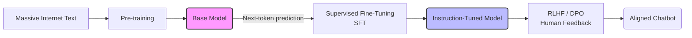

Nếu bạn đã từng trầm trồ trước khả năng làm thơ, viết code hay trả lời câu hỏi trôi chảy của ChatGPT, Claude hay Gemini, thì bạn đã chứng kiến sức mạnh của **Mô hình Ngôn ngữ Lớn (Large Language Model - LLM)**. 

Nhưng thực chất, LLM hoạt động như thế nào? Liệu nó có thực sự "suy nghĩ" như con người hay chỉ là một cỗ máy tính toán cơ học?

Về bản chất, LLM là một hệ thống Trí tuệ Nhân tạo (AI) học sâu (Deep Learning) được thiết kế để hiểu, tạo lập và tương tác bằng ngôn ngữ tự nhiên. Sức mạnh thực sự của LLM không nằm ở một trí thông minh có ý thức, mà là khả năng toán học siêu việt trong việc dự đoán từ ngữ tiếp theo (next-[token](/concepts/6-ai-ml/genai-ml/token/) prediction) dựa trên ngữ cảnh được cung cấp.

## LLM là gì dưới góc nhìn kỹ thuật?

Nếu bóc tách một LLM ra, bạn sẽ thấy nó chỉ là một tập hợp khổng lồ các tệp tin chứa ma trận trọng số (weight parameters - thường từ vài tỷ đến hàng nghìn tỷ tham số). Những con số này chính là phần mã hóa mối quan hệ phân phối thống kê giữa các từ vựng trong ngôn ngữ loài người.

Khi bạn gửi cho LLM một chuỗi văn bản (đầu vào hoặc Prompt), nó sẽ thực hiện hàng loạt phép nhân ma trận liên tiếp qua hàng chục lớp xử lý để tính toán ra một bảng phân phối xác suất. Câu hỏi duy nhất mà mô hình tự trả lời lúc này là: 

*"Dựa vào toàn bộ dữ liệu tôi đã đọc trên Internet, từ (token) nào có khả năng xuất hiện tiếp theo trong ngữ cảnh này cao nhất?"* 

Quá trình dự đoán từng từ một này được lặp đi lặp lại liên tục cho đến khi tạo thành một câu hoặc một đoạn văn hoàn chỉnh.

### Tại sao LLM lại bùng nổ mạnh mẽ?

Trước kỷ nguyên của các mô hình ngôn ngữ lớn (trước năm 2017), các kỹ sư Xử lý Ngôn ngữ Tự nhiên (NLP) chủ yếu sử dụng các kiến trúc mạng nơ-ron tuần tự như RNN hoặc LSTM. Những kiến trúc này vấp phải ba rào cản chí mạng:
* **Hội chứng mất trí nhớ ngắn hạn**: Chúng xử lý văn bản theo thứ tự từ trái sang phải. Khi đọc đến cuối một đoạn văn dài, chúng đã quên mất nội dung ở đầu đoạn.
* **Tốc độ huấn luyện rất chậm**: Do cơ chế xử lý tuần tự, các mô hình này không thể tận dụng sức mạnh tính toán song song cực mạnh của GPU.
* **Tính chuyên biệt hóa quá cao**: Bạn cần phải xây dựng một mô hình riêng để dịch thuật, một mô hình khác để tóm tắt và một mô hình khác nữa để phân tích cảm xúc.

Năm 2017, Google xuất bản bài báo khoa học mang tính lịch sử *"Attention Is All You Need"*, giới thiệu kiến trúc **Transformer**. Kiến trúc này đã giải quyết triệt để bài toán xử lý song song, mở đường cho việc đưa những tập dữ liệu khổng lồ của toàn bộ Internet vào các mô hình có quy mô hàng trăm tỷ tham số. Kết quả là chúng ta có những mô hình "chuyên gia đa năng" (zero-shot generalists): Một mô hình duy nhất có thể giải quyết hầu hết các tác vụ ngôn ngữ chỉ thông qua việc ra lệnh (Prompting).

---

## Ba trụ cột công nghệ của LLM

Sự vĩ đại của LLM được xây dựng trên ba thành phần nền tảng:

1. **Tokenization (Mã hóa từ vựng)**: Mô hình không đọc chữ cái hay từ nguyên bản giống như con người. Văn bản đầu vào sẽ được băm nhỏ thành các mảnh gọi là Token (trung bình 1 token bằng khoảng 0.75 từ tiếng Anh). Từ "Hamburger" có thể được tách thành "Ham" và "burger", sau đó mỗi token được ánh xạ thành một con số ID cụ thể.
2. **Word Embeddings (Biểu diễn không gian vector)**: Mỗi từ được gán cho một tọa độ (vector đa chiều). Trong không gian này, các từ có ý nghĩa tương đương (như "Vua" và "Hoàng hậu") sẽ nằm rất gần nhau. Mô hình hiểu "ngữ nghĩa" thông qua khoảng cách hình học giữa các vector này.
3. **Cơ chế Self-Attention (Tự chú ý)**: Đây là trái tim của Transformer. Khi đọc một từ trong câu, cơ chế này giúp mô hình "liếc nhìn" và liên kết với tất cả các từ khác xung quanh để xác định từ nào quan trọng nhất trong việc định hình ngữ cảnh. Ví dụ, trong câu *"Con chuột máy tính bị đứt đuôi"*, nhờ cơ chế Attention, mô hình hiểu từ "chuột" ở đây liên quan đến đồ công nghệ ("máy tính") chứ không phải là một con vật.

---

## Hành trình huấn luyện một LLM hiện đại

Để biến một tập hợp các file ma trận trống rỗng thành một trợ lý AI thông minh như ngày nay, mô hình phải trải qua một quy trình huấn luyện gồm 3 giai đoạn chính:


### Giai đoạn 1: Pre-training (Tiền huấn luyện)
Đây là giai đoạn ngốn nhiều tài nguyên nhất (tiêu tốn hàng chục triệu đô la và hàng vạn GPU chạy liên tục trong nhiều tháng). Mô hình sẽ đọc hàng nghìn tỷ từ ngữ từ sách báo, Wikipedia, Reddit và code GitHub để học cách đoán từ tiếp theo.
- **Kết quả**: Tạo ra một **Base Model** (Mô hình nền tảng) cực kỳ thông thái nhưng... vô dụng trong giao tiếp. Nếu bạn hỏi nó: *"Thủ đô nước Pháp là gì?"*, Base Model có thể tự động điền tiếp: *"Thủ đô nước Anh là gì? Thủ đô nước Đức là gì?"* vì nó nghĩ bạn đang lập một danh sách câu hỏi ôn tập.

### Giai đoạn 2: Supervised Fine-Tuning (SFT - Tinh chỉnh có giám sát)
Để biến Base Model thành một trợ lý hữu ích, chúng ta phải dạy nó biết tuân thủ các chỉ dẫn (Instruction Following). Các kỹ sư sẽ chuẩn bị hàng vạn cặp dữ liệu dạng `[Chỉ dẫn / Câu hỏi] - [Câu trả lời mẫu chuẩn mực]`.
- **Kết quả**: Tạo ra mô hình **Instruction-Tuned**. Lúc này, khi hỏi *"Thủ đô nước Pháp?"*, mô hình sẽ trả lời chính xác: *"Thủ đô của Pháp là Paris"*.

### Giai đoạn 3: RLHF (Reinforcement Learning from Human Feedback) / DPO
Mục tiêu của giai đoạn này là giúp mô hình trở nên an toàn, lịch sự và hữu ích hơn (Alignment). Mô hình sẽ sinh ra nhiều câu trả lời khác nhau cho cùng một câu hỏi, sau đó con người (hoặc một AI khác) sẽ chấm điểm xem câu nào tốt hơn và ít độc hại hơn. Mô hình sẽ tự điều chỉnh trọng số để tối đa hóa điểm số nhận được.
- **Kết quả**: Tạo ra một chatbot AI hoàn thiện, biết từ chối các yêu cầu vi phạm đạo đức hoặc pháp luật (như hướng dẫn viết mã độc hay chế tạo bom).

---

## Cơ chế dự đoán từ và vai trò của Temperature

Hãy xem cách LLM dự đoán từ bằng bảng xác suất. Khi nhận được prompt: 

*"Trời mưa, tôi phải mang theo cái..."*

Mô hình sẽ tính toán và đưa ra các lựa chọn:
* `ô` (85%)
* `áo_mưa` (12%)
* `cặp` (2.9%)
* `máy_bay` (0.001%)

Việc chọn từ nào tiếp theo sẽ phụ thuộc vào tham số **Temperature** (Nhiệt độ):
* **Temperature = 0**: Mô hình luôn chọn từ có xác suất cao nhất (`ô`). Điều này giúp câu trả lời cực kỳ chính xác, nhất quán nhưng sẽ rất máy móc và khô khan.
* **Temperature cao (ví dụ 0.7 - 1.0)**: Mô hình sẽ có cơ hội lựa chọn các từ có xác suất thấp hơn như `áo_mưa` để câu văn trở nên tự nhiên, sáng tạo và đa dạng hơn.

Dưới đây là một đoạn code ví dụ cách gọi API của OpenAI và cấu hình tham số này:
```python
import openai

response = openai.ChatCompletion.create(
    model="gpt-4",
    messages=[
        {"role": "system", "content": "Bạn là một nhà thơ sáng tạo."},
        {"role": "user", "content": "Trời mưa, tôi phải mang theo cái..."}
    ],
    temperature=0.7, # Tăng tính sáng tạo cho câu trả lời
    max_tokens=50
)
print(response.choices[0].message.content)
```

---

## Điểm mạnh và điểm yếu

### Những ưu điểm vượt trội (Pros)
* **Khả năng tự bộc phát trí thông minh (Emergent Abilities)**: Khi đạt đến một quy mô tham số đủ lớn, mô hình tự nhiên có được những khả năng lập luận phức tạp hoặc giải quyết những bài toán mà nó chưa từng được huấn luyện trực tiếp (Zero-shot learning).
* **Giao tiếp tự nhiên**: Phá bỏ hoàn toàn rào cản công nghệ, giúp con người có thể điều khiển máy tính bằng chính ngôn ngữ tự nhiên hàng ngày.

### Những hạn chế chí mạng (Cons)
* **Ảo giác (Hallucination)**: Bản chất của LLM là mô hình xác suất. Nó không hề có ý niệm về "sự thật khách quan". Nếu thiếu thông tin, nó sẵn sàng bịa ra một câu chuyện trông cực kỳ thuyết phục và tự tin.
* **Hộp đen bí ẩn (Black Box)**: Với hàng trăm tỷ tham số, việc giải thích chính xác tại sao LLM lại đưa ra một quyết định cụ thể nào đó về mặt toán học là điều gần như không thể ở thời điểm hiện tại.
* **Chi phí tài nguyên khổng lồ**: Việc huấn luyện và vận hành các mô hình lớn tiêu tốn một lượng điện năng và tài nguyên làm mát cực kỳ khủng khiếp.

### Kinh nghiệm xương máu khi làm việc với LLM (Best Practices)
* **Bảo vệ System Prompt**: Luôn xây dựng các rào chắn (guardrails) xung quanh System Prompt để ngăn chặn các cuộc tấn công chèn câu lệnh (Prompt Injection) từ phía người dùng.
* **Sử dụng RAG thay vì Fine-tuning để dạy kiến thức mới**: Kiến thức của LLM bị đóng băng tại thời điểm nó được huấn luyện. Đừng cố fine-tune mô hình chỉ để nhồi nhét thông tin mới của công ty. Hãy kết nối nó với một [Vector Database](/concepts/6-ai-ml/genai-ml/vector-database/) thông qua kiến trúc RAG (Retrieval-Augmented Generation).
* **Cài đặt [Temperature](/concepts/6-ai-ml/genai-ml/temperature/) phù hợp**: Đặt `Temperature = 0` cho các tác vụ cần tính chính xác cao như trích xuất dữ liệu JSON hay phân tích log hệ thống. Ngược lại, hãy tăng `Temperature` lên `0.7 - 0.9` cho các tác vụ sáng tạo nội dung, viết bài PR.

### Các sai lầm phổ biến cần tránh
* **Nhân hóa AI**: Tin rằng chatbot có linh hồn hoặc cảm xúc thực sự. Việc quá tin tưởng vào AI có thể dẫn đến những quyết định sai lầm nghiêm trọng trong công việc.
* **Bắt LLM làm toán phức tạp**: LLM tính toán bằng cách dự đoán chuỗi ký tự chữ viết chứ không có bộ xử lý logic toán học (ALU) bên trong. Do đó, nó tính toán các phép tính lớn rất tệ.
* **Rò rỉ dữ liệu nhạy cảm**: Gửi các mã nguồn bảo mật hoặc báo cáo tài chính nội bộ lên các dịch vụ API công cộng miễn phí. Đối với dữ liệu nhạy cảm, hãy sử dụng các phiên bản API doanh nghiệp được cam kết bảo mật hoặc tự chạy các mô hình Local LLM.

---

## Khi nào nên dùng

### Nên chọn khi:
* Cần xây dựng các hệ thống chatbot hỗ trợ khách hàng, trợ lý ảo thông minh.
* Tóm tắt các tài liệu văn bản khổng lồ, dịch thuật đa ngôn ngữ với độ chính xác cao về mặt ngữ cảnh.
* Trích xuất thông tin từ các tài liệu phi cấu trúc (PDF, ảnh chụp) sang cấu trúc JSON hoặc viết các đoạn mã nguồn mẫu.

### Không nên chọn khi:
* Hệ thống điều khiển tự động trong các lĩnh vực nhạy cảm (như y tế, hàng không) nơi một lỗi nhỏ do xác suất cũng có thể gây ảnh hưởng đến tính mạng.
* Cần phân tích và tính toán các số liệu tài chính chuyên sâu (các thuật toán và thư viện lập trình truyền thống như Pandas sẽ nhanh và chính xác 100%).

---

## Khái niệm liên quan

* [Ảo giác LLM (Hallucination)](/concepts/6-ai-ml/genai-ml/hallucination/)
* [Retrieval-Augmented Generation (RAG)](/concepts/6-ai-ml/genai-ml/rag/)
* [Gợi ý hệ thống (System Prompt)](/concepts/6-ai-ml/genai-ml/system-prompt/)
* [Tác nhân AI (AI Agent)](/concepts/6-ai-ml/genai-ml/ai-agent/)

---

## Trọng tâm ôn luyện phỏng vấn

### 1. Giải thích sự khác biệt giữa Base LLM và Instruction-Tuned LLM?
* **Mục đích của người phỏng vấn**: Đánh giá sự hiểu biết của bạn về quy trình huấn luyện (training pipeline) của các hệ thống GenAI.
* **Gợi ý trả lời**:
  * **Base LLM** là kết quả trực tiếp của quá trình Pre-training trên dữ liệu thô. Nhiệm vụ duy nhất của nó là đoán từ tiếp theo. Do đó, nó không biết cách trò chuyện. Nếu ta nhập: *"Cách làm món phở bò?"*, nó có thể viết tiếp *"Cách làm món phở gà, cách làm bún chả..."* vì nó nghĩ đây là một danh mục món ăn.
  * **Instruction-Tuned LLM** là Base LLM đã được tinh chỉnh qua các bước SFT và RLHF để hiểu các câu lệnh và giao tiếp tự nhiên với con người. Khi nhận câu hỏi tương tự, nó biết vai trò của mình là trợ lý và sẽ đưa ra các bước hướng dẫn cụ thể để nấu phở bò.

### 2. Token là gì? Tại sao LLM xử lý văn bản theo Token thay vì từng chữ cái hay từng từ nguyên vẹn?
* **Mục đích của người phỏng vấn**: Đánh giá kiến thức chuyên sâu về cách xử lý ngôn ngữ tự nhiên (NLP) ở tầng sâu.
* **Gợi ý trả lời**:
  * Nếu xử lý theo **chữ cái** (A, B, C...): Số lượng ký tự trong từ điển rất nhỏ, nhưng chuỗi đầu vào sẽ trở nên quá dài, làm quá tải giới hạn ngữ cảnh (Context Window) của mô hình. Hơn nữa, từng chữ cái đơn lẻ không mang nhiều ý nghĩa ngữ nghĩa.
  * Nếu xử lý theo **từ nguyên vẹn**: Từ điển sẽ phình to ra hàng triệu từ (do có lỗi chính tả, từ ghép, từ lóng, biến thể thì động từ...). Điều này làm ma trận Embedding cực kỳ khổng lồ, gây tràn bộ nhớ và mô hình sẽ bất lực trước các từ mới lạ.
  * **Sub-word Tokenization** (như thuật toán BPE) là sự dung hòa hoàn hảo: Nó cắt các từ thành các âm tiết nhỏ hơn. Các từ phổ biến sẽ là 1 token, các từ hiếm hoặc viết sai sẽ được ghép lại từ nhiều token nhỏ hơn. Phương án này giữ cho kích thước từ điển ở mức tối ưu (30.000 - 100.000 token) mà vẫn đảm bảo hiệu năng xử lý.

### 3. Khả năng bộc phát (Emergent Abilities) trong LLM nghĩa là gì?
* **Mục đích của người phỏng vấn**: Xem bạn có nắm bắt được các lý thuyết nghiên cứu hiện đại về sự phát triển quy mô (scaling laws) của mô hình không.
* **Gợi ý trả lời**:
  * **Emergent Abilities** là những khả năng giải quyết các vấn đề phức tạp (như lập luận toán học, dịch thuật ngôn ngữ hiếm, hay suy luận logic) tự động xuất hiện khi mô hình được tăng kích thước (số lượng tham số, lượng dữ liệu huấn luyện) vượt qua một ngưỡng giới hạn nhất định (thường là trên vài chục tỷ tham số). Những khả năng này không hề xuất hiện ở các mô hình quy mô nhỏ và cũng không được các kỹ sư lập trình trực tiếp cho mô hình.

---

## Xem thêm các khái niệm liên quan
* [Tác nhân AI (AI Agent)](/concepts/6-ai-ml/genai-ml/ai-agent/)
* [Phân tách văn bản - Chunking and Chunking Strategy](/concepts/6-ai-ml/genai-ml/chunking/)
* [Cửa sổ ngữ cảnh - Context Window](/concepts/6-ai-ml/genai-ml/context-window/)

## Tài liệu tham khảo

1. [Google Cloud - Vertex AI Generative AI Overview](https://cloud.google.com/vertex-ai/generative-ai/docs/learn/overview)
2. [AWS - What is Amazon Bedrock?](https://docs.aws.amazon.com/bedrock/latest/userguide/what-is-bedrock.html)
3. [Azure - Azure OpenAI Service Documentation](https://learn.microsoft.com/en-us/azure/ai-services/openai/overview)
4. [Databricks - Introduction to Large Language Models on Databricks](https://docs.databricks.com/en/large-language-models/index.html)
5. [Snowflake - Snowflake Cortex AI LLM Overview](https://docs.snowflake.com/en/user-guide/snowflake-cortex/llm-overview)

---

## English summary

A **Large Language Model (LLM)** is a sophisticated Deep Learning system based on the Transformer architecture, characterized by billions of parameter weights and trained on massive corpus of text data. Fundamentally, an LLM is a probabilistic engine optimized for next-token prediction via self-attention mechanisms and dense word [embeddings](/concepts/6-ai-ml/genai-ml/embeddings/). The lifecycle of modern conversational LLMs involves massive unsupervised Pre-training to acquire general world knowledge, followed by Supervised Fine-Tuning (SFT) and Reinforcement Learning from Human Feedback (RLHF) to align their behavior with human instructions and safety guidelines, enabling unparalleled zero-shot capabilities across diverse natural language processing tasks.