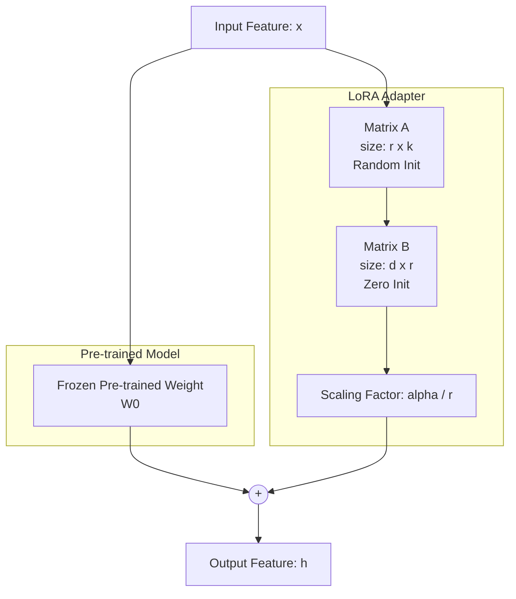

Khi bạn muốn biến một mô hình ngôn ngữ lớn ([LLM](/concepts/6-ai-ml/genai-ml/llm/)) thô thành một chuyên gia trong một lĩnh vực cụ thể (ví dụ: một bot viết mã SQL hoặc một trợ lý y tế), phương pháp truyền thống là **Full Fine-Tuning (Tinh chỉnh toàn bộ mô hình)**. 

Tuy nhiên, việc cập nhật lại toàn bộ hàng tỷ tham số của LLM giống như việc bạn phải xây dựng lại toàn bộ một nhà máy: nó yêu cầu một lượng lớn GPU chuyên dụng đắt đỏ (như A100 hay H100) để chứa các trạng thái tối ưu hóa (optimizer states) và gradient, chi phí lưu trữ khổng lồ và rủi ro mô hình bị "quên sạch" các kiến thức tổng quát ban đầu (Catastrophic Forgetting).

Để giải quyết bài toán đau đầu này, các nhà nghiên cứu tại Microsoft đã phát triển kỹ thuật **Low-Rank Adaptation (LoRA)**. Đây là một phương pháp tinh chỉnh tham số hiệu quả ([PEFT](/concepts/6-ai-ml/genai-ml/peft/) - Parameter-Efficient Fine-Tuning) giúp bạn "dạy" mô hình lớn học tác vụ mới với chi phí phần cứng siêu rẻ mà vẫn giữ nguyên được phong độ của mô hình gốc.

## Ý tưởng toán học đằng sau LoRA

Triết lý của LoRA dựa trên một giả thuyết khoa học gọi là **Hạng nội tại (Intrinsic Rank)**: Khi chúng ta tinh chỉnh một mô hình khổng lồ cho một tác vụ cụ thể, sự thay đổi thực tế của các trọng số ($\Delta W$) thực chất chỉ nằm trong một không gian có số chiều rất thấp.

Thay vì phải cập nhật trực tiếp ma trận trọng số khổng lồ ban đầu $W_0 \in \mathbb{R}^{d \times k}$, LoRA đóng băng hoàn toàn ma trận này và biểu diễn phần trọng số thay đổi $\Delta W$ dưới dạng tích của hai ma trận hạng thấp (low-rank matrices) nhỏ hơn rất nhiều:

$$\Delta W = B \times A$$

Trong đó:
* $B \in \mathbb{R}^{d \times r}$
* $A \in \mathbb{R}^{r \times k}$
* Hạng $r$ (rank) được chọn là một số cực kỳ nhỏ so với kích thước gốc ($r \ll \min(d, k)$).

**Hãy làm một phép toán đơn giản:**
Giả sử lớp Attention của mô hình có kích thước $d = 4096$ và $k = 4096$. Ma trận cập nhật $\Delta W$ thông thường sẽ có \\$4096 \times 4096 \approx 16.7$ triệu tham số cần huấn luyện.
Nếu áp dụng LoRA với hạng $r = 8$:
* Ma trận $A$ chỉ có \\$8 \times 4096 = 32.768$ tham số.
* Ma trận $B$ cũng có \\$32.768$ tham số.
* Tổng số tham số cần huấn luyện lúc này chỉ là $\sim 65.536$ (giảm tới hơn 250 lần so với ban đầu!).

---

## Cơ chế hoạt động của LoRA

Quy trình tiêm và huấn luyện LoRA diễn ra theo các bước cực kỳ logic:


1. **Đóng băng mô hình gốc**: Tải mô hình gốc lên bộ nhớ và khóa toàn bộ trọng số $W_0$ lại để chúng không bị cập nhật trong quá trình lan truyền ngược (backpropagation).
2. **Tiêm ma trận LoRA**: Chèn cặp ma trận $A$ và $B$ vào song song với các lớp tuyến tính (thường là các lớp Query, Key, Value trong khối Self-Attention).
   * Ma trận $A$ được khởi tạo bằng các số ngẫu nhiên theo phân phối Gaussian.
   * Ma trận $B$ được khởi tạo bằng **toàn bộ số 0**. Điều này cực kỳ quan trọng vì nó đảm bảo lúc mới bắt đầu (epoch 0), tích $B \times A = 0$, mô hình hoạt động giống hệt như chưa hề tinh chỉnh, tránh bị sốc hoặc lệch kết quả.
3. **Huấn luyện**: Chỉ tính toán gradient và cập nhật trọng số cho các tham số nằm trong hai ma trận $A$ và $B$.
4. **Hợp nhất (Merging)**: Khi quá trình huấn luyện hoàn tất, bạn sẽ thu được một adapter siêu nhẹ. Để đưa vào sử dụng thực tế mà không làm tăng độ trễ truy vấn (latency overhead), bạn chỉ cần thực hiện phép cộng toán học đơn giản: $W_{new} = W_0 + B \times A$. Mô hình mới sẽ chạy với tốc độ y hệt như mô hình gốc.

---

## Trải nghiệm thực tế: SQL Bot với LoRA

Giả sử bạn cần tinh chỉnh mô hình Llama-3-8B để viết câu lệnh SQL chuẩn xác cho cơ sở dữ liệu của công ty. Thay vì mất hàng trăm triệu đồng thuê GPU để chạy Full Fine-Tuning, bạn có thể thực hiện theo cách sau:
1. **Dữ liệu**: Chuẩn bị 10.000 cặp câu hỏi tự nhiên và câu lệnh SQL tương ứng.
2. **Cấu hình**: Tiêm LoRA vào các lớp chiếu của Attention (`q_proj`, `v_proj`) với rank $r = 16$ và hệ số scale $\alpha = 32$.
3. **Huấn luyện**: Bạn chỉ cần sử dụng 1 chiếc GPU RTX 4090 (24GB VRAM) chạy trong 3 giờ là xong. Kết quả thu được là một tệp adapter siêu nhẹ chỉ khoảng **80MB** (thay vì 16GB của mô hình gốc).

Dưới đây là ví dụ thiết lập cấu hình LoRA sử dụng thư viện `peft` của Hugging Face:
```python
from peft import LoraConfig, get_peft_model
from transformers import AutoModelForCausalLM

# Tải mô hình gốc (Base Model)
base_model = AutoModelForCausalLM.from_pretrained("meta-llama/Meta-Llama-3-8B")

# Định nghĩa cấu hình LoRA
lora_config = LoraConfig(
    r=16,               # Hạng của ma trận (Rank)
    lora_alpha=32,      # Hệ số scale (thường gấp đôi r)
    target_modules=["q_proj", "v_proj"], # Các lớp Attention để tiêm LoRA vào
    lora_dropout=0.05,
    bias="none",
    task_type="CAUSAL_LM"
)

# Bọc mô hình gốc với cấu hình LoRA (Chỉ huấn luyện adapter)
peft_model = get_peft_model(base_model, lora_config)
peft_model.print_trainable_parameters()
# Output thực tế: trainable params: 6,815,744 || all params: 8,037,076,992 || trainable%: 0.0848%
```

---

## Điểm mạnh và điểm yếu

### Điểm mạnh (Pros)
* **Tiết kiệm tài nguyên tối đa**: Giảm tới 90% lượng VRAM cần thiết để huấn luyện. Bạn thậm chí có thể fine-tune mô hình 7B tham số trên GPU cá nhân.
* **Kích thước adapter siêu nhỏ**: Việc lưu trữ và chia sẻ file adapter (chỉ vài chục MB) dễ dàng hơn nhiều so với việc bê nguyên cả mô hình gốc hàng chục GB đi khắp nơi.
* **Kiến trúc đa khách hàng (Multi-tenant)**: Bạn có thể giữ một mô hình gốc duy nhất trên RAM và phục vụ hàng trăm khách hàng khác nhau bằng cách linh hoạt "cắm/rút" (swap) các adapter tương ứng cho từng request.
* **Không tốn thêm độ trễ**: Khi đã merge adapter vào mô hình gốc, tốc độ suy luận hoàn toàn không bị ảnh hưởng.

### Điểm yếu (Cons)
* **Khả năng tiếp thu kiến thức mới bị giới hạn**: Do không gian biểu diễn toán học bị bóp nhỏ (hạng thấp), LoRA không phù hợp để dạy các kiến thức hoàn toàn mới (như học một ngôn ngữ mới từ đầu).
* **Nhiều siêu tham số cần tối ưu**: Bạn sẽ phải thử nghiệm để chọn ra các giá trị phù hợp cho $r$, $\alpha$ và lựa chọn đúng các lớp đích (target modules) để chèn adapter.

## Khi nào nên dùng

### Nên dùng:
* Khi cần tinh chỉnh mô hình ngôn ngữ lớn trên phần cứng giới hạn (như GPU đơn lẻ hoặc GPU tiêu dùng).
* Khi cần cá nhân hóa phong cách, hành vi hoặc định dạng đầu ra của LLM mà không thay đổi tri thức nền tảng.
* Khi cần lưu trữ và chạy nhiều biến thể mô hình (adapters) phục vụ các nhiệm vụ khác nhau một cách linh hoạt trên cùng một base model.

### Không nên dùng:
* Khi muốn huấn luyện mô hình học một ngôn ngữ hoàn toàn mới hoặc nhồi nhét một lượng kiến thức chuyên ngành khổng lồ từ con số 0. Trường hợp này bắt buộc phải dùng Continual Pre-training hoặc Full Fine-Tuning.

### Lời khuyên khi triển khai (Best Practices)
* **Công thức thiết lập $r$ và $\alpha$**: Quy tắc ngón tay cái phổ biến là luôn chọn $\alpha = 2 \times r$. Các giá trị rank $r$ tối ưu thường nằm trong khoảng 8, 16, 32 hoặc 64.
* **Học thêm QLoRA nếu thiếu VRAM**: QLoRA là phiên bản nâng cấp của LoRA. Nó nén mô hình gốc xuống định dạng 4-bit (chỉ đọc), giúp tiết kiệm VRAM hơn nữa, trong khi các ma trận LoRA A và B vẫn được giữ ở 16-bit để đảm bảo độ chính xác khi huấn luyện.
* **Sử dụng tốc độ học (Learning Rate) cao hơn**: Vì số lượng tham số huấn luyện của LoRA rất ít, bạn nên đặt tốc độ học cao hơn so với tinh chỉnh toàn bộ (thường dùng `1e-4` đến `3e-4` với thuật toán AdamW).

### Những sai lầm phổ biến cần tránh
* **Quên hợp nhất trọng số trước khi deploy**: Nếu bạn chạy mô hình ở môi trường thực tế mà load song song cả mô hình gốc và file adapter thô, hệ thống sẽ phải tính toán song song hai nhánh ma trận rời rạc, làm tăng đáng kể độ trễ (latency) của câu trả lời. Hãy nhớ chạy lệnh merge trước khi deploy.
* **Khởi tạo sai ma trận B**: Tuyệt đối không khởi tạo ma trận B bằng các số ngẫu nhiên. Điều này sẽ đưa một lượng nhiễu lớn vào mô hình ngay ở step đầu tiên, khiến mô hình bị "sốc" và làm hàm mất mát (loss) phân kỳ. B bắt buộc phải bắt đầu bằng toàn số 0.

---

## Khi nào nên và không nên chọn LoRA?

### Nên chọn khi:
* Bạn cần huấn luyện mô hình tuân thủ cấu trúc đầu ra nhất định (như sinh JSON, viết SQL) từ một Base Model.
* Cần cá nhân hóa phong cách viết, giọng điệu phản hồi cho chatbot của doanh nghiệp.
* Bạn bị giới hạn về ngân sách hạ tầng hoặc muốn tối ưu hóa chi phí vận hành trên đám mây.

### Không nên chọn khi:
* Bạn muốn dạy mô hình học một ngôn ngữ mới hoặc nhồi nhét một lượng kiến thức chuyên ngành khổng lồ từ con số 0. Trường hợp này bắt buộc phải dùng Continual Pre-training hoặc Full Fine-Tuning.
* Bạn đang huấn luyện một mô hình hoàn toàn mới từ đầu.

---

## Khái niệm liên quan

* [Large Language Models (LLM)](/concepts/6-ai-ml/genai-ml/llm/)
* [Fine-Tuning](/concepts/6-ai-ml/genai-ml/fine-tuning/)
* [Model Serving](/concepts/6-ai-ml/genai-ml/model-serving/)

---

## Trọng tâm ôn luyện phỏng vấn

### 1. Tại sao ma trận B trong LoRA lại được khởi tạo bằng toàn số 0, trong khi ma trận A được khởi tạo ngẫu nhiên?
* **Mục đích của người phỏng vấn**: Đánh giá kiến thức sâu sắc của bạn về toán học đằng sau quá trình lan truyền ngược và sự ổn định của mạng nơ-ron.
* **Gợi ý trả lời**:
  * Ma trận B bắt buộc phải khởi tạo bằng toàn bộ số 0 để đảm bảo tích $\Delta W = B \times A = 0$ tại bước huấn luyện đầu tiên (step 0). Điều này giúp giữ cho mô hình hoạt động ổn định và có đầu ra y hệt mô hình gốc khi chưa học gì.
  * Ngược lại, ma trận A phải được khởi tạo ngẫu nhiên theo phân phối Gaussian để tránh hiện tượng đối xứng ma trận (symmetry breaking). Nếu cả hai đều bằng 0, mô hình sẽ không thể tính toán gradient một cách chính xác để cập nhật trọng số ở các bước tiếp theo.

### 2. Sự khác biệt cốt lõi giữa LoRA và QLoRA là gì?
* **Mục đích của người phỏng vấn**: Kiểm tra kinh nghiệm thực chiến của bạn trong việc tối ưu hóa tài nguyên phần cứng.
* **Gợi ý trả lời**:
  * **LoRA** giảm số lượng tham số cần huấn luyện nhưng vẫn yêu cầu bạn phải tải toàn bộ trọng số của mô hình gốc ở định dạng 16-bit (FP16/BF16), vốn vẫn chiếm khá nhiều bộ nhớ VRAM.
  * **QLoRA (Quantized LoRA)** đi xa hơn bằng cách lượng tử hóa (nén) mô hình gốc xuống định dạng 4-bit (thường dùng kiểu NF4). Khi huấn luyện, dữ liệu đi qua mô hình 4-bit sẽ được giải nén tạm thời sang 16-bit để tính toán với ma trận LoRA (vẫn chạy ở 16-bit). QLoRA giúp giảm lượng VRAM cần thiết đi thêm khoảng 4 lần so với LoRA thông thường, đổi lại tốc độ huấn luyện sẽ chậm đi một chút do tốn thêm bước giải nén.

### 3. Việc sử dụng LoRA có làm chậm tốc độ suy luận (inference latency) của mô hình trong thực tế không?
* **Mục đích của người phỏng vấn**: Đánh giá hiểu biết của bạn về quy trình đóng gói và triển khai mô hình ([Model Serving](/concepts/6-ai-ml/genai-ml/model-serving/)).
* **Gợi ý trả lời**:
  * Điều này tùy thuộc vào cách bạn triển khai. Nếu bạn load song song mô hình gốc và tệp adapter thô để chạy suy luận, tốc độ sẽ bị chậm lại do hệ thống phải thực hiện thêm các phép tính ma trận phụ.
  * Tuy nhiên, trên môi trường production, chúng ta luôn thực hiện bước hợp nhất trọng số (Weight Merging) trước: Cộng trực tiếp $\Delta W$ vào ma trận gốc $W_0$. Khi đó, mô hình sẽ trở lại thành một ma trận duy nhất, tốc độ suy luận hoàn toàn giống hệt như mô hình gốc, độ trễ phát sinh bằng 0.

### 4. Tham số Alpha ($\alpha$) trong cấu hình LoRA đóng vai trò gì?
* **Mục đích của người phỏng vấn**: Đánh giá kinh nghiệm thực tế của bạn khi tinh chỉnh các siêu tham số.
* **Gợi ý trả lời**:
  * Hệ số Alpha là một hằng số dùng để điều chỉnh tỷ lệ ảnh hưởng của LoRA adapter lên trọng số gốc của mô hình. Cụ thể, ma trận cập nhật $\Delta W$ sẽ được nhân với tỷ lệ $\frac{\alpha}{r}$ trước khi cộng vào $W_0$.
  * Vai trò của $\alpha$ là giữ cho cường độ của các cập nhật trọng số luôn ổn định khi chúng ta thử nghiệm thay đổi các giá trị hạng $r$ khác nhau, giúp quá trình huấn luyện diễn ra mượt mà hơn mà không cần phải chỉnh lại Learning Rate. Thông thường, chúng ta đặt $\alpha = 2 \times r$.

---

## Xem thêm các khái niệm liên quan
* [Tác nhân AI (AI Agent)](/concepts/6-ai-ml/genai-ml/ai-agent/)
* [Phân tách văn bản - Chunking and Chunking Strategy](/concepts/6-ai-ml/genai-ml/chunking/)
* [Cửa sổ ngữ cảnh - Context Window](/concepts/6-ai-ml/genai-ml/context-window/)

## Tài liệu tham khảo

1. [Google Cloud - Tune Generative AI Models in Vertex AI](https://cloud.google.com/vertex-ai/generative-ai/docs/models/tune-models)
2. [AWS - Amazon Bedrock Model Customization and Fine-Tuning](https://docs.aws.amazon.com/bedrock/latest/userguide/model-customization.html)
3. [Azure - Azure OpenAI Service Fine-Tuning Guide](https://learn.microsoft.com/en-us/azure/ai-services/openai/how-to/fine-tuning)
4. [Databricks - Fine-Tuning Foundation Models with LoRA](https://docs.databricks.com/en/large-language-models/index.html)
5. [Snowflake - Snowflake Cortex AI Customization Overview](https://docs.snowflake.com/en/user-guide/snowflake-cortex/llm-overview)

---

## English summary

Low-Rank Adaptation (LoRA) is a Parameter-Efficient Fine-Tuning (PEFT) technique designed to adapt Large Language Models (LLMs) with minimal computational and memory footprints. Instead of fine-tuning all parameters of the pre-trained model (which is frozen), LoRA injects trainable low-rank decomposition matrices ($A$ and $B$) into specific network layers (typically Attention modules). This dramatically reduces the number of trainable parameters by up to 10,000 times, allowing billion-parameter models to be fine-tuned on consumer GPUs without catastrophic forgetting. During inference, the learned adapter weights can be seamlessly merged with the base model, yielding zero additional latency overhead. LoRA adapters are extremely lightweight and highly portable.