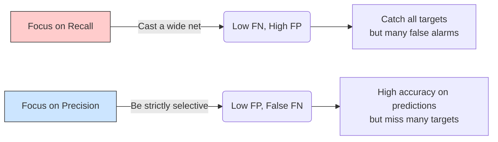

Khi đánh giá hiệu năng của một mô hình học máy (Machine Learning) hay một hệ thống tìm kiếm thông tin, chúng ta thường nghe nhắc đến thuật ngữ **Recall (Độ phủ)**. Đây là một trong những thước đo quan trọng bậc nhất giúp chúng ta biết được mô hình có đang hoạt động hiệu quả hay không, đặc biệt là trong các bài toán mang tính chất rủi ro cao hoặc mất cân bằng dữ liệu.

## Không bỏ sót mục tiêu: Recall là gì?

Recall (Độ phủ) – hay còn gọi là Độ nhạy (Sensitivity) hoặc True Positive Rate (TPR) – là thước đo đánh giá tỷ lệ các trường hợp "Đúng" (Positive) trên thực tế mà mô hình đã nhận diện thành công so với tổng số trường hợp "Đúng" thực tế tồn tại trong tập dữ liệu.

Nói một cách ngắn gọn, Recall trả lời cho câu hỏi: *"Trong tất cả các đối tượng thực sự là mục tiêu cần tìm, mô hình của chúng ta đã tìm ra được bao nhiêu phần trăm, hay đã bỏ sót mất bao nhiêu?"*

Về mặt toán học, Recall được tính bằng công thức:

$$Recall = \frac{True Positives (TP)}{True Positives (TP) + False Negatives (FN)}$$

Trong đó:
* **True Positives (TP - Điểm dương thật)**: Số lượng mẫu thực sự là Positive và mô hình dự đoán chính xác là Positive.
* **False Negatives (FN - Điểm âm giả)**: Số lượng mẫu thực sự là Positive nhưng mô hình lại bỏ sót và dán nhãn sai thành Negative.

Tổng số $(TP + FN)$ biểu diễn toàn bộ các nhãn Positive thực tế có trong tập dữ liệu (Ground Truth).

Trong bối cảnh Hệ thống truy xuất thông tin (Information Retrieval) hoặc các ứng dụng [RAG](/concepts/6-ai-ml/genai-ml/rag/) (Retrieval-Augmented Generation), Recall được hiểu là tỷ lệ tài liệu liên quan mà hệ thống đã lôi ra được trên tổng số tài liệu liên quan có trong database.

## Tại sao chúng ta cần Recall?

Nếu chỉ nhìn vào độ chính xác tổng thể (Accuracy), bạn rất dễ bị đánh lừa khi làm việc với các bộ dữ liệu mất cân bằng (Imbalanced Datasets). 

Hãy tưởng tượng một hệ thống phát hiện gian lận thẻ tín dụng. Trong số 10.000 giao dịch, chỉ có 100 giao dịch là gian lận (1%), còn lại 9.900 giao dịch là bình thường (99%). Nếu bạn xây dựng một mô hình cực kỳ đơn giản và lười biếng: luôn dự đoán mọi giao dịch là "Bình thường", mô hình này vẫn đạt độ chính xác Accuracy lên tới 99%! Thế nhưng, nó hoàn toàn vô dụng vì đã bỏ sót 100% các vụ gian lận thẻ.

Recall sinh ra chính là để đo lường khả năng **"không bỏ sót"** này. Trong các bài toán mà việc bỏ lọt mục tiêu mang lại hậu quả khôn lường (như y tế chẩn đoán bệnh ung thư, phát hiện mã độc tấn công hệ thống mạng), việc chẩn đoán nhầm một người khỏe thành có bệnh (False Positive) để họ đi kiểm tra lại vẫn tốt hơn rất nhiều so với việc bỏ sót một bệnh nhân thực sự (False Negative) khiến họ mất đi cơ hội chữa trị kịp thời.

## Điểm chạm cốt lõi của Recall

Ý tưởng cốt lõi của việc tối ưu hóa Recall là giảm thiểu chỉ số **False Negatives (FN)** về mức thấp nhất có thể.
* FN càng tiệm cận về 0 $\rightarrow$ Recall càng tiến gần về mức tuyệt đối 100% (hay 1.0).
* Recall đạt 1.0 đồng nghĩa với việc mô hình đã tóm gọn toàn bộ các đối tượng Positive mà không bỏ sót bất kỳ ai.

Tuy nhiên, cuộc sống luôn có sự đánh đổi. Bạn hoàn toàn có thể dễ dàng đạt được Recall 100% bằng cách cực đoan: *"Dự đoán tất cả mọi đối tượng đều là Positive"*. Ví dụ, một cái chuông báo cháy lúc nào cũng kêu inh ỏi thì chắc chắn sẽ không bỏ sót bất kỳ vụ cháy nào, nhưng nó sẽ khiến mọi người phát điên vì báo động giả liên tục. Lúc này, độ chuẩn xác (Precision) của hệ thống sẽ sụt giảm thê thảm.

## Minh họa thực tế: Từ bộ lọc Spam đến hệ thống RAG

### Kịch bản 1: Lọc thư rác (Spam Email)
Giả sử hòm thư của bạn thực tế nhận được 10 email Spam (TP + FN = 10).
Hệ thống lọc thư rác của bạn phân loại và đánh dấu 7 email là Spam. 
Trong số 7 email bị đánh dấu đó, có 5 email thực sự là Spam (TP = 5), còn 2 email là thư công việc quan trọng bị nhận nhầm (FP = 2).
Như vậy, có 5 email Spam vẫn lọt lưới thành công và chui vào hòm thư chính của bạn (FN = 5).
* $Recall = \frac{5}{5 + 5} = 0.5$ (50%)
* Nhận xét: Hệ thống chỉ phủ được một nửa lượng thư rác thực tế.

### Kịch bản 2: Tìm kiếm ngữ cảnh cho RAG (Vector Search)
Một người dùng đặt câu hỏi: *"Chính sách nghỉ phép năm của công ty thế nào?"*. Thực tế trong database của bạn có đúng 4 tài liệu liên quan đến chủ đề này.
Hệ thống Vector Search trả về Top 5 kết quả. Trong 5 kết quả này, có 3 tài liệu thực sự liên quan, còn 2 tài liệu nói về nội dung khác. Tài liệu liên quan thứ 4 đã bị bỏ sót do xếp ở vị trí thứ 20.
* $Recall = \frac{3}{4} = 0.75$ (75%)
* $Precision = \frac{3}{5} = 0.60$ (60%)

## Ví dụ lập trình: Tính toán Recall với Scikit-Learn

Dưới đây là cách tính toán nhanh chỉ số Recall và Precision bằng thư viện `scikit-learn` trong Python:

```python
from sklearn.metrics import recall_score, precision_score

# 1 đại diện cho Spam (Positive), 0 là Not Spam (Negative)
y_true = [1, 1, 1, 0, 0, 0] # Thực tế có 3 email Spam
y_pred = [1, 0, 0, 1, 0, 0] # Mô hình chỉ bắt đúng 1 Spam, bắt nhầm 1 Not Spam, bỏ sót 2 Spam

recall = recall_score(y_true, y_pred)
precision = precision_score(y_true, y_pred)

print(f"Recall: {recall:.2f}")       # 1/3 = 0.33 (Bắt được 33% số thư rác)
print(f"Precision: {precision:.2f}") # 1/2 = 0.50 (Trong các email báo rác, có 50% là rác thật)
```

## Điểm mạnh (Pros) và điểm yếu (Cons)

### Điểm mạnh (Pros)
* **Giảm thiểu rủi ro bỏ sót**: Cực kỳ quan trọng cho các bài toán nhạy cảm về an toàn như y khoa hoặc an ninh mạng, nơi việc bỏ sót một ca bệnh hay một cuộc tấn công có thể dẫn đến hậu quả nghiêm trọng.
* **Đánh giá khách quan trên tập dữ liệu mất cân bằng**: Khác với Accuracy, Recall tập trung hoàn toàn vào việc nhận diện lớp Positive mục tiêu, tránh bị bóp méo bởi số lượng áp đảo của lớp Negative.
* **Tối ưu hóa nguồn tài liệu đầu vào cho RAG**: Đảm bảo toàn bộ thông tin quan trọng được đưa vào context window trước khi LLM xử lý.

### Điểm yếu (Cons)
* **Không phản ánh cảnh báo giả**: Recall không quan tâm đến số lượng False Positives. Mô hình có Recall 100% vẫn có thể gây phiền thoái hoặc lãng phí lớn vì lượng báo động giả quá nhiều.
* **Dễ bị thao túng cực đoan**: Có thể đạt Recall tối đa 1.0 một cách giả tạo bằng cách dự đoán tất cả mẫu dữ liệu đều là Positive.

## Khi nào nên dùng và không nên dùng

### Khi nào nên dùng
* **Hệ thống chẩn đoán y khoa**: Phát hiện các căn bệnh hiểm nghèo như ung thư, tim mạch (thà kiểm tra kỹ thêm còn hơn bỏ qua mầm bệnh).
* **An ninh mạng và phát hiện gian lận**: Phát hiện mã độc xâm nhập hoặc giao dịch gian lận thẻ tín dụng.
* **Giai đoạn Retrieval của RAG**: Truy xuất ngữ cảnh (Vector Search) để tối đa hóa lượng thông tin hữu ích trước khi thực hiện [Reranking](/concepts/6-ai-ml/genai-ml/reranking/).

### Khi nào không nên dùng
* **Hệ thống gợi ý sản phẩm/nội dung**: Nếu YouTube hay Netflix tối ưu hóa hoàn toàn cho Recall, họ sẽ gợi ý tràn lan nội dung không phù hợp, làm giảm trải nghiệm người dùng (nên ưu tiên Precision).
* **Hệ thống tư pháp hoặc phê duyệt tự động**: Khi việc kết tội oan hoặc duyệt nhầm mang lại hậu quả pháp lý nghiêm trọng.

## Cuộc chiến giằng co giữa Precision và Recall

Sự giằng co giữa Precision (Độ chuẩn xác) và Recall (Độ phủ) là một trong những bài toán đánh đổi kinh điển nhất của ngành học máy:


* **Ưu tiên tối ưu Recall**: Mô hình sẽ mở rộng ranh giới phân loại, chấp nhận "thà bắt nhầm còn hơn bỏ sót". Kết quả là số lượng lỗi False Negatives giảm mạnh, nhưng số lượng báo động giả (False Positives) sẽ tăng cao, kéo Precision đi xuống.
* **Ưu tiên tối ưu Precision**: Mô hình trở nên cực kỳ cẩn trọng và bảo thủ. Nó chỉ dán nhãn Positive khi có mức độ tự tin rất cao. Kết quả là các dự đoán đưa ra hầu như đều đúng (False Positives cực thấp), nhưng hệ thống sẽ bỏ sót rất nhiều mục tiêu thực tế (False Negatives tăng cao, Recall sụt giảm).

## Trọng tâm ôn luyện phỏng vấn

### 1. Hãy giải thích ý nghĩa thực tế của F1-Score và tại sao chúng ta lại dùng trung bình điều hòa (Harmonic Mean) thay vì trung bình cộng thông thường khi tính chỉ số này?
* **Gợi ý trả lời**: F1-Score là chỉ số đại diện cho sự cân bằng giữa Precision và Recall. Chúng ta bắt buộc phải dùng trung bình điều hòa thay vì trung bình cộng vì trung bình điều hòa sẽ trừng phạt rất nặng những mô hình có sự chênh lệch cực đoan giữa hai chỉ số. 
  Ví dụ: Một mô hình dự đoán vô tội vạ mọi email đều là spam sẽ đạt Recall = 1.0 nhưng Precision chỉ đạt 0.01. Nếu dùng trung bình cộng, điểm số sẽ là $(1.0 + 0.01) / 2 = 0.505$ (một con số trông có vẻ khá tốt). Tuy nhiên, nếu dùng trung bình điều hòa, điểm F1-Score sẽ bị kéo tụt xuống mức sát đáy là 0.02. Điều này phản ánh chính xác rằng mô hình đó hoàn toàn vô dụng trong thực tế.

### 2. Bạn sẽ làm thế nào để tăng chỉ số Recall cho hệ thống truy xuất tài liệu (Retrieval) trong ứng dụng RAG?
* **Gợi ý trả lời**: Để cải thiện Recall cho bước Retrieval, ta có thể áp dụng các kỹ thuật:
  1. Tăng số lượng tài liệu lấy ra (tăng giá trị $K$ trong tìm kiếm Top-K, ví dụ lấy Top-15 thay vì Top-5).
  2. Triển khai kiến trúc [Hybrid Search](/concepts/6-ai-ml/genai-ml/hybrid-search/): Kết hợp thế mạnh của Vector Search (tìm theo ngữ nghĩa) và BM25 Search (tìm theo từ khóa chính xác) để đảm bảo không bỏ sót các tài liệu chứa từ khóa chuyên ngành.
  3. Cải tiến chiến lược cắt nhỏ văn bản (Chunking Strategy), tăng tỷ lệ gối đầu (overlap) giữa các đoạn văn bản để giữ trọn vẹn ngữ cảnh ngữ nghĩa.
  4. Sử dụng mô hình Embedding chất lượng cao hơn và phù hợp với ngôn ngữ của tập tài liệu.

---

## Xem thêm các khái niệm liên quan
* [Tác nhân AI (AI Agent)](/concepts/6-ai-ml/genai-ml/ai-agent/)
* [Phân tách văn bản - Chunking and Chunking Strategy](/concepts/6-ai-ml/genai-ml/chunking/)
* [Cửa sổ ngữ cảnh - Context Window](/concepts/6-ai-ml/genai-ml/context-window/)

## Tài liệu tham khảo

1. [AWS Machine Learning Developer Guide - Evaluating Model Accuracy](https://docs.aws.amazon.com/machine-learning/latest/dg/evaluating-model-accuracy.html) - Tài liệu AWS hướng dẫn đánh giá độ chính xác mô hình học máy với Recall và Precision.
2. [Google Cloud Vertex AI - Evaluate AutoML Model Results](https://cloud.google.com/vertex-ai/docs/tabular-data/classification-regression/evaluate) - Hướng dẫn của Google Cloud về phân tích các chỉ số Recall, Precision và F1-score.
3. [Azure Machine Learning Blog - Evaluating Machine Learning Models](https://azure.microsoft.com/en-us/blog/evaluating-machine-learning-models/) - Bài viết từ đội ngũ Azure Microsoft chia sẻ phương pháp đánh giá mô hình phân loại.
4. [Apache Spark MLlib - Evaluation Metrics](https://spark.apache.org/docs/latest/mllib-evaluation-metrics.html) - Tài liệu Apache Spark về cách tính các chỉ số phân loại nhị phân bao gồm Recall.
5. [Databricks MLflow - Model Evaluation Guide](https://docs.databricks.com/en/machine-learning/model-evaluation/index.html) - Hướng dẫn tích hợp MLflow để theo dõi và đánh giá Recall của mô hình trên nền tảng Databricks.
6. [Precision and recall - Wikipedia](https://en.wikipedia.org/wiki/Precision_and_recall) - Định nghĩa chi tiết và các công thức toán học liên quan đến độ phủ và độ chuẩn xác trên Wikipedia.

---

## English Summary

Recall, also known as Sensitivity or True Positive Rate, is a performance metric used in classification and information retrieval systems. It measures the proportion of actual positive cases that the model successfully identified ($TP / (TP + FN)$). Recall is critically important in risk-averse scenarios, such as medical diagnostics or anomaly detection, where the cost of a False Negative (missing a target) is vastly higher than a False Positive (false alarm). In search and Retrieval-Augmented Generation (RAG) contexts, Recall indicates how comprehensively the system retrieved relevant documents from the database. It is typically evaluated alongside Precision using the F1-Score or plotted on a Precision-Recall curve to determine the optimal operational threshold.