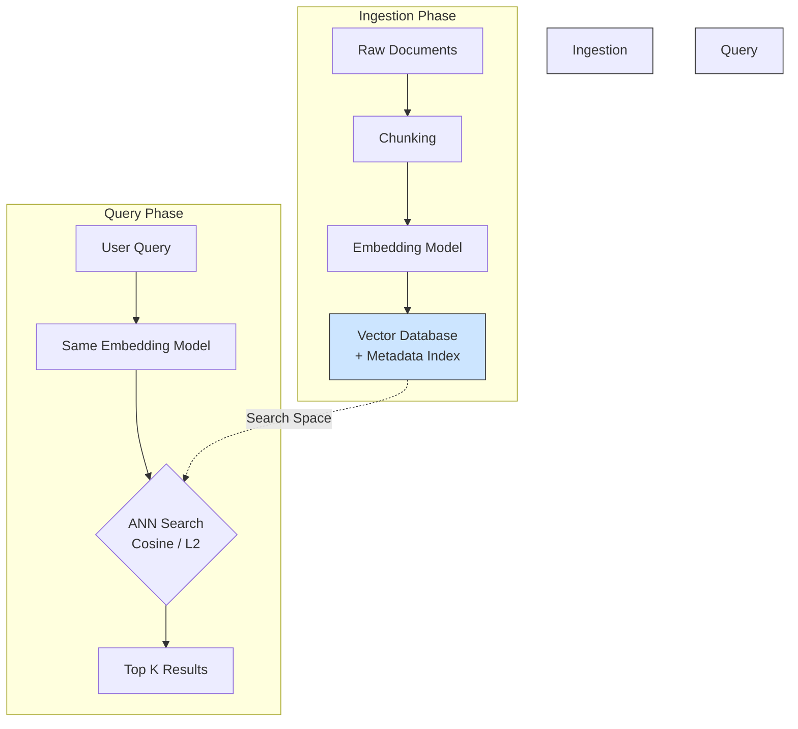

Trong kỷ nguyên của Trí tuệ nhân tạo tạo sinh (GenAI), các mô hình ngôn ngữ lớn ([LLM](/concepts/6-ai-ml/genai-ml/llm/)) giống như những bộ não siêu việt nhưng lại có một điểm yếu chí mạng: chúng không có trí nhớ dài hạn đối với dữ liệu nội bộ của doanh nghiệp. Để giải quyết vấn đề này, các kỹ sư dữ liệu đã xây dựng một "ngăn nhớ" chuyên biệt có khả năng lưu trữ và truy xuất tri thức một cách thông minh. Đó chính là **Cơ sở dữ liệu Vector (Vector Database / Vector Store)**. 

Khác với các cơ sở dữ liệu truyền thống vốn chỉ hiểu các phép so khớp từ khóa chính xác, Vector Database lưu trữ thông tin dưới dạng các tọa độ đa chiều (embeddings) và cho phép tìm kiếm dữ liệu dựa trên sự tương đồng về mặt ngữ nghĩa (semantic similarity).


## Vector Database là gì? Thấu hiểu dữ liệu qua lăng kính ngữ nghĩa

Về mặt định nghĩa, **Vector Database** (hay **Vector Store**) là một hệ thống cơ sở dữ liệu chuyên biệt được thiết kế để lưu trữ, lập chỉ mục ([indexing](/concepts/2-storage/database-storage/indexing/)) và truy vấn các **[Embeddings](/concepts/6-ai-ml/genai-ml/embedding-models/)** – những mảng số thực đa chiều biểu diễn các đặc trưng ngữ nghĩa của dữ liệu phi cấu trúc (như văn bản, hình ảnh, âm thanh).

Thay vì sử dụng các câu lệnh SQL với toán tử so sánh quen thuộc như `=` hay `LIKE`, Vector Database sử dụng các phép toán tính toán khoảng cách trong không gian hình học đa chiều (như Cosine Similarity, Euclidean Distance hay Dot Product) kết hợp với các thuật toán lập chỉ mục lân cận gần đúng (Approximate Nearest Neighbor - ANN) để tìm kiếm và trả về kết quả tương đồng nhất chỉ trong vài phần nghìn giây.

## Tại sao cơ sở dữ liệu truyền thống lại "chào thua" trước Vector?

Sự trỗi dậy của Deep Learning và các Mô hình Ngôn ngữ Lớn (LLM) kéo theo làn sóng dữ liệu phi cấu trúc bùng nổ. Điều này đặt ra ba thách thức lớn mà các hệ thống cơ sở dữ liệu cũ không thể đáp ứng:

1. **Sự bất lực của tìm kiếm từ khóa:** Các cơ sở dữ liệu quan hệ (PostgreSQL, MySQL) hay các engine tìm kiếm văn bản kinh điển (Elasticsearch với thuật toán BM25) rất mạnh về việc tìm từ khóa chính xác. Tuy nhiên, chúng hoàn toàn không hiểu được ngữ nghĩa của từ nếu không được cấu hình từ điển đồng nghĩa (synonyms) thủ công cực kỳ phức tạp. Ví dụ, câu lệnh SQL với toán tử `LIKE %cat%` sẽ bỏ sót các kết quả chứa từ "kitten" hay "feline".
2. **Thảm họa hiệu năng khi quy mô tăng lớn:** Để tìm ra vector giống nhất với một câu truy vấn trong số 1 triệu vector có sẵn, phương pháp đơn giản nhất là lấy vector đó đi so sánh khoảng cách lần lượt với toàn bộ 1 triệu vector còn lại (thuật toán k-Nearest Neighbors - KNN). Phép toán brute-force này có độ phức tạp $O(N)$, sẽ làm treo hệ thống ngay khi dữ liệu phình to.
3. **Thiếu các tính năng quản lý dữ liệu cấp doanh nghiệp:** Các thư viện tìm kiếm vector lưu trữ trực tiếp trên RAM (như FAISS của Meta) có tốc độ rất nhanh nhưng lại thiếu đi các tính năng cơ bản của một cơ sở dữ liệu thực thụ như: khả năng lưu trữ bền vững (persistence), hỗ trợ các giao dịch CRUD, phân cụm phân tán (distributed [clustering](/concepts/2-storage/database-storage/clustering/)) và quản lý quyền truy cập.

Vector Database ra đời để giải quyết trọn vẹn các bài toán này: mang đến khả năng tìm kiếm ngữ nghĩa siêu tốc đồng thời đảm bảo đầy đủ các tính năng quản trị dữ liệu chuẩn doanh nghiệp.

## Ba cột mốc nền tảng: Embeddings, Lập chỉ mục và Đo khoảng cách

Nguyên lý hoạt động của một Vector Database được xây dựng trên ba trụ cột chính:

* **Embeddings:** Là quá trình chuyển đổi dữ liệu thô (văn bản, hình ảnh, âm thanh) thành các chuỗi số thực đa chiều thông qua các mô hình Neural Network (ví dụ: mô hình `text-embedding-3-small` của OpenAI). Các thực thể có ý nghĩa tương đồng nhau trong thế giới thực sẽ được biểu diễn bằng các vector nằm gần nhau trong không gian toán học.
* **Vector Indexing (Lập chỉ mục):** Đây là bước xây dựng "bản đồ đường đi" trong không gian vector nhằm tăng tốc độ tìm kiếm. Thay vì quét tuần tự, hệ thống sử dụng các thuật toán đồ thị hoặc cây như **HNSW** (Hierarchical Navigable Small World) hay **IVF** (Inverted File Index). Bước lập chỉ mục này chấp nhận đánh đổi một lượng rất nhỏ độ chính xác (accuracy) để đổi lấy tốc độ truy vấn vượt trội (speed).
* **Distance Metrics (Đo lường khoảng cách):** Hàm toán học xác định mức độ gần gũi giữa hai vector:
  * *Cosine Similarity:* Đo góc giữa hai vector (phổ biến nhất cho xử lý ngôn ngữ tự nhiên NLP).
  * *L2 (Euclidean Distance):* Đo khoảng cách đường thẳng trực tiếp giữa hai điểm đầu mút vector.
  * *Dot Product (Tích vô hướng):* Tính toán kết hợp cả góc và độ lớn của vector (cực nhanh khi các vector đã được chuẩn hóa).

## Quy trình vận hành: Từ tài liệu thô đến kết quả tìm kiếm

Kiến trúc luồng dữ liệu (Data Flow) trong một hệ thống ứng dụng Vector Database điển hình:



### 1. Giai đoạn Ingestion (Nạp dữ liệu)
* Hệ thống đọc các tài liệu thô phi cấu trúc (ví dụ: các file PDF chính sách nội bộ).
* Dữ liệu được cắt nhỏ thành các đoạn văn bản ngắn ([Chunking](/concepts/6-ai-ml/genai-ml/chunking/)) để tránh loãng ngữ nghĩa.
* Các đoạn văn này được gửi qua [Embedding Model](/concepts/6-ai-ml/genai-ml/embedding-models/) để chuyển hóa thành các vector số thực.
* Hệ thống lưu trữ các vector này vào Vector Database kèm theo siêu dữ liệu (metadata như: tên file, ngày tạo, danh mục) và tiến hành xây dựng chỉ mục (Index).

### 2. Giai đoạn Query (Tìm kiếm truy vấn)
* Người dùng nhập câu hỏi vào ứng dụng.
* Câu hỏi được mã hóa thành vector bằng **chính Embedding Model** đã sử dụng ở giai đoạn nạp dữ liệu.
* Vector truy vấn được gửi đến Vector Database.
* Hệ thống chạy thuật toán tìm kiếm lân cận gần đúng (ANN) trên tệp chỉ mục và nhanh chóng trả về Top K đoạn văn bản có độ tương đồng ngữ nghĩa cao nhất.

## Ví dụ thực tế

### 1. Sử dụng pgvector trên PostgreSQL (SQL)

Chúng ta có thể lưu trữ và tìm kiếm vector trực tiếp trong cơ sở dữ liệu quan hệ PostgreSQL bằng cách sử dụng extension **pgvector**:

```sql
-- 1. Kích hoạt extension pgvector
CREATE EXTENSION vector;

-- 2. Tạo bảng lưu trữ tài liệu với cột vector 3 chiều
CREATE TABLE documents (
    id SERIAL PRIMARY KEY,
    content TEXT,
    embedding vector(3)
);

-- 3. Thêm tài liệu (Với giá trị vector đã được tính toán từ Client)
INSERT INTO documents (content, embedding) VALUES 
('Mèo thích ăn cá', '[0.1, 0.2, 0.8]'),
('Chó thích gặm xương', '[0.2, 0.1, 0.3]');

-- 4. Tìm kiếm ngữ nghĩa bằng khoảng cách Cosine (Ký hiệu <=> )
SELECT content, embedding 
FROM documents
ORDER BY embedding <=> '[0.11, 0.22, 0.79]' 
LIMIT 1;

-- Kết quả trả về sẽ là bản ghi: "Mèo thích ăn cá"
```

### 2. Tích hợp Pinecone trong Python

Đoạn code minh họa cách khởi tạo, nạp dữ liệu và thực hiện tìm kiếm ngữ nghĩa sử dụng Pinecone:

```python
from pinecone import Pinecone

# 1. Khởi tạo Pinecone client
pc = Pinecone(api_key="YOUR_API_KEY")
index = pc.Index("hr-documents")

# --- Giai đoạn Ingestion: Lưu trữ vector dữ liệu ---
index.upsert(
    vectors=[
        {
            "id": "doc_1", 
            "values": [0.12, -0.05, 0.88, ...], # Vector 1536 chiều
            "metadata": {"text": "Nhân viên được nghỉ phép năm 12 ngày có lương."}
        }
    ]
)

# --- Giai đoạn Query: Tìm kiếm tương đồng ---
# Vector hóa câu hỏi: "Tôi có bao nhiêu ngày nghỉ phép?"
query_vector = [0.10, -0.04, 0.85, ...]

response = index.query(
    vector=query_vector,
    top_k=1,
    include_metadata=True
)

# In kết quả tương đồng nhất tìm được
print(response['matches'][0]['metadata']['text'])
```

## Những Best Practices và cạm bẫy thiết kế

* **Sử dụng bộ lọc kết hợp (Hybrid Search):** Tìm kiếm vector rất mạnh về mặt ngữ nghĩa nhưng lại khá yếu khi cần lọc các điều kiện chính xác (ví dụ: tìm các bài viết giống chủ đề X *nhưng* bắt buộc phải xuất bản trong năm 2026). Hãy chọn các Vector DB hỗ trợ tính năng Hybrid Search để kết hợp lọc metadata trực tiếp trong quá trình duyệt đồ thị chỉ mục (Pre-filtering) nhằm nâng cao hiệu năng.
* **Đồng bộ hóa Embedding Model:** Chất lượng tìm kiếm của Vector Database phụ thuộc hoàn toàn vào Embedding Model. Bạn tuyệt đối không được phép thay đổi Embedding Model ở phía Client mà không chạy lại quy trình re-index toàn bộ cơ sở dữ liệu vector cũ. Dữ liệu được mã hóa bởi hai mô hình khác nhau sẽ không thể so sánh khoảng cách với nhau.
* **Chuẩn hóa Vector (L2 Normalization):** Nếu hệ thống của bạn sử dụng phép đo Cosine Similarity, hãy chuẩn hóa độ dài của tất cả các vector về mức 1 trước khi lưu trữ. Việc này giúp phép toán tính Cosine Similarity chuyển đổi thành phép tính Dot Product đơn giản hơn, tận dụng tối đa năng lực xử lý phần cứng để chạy nhanh hơn.
* **Tránh lạm dụng thư viện In-Memory trên Production:** Các thư viện như FAISS hay Chroma chạy cục bộ trong bộ nhớ RAM rất tiện lợi để viết code thử nghiệm (PoC) nhưng lại thiếu các tính năng chịu lỗi và sao lưu. Khi đưa hệ thống lên Production, hãy sử dụng các dịch vụ Vector Database chuyên nghiệp (như Pinecone, Milvus, Qdrant).
* **Lên lịch dọn dẹp (Vacuum) và tối ưu hóa:** Khi thực hiện xóa hoặc cập nhật, các Vector Database thường chỉ đánh dấu xóa logic. Cần lên lịch chạy các tiến trình tối ưu hóa đồ thị chỉ mục định kỳ để duy trì tốc độ đọc.

## Khi nào nên dùng

* **Nên dùng:**
  * Khi phát triển các ứng dụng dựa trên LLM và yêu cầu kỹ thuật [RAG (Retrieval-Augmented Generation)](/concepts/6-ai-ml/genai-ml/rag/) để tích hợp tài liệu nội bộ.
  * Khi xây dựng hệ thống gợi ý sản phẩm, tìm kiếm hình ảnh/video bằng văn bản (multimodal search).
  * Khi cần tìm kiếm tương đồng ngữ nghĩa trên các tệp dữ liệu phi cấu trúc lớn với tốc độ dưới 10ms.
* **Không nên dùng:**
  * Khi các câu hỏi truy vấn của bạn chỉ là lọc dữ liệu chính xác (ví dụ: tìm tất cả các đơn hàng có `status = 'COMPLETED'`).
  * Khi hệ thống có dung lượng bộ nhớ (RAM) hạn chế và không thể chi trả chi phí chạy các chỉ mục vector trong RAM.
  * Khi bạn chỉ cần một thư viện tìm kiếm vector cục bộ đơn giản cho tập dữ liệu nhỏ (dưới vài ngàn bản ghi), có thể dùng NumPy/FAISS trực tiếp trong RAM.

## Điểm mạnh và điểm yếu (Trade-offs)

### Điểm mạnh (Pros)
* **Hiểu ngữ nghĩa sâu sắc:** Vượt qua giới hạn tìm kiếm từ khóa truyền thống để nắm bắt ý định người dùng một cách chính xác.
* **Tốc độ phản hồi vượt trội:** Nhờ thuật toán lập chỉ mục lân cận gần đúng (ANN) như HNSW, giúp tìm kiếm hàng triệu vector trong vài mili-giây.
* **Hỗ trợ đa phương thức (Multimodal):** Cho phép kết hợp so sánh giữa văn bản, hình ảnh, âm thanh trong cùng một không gian vector.

### Điểm yếu (Cons)
* **Chi phí vận hành cao:** Yêu cầu lượng RAM lớn để giữ các chỉ mục vector (HNSW) hoạt động, làm tăng chi phí hạ tầng.
* **Khó khăn khi cập nhật dữ liệu:** Việc ghi, xóa, hoặc cập nhật dữ liệu đòi hỏi tính toán xây dựng lại đồ thị chỉ mục, gây độ trễ ghi nhất định.
* **Độ chính xác tương đối:** Thuật toán ANN đánh đổi một phần nhỏ độ chính xác để lấy tốc độ truy cập cực nhanh.
* **Khó giải thích (Explainability):** Các phép toán khoảng cách được thực thi trên mảng số thực hàng ngàn chiều rất khó để diễn dịch một cách trực quan cho con người hiểu tại sao kết quả A lại giống câu hỏi B hơn kết quả C.

## Trọng tâm ôn luyện phỏng vấn

### 1. Sự khác biệt cốt lõi giữa thuật toán KNN và ANN trong tìm kiếm vector là gì? Tại sao Vector Database lại chọn ANN?
* **Gợi ý trả lời**:
  * **KNN (k-Nearest Neighbors):** Là thuật toán tìm kiếm lân cận chính xác. Nó thực hiện so sánh khoảng cách từ vector truy vấn đến *từng vector một* trong toàn bộ cơ sở dữ liệu. Độ phức tạp là $O(N)$. Phương pháp này cho kết quả chính xác 100% nhưng cực kỳ chậm và bất khả thi khi dữ liệu vượt ngưỡng triệu dòng.
  * **ANN (Approximate Nearest Neighbor):** Là thuật toán tìm kiếm lân cận gần đúng. Nó sử dụng các cấu trúc dữ liệu đặc biệt như phân cụm (IVF) hoặc đồ thị (HNSW) để khoanh vùng nhanh và chỉ so sánh trong một nhóm nhỏ các vector có khả năng tương đồng cao nhất. Độ phức tạp giảm xuống mức logarit $O(\log N)$.
  * **Lý do chọn:** Trong thực tế, doanh nghiệp chấp nhận hy sinh 1-2% độ chính xác để đổi lấy tốc độ truy vấn nhanh gấp hàng ngàn lần và khả năng mở rộng hệ thống không giới hạn.

### 2. Thuật toán lập chỉ mục HNSW (Hierarchical Navigable Small World) hoạt động dựa trên cơ chế nào?
* **Gợi ý trả lời**:
  * HNSW hoạt động dựa trên sự kết hợp giữa hai ý tưởng: cấu trúc phân tầng (tương tự như cấu trúc Skip-list) và đồ thị thế giới nhỏ (Small World Graph). 
  * Các vector được liên kết với nhau tạo thành một đồ thị gồm nhiều tầng (layers). Tầng trên cùng có mật độ điểm rất thưa thớt, các điểm nằm cách xa nhau. Các tầng dưới có mật độ điểm dày đặc dần. 
  * Khi thực hiện tìm kiếm, thuật toán bắt đầu từ tầng trên cùng để nhảy nhanh qua các khoảng cách lớn đến khu vực gần đích nhất. Sau đó, nó hạ dần xuống các tầng dưới để tinh chỉnh đường đi và tìm ra các điểm lân cận gần nhất một cách cực kỳ nhanh chóng mà không cần phải quét qua toàn bộ các điểm trên đồ thị.

### 3. Hãy phân biệt cơ chế Pre-filtering và Post-filtering khi lọc dữ liệu kết hợp với Metadata trong Vector DB. Hệ thống hiện đại xử lý vấn đề này thế nào?
* **Gợi ý trả lời**:
  * **Post-filtering (Lọc sau):** Hệ thống thực hiện tìm kiếm vector bằng ANN để lấy ra Top K kết quả tương đồng nhất trước, sau đó mới áp dụng bộ lọc metadata để loại bỏ các bản ghi không thỏa mãn. Nhược điểm lớn của cách này là nếu điều kiện lọc quá khắt khe, toàn bộ Top K kết quả ban đầu có thể bị loại bỏ sạch, dẫn đến việc không trả về được kết quả nào cho người dùng.
  * **Pre-filtering (Lọc trước):** Hệ thống lọc sạch các bản ghi không thỏa mãn điều kiện metadata trước để tạo ra một tập dữ liệu con, sau đó mới thực hiện tìm kiếm vector trên tập con này. Nhược điểm là việc lọc trước làm phá vỡ cấu trúc liên kết của đồ thị chỉ mục ANN đã xây dựng từ trước, khiến hiệu năng tìm kiếm bị giảm mạnh.
  * **Giải pháp hiện đại:** Các Vector DB tiên tiến (như Milvus, Qdrant) áp dụng cơ chế **Single-stage filtering** (thực hiện lọc metadata trực tiếp trong quá trình duyệt qua các node trên đồ thị HNSW) kết hợp với bộ tối ưu hóa truy vấn (Query Optimizer) để lựa chọn chiến lược lọc tối ưu nhất dựa trên độ phân tán (cardinality) của dữ liệu.

### 4. Khi nào nên sử dụng PostgreSQL với extension `pgvector` và khi nào nên dùng các Vector DB chuyên dụng (như Qdrant, Milvus)?
* **Gợi ý trả lời**:
  * **Nên dùng `pgvector` trên PostgreSQL khi:** Quy mô dữ liệu ở mức vừa và nhỏ (dưới vài triệu vector). Việc này giúp tận dụng hệ thống cơ sở dữ liệu quan hệ có sẵn, đảm bảo tính nhất quán dữ liệu (ACID), đơn giản hóa kiến trúc hệ thống và thực hiện các câu lệnh JOIN kết hợp metadata (Hybrid Search) cực kỳ hiệu quả.
  * **Nên dùng Vector DB chuyên dụng khi:** Quy mô dữ liệu cực kỳ lớn (hàng chục đến hàng trăm triệu vector), yêu cầu số lượng truy vấn đồng thời cao (QPS lớn). Các Vector DB chuyên dụng được thiết kế tối ưu cho việc tính toán phân tán, quản lý bộ nhớ In-Memory chuyên sâu cho đồ thị HNSW, và hỗ trợ mở rộng độc lập giữa tầng tính toán (Compute) và tầng lưu trữ (Storage).

## Xem thêm các khái niệm liên quan
* [Tác nhân AI (AI Agent)](/concepts/6-ai-ml/genai-ml/ai-agent/)
* [Phân tách văn bản - Chunking and Chunking Strategy](/concepts/6-ai-ml/genai-ml/chunking/)
* [Cửa sổ ngữ cảnh - Context Window](/concepts/6-ai-ml/genai-ml/context-window/)

## Tài liệu tham khảo

* [AWS - What is a Vector Database?](https://aws.amazon.com/what-is/vector-database/)
* [Google Cloud - Vector Search Overview](https://cloud.google.com/vertex-ai/docs/vector-search/overview)
* [Azure Cosmos DB - Vector Database Documentation](https://azure.microsoft.com/en-us/products/cosmos-db/)
* [Confluent - Vector Database and Real-Time Data](https://www.confluent.io/blog/vector-database-real-time-data/)
* [Snowflake - Vector Database capabilities](https://www.snowflake.com/trending/vector-database/)
* [Databricks - Vector Search Glossary](https://www.databricks.com/glossary/vector-database)
* [Malkov & Yashunin - HNSW Paper](https://arxiv.org/abs/1603.09320)

## English Summary

A **Vector Database** (or **Vector Store**) is a specialized database system engineered to store, index, and query high-dimensional vector representations (embeddings) of unstructured data such as text, images, or audio. Unlike traditional relational databases that rely on exact keyword matching, vector databases utilize **Approximate Nearest Neighbor (ANN)** algorithms (like HNSW or IVF) and distance metrics (Cosine Similarity, L2) to perform rapid **semantic similarity searches**. This capability allows systems to find conceptually related information even if the exact terminology differs, making vector databases a foundational infrastructure component for Retrieval-Augmented Generation (RAG) applications, large language models (LLMs), and modern recommendation engines.