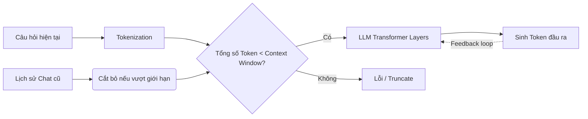

Khi tương tác với các mô hình ngôn ngữ lớn ([LLM](/concepts/6-ai-ml/genai-ml/llm/)) như GPT-4, Claude hay Llama, bạn có bao giờ thắc mắc làm thế nào AI có thể nhớ được những câu nói trước đó của bạn trong cuộc hội thoại? Hay tại sao khi bạn gửi một tài liệu quá dài, AI lại báo lỗi hoặc đột ngột quên mất yêu cầu ban đầu? Câu trả lời nằm ở khái niệm **Context Window (Cửa sổ ngữ cảnh)** – một thông số kỹ thuật quyết định trực tiếp đến dung lượng bộ nhớ tạm thời của mô hình.


## Context Window: "Bộ nhớ làm việc" giới hạn của các mô hình ngôn ngữ

Nói một cách đơn giản, **Context Window (Cửa sổ ngữ cảnh)** giống như "bộ nhớ ngắn hạn" hoặc "bộ nhớ làm việc" `(working memory)` của LLM. Nó đại diện cho số lượng đơn vị từ vựng `(tokens)` tối đa mà mô hình có thể tiếp nhận, xử lý và ghi nhớ cùng một lúc trong một lượt tương tác. 

Kích thước của cửa sổ này thường được các nhà phát triển đo lường bằng đơn vị Token (ví dụ: 4K, 8K, 128K, hoặc thậm chí lên tới 1M tokens). Mọi thông tin nằm ngoài phạm vi giới hạn của cửa sổ này sẽ hoàn toàn bị mô hình "bỏ qua" hoặc quên lãng.

## Tại sao Context Window lại không thể mở rộng vô hạn?

Các mô hình ngôn ngữ hiện đại dựa trên kiến trúc mạng nơ-ron Transformer hoạt động nhờ cơ chế **Tự chú ý (Self-Attention)**. Trong cơ chế này, để hiểu được ý nghĩa của một từ, mô hình bắt buộc phải so sánh và tính toán mức độ liên quan của từ đó với **tất cả** các từ còn lại trong chuỗi văn bản đầu vào.

Về mặt toán học, điều này dẫn đến độ phức tạp về mặt thời gian và không gian tính toán tăng theo cấp số nhân: **$O(N^2)$**, với N là số lượng tokens. 

Nếu các kỹ sư muốn tăng kích thước cửa sổ ngữ cảnh lên gấp đôi, yêu cầu về bộ nhớ đồ họa (VRAM của GPU) và năng lực tính toán của hệ thống sẽ tăng lên gấp bốn lần. Do giới hạn vật lý của phần cứng và chi phí huấn luyện cực kỳ đắt đỏ, mỗi mô hình luôn phải được cấu hình một giới hạn Context Window cố định khi đưa vào vận hành.

## Quy tắc hoạt động của Cửa sổ ngữ cảnh

* **Đặc tính ngắn hạn**: Context Window là bộ nhớ duy nhất mà mô hình có được khi sinh văn bản. LLM không có khả năng ghi nhớ dài hạn (ngoại trừ các tri thức đã được đóng băng trong các trọng số `weights` trong quá trình huấn luyện).
* **Đầu vào + Đầu ra = Tổng dung lượng**: Giới hạn của cửa sổ ngữ cảnh bao gồm cả phần câu hỏi của người dùng `(prompt)`, tài liệu đính kèm thêm (ví dụ qua [RAG](/concepts/6-ai-ml/genai-ml/rag/)) và cả câu trả lời mà AI sẽ viết ra. Nếu prompt đầu vào của bạn đã chiếm tới 99% giới hạn, mô hình sẽ chỉ còn 1% không gian để viết câu trả lời.
* **Cơ chế cửa sổ trượt (Sliding Window)**: Trong các ứng dụng chat, khi cuộc hội thoại kéo dài vượt quá giới hạn của cửa sổ, hệ thống sẽ tự động cắt bỏ các tin nhắn cũ nhất ở phía đầu để nhường chỗ cho các tin nhắn mới ở phía cuối.

## Đường đi của Token qua Cửa sổ ngữ cảnh

Quy trình xử lý một truy vấn qua cửa sổ ngữ cảnh diễn ra như sau:


1. Hệ thống thu thập câu hỏi hiện tại của bạn kết hợp với lịch sử chat gần nhất.
2. Toàn bộ văn bản này được chia nhỏ thành các Token.
3. Nếu tổng số token vượt quá giới hạn Context Window, hệ thống sẽ tự động cắt bớt `(truncate)` phần lịch sử cũ nhất.
4. Chuỗi token hợp lệ được gửi vào các lớp mạng Transformer của LLM.
5. Mô hình bắt đầu sinh từng token tiếp theo và liên tục cộng dồn chúng lại vào cửa sổ ngữ cảnh cho đến khi hoàn thành câu trả lời.

## Minh họa thực tế và cách kiểm soát Token bằng Python

Giả sử bạn đang làm việc với một mô hình có giới hạn Context Window là **4096 tokens**:
* **[System prompt](/concepts/6-ai-ml/genai-ml/system-prompt/) (chỉ thị hệ thống)**: 100 tokens.
* **Lịch sử chat**: 1500 tokens.
* **Tài liệu đính kèm thêm**: 2000 tokens.
* **Câu hỏi mới của bạn**: 496 tokens.
* **Tổng cộng đầu vào**: 4096 tokens.

Lúc này, không gian còn lại dành cho câu trả lời của LLM bằng đúng **0 token**. Khi chạy thực tế, mô hình sẽ đột ngột dừng lại `(cut off)` ngay từ chữ đầu tiên vì không còn chỗ để viết.

Để tránh gặp phải lỗi này, các kỹ sư thường sử dụng các thư viện đếm token trước khi gửi prompt đi. Dưới đây là ví dụ bằng Python sử dụng thư viện `tiktoken` của OpenAI:
```python
import tiktoken

# Khởi tạo bộ mã hóa (encoding) cho mô hình GPT-4
enc = tiktoken.encoding_for_model("gpt-4")

# Đoạn văn bản cần gửi
text = "Context Window là cửa sổ ngữ cảnh của LLM."

# Tiến hành đếm số lượng tokens
tokens = enc.encode(text)
print(f"Số lượng tokens thực tế: {len(tokens)}")

# Kiểm tra giới hạn và chủ động cắt bớt nếu vượt ngưỡng
MAX_TOKENS = 8192
if len(tokens) > MAX_TOKENS:
    tokens = tokens[:MAX_TOKENS]
    text = enc.decode(tokens)
```

## Cẩm nang tối ưu hóa Context Window (Best Practices)

* **Viết prompt ngắn gọn, cô đọng**: Hãy tối ưu hóa câu lệnh của bạn bằng cách loại bỏ các từ ngữ thừa thãi để nhường chỗ cho bối cảnh quan trọng hơn.
* **Áp dụng kiến trúc RAG**: Thay vì nhồi nhét toàn bộ cuốn sách hướng dẫn dài 1000 trang vào prompt, hãy sử dụng mô hình tìm kiếm ngữ nghĩa để trích xuất ra 3-5 đoạn văn liên quan nhất rồi mới đưa vào cửa sổ ngữ cảnh.
* **Lưu ý hiện tượng "Lost in the Middle"**: Các nghiên cứu thực nghiệm chỉ ra rằng LLM có xu hướng ghi nhớ cực tốt thông tin nằm ở phần đầu và phần cuối prompt, nhưng lại dễ bỏ qua hoặc "quên" các thông tin nằm ở giữa một ngữ cảnh quá dài. Hãy đặt các thông tin quan trọng nhất hoặc các chỉ thị cốt lõi ở đầu hoặc ở cuối prompt của bạn.

## Những sai lầm phổ biến khi làm việc với ngữ cảnh

* **Quên tính toán dung lượng đầu ra**: Rất nhiều người cố gắng nhét dữ liệu vào prompt cho đến khi vừa khít giới hạn của mô hình (ví dụ 8100/8192 tokens) và thắc mắc tại sao mô hình chỉ trả lời được vài từ ngắn ngủi rồi dừng lại. Hãy luôn để dành một khoảng trống hợp lý cho câu trả lời.
* **Thần thánh hóa các cửa sổ ngữ cảnh khổng lồ**: Việc ném toàn bộ mã nguồn dự án vào các mô hình có context window lớn (như 1 triệu tokens) mà không qua bộ lọc RAG thường mang lại hiệu quả kém. Nó sẽ làm tăng chi phí API lên gấp nhiều lần, tăng thời gian chờ phản hồi `(latency)` và làm mô hình dễ bị nhiễu thông tin dẫn đến ảo giác.

## Điểm mạnh và điểm yếu

### Điểm mạnh (Pros)
* **Xử lý tài liệu dài:** Cho phép phân tích trực tiếp các tài liệu lớn (sách, mã nguồn, báo cáo) mà không cần chia cắt nhỏ.
* **Học ngữ cảnh mạnh mẽ (In-context learning):** Hỗ trợ đưa nhiều ví dụ hướng dẫn để mô hình bắt chước trực tiếp mà không cần huấn luyện lại.

### Điểm yếu (Cons)
* **Chi phí cao:** Chi phí API tăng theo số lượng token xử lý, tăng đáng kể chi phí vận hành.
* **Thời gian phản hồi chậm:** Tăng thời gian chờ phản hồi đầu tiên (Time To First Token) khi ngữ cảnh quá lớn.
* **Lost in the Middle:** Dễ bỏ sót thông tin quan trọng nằm ở phần giữa của prompt dài.

## Khi nào nên dùng

* Khi cần tóm tắt nội dung nguyên bản của một cuốn sách hoặc file ghi âm cuộc họp dài.
* Thực hiện dịch thuật các văn bản dài yêu cầu tính liền mạch cao về mặt hành văn.
* Triển khai kỹ thuật Few-shot prompting cần đưa vào hàng chục ví dụ thực tế để mô hình bắt chước.

## Trọng tâm ôn luyện phỏng vấn

### 1. Tại sao độ phức tạp tính toán của cơ chế Self-Attention trong Transformer lại tăng theo bình phương $O(N^2)$ đối với kích thước cửa sổ ngữ cảnh N?
* **Mục đích câu hỏi**: Kiểm tra kiến thức toán học và hiểu biết sâu sắc về kiến trúc mạng Transformer của ứng viên.
* **Gợi ý trả lời**:
  * Trong cơ chế Self-Attention của Transformer, để biểu diễn ngữ nghĩa cho một token, mô hình phải tính toán trọng số liên quan (Attention Score) của token đó với tất cả các token khác trong chuỗi (thông qua phép nhân ma trận Query và Key).
  * Do đó, nếu chuỗi văn bản đầu vào có độ dài N tokens, chúng ta sẽ có một ma trận tương quan kích thước $N \times N$, tương đương với $N^2$ phép tính. Điều này khiến cho nhu cầu tính toán và bộ nhớ VRAM tăng theo cấp số nhân khi N tăng lên.

### 2. Hiện tượng "Lost in the Middle" là gì và làm cách nào để giảm thiểu ảnh hưởng của nó trong các ứng dụng RAG?
* **Mục đích câu hỏi**: Đánh giá kinh nghiệm thực chiến gỡ lỗi và tối ưu hóa ứng dụng LLM.
* **Gợi ý trả lời**:
  * *Lost in the Middle* là hiện tượng hiệu suất của LLM có dạng hình chữ U khi xử lý ngữ cảnh dài: mô hình nhớ rất tốt thông tin ở đầu và cuối prompt, nhưng lại dễ bỏ quên thông tin nằm ở đoạn giữa.
  * *Cách giảm thiểu*:
    1. Đặt các chỉ thị quan trọng nhất hoặc câu hỏi chính ở cuối prompt.
    2. Sử dụng RAG để lọc và chỉ giữ lại các đoạn thông tin thực sự giá trị, cắt giảm các phần rác để thu nhỏ tổng dung lượng ngữ cảnh.
    3. Áp dụng kỹ thuật Re-ranking sau khi tìm kiếm vector để chủ động xếp các tài liệu quan trọng nhất lên đầu và xuống cuối prompt trước khi gửi cho LLM.

## Khái niệm liên quan & Tài liệu tham khảo

**Khái niệm liên quan:**
* [Token (Đơn vị từ vựng)](/concepts/6-ai-ml/genai-ml/token/)
* [Tìm kiếm ngữ nghĩa (Semantic Search)](/concepts/6-ai-ml/genai-ml/semantic-search/)
* [Phân tách văn bản (Chunking)](/concepts/6-ai-ml/genai-ml/chunking/)

## Xem thêm các khái niệm liên quan
* [Tác nhân AI (AI Agent)](/concepts/6-ai-ml/genai-ml/ai-agent/)
* [Phân tách văn bản - Chunking and Chunking Strategy](/concepts/6-ai-ml/genai-ml/chunking/)
* [Các mô hình nhúng - Embedding Models](/concepts/6-ai-ml/genai-ml/embedding-models/)

## Tài liệu tham khảo

1. [Google Cloud - Vertex AI Model Generative AI Overview](https://cloud.google.com/vertex-ai/generative-ai/docs/learn/models)
2. [AWS - Amazon Bedrock Model Inference Parameters](https://docs.aws.amazon.com/bedrock/latest/userguide/model-parameters.html)
3. [Azure - Azure OpenAI Service Model Deployment Guide](https://learn.microsoft.com/en-us/azure/ai-services/openai/concepts/models)
4. [Databricks - Model Serving with Custom Models](https://docs.databricks.com/en/machine-learning/model-serving/index.html)
5. [Snowflake - Snowflake Cortex AI Large Language Models](https://docs.snowflake.com/en/user-guide/snowflake-cortex/llm-overview)

## English Summary

The Context Window is the maximum sequence length (measured in tokens) that a Large Language Model can process in a single invocation, encompassing both the input prompt and the generated output. It acts as the model's short-term working memory. Because the core Self-Attention mechanism of Transformers scales quadratically $O(N^2)$ with sequence length, context windows are strictly constrained by hardware limitations (GPU VRAM). Expanding context allows for rich in-context learning and analyzing long documents without fine-tuning, but comes at the cost of higher latency, increased API expenses, and susceptibility to the "Lost in the Middle" phenomenon, where information in the center of the prompt is easily ignored.