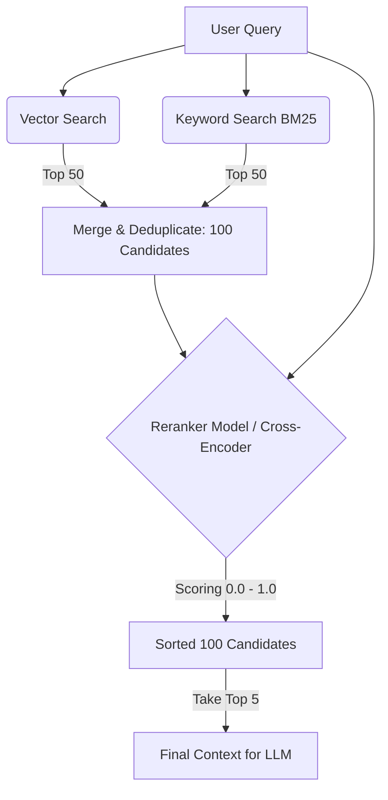
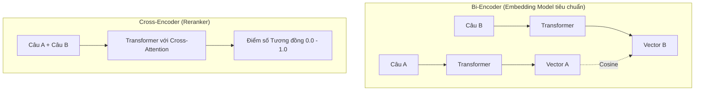

Khi xây dựng các hệ thống tìm kiếm thông tin lớn hoặc các ứng dụng [RAG](/concepts/6-ai-ml/genai-ml/rag/) (Retrieval-Augmented Generation), việc lấy được những tài liệu thực sự chất lượng và liên quan nhất để đưa vào prompt cho [LLM](/concepts/6-ai-ml/genai-ml/llm/) là yếu tố quyết định sự thành bại của giải pháp. Để giải quyết triệt để bài toán này, các kỹ sư thường áp dụng một kỹ thuật tối ưu hóa thứ hạng cực kỳ hiệu quả gọi là **Reranking (Tái sắp xếp kết quả)** sử dụng các mô hình **Reranker**.


## Bước lọc tinh tế cho hệ thống tìm kiếm: Reranking là gì?

Reranking là giai đoạn thứ hai trong quy trình truy xuất thông tin hiện đại. Nhiệm vụ của nó là nhận vào một danh sách các tài liệu ứng viên tiềm năng đã được lọc thô từ giai đoạn một (Retrieval), sau đó sử dụng một mô hình AI thông minh hơn (Reranker) để chấm điểm lại mức độ liên quan ngữ nghĩa chi tiết giữa câu hỏi của người dùng và từng tài liệu, từ đó sắp xếp lại thứ tự và đẩy những tài liệu thực sự hữu ích nhất lên trên cùng.

Thay vì tin tưởng tuyệt đối vào kết quả xếp hạng thô sơ ban đầu của [Cơ sở dữ liệu Vector](/concepts/6-ai-ml/genai-ml/vector-database/) (dựa trên khoảng cách vector) hay Keyword Search (dựa trên tần suất từ khóa BM25), hệ thống sẽ lấy Top-K tài liệu ứng viên (ví dụ: 100 tài liệu), truyền toàn bộ cặp `(Câu hỏi, Tài liệu)` vào mô hình Reranker để tính toán lại điểm số liên quan một cách chính xác nhất. Cuối cùng, hệ thống sắp xếp lại danh sách và chỉ lọc lấy Top-N tài liệu tốt nhất (ví dụ: 5 tài liệu) để hiển thị cho người dùng hoặc chuyển tiếp vào LLM làm ngữ cảnh.

## Tại sao hệ thống tìm kiếm cần đến hai giai đoạn?

Hệ thống tìm kiếm thông tin quy mô lớn luôn phải đối mặt với sự giằng co kinh điển giữa **Tốc độ (Speed)** và **Độ chính xác sâu (Deep Semantic Precision)**.

* Nếu chúng ta mang một mô hình ngôn ngữ lớn cực kỳ thông minh đi đọc chi tiết và so khớp từng tài liệu một trong số hàng triệu tài liệu trong database, hệ thống sẽ mất hàng giờ mới có thể đưa ra kết quả. Điều này hoàn toàn bất khả thi cho các ứng dụng thực tế.
* Ngược lại, nếu chỉ dùng Vector Database (Bi-Encoder) hoặc BM25, chúng ta sẽ có kết quả cực nhanh (chỉ mất khoảng 10ms). Thế nhưng, các hệ thống này phân tích ngữ nghĩa ở mức độ khá nông do hiện tượng nghẽn thông tin (Information Bottleneck) khi nén tài liệu dài thành một vector tĩnh cố định. Chúng có thể dễ dàng bị đánh lừa bởi các tài liệu chứa từ khóa trùng khớp nhưng ngữ cảnh thực tế lại hoàn toàn khác biệt.

Reranking ra đời như một **bước lọc tinh** để dung hòa cả hai yếu tố trên thông qua mô hình **Truy xuất hai giai đoạn (Two-stage Retrieval)**:



* **Giai đoạn 1 (Lọc thô - Retrieval)**: Sử dụng Vector DB hoặc Keyword Search để nhanh chóng quét và thu hẹp phạm vi dữ liệu, lấy ra khoảng 100 tài liệu ứng viên tiềm năng nhất (đảm bảo độ phủ - [Recall](/concepts/6-ai-ml/genai-ml/recall/) cao).
* **Giai đoạn 2 (Lọc tinh - Reranking)**: Sử dụng mô hình Reranker đọc kỹ 100 tài liệu đó để đánh giá ngữ nghĩa và sắp xếp lại thứ hạng (đảm bảo độ chính xác - Precision cao). Vì Reranker chỉ cần xử lý 100 tài liệu chứ không phải hàng triệu, tốc độ phản hồi của hệ thống vẫn được đảm bảo dưới 100ms.

## Bản chất học máy của Reranker: Cross-Encoder vs Bi-Encoder

Về mặt bản chất học máy, mô hình Reranker thường được xây dựng dựa trên kiến trúc **Cross-Encoder**. Sự khác biệt kỹ thuật giữa hai mô hình này quyết định vai trò của chúng trong hệ thống:



### 1. Bi-Encoder (Mô hình tạo Vector Embedding)
* **Quy trình**:
  - $Vector_A = BERT(Query)$
  - $Vector_B = BERT(Document)$
  - $Score = Cosine(Vector_A, Vector_B)$
* **Đặc tính**: Có thể tính toán và tạo chỉ mục ([indexing](/concepts/2-storage/database-storage/indexing/)) trước cho toàn bộ tài liệu (Offline Indexing). Tốc độ tìm kiếm cực nhanh nhưng câu hỏi và tài liệu không có cơ hội giao thoa trực tiếp trong quá trình mô hình phân tích ngữ nghĩa.

### 2. Cross-Encoder (Mô hình Reranker)
* **Quy trình**:
  - Khâu nối chuỗi: `Input = "Query [SEP] Document"`
  - Đi qua Transformer, lớp cơ chế Self-Attention tính toán sự liên kết chéo (Cross-Attention) giữa **mọi** từ trong Query với **mọi** từ trong Document.
  - Điểm số được đưa ra qua một lớp tuyến tính (Linear layer) ở cuối cùng: $Score = BERT(Query \oplus Document)$
* **Đặc tính**: Độ chính xác cực kỳ cao, nắm bắt được các sắc thái ngữ nghĩa tinh tế nhất. Tuy nhiên, tốc độ tính toán chậm và bắt buộc phải chạy lại toàn bộ mô hình cho mỗi cặp Query-Document lúc runtime.

## Ví dụ thực tế: Tích hợp API Cohere Rerank trong Python

Dưới đây là đoạn code Python minh họa cách gọi dịch vụ Cohere Rerank để sắp xếp lại danh sách các tài liệu thô được trả về từ database:

```python
import cohere

# Khởi tạo client kết nối với API của Cohere
co = cohere.Client('YOUR_API_KEY')

query = "Làm sao để cấu hình VPN?"
# Danh sách tài liệu thô lấy ra từ database (có thể lẫn lộn nhiều nội dung không liên quan trực tiếp)
docs = [
    "VPN là mạng riêng ảo giúp bảo mật đường truyền internet...",
    "Để cấu hình VPN trên hệ điều hành Windows, bạn vào Settings -> Network -> VPN...",
    "Bảng so sánh giá dịch vụ VPN mới nhất năm 2025..."
]

# Gọi API Rerank để sắp xếp và chọn lọc tài liệu
response = co.rerank(
    model='rerank-multilingual-v3.0',
    query=query,
    documents=docs,
    top_n=2 # Chỉ lấy ra 2 tài liệu tốt nhất
)

# Hiển thị kết quả sau khi đã tái sắp xếp
for idx, result in enumerate(response.results):
    print(f"Rank {idx+1} (Score: {result.relevance_score:.2f}): {docs[result.document_index]}")
```

## Những kinh nghiệm vàng để tối ưu hóa Reranking

* **Đặt số lượng ứng viên ($K$) hợp lý**: Đừng tham lam đưa quá nhiều tài liệu vào bước Reranking. Ngưỡng tối ưu cho $K$ thường nằm trong khoảng từ 50 đến 150 tài liệu. Việc bắt Reranker xử lý hàng nghìn tài liệu cho một truy vấn sẽ làm tăng đáng kể độ trễ phản hồi của hệ thống và tiêu tốn nhiều tài nguyên GPU.
* **Lựa chọn mô hình nhỏ gọn**: Do Reranker bắt buộc phải chạy tính toán trực tiếp (online) lúc người dùng đang đợi kết quả, bạn không nên sử dụng các mô hình quá lớn. Các Reranker hiệu quả nhất hiện nay thường có kích thước vừa phải từ 250M đến 2B tham số (như dòng mô hình `BGE-Reranker` hoặc `MiniLM`).
* **Tính toán theo lô (Batching)**: Khi gửi danh sách tài liệu sang Reranker, hãy gom chúng lại và gửi đi dưới dạng Batch thay vì dùng vòng lặp để gọi từng cặp một nhằm tối ưu hóa năng lực tính toán song song của GPU.
* **Kiểm soát độ dài văn bản (Max Length)**: Các mô hình Cross-Encoder luôn có giới hạn cứng về độ dài token đầu vào (thường là 512 hoặc 1024 tokens cho cả query và document gộp lại). Hãy cắt nhỏ tài liệu ([Chunking](/concepts/6-ai-ml/genai-ml/chunking/)) một cách hợp lý để tránh mất mát dữ kiện quan trọng ở phần đuôi tài liệu.

## Khi nào nên dùng

* **Nên dùng:**
  * Làm giai đoạn lọc thứ hai (Stage 2) trong các hệ thống tìm kiếm thông tin lớn hoặc các ứng dụng RAG doanh nghiệp yêu cầu độ chính xác cao.
  * Khi hệ thống tìm kiếm vector thường xuyên trả về các kết quả có độ tương đồng ngữ nghĩa ảo nhưng nội dung thực tế không giải quyết được vấn đề (ví dụ: các mã lỗi kỹ thuật cụ thể).
* **Không nên dùng:**
  * Làm công cụ tìm kiếm độc lập đầu tiên trên toàn bộ kho dữ liệu hàng triệu bản ghi (quá chậm và tốn kém).
  * Các tính năng tìm kiếm tức thì (như gợi ý từ khóa Autocomplete khi người dùng đang gõ phím) yêu cầu độ trễ phản hồi siêu thấp (dưới 20ms).

## Điểm mạnh và điểm yếu (Trade-offs)

### Điểm mạnh (Pros)
* **Độ chính xác vượt trội**: Loại bỏ hoàn toàn tình trạng mất mát thông tin ngữ nghĩa do quá trình nén vector gây ra ở các Vector DB.
* **Dễ tinh chỉnh (Fine-tuning)**: Việc huấn luyện lại một Reranker cho phù hợp với biệt ngữ của một ngành cụ thể đơn giản và dễ dàng hơn nhiều so với việc fine-tune mô hình sinh vector, vì hàm mất mát của nó chỉ là hàm phân loại nhị phân cơ bản.

### Điểm yếu (Cons)
* **Tăng độ trễ hệ thống (Latency)**: Do phải thực hiện tính toán online ngay khi nhận câu hỏi từ người dùng. Quá trình này thường cộng thêm khoảng 50ms đến 200ms vào tổng thời gian xử lý.
* **Không thể tạo chỉ mục trước**: Bạn bắt buộc phải tốn tài nguyên tính toán ngay lúc người dùng gửi truy vấn, không thể chuẩn bị trước như việc lưu vector tĩnh.

## Trọng tâm ôn luyện phỏng vấn

### 1. Tại sao chúng ta không áp dụng trực tiếp mô hình Reranker cho toàn bộ cơ sở dữ liệu ngay từ đầu để có độ chính xác cao nhất, thay vì phải qua bước lọc thô của Vector DB?
* **Gợi ý trả lời**: Vì mô hình Reranker (Cross-encoder) đòi hỏi chi phí tính toán cực kỳ lớn. Nó bắt buộc phải nhận vào đồng thời cả câu hỏi và tài liệu để chạy qua hàng tỷ tham số của mạng Transformer. Nếu database của bạn có 1 triệu tài liệu, việc chạy Reranker trực tiếp sẽ yêu cầu thực hiện suy luận mạng nơ-ron 1 triệu lần cho mỗi câu hỏi của người dùng, khiến thời gian phản hồi kéo dài hàng tiếng đồng hồ. 
  Do đó, thiết kế chuẩn là dùng Vector DB (Bi-encoder) để tính toán trước các vector tĩnh offline. Khi truy vấn, hệ thống chỉ cần thực hiện so khớp khoảng cách vector mất vài mili-giây để nhanh chóng lọc ra 100 ứng viên, rồi mới dùng Reranker để lọc tinh trên tập nhỏ này.

### 2. Sự khác biệt bản chất giữa Reranking và kiến trúc RAG (Retrieval-Augmented Generation) là gì?
* **Gợi ý trả lời**: RAG là một kiến trúc hệ thống tổng thể kết hợp giữa hai quá trình: Tìm kiếm thông tin liên quan (Retrieval) và Sử dụng LLM để sinh câu trả lời (Generation). Trong khi đó, Reranking chỉ là một bước tối ưu xếp hạng tài liệu nằm trong phần Retrieval của hệ thống RAG. Reranking đứng ở giữa giai đoạn lọc thô tài liệu và giai đoạn nạp ngữ cảnh vào prompt cho LLM. Bản thân Reranking không tạo ra nội dung mới, nó chỉ sắp xếp lại trật tự hiển thị của các tài liệu đã được tìm thấy.

### 3. Nếu Cross-Encoder quá chậm và tốn kém tài nguyên, còn Bi-Encoder lại có độ chính xác chưa tốt, liệu có kiến trúc trung gian nào giải quyết được bài toán này không?
* **Gợi ý trả lời**: Có, đó là kiến trúc **Late Interaction (Tương tác muộn)**, tiêu biểu là mô hình **ColBERT**.
  - Thay vì nén toàn bộ tài liệu thành một vector duy nhất giống như Bi-Encoder, ColBERT giữ lại các vector biểu diễn riêng biệt cho từng token trong tài liệu.
  - Khi có query gửi đến, hệ thống sẽ tính toán độ tương đồng tối đa (Max-Similarity) giữa từng vector token của câu hỏi với tất cả vector token của tài liệu, sau đó cộng tổng lại.
  - Kiến trúc lai này cho phép chúng ta tính toán và lưu trữ trước (offline) các vector token của tài liệu, đồng thời khi tìm kiếm online vẫn giữ được độ chính xác gần tương đương với mô hình Cross-Encoder nhưng với tốc độ nhanh hơn rất nhiều.

### 4. Chúng ta có thể sử dụng chính các LLM lớn (như GPT-4) đóng vai trò làm mô hình Reranker được không?
* **Gợi ý trả lời**: Hoàn toàn có thể (kỹ thuật LLM-as-a-Judge). Tuy nhiên, trong môi trường sản xuất (production), cách tiếp cận này rất ít khi được áp dụng do chi phí API cực kỳ đắt đỏ, tốn lượng lớn token, tốc độ phản hồi chậm và rủi ro LLM trả về sai định dạng kết quả khiến hệ thống không thể parse được. Thực tế, người ta thường sử dụng các mô hình Reranker chuyên dụng cỡ nhỏ (khoảng 200M đến 2B tham số) được huấn luyện riêng biệt bằng các hàm loss xếp hạng.

## Xem thêm các khái niệm liên quan
* [Tác nhân AI (AI Agent)](/concepts/6-ai-ml/genai-ml/ai-agent/)
* [Phân tách văn bản - Chunking and Chunking Strategy](/concepts/6-ai-ml/genai-ml/chunking/)
* [Cửa sổ ngữ cảnh - Context Window](/concepts/6-ai-ml/genai-ml/context-window/)

## Tài liệu tham khảo

* [AWS OpenSearch - Search Pipeline Reranking with Cohere](https://docs.aws.amazon.com/opensearch-service/latest/developerguide/search-pipeline-reranking.html)
* [Google Cloud - Use RAG and Search Re-ranking in Vertex AI](https://cloud.google.com/vertex-ai/docs/generative-ai/agent-engine/use-rag)
* [Azure AI Search - Semantic Search & Ranking](https://azure.microsoft.com/en-us/blog/introducing-semantic-search-in-azure-cognitive-search/)
* [Databricks - Document Ingestion and Managed Vector Search Reranking](https://docs.databricks.com/en/generative-ai/vector-search.html)
* [Cohere Rerank API Documentation](https://docs.cohere.com/docs/rerank)
* [ColBERT Paper - Efficient and Effective Late Interaction over BERT](https://arxiv.org/abs/2004.12832)

## English Summary

Reranking is the crucial second stage in modern two-stage Information Retrieval and RAG pipelines. After a fast but coarse first-stage retrieval (e.g., Vector Search or BM25) fetches a broad candidate pool of documents (high recall), a Reranker model (typically a Cross-Encoder) evaluates the exact query-document pairs to compute highly accurate semantic relevance scores. Unlike Bi-Encoders ([Embedding models](/concepts/6-ai-ml/genai-ml/embedding-models/)) that compress text independently into static vectors (creating an information bottleneck), Cross-Encoders concatenate the query and document into a single input, enabling Transformer self-attention to perform rich cross-attention between the two. While adding a slight latency overhead, Reranking dramatically improves the final context quality for downstream LLM generation.