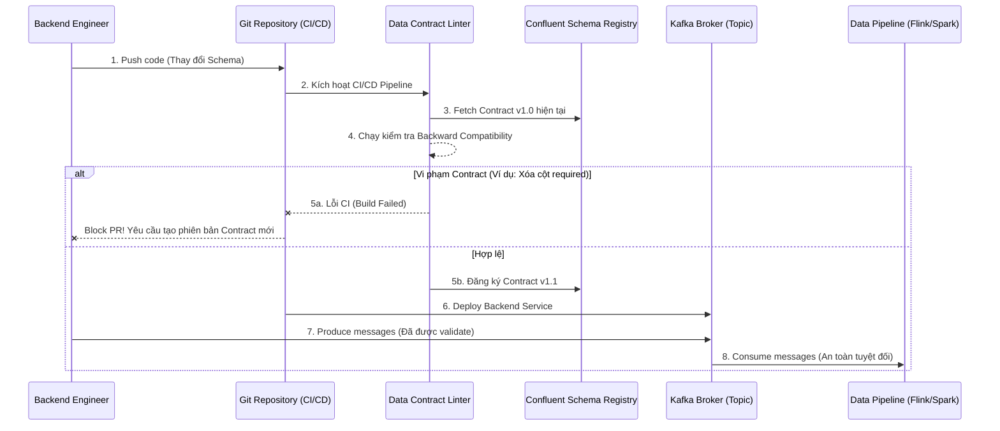

Hãy tưởng tượng một buổi sáng thứ Hai, bạn bước vào văn phòng và phát hiện toàn bộ pipeline xử lý doanh thu đã "đỏ lòm". Cụm Spark báo lỗi `OOMKilled` do lỗi Cartesian Explosion, hoặc tệ hơn là pipeline vẫn chạy xanh mượt mà (Silent Data Failures) nhưng dashboard lại trống trơn số liệu. 

Nguyên nhân gốc rễ? Cuối tuần qua, team Backend quyết định refactor mã nguồn và âm thầm đổi tên trường `user_id` thành `customer_id` trong payload JSON bắn vào Kafka. 

Trong kiến trúc phân tán (Microservices & Data Mesh), sự đứt gãy giao tiếp giữa **Data Producers** (Software Engineers) và **Data Consumers** (Data Engineers/Scientists) là nguyên nhân số một gây ra nợ kỹ thuật khổng lồ. Đây là lúc **Data Contract (Hợp đồng dữ liệu)** bước vào, không phải như một khái niệm sách giáo khoa, mà như một cơ chế **Hard-block tự động tại CI/CD**.

---

## 1. Kiến trúc Thực thi Vật lý (Physical Execution Architecture)

Data Contract không phải là một file PDF, một trang Confluence hay một lời hứa miệng mà Producer viết cho có. Ở quy mô Enterprise (như PayPal, Uber hay Netflix), nó là một Artifact kỹ thuật (Technical Artifact) được quản lý version, thực thi bằng CI/CD, và kiểm soát nghiêm ngặt qua Schema Registry.

### 1.1. Luồng Thực thi (Enforcement Flow)



Trong hệ thống này, Schema Registry đóng vai trò là "Single Source of Truth". Bất kỳ payload nào vi phạm hợp đồng đều bị chặn lại ở **mức độ Network/Client** (Produce time) hoặc đẩy vào Dead Letter Queue (DLQ), thay vì làm bẩn Data Lakehouse.

---

## 2. Implementation Thực Chiến (Show, Don't Tell)

Hãy xem xét một Data Contract định nghĩa cho event `user_onboarding`. Thay vì nói suông, chúng ta định nghĩa bằng YAML theo chuẩn Open Data Contract Standard (ODCS).

### 2.1. File Hợp đồng (`datacontract.yaml`)

```yaml
dataContractSpecification: 0.9.3
id: urn:datacontract:customer:user_onboarding
info:
  title: User Onboarding Events
  version: 1.2.0
  owner: backend-identity-team

servers:
  production:
    type: kafka
    host: kafka-cluster.prod.internal:9092
    topic: events.identity.user_onboarding

terms:
  usage: "Dữ liệu được dùng để phân tích funnel, cấm dùng PII cho ML training."
  limitations: "Độ trễ tối đa 500ms."

models:
  UserOnboarding:
    fields:
      event_id:
        type: string
        required: true
        description: "UUIDv4 của event, dùng làm Idempotency Key"
      user_id:
        type: string
        required: true
      email:
        type: string
        required: true
        pii: true
        pattern: "^[a-zA-Z0-9_.+-]+@[a-zA-Z0-9-]+\\.[a-zA-Z0-9-.]+$"
      age:
        type: integer
        required: false
        minimum: 13
        maximum: 120

# Khối Quality: Chặn rác từ nguồn
quality:
  type: SodaCL
  specification: |"
    checks for UserOnboarding:
      - missing_count(user_id) = 0
      - min(age) >= 13
```

### 2.2. CI/CD Hard-Block (GitHub Actions)

Làm sao để ép Backend Engineer phải tuân thủ? Cài đặt một GitHub Action chặn Pull Request nếu họ phá vỡ Contract:

```yaml
# .github/workflows/data_contract_check.yml
name: Data Contract Enforcement
on:
  pull_request:
    paths:
      - 'backend/schemas/**'

jobs:
  lint-and-diff:
    runs-on: ubuntu-latest
    steps:
      - uses: actions/checkout@v3
      - name: Install Data Contract CLI
        run: pip install datacontract-cli
      
      - name: Check Backward Compatibility
        run: "|
          # So sánh với schema trên Production Registry
          datacontract diff --server production datacontract.yaml
          
      - name: Lint Contract
        run: datacontract lint datacontract.yaml
```

Nếu một Dev tự ý xóa cột `email`, lệnh `datacontract diff` sẽ throw error `exit code 1` vì đây là **Breaking Change**. Pipeline lập tức đổi màu đỏ, PR không thể merge. Đây gọi là **Shift-Left Data Quality**.

### 2.3. Thực thi ở tầng Data Warehouse (dbt Contracts)

Khi dữ liệu đã vào Warehouse, ta dùng tính năng Model Contracts của dbt để chốt chặn tầng Transformation (Biến đổi):

```yaml
# dbt models/schema.yml
models:
  - name: stg_user_onboarding
    config:
      contract:
        enforced: true # Bắt buộc database tuân thủ schema lúc DDL (dbt run)
    columns:
      - name: user_id
        data_type: varchar
        constraints:
          - type: not_null
      - name: email
        data_type: varchar
```
Nếu Fivetran/Airbyte kéo về một kiểu dữ liệu sai (ví dụ `user_id` bị ép thành kiểu `int`), lệnh `dbt run` sẽ biên dịch ra câu lệnh `CREATE TABLE` kèm `CHECK CONSTRAINT` (trên Snowflake/BigQuery) và fail ngay lập tức, ngăn chặn việc overwrite bảng staging bằng dữ liệu rác.

---

## 3. Rủi ro Vận hành & Đánh Đổi Hệ Thống (Systemic Trade-offs)

Việc áp dụng Data Contract giải quyết được lỗi dữ liệu, nhưng cũng tạo ra những bài toán hệ thống cực kỳ hóc búa.

### 3.1. Tốc độ Phát triển (Speed) vs. Tính ổn định (Stability)
- **Trade-off:** Đưa Data Contract vào CI/CD tạo ra sự "khớp nối" chặt (Coupling) giữa Producer và Consumer. Backend không thể tự do đổi Schema như trước.
- **Rủi ro:** Gây thắt cổ chai (Bottleneck) cho Product Team. Mỗi khi cần thêm field, họ phải mở PR cho file `datacontract.yaml`, chờ Data Team review. 
- **Cách giải quyết:** Chỉ enforce Contract ở mức **Backward Compatible** (ví dụ: cho phép thêm cột mới thoải mái không cần review, nhưng cấm xóa/đổi kiểu dữ liệu cột cũ).

### 3.2. Semantic Drift (Trôi dạt Ngữ nghĩa)
- **Vấn đề:** Schema không đổi, Data type không đổi, nhưng *ý nghĩa nghiệp vụ* lại thay đổi. Ví dụ: cột `status=1` trước đây nghĩa là "Completed", nay Backend đổi logic ứng dụng thành `status=1` là "Pending". CI/CD Schema Check sẽ **pass xanh rờn**, nhưng báo cáo doanh thu sẽ sai lệch hoàn toàn (Silent Failure).
- **Cách giải quyết:** Data Contract phải có phần `quality` (như SodaCL ở trên) hoặc các bộ test phân phối dữ liệu (Distribution checks) chạy liên tục bằng Great Expectations / Monte Carlo để phát hiện Anomaly Detection.

### 3.3. Lũ lụt Dead Letter Queue (DLQ Flood)
- **Sự cố thực tế:** Khi Contract được enforce mạnh mẽ tại Kafka Producer/Consumer. Nếu có một batch data lỗi lớn bị đẩy vào mạng, Kafka Consumer (chạy Flink) sẽ reject và đẩy sang topic DLQ. Nếu không cấu hình TTL hoặc dung lượng lưu trữ cho DLQ đúng mức, nó sẽ phình to gây cạn kiệt Storage của broker (Disk Full), làm sập cả cluster Kafka.
- **Cách giải quyết:** Thiết lập Retention Policy nghiêm ngặt cho DLQ. Áp dụng Retry Pattern (có Exponential Backoff) thận trọng, vì Consumer liên tục retry xử lý "Poison Pill" có thể dẫn đến **Retry Storm** làm nghẽn CPU của cluster.

---

## 4. Tối ưu Chi phí (FinOps) & ROI của Data Contract

Đừng nhìn Data Contract như một công cụ kỹ thuật thuần túy, nó là một chiến lược FinOps (Financial Operations) cực kỳ hiệu quả. 

Hãy tưởng tượng một bảng `fact_transactions` khổng lồ trên BigQuery (100TB, partition theo ngày). Nếu dữ liệu rác lọt vào, bạn phát hiện ra sau 3 ngày. Bạn sẽ phải chạy lại (Backfill) pipeline cho 3 ngày đó. 
- **Tiền quét dữ liệu rác:** Rất Tốn kém.
- **Tiền Compute để MERGE/OVERWRITE lại 3 phân vùng:** Tốn thêm gấp đôi.
- **Tiền duy trì Snowflake Virtual Warehouse:** Chạy 100% CPU trong nhiều giờ để xử lý mớ bòng bong do Backend gây ra.

Việc chặn rác từ cửa ngõ (Shift-Left) với chi phí chạy một GitHub Action tốn vài xu, rẻ hơn hàng nghìn lần so với chi phí Compute trên Data Warehouse để dọn dẹp hậu quả.

---

## 5. Kết luận

Data Contract không phải là giải pháp "Silver Bullet" (Viên đạn bạc). Nó đòi hỏi một sự chuyển dịch văn hóa khổng lồ, nơi Software Engineers chấp nhận rằng dữ liệu họ tạo ra là một "Sản phẩm" [Data as a Product] và họ phải chịu trách nhiệm về hợp đồng giao diện của nó. 

Trong kỷ trúc Data Mesh hiện đại (như PayPal, Monzo hay Netflix đang áp dụng), Data Contract là xương sống duy nhất giữ cho các Domain hoạt động độc lập (Decentralized Autonomy) mà không biến Data Platform thành một bãi rác (Data Swamp).

## Nguồn Tham Khảo

1. **Netflix Tech Blog:** *Data Contracts in Ads Engineering* - Giải thích cách Netflix sử dụng schema registry để cô lập hệ thống ad serving với event processing.
2. **PayPal Engineering:** *Data Mesh Implementation* - Các bài toán đánh đổi giữa Domain Autonomy (Tự trị) và Interoperability (Khả năng tương tác) bằng Data Quanta.
3. **Databricks Blog:** *Data Contracts for AI Reliability* - Xây dựng Declarative pipelines và chặn đứng Schema Drift bằng `datacontract.yaml`.
4. **Open Data Contract Standard (ODCS):** Chuẩn hóa file YAML cho Data Contract tại [GitHub datacontract](https://github.com/datacontract].
5. **Designing Data-Intensive Applications** (Martin Kleppmann) - *Chương 4: Encoding and Evolution* (Sự tiến hóa và tương thích ngược của Data Schema).
