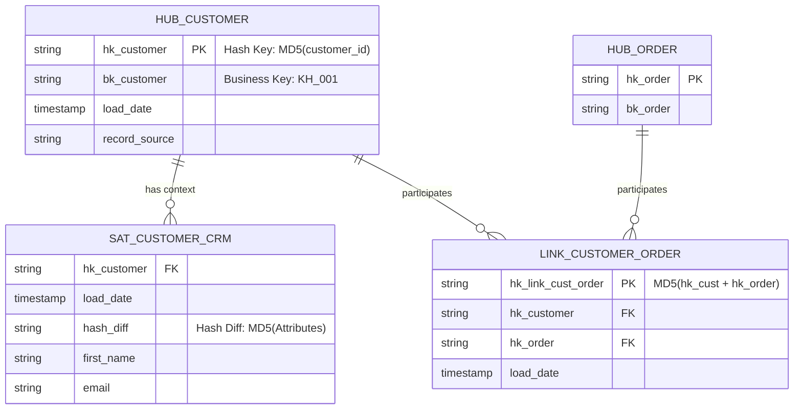
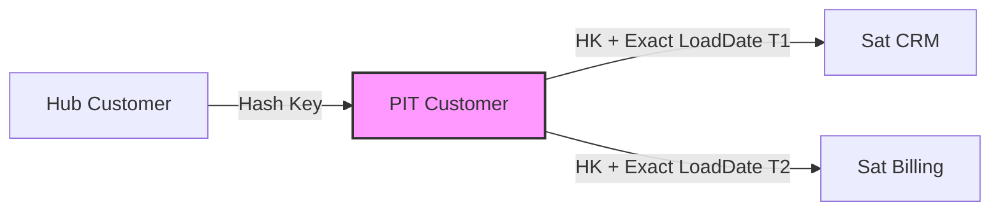

Data Vault 2.0 không phải là một "công thức chia bảng" lý thuyết mà bạn học trong trường đại học. Dưới lăng kính Data Engineering thực chiến, nó là một thiết kế **Decoupled Architecture** [Kiến trúc Tách rời] sinh ra để giải quyết Bottleneck của hệ thống tính toán phân tán (MPP Databases) khi phải đối phó với hàng trăm Source Systems có Schema thay đổi liên tục.

Khác với các hệ thống OLTP ưu tiên 3NF (Inmon) hay các Data Mart ưu tiên Star Schema (Kimball), Data Vault đánh đổi **Read Latency (Độ trễ khi Đọc)** lấy **Write Scalability (Khả năng mở rộng khi Ghi)** và **Agility (Tính linh hoạt)**.

---

## 1. Đánh đổi Hệ thống (Systemic Trade-offs): Inmon vs Kimball vs Data Vault

Khi scale một hệ thống Dữ liệu lên cỡ Petabytes với hàng trăm Data Pipelines (Kafka, Fivetran, CDC Debezium), các mô hình truyền thống bắt đầu bộc lộ sự gãy vỡ:

- **Inmon (3NF):** Tightly coupled (Khớp nối chặt). Mỗi khi hệ thống Upstream (như Salesforce CRM) thêm một trường mới, hoặc đổi Logic quan hệ, bạn phải thực hiện `CASCADE ALTER TABLE` và Backfill dữ liệu diện rộng. Chi phí *Refactor* hệ thống là khổng lồ.
- **Kimball (Star Schema):** Read-optimized (Tối ưu cho việc Đọc). Tuy nhiên, việc maintain Slowly Changing Dimensions (SCD Type 2) trên một bảng Dimension tỷ dòng là một thảm họa về Write (Nút thắt cổ chai tại việc sinh Surrogate Key). Quá trình Update/Merge liên tục gây ra *Z-Ordering Fragmentation* và *Micro-partitions Churn* nghiêm trọng (đặc biệt tốn kém trên Snowflake hoặc Databricks).
- **Data Vault 2.0:** Write-optimized (Tối ưu cho việc Ghi). Dữ liệu được nạp (Insert-Only) một cách phân tán, song song (Parallel Loading) 100% nhờ vào Hash Keys. Mọi sự thay đổi về cấu trúc Upstream chỉ đơn giản là tạo thêm một bảng Satellite mới (Additive Schema). Lịch sử dữ liệu được lưu trữ nguyên bản (Raw Vault) giúp quá trình Auditing hoàn hảo.

**Trade-off cốt lõi (Sự đánh đổi):** Data Vault đẩy toàn bộ độ phức tạp từ **Ingestion Phase (Write)** sang **Consumption Phase (Read)**. Việc Query trực tiếp các bảng Data Vault sẽ gây ra cơn ác mộng *Cartesian Explosion* (Khủng hoảng JOIN). Do đó, bạn luôn phải xây một tầng Business Vault/Information Mart phía trên để phục vụ Business User.

---

## 2. Giải phẫu Kiến trúc (Physical Execution Architecture)

Mô hình Data Vault được xây dựng xoay quanh 3 thực thể lõi: **Hubs, Links, và Satellites**.




### 2.1. Hubs (Core Business Concepts) & Cơ chế Hashing
Hubs là bộ xương của hệ thống. Nó chỉ chứa Business Keys (mã sinh ra bởi hệ thống nghiệp vụ như `user_id`, `order_sn`).

Trong Data Vault 2.0, **Tuyệt đối KHÔNG sử dụng Auto-increment Surrogate Keys** (như `IDENTITY`, `SEQUENCE` hay `SERIAL`). 
- **Lý do System Engineering:** Trong môi trường MPP (Massively Parallel Processing) như Spark hay AWS Redshift, việc tạo Sequence đòi hỏi Distributed Lock (khóa toàn cục). Nó bắt hàng trăm worker nodes phải "xếp hàng" chờ lấy ID, biến toàn bộ quá trình nạp dữ liệu phân tán thành tuần tự (Sequential Bottleneck).
- **Giải pháp:** Sử dụng **Hash Keys** (MD5 hoặc SHA-256) được băm trực tiếp từ Business Key. Các Worker Nodes có thể tính Hash độc lập trong bộ nhớ RAM mà không cần giao tiếp với Master Node, mở khóa Parallel Ingestion 100%.

### 2.2. Links (Transaction Networks)
Links đóng vai trò như các bảng Junction nhiều-nhiều (N:M). Chúng không bao giờ chứa thông tin trạng thái hay thuộc tính, chỉ chứa Hash Keys của các Hub mà chúng liên kết. Nhờ đó, bạn có thể dễ dàng map các quan hệ thay đổi mà không phải gỡ rối FK/PK rối rắm như mô hình 3NF. Nếu Business đổi luật từ 1-N sang N-N, cấu trúc Link vẫn không cần thay đổi!

### 2.3. Satellites (Khối Lịch Sử)
Satellites lưu trữ Payload (các thuộc tính mô tả). Để theo dõi thay đổi lịch sử (SCD Type 2), Data Vault 2.0 giới thiệu khái niệm `Hash_Diff` - mã băm của tất cả các cột thuộc tính.

Thay vì so sánh từng cột `if colA != colA_old or colB != colB_old...` (rất tốn CPU), Database Engine chỉ cần so sánh một cột `Hash_Diff` duy nhất.

#### Code Thực chiến: Nạp dữ liệu Satellite với Hash_Diff (Snowflake/Databricks SQL)

Dưới đây là kiến trúc mã SQL chuẩn để nạp dữ liệu Insert-Only vào Satellite. Không có lệnh `UPDATE` hay `MERGE`, không có khóa ghi (Write Lock):

```sql
-- Dùng dbt-vault (AutomateDV) hoặc chạy trực tiếp trên Databricks
INSERT INTO raw_vault.sat_customer_crm (
    hk_customer, 
    load_date, 
    hash_diff, 
    first_name, 
    email, 
    record_source
)
WITH incoming_data AS (
    -- 1. Tính toán Hash Key và Hash Diff trên tầng Staging
    SELECT 
        MD5(CAST(customer_id AS STRING)) AS hk_customer,
        CURRENT_TIMESTAMP() AS load_date,
        -- Hash_Diff để phát hiện sự thay đổi (CDC)
        MD5(CONCAT_WS('||', 
            COALESCE(first_name, ''), 
            COALESCE(email, '')
        )) AS hash_diff,
        first_name,
        email,
        'kafka_crm_cdc' AS record_source
    FROM staging.crm_customers
),
latest_active_records AS (
    -- 2. Lấy bản ghi mới nhất đang active trong Satellite
    SELECT hk_customer, hash_diff
    FROM raw_vault.sat_customer_crm
    QUALIFY ROW_NUMBER() OVER(PARTITION BY hk_customer ORDER BY load_date DESC) = 1
)
-- 3. Lọc: Chỉ INSERT khi Hash_Diff khác biệt (Dữ liệu thực sự thay đổi)
SELECT src.hk_customer, src.load_date, src.hash_diff, src.first_name, src.email, src.record_source
FROM incoming_data src
LEFT JOIN latest_active_records tgt 
    ON src.hk_customer = tgt.hk_customer
WHERE tgt.hash_diff IS NULL -- Khách hàng mới tinh
   OR tgt.hash_diff != src.hash_diff; -- Khách hàng cũ có update thuộc tính
```

---

## 3. Quản lý Cơ sở Hạ tầng Data Vault (Infrastructure as Code)

Để triển khai Data Vault, bạn cần tự động hóa việc tạo ra hàng trăm bảng. Đây là một đoạn mã Terraform mẫu để cấu hình một dbt project chạy AutomateDV (framework mã nguồn mở tốt nhất cho Data Vault):

```hcl
resource "dbt_cloud_job" "data_vault_daily_run" {
  project_id = var.dbt_project_id
  environment_id = var.dbt_env_id
  name = "Data Vault 2.0 Ingestion Pipeline"
  
  # Chạy dbt run cho toàn bộ folder raw_vault
  execute_steps = [
    "dbt run --select path:models/raw_vault/*"
  ]
  
  triggers = {
    github_webhook = false
    schedule       = true
  }
  
  # Cấu hình schedule chạy hàng ngày lúc nửa đêm
  schedule_days  = [0, 1, 2, 3, 4, 5, 6]
  schedule_type  = "time"
  schedule_hours = [0]
}
```

---

## 4. Rủi ro Vận hành & Troubleshooting (Operational Risks]

Sử dụng Data Vault mà không hiểu rõ Physical Execution Layer sẽ dẫn đến thảm họa về Compute Cost (FinOps) và System Performance.

### 4.1. Thảm họa "Cartesian Explosion" tại Business Vault
Như đã phân tích, Data Vault đẩy độ phức tạp vào khâu Read. Để cung cấp bảng Star Schema cho Tableau/PowerBI, bạn phải viết Query `JOIN` 1 Hub với 5-7 Satellites và Links. Mỗi Satellite lại có các mốc thời gian `load_date` khác nhau.

Việc JOIN trực tiếp bằng điều kiện bất đẳng thức (Range-Join) `t1.load_date >= t2.load_date AND t1.load_date < t3.load_date` sẽ buộc Optimizer của Database phải dùng **Nested Loop Join**. Điều này dẫn đến **OOMKilled** (Out of Memory) hoặc Disk Spill (tràn RAM xuống đĩa cứng) cực kỳ trầm trọng, làm sập cả Data Warehouse.

### 4.2. Giải pháp: Point-in-Time (PIT) Tables
PIT Tables là kỹ thuật "Equi-Join" hóa các bảng Satellites. PIT lưu sẵn Hash Keys và mốc `load_date` gần nhất của từng Satellite tại các Snapshot định kỳ (ví dụ: Snapshot mỗi ngày 1 lần). Thay vì dùng toán tử `>=`, ta có thể dùng toán tử `=` để JOIN, biến Nested Loop Join chậm chạp thành Hash Join siêu tốc.



*🚨 Incidents thực tế:* Tạo PIT table sai cách bằng cách `CROSS JOIN` bảng Hub với toàn bộ ngày trong `Date Dimension` sẽ tạo ra một bảng ma trận hàng nghìn tỷ dòng, đốt sạch Credit của Snowflake. Bạn bắt buộc phải dùng cấu trúc Incrementally Updated PIT kết hợp với Data Pruning.

### 4.3. Xung đột Băm [Hash Collisions]
Nhiều kỹ sư lo sợ hàm MD5 sinh ra Hash Collision. Thực tế, xác suất trùng lặp của MD5 là `1/2^128` - nghĩa là bạn phải sinh ra hàng tỷ tỷ bản ghi mỗi giây trong hàng nghìn năm mới bị trùng. Các hệ thống như Databricks và Snowflake tính toán MD5 cực kỳ nhanh (Hardware-accelerated). Tuy nhiên, nếu chính sách Security / Compliance của công ty cấm MD5, bạn phải nâng lên `SHA-256` (lưu ý: sẽ tốn CPU cycles hơn khoảng 20-30% khi Load data).

---

## 5. Khi nào tuyệt đối KHÔNG DÙNG Data Vault?

Đừng mù quáng áp dụng Data Vault 2.0 cho mọi dự án, nó có thể biến thành **Over-engineering độc hại**:
1. **Dữ liệu nhỏ, Nguồn dữ liệu tĩnh (Static Sources):** Nếu công ty bạn chỉ kéo dữ liệu từ 2 nguồn (PostgreSQL nội bộ và Google Analytics) mà không có hệ thống nào thay đổi cấu trúc, mô hình Kimball (Star Schema) kết hợp với dbt/SCD Type 2 snapshot là quá đủ. 
2. **Hệ thống Streaming Real-time thuần túy:** Data Vault truyền thống với hàng chục phép JOINs vật lý ở tầng Business Vault không phù hợp cho truy xuất Low-latency (cỡ millisecond).
3. **Không có Data Catalog & Automation Tool:** Viết tay hàng trăm câu SQL Hub/Sat/Link là hành động tự sát vận hành. Bạn bắt buộc phải dùng công cụ tự động sinh mã (Metadata-driven macro) như **dbtvault (AutomateDV)**, **WhereScape**, hoặc **VaultSpeed**.

---

## Nguồn Tham Khảo

1. **Dan Linstedt** - *Building a Scalable Data Warehouse with Data Vault 2.0*. (Tác giả khai sinh ra Data Vault).
2. [Databricks Engineering Blog: Data Vault 2.0 on Lakehouse][https://www.databricks.com/blog/2022/09/01/data-vault-modeling-databricks-lakehouse.html]
3. [Databricks Glossary: Data Vault][https://www.databricks.com/glossary/data-vault]
4. [AutomateDV (trước đây là dbtvault] Documentation](https://automate-dv.readthedocs.io/en/latest/)
