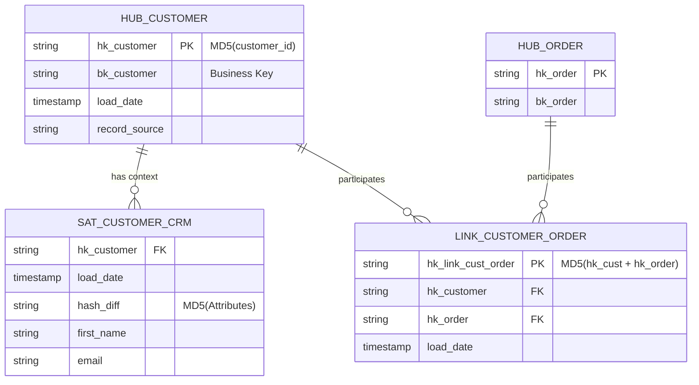
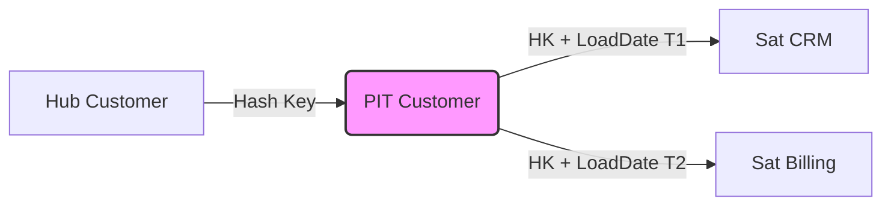

Data Vault 2.0 không phải là một "công thức chia bảng" lý thuyết. Dưới lăng kính Data Engineering thực chiến, nó là một thiết kế **Decoupled Architecture** sinh ra để giải quyết Bottleneck của hệ thống phân tán (MPP Databases) khi phải đối phó với hàng trăm Source Systems có Schema thay đổi liên tục.

Khác với các hệ thống OLTP ưu tiên 3NF (Inmon) hay các Data Mart ưu tiên Star Schema (Kimball), Data Vault đánh đổi **Read Latency** lấy **Write Scalability** và **Agility**.

---

## 1. Đánh đổi Hệ thống (Systemic Trade-offs): Inmon vs Kimball vs Data Vault

Khi scale một hệ thống lên cỡ Petabytes với hàng trăm Data Pipelines (Kafka, Fivetran, CDC), các mô hình truyền thống bắt đầu gãy vỡ:

- **Inmon (3NF):** Tightly coupled. Mỗi khi hệ thống Upstream (như CRM) thêm một trường mới, hoặc đổi Logic quan hệ, bạn phải thực hiện CASCADE ALTER TABLE và Backfill dữ liệu diện rộng. Chi phí *Refactor* là khổng lồ.
- **Kimball (Star Schema):** Read-optimized. Tuy nhiên, việc maintain Slowly Changing Dimensions (SCD Type 2) trên một bảng Dimension tỷ dòng là một thảm họa về Write (Bottleneck tại Surrogate Key generation). Update/Merge liên tục gây ra *Z-Ordering Fragmentation* và *Micro-partitions Churn* (như trong Snowflake).
- **Data Vault 2.0:** Write-optimized. Dữ liệu được nạp (Insert-Only) một cách phân tán, song song (Parallel Loading) 100% nhờ vào Hash Keys. Mọi sự thay đổi về cấu trúc Upstream chỉ đơn giản là tạo thêm một bảng Satellite mới (Additive Schema).

**Trade-off cốt lõi:** Data Vault đẩy toàn bộ độ phức tạp từ **Ingestion Phase (Write)** sang **Consumption Phase (Read)**. Truy vấn Data Vault trực tiếp sẽ gây ra *Cartesian Explosion* (Khủng hoảng JOIN).

---

## 2. Kiến trúc Thực thi Vật lý (Physical Execution)

Mô hình Data Vault được xây dựng xoay quanh 3 thực thể: **Hubs, Links, và Satellites**.




### 2.1. Hubs (Core Business Concepts) & Hashing Mechanism
Hubs chỉ chứa Business Keys (mã sinh ra bởi hệ thống nghiệp vụ như `user_id`, `order_sn`).

Trong Data Vault 2.0, **Tuyệt đối KHÔNG sử dụng Auto-increment Surrogate Keys** (như `IDENTITY` hay `SEQUENCE`). Lý do: Trong môi trường MPP (Massively Parallel Processing) như Spark hay Redshift, việc tạo Sequence đòi hỏi Distributed Lock (khóa toàn cục), biến toàn bộ quá trình nạp dữ liệu thành tuần tự (Sequential Bottleneck).

**Giải pháp:** Sử dụng **Hash Keys** (MD5 hoặc SHA-256) được tính toán trực tiếp từ Business Key. Các Worker Nodes có thể tính Hash độc lập trong bộ nhớ mà không cần giao tiếp với Master Node.

### 2.2. Links (Transaction Networks)
Links đóng vai trò như các bảng Junction nhiều-nhiều (N:M). Chúng không bao giờ chứa thông tin trạng thái, chỉ chứa Hash Keys của các Hub mà chúng liên kết. Nhờ đó, bạn có thể dễ dàng map các quan hệ thay đổi mà không phải gỡ rối FK/PK như mô hình 3NF.

### 2.3. Satellites (Slowly Changing Dimensions)
Satellites lưu trữ Payload (các thuộc tính mô tả). Để theo dõi thay đổi lịch sử (SCD Type 2), Data Vault 2.0 giới thiệu khái niệm `Hash_Diff` - mã băm của tất cả các cột thuộc tính.

Thay vì so sánh từng cột `if colA != colA_old or colB != colB_old...`, Database Engine chỉ cần so sánh một cột `Hash_Diff` duy nhất.

#### Code Thực chiến: Nạp dữ liệu Satellite với Hash_Diff (Snowflake/Databricks SQL)

Dưới đây là kiến trúc mã SQL chuẩn để nạp dữ liệu Insert-Only vào Satellite. Không có `UPDATE`, không có khóa ghi (Write Lock):

```sql
-- Dùng dbt-vault (AutomateDV) hoặc chạy trực tiếp trên Databricks
INSERT INTO raw_vault.sat_customer_crm (
    hk_customer, 
    load_date, 
    hash_diff, 
    first_name, 
    email, 
    record_source
)
WITH incoming_data AS (
    -- 1. Tính toán Hash Key và Hash Diff trên tầng Staging
    SELECT 
        MD5(CAST(customer_id AS STRING)) AS hk_customer,
        CURRENT_TIMESTAMP() AS load_date,
        -- Hash_Diff để phát hiện thay đổi (CDC)
        MD5(CONCAT_WS('||', 
            COALESCE(first_name, ''), 
            COALESCE(email, '')
        )) AS hash_diff,
        first_name,
        email,
        'kafka_crm_cdc' AS record_source
    FROM staging.crm_customers
),
latest_active_records AS (
    -- 2. Lấy bản ghi mới nhất đang active trong Satellite
    SELECT hk_customer, hash_diff
    FROM raw_vault.sat_customer_crm
    QUALIFY ROW_NUMBER() OVER(PARTITION BY hk_customer ORDER BY load_date DESC) = 1
)
-- 3. Chỉ INSERT khi Hash_Diff khác biệt (Dữ liệu thực sự thay đổi)
SELECT src.hk_customer, src.load_date, src.hash_diff, src.first_name, src.email, src.record_source
FROM incoming_data src
LEFT JOIN latest_active_records tgt 
    ON src.hk_customer = tgt.hk_customer
WHERE tgt.hash_diff IS NULL -- Khách hàng mới
   OR tgt.hash_diff != src.hash_diff; -- Khách hàng cũ có update thuộc tính
```

---

## 3. Rủi ro Vận hành & Troubleshooting (Operational Risks)

Sử dụng Data Vault mà không hiểu rõ Physical Layer sẽ dẫn đến thảm họa về Compute Cost (FinOps) và Performance.

### 3.1. Thảm họa "Cartesian Explosion" tại Business Vault
Như đã nói, Data Vault đẩy độ phức tạp vào khâu Read. Để cung cấp bảng Star Schema cho Tableau/PowerBI, bạn phải JOIN 1 Hub với 5-7 Satellites và Links. Mỗi Satellite lại có các mốc thời gian `load_date` khác nhau.

Việc JOIN trực tiếp bằng điều kiện bất đẳng thức (Range-Join) `t1.load_date >= t2.load_date AND t1.load_date < t3.load_date` sẽ buộc Optimizer của Database phải dùng **Nested Loop Join**, dẫn đến **OOMKilled** (Out of Memory) hoặc Spill-to-disk trầm trọng.

### 3.2. Giải pháp: Point-in-Time (PIT) Tables
PIT Tables là kỹ thuật "Equi-Join" hóa các bảng Satellites. PIT lưu sẵn Hash Keys và mốc `load_date` gần nhất của từng Satellite tại các Snapshot định kỳ (vd: mỗi ngày 1 lần).



*Incidents thực tế:* Tạo PIT table sai cách bằng cách `CROSS JOIN` bảng Hub với toàn bộ `Date Dimension` sẽ tạo ra bảng hàng nghìn tỷ dòng. Cần dùng cấu trúc Incrementally Updated PIT kết hợp với Data Pruning.

### 3.3. Xung đột Băm (Hash Collisions)
Nhiều kỹ sư lo sợ MD5 sinh ra Hash Collision. Thực tế, xác suất trùng lặp của MD5 là `1/2^128` - gần như bằng 0 với quy mô dữ liệu doanh nghiệp thông thường. Các hệ thống như Databricks và Snowflake tính toán MD5 cực kỳ nhanh ở mức phần cứng. Nếu chính sách Security của công ty cấm MD5, bạn phải nâng lên SHA-256 (tốn CPU cycles hơn khoảng 20-30%).

---

## 4. Khi nào tuyệt đối KHÔNG DÙNG Data Vault?

Đừng mù quáng áp dụng Data Vault cho mọi dự án:
1. **Dữ liệu nhỏ, nguồn dữ liệu tĩnh (Static Sources):** Nếu công ty bạn chỉ kéo dữ liệu từ 2 nguồn (PostgreSQL nội bộ và Google Analytics) mà không có hệ thống nào thay đổi cấu trúc, Kimball (Star Schema) kết hợp với dbt/SCD Type 2 snapshot là quá đủ. Data Vault ở đây là sự *Over-engineering* độc hại.
2. **Hệ thống Streaming Real-time thuần túy:** Data Vault truyền thống với nhiều JOINs vật lý ở Business Vault không phù hợp cho truy xuất millisecond-latency.
3. **Không có Data Catalog & Automation Tool:** Viết tay hàng trăm câu SQL Hub/Sat/Link là tự sát. Bạn bắt buộc phải dùng công cụ tự động sinh mã (Metadata-driven) như **dbtvault (AutomateDV)**, **WhereScape**, hoặc **VaultSpeed**.

---

## 5. Tổng kết

Data Vault 2.0 là nghệ thuật **Design for Failure and Change**. Bạn chấp nhận sự bùng nổ về số lượng bảng (Entity Sprawl) và chi phí Compute ở tầng Presentation (Marts) để đổi lấy một hệ thống lõi bất tử (Immutable Core) có khả năng nuốt trọn mọi thay đổi schema từ Upstream mà không cần một dòng lệnh `ALTER TABLE` hay `UPDATE` nào.

## Nguồn Tham Khảo
- [Building a Scalable Data Warehouse with Data Vault 2.0 - Dan Linstedt](https://datavaultalliance.com/)
- [Databricks Engineering Blog: Data Vault 2.0 on Lakehouse](https://www.databricks.com/blog/2022/09/01/data-vault-modeling-databricks-lakehouse.html)
- [AWS Architecture Blog - Automating Data Vault](https://aws.amazon.com/blogs/architecture/)
- [AutomateDV (dbtvault) Documentation](https://automate-dv.readthedocs.io/en/latest/)
