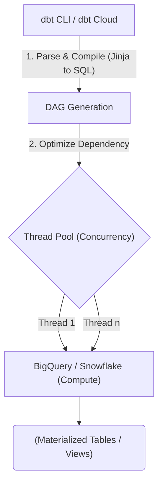

Thay vì coi **dbt (data build tool)** như một công cụ "render SQL" đơn thuần cho Data Analyst, ở quy mô Enterprise (như cách Uber hay Netflix vận hành hàng chục ngàn Data Pipelines), dbt thực chất là một **Macro-driven Execution Framework** (Khung thực thi điều khiển bằng Macro).

Nhiệm vụ cốt lõi của nó là phân tích cây phụ thuộc (Dependency Graph) thông qua hàm `ref()`, sau đó sử dụng engine Jinja để biên dịch (transpile) mã nguồn SQL pha trộn logic lập trình (Loops, If-Else) thành các câu lệnh DDL/DML tĩnh. Những câu lệnh này phải tương thích tuyệt đối với trình tối ưu hóa (Query Optimizer) của từng Cloud Data Warehouse (Snowflake, BigQuery, Databricks).

Bài viết này mổ xẻ dbt dưới góc nhìn **Kiến trúc Hệ thống (System Architecture)**: Cách hệ thống thực thi vật lý, Trade-offs của các chiến lược Materialization, kỹ thuật xử lý Late-Arriving Data, và cách tối ưu chi phí Cloud bằng Slim CI.

## 1. Kiến trúc Thực thi Vật lý (Physical Execution)

Khi một Data Engineer gõ lệnh `dbt run` trên Terminal, không có một dòng dữ liệu nào chạy qua máy tính của họ. dbt là một *Push-down Engine*. Nó đẩy toàn bộ gánh nặng tính toán xuống Data Warehouse. Một luồng xử lý (Workflow) diễn ra ngầm định gồm 3 pha cực kỳ chặt chẽ:



1. **Parsing (Phân tích cú pháp):** dbt đọc toàn bộ các file `.sql`, `.yml` (schema, project config). Nó trích xuất các Macro Jinja và các hàm `ref()`, `source()` để hiểu mối quan hệ cha-con giữa các bảng.
2. **Compilation (Biên dịch):** Engine Jinja thay thế các biến, chạy các vòng lặp `for`, và biên dịch mã nguồn thành mã SQL thuần túy (Raw SQL / Compiled SQL). Đồng thời nó vẽ ra một Đồ thị có hướng không tuần hoàn (DAG - Directed Acyclic Graph) để lên lịch chạy.
3. **Execution (Thực thi):** Dựa trên file `profiles.yml`, dbt khởi tạo các luồng đồng thời (Concurrency threads - cấu hình qua thông số `threads`). Nó bắn các câu lệnh SQL đã biên dịch xuống Data Warehouse thông qua kết nối JDBC/ODBC hoặc REST API. Warehouse sẽ nhận lệnh và tự thực hiện việc tính toán.

### Hiện tượng "OOMKilled" ở tầng Parsing
Ở các siêu kho lưu trữ (Mega Repos) với hàng chục nghìn models, bước Parsing tạo ra một cây AST (Abstract Syntax Tree) khổng lồ ngốn hàng chục GB RAM. Trên môi trường dbt Core chạy bằng Airflow/Kubernetes, Pod rất dễ bị hệ điều hành bắn hạ (JVM OOMKilled). 
- **Giải pháp Hệ thống:** Áp dụng kiến trúc **dbt Mesh**. Tách monolithic repo khổng lồ thành nhiều sub-projects độc lập thông qua `cross-project ref()`, giúp cô lập scope của parser và chia nhỏ vùng bùng nổ (Blast Radius).

## 2. Systemic Trade-offs: Bốn Chiến lược Materialization

Lựa chọn Materialization không chỉ quyết định cách dữ liệu hiển thị. Dưới góc độ Engineering, nó là bài toán đánh đổi giữa **Compute Cost (Chi phí CPU/Slot)**, **Storage Cost (Chi phí Ổ cứng)**, và **Query Latency (Độ trễ truy vấn)**.

### 2.1. View (`materialized='view'`)
Biên dịch thành lệnh `CREATE OR REPLACE VIEW`.
- **Bản chất vật lý:** Không lưu trữ dữ liệu (Zero Storage). Nó chỉ lưu một câu truy vấn ảo.
- **Trade-off:** Dữ liệu luôn Fresh nhất có thể. Nhưng Query Latency cực cao. Bất kỳ ai query vào View sẽ trigger việc Warehouse tính toán lại toàn bộ logic. Nếu logic chứa nhiều `JOIN` hoặc `Window Functions` phức tạp, nó sẽ làm sập (Crash) hoặc "Spill-to-disk" các hệ thống BI Dashboard kết nối vào nó.

### 2.2. Table [`materialized='table'`]
Biên dịch thành lệnh `CREATE OR REPLACE TABLE` (CTAS).
- **Bản chất vật lý:** Ghi dữ liệu tĩnh xuống ổ đĩa cứng của Warehouse.
- **Trade-off:** Truy vấn (Query) cực kỳ nhanh, tận dụng được bộ nhớ đệm (Cache). Đánh đổi lại: Tốn Storage, dữ liệu bị Stale (cũ) giữa các chu kỳ chạy dbt. Việc Drop và Recreate bảng mỗi đêm tiêu tốn một lượng Compute khổng lồ vô ích (đặc biệt nếu bảng có tỷ lệ thay đổi dữ liệu thấp).

### 2.3. Ephemeral (`materialized='ephemeral'`)
- **Bản chất vật lý:** Không bao giờ được tạo ra trên Database. dbt sẽ nhúng (Inject) mã SQL của model này vào bất kỳ model nào gọi nó dưới dạng Common Table Expression (CTE).
- **Rủi ro Hệ thống (Query Plan Explosion):** Là một con dao hai lưỡi cực kỳ nguy hiểm. Nếu model A (ephemeral) được gọi bởi 10 model khác, đoạn code khổng lồ của A sẽ bị copy-paste 10 lần vào 10 truy vấn. Query Optimizer của Warehouse (ví dụ Catalyst) sẽ phải vật lộn, tiêu tốn cực nhiều RAM để phân tích cú pháp một câu truy vấn dài cả vạn dòng. Chỉ nên dùng cho các snippet logic cực kỳ nhẹ.

### 2.4. Incremental: Nữ Hoàng của Dữ liệu lớn
Đối với các bảng Log/Clickstream hàng chục Terabyte, `Incremental` là bắt buộc. Thay vì chạy Full Refresh (CTAS), dbt biên dịch thành các lệnh `MERGE` hoặc `INSERT`.

**Sự cố Kinh điển: Late-Arriving Data (Dữ liệu đến trễ)**
Lỗi phổ biến nhất của Junior Data Engineer là dùng lệnh `max(timestamp)` thuần túy để filter dữ liệu Incremental.

```sql
-- ANTI-PATTERN: Lỗi mất dữ liệu khi dùng max(timestamp)
SELECT * FROM {{ ref('stg_events') }}

  WHERE event_time > (SELECT max(event_time) FROM {{ this }})

```
Nếu có sự kiện bị nghẽn mạng lúc 10:00, tới 11:30 mới chạy vào DB. Trong khi lúc 11:00 dbt đã chạy và set `max(event_time)` là 11:00. Sự kiện 10:00 sẽ **Vĩnh viễn bị bỏ sót** vì 10:00 < 11:00.

**Code Thực chiến (Lookback Window):** Bắt buộc phải giật lùi (Lookback) thời gian và dùng chiến lược `MERGE` để Upsert (đè dữ liệu), tránh Duplicate.

```sql
{{ config(
    materialized='incremental',
    unique_key='event_id', -- Bắt buộc có để dbt chuyển thành lệnh MERGE
    incremental_strategy='merge',
    cluster_by=['event_time']
] }}

SELECT * FROM {{ ref['stg_events'] }}

  -- Kỹ thuật Lookback 3 ngày để cover toàn bộ dữ liệu đến trễ
  WHERE event_time >= (
      SELECT date_sub(max(event_time), interval 3 day) 
      FROM {{ this }}
  )

```
*Lưu ý Vật lý:* Việc thực hiện `MERGE` (Upsert) liên tục trên Columnar Storage sẽ gây ra hiện tượng **Z-Ordering Fragmentation** (Phân mảnh Data files). Engineer bắt buộc phải chạy lệnh `OPTIMIZE` hoặc `VACUUM` định kỳ (hàng tuần) để dọn dẹp các tệp tin rác.

## 3. Macro Jinja: Sức mạnh của Lập trình trong SQL

Sức mạnh thực sự của dbt nằm ở Jinja. Nó biến SQL từ ngôn ngữ khai báo (Declarative) tĩnh thành một ngôn ngữ có tính cấu trúc, có thể chia sẻ (DRY - Don't Repeat Yourself).

```sql
-- Kỹ thuật dùng Macro để Generate Pivot Table động
-- Không cần phải viết tay hàng chục câu lệnh CASE WHEN


SELECT
    order_id,
    
    sum[case when payment_method = '{{ payment_method }}' then amount else 0 end] 
        as {{ payment_method }}_amount
    ,
    
FROM {{ ref('raw_payments') }}
GROUP BY 1
```

## 4. Quản lý State & CI/CD: Kiến trúc Slim CI

Ở quy mô Enterprise, khi Dev tạo một Pull Request (PR) sửa 1 file SQL, hệ thống CI/CD không thể (và không được phép) chạy lại toàn bộ DAG gồm 2000 models (Full Run) để test. Nó sẽ đốt cháy hàng ngàn đô la Compute Cost. Uber và dbt Labs giải quyết bài toán này bằng **Slim CI** thông qua **State Tracking**.

Khi chạy dbt ở môi trường Production, dbt sinh ra file `manifest.json` trong thư mục `target/`. File này là bản Snapshot của cây DAG Prod.
Khi Dev push code lên GitHub, GitHub Actions sẽ download file `manifest.json` của Prod về (đóng vai trò là *State*), và chạy lệnh so sánh ngầm:

```bash
# Code Thực chiến: Lệnh chạy Slim CI trong GitHub Actions
# Lệnh này so sánh code hiện tại với State của Prod
# Chỉ run những model bị thay đổi (state:modified)
# và các model con phụ thuộc trực tiếp vào nó (+)
dbt run --select state:modified+ --state ./prod-state-artifacts/ --defer
```

Tham số `--defer` là ma thuật của hệ thống. Nếu model con cần JOIN với một model cha không bị thay đổi, dbt sẽ không thèm build lại model cha ở môi trường Test, mà nó tự động `defer` (trỏ link) thẳng về bảng vật lý đang có trên môi trường Prod. Điều này tiết kiệm 99% thời gian và chi phí cho các luồng CI/CD.

## Nguồn Tham Khảo (References)

1. **dbt Labs Developer Hub:** [Incremental Models & Advanced Materializations](https://docs.getdbt.com/docs/build/incremental-models)
2. **dbt Labs Blog:** [The Modern Data Stack & dbt Mesh Architecture](https://docs.getdbt.com/blog/dbt-mesh-architecture)
3. **Databricks Engineering:** [Optimizing dbt on Databricks with Incremental Models](https://www.databricks.com/blog)
4. **AWS Architecture Blog:** [Modernizing Data Architectures with dbt and Amazon Redshift](https://aws.amazon.com/blogs/architecture/)
5. **Designing Data-Intensive Applications** - *Martin Kleppmann* (Lý thuyết về State, Idempotency và Late-arriving events).
