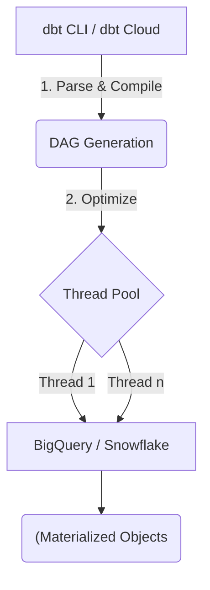

Thay vì coi dbt (data build tool) như một công cụ "render SQL" đơn thuần, ở quy mô Enterprise (như cách Uber hay Netflix vận hành các Data Pipelines), dbt là một compiler engine. Nhiệm vụ cốt lõi của nó là phân tích cây phụ thuộc (Dependency Graph) qua hàm `ref()`, sau đó chuyển đổi (transpile) mã Jinja-SQL thành các câu lệnh DDL/DML tương thích với trình tối ưu hóa (Query Optimizer) của từng Cloud Data Warehouse (Snowflake, BigQuery).

Bài viết này mổ xẻ dbt dưới góc nhìn **Kiến trúc Hệ thống (System Architecture)**: Cách DAG thực thi vật lý, Trade-offs của các Materializations, và cách quản lý State để tối ưu chi phí thông qua Slim CI.


## 1. Kiến trúc Thực thi Vật lý (Physical Execution)

Khi bạn gõ lệnh `dbt run`, một luồng xử lý (Workflow) diễn ra ngầm định gồm 3 pha:

1. **Parsing:** Đọc toàn bộ các file `.sql`, `dbt_project.yml`, `schema.yml`. Trích xuất các macro và hàm `ref()`, `source()`.
2. **Compilation:** Biên dịch mã Jinja thành mã SQL thuần túy (Raw SQL) mà Warehouse có thể hiểu được. Đồng thời xây dựng DAG (Directed Acyclic Graph).
3. **Execution:** Khởi tạo các thread đồng thời (Concurrency threads) để submit các câu lệnh SQL xuống Data Warehouse thông qua JDBC/ODBC hoặc REST API.



### Hiện tượng "Cartesian Explosion" ở tầng Parsing
Ở các repo lớn (Mega Repos) với hàng nghìn models, bước Parsing có thể ngốn rất nhiều RAM (JVM OOMKilled trên môi trường dbt Core/Airflow). Giải pháp là áp dụng **dbt Mesh**, tách monolithic repo thành nhiều sub-projects độc lập thông qua `cross-project ref()`, giúp cô lập scope của parser.

## 2. Systemic Trade-offs: Chiến lược Materialization

Lựa chọn Materialization không chỉ quyết định cách dữ liệu hiển thị, nó là bài toán đánh đổi giữa **Compute Cost (Chi phí CPU/Slot)** và **Storage Cost (Chi phí Lưu trữ)**.

### 2.1. View vs. Table
*   **View (`materialized='view'`):** Không tốn Storage, dữ liệu luôn Fresh.
    *   *Trade-off:* Query Latency cao. Bất kỳ ai query vào View sẽ trigger việc tính toán lại toàn bộ logic. Rất dễ dính "Spill-to-disk" trên Data Warehouse nếu logic chứa nhiều JOIN/Window Functions phức tạp.
*   **Table (`materialized='table'`):** Query cực nhanh, tận dụng được tính năng Cache của Data Warehouse.
    *   *Trade-off:* Tốn Storage, dữ liệu bị Stale (cũ) giữa các chu kỳ `dbt run`. Việc chạy `CREATE OR REPLACE TABLE` (CTAS) tốn kém Compute.

### 2.2. Incremental: Sự nguy hiểm của Data Drift

`Incremental` là vũ khí tối thượng cho những bảng dữ liệu khổng lồ (Event Logs, Clickstreams). Thay vì chạy Full Refresh, dbt chỉ `MERGE` / `INSERT` các bản ghi mới.

```sql
-- Cấu hình Incremental với chiến lược merge
{{ config(
    materialized='incremental',
    unique_key='event_id',
    incremental_strategy='merge',
    cluster_by=['event_date']
) }}

SELECT *
FROM {{ ref('stg_events') }}

  -- Chỉ lấy các event xuất hiện sau lần run cuối cùng
  WHERE event_timestamp > (SELECT max(event_timestamp) FROM {{ this }})

```

**Real-world Incident: The Late Arriving Data Problem**
Nếu bạn dùng `max(event_timestamp)` như code trên, hệ thống sẽ sập (hoặc mất dữ liệu ngầm) khi có sự kiện đến trễ (Late-arriving facts - do lỗi network hoặc thiết bị offline). Bản ghi trễ đó mang `timestamp` nhỏ hơn `max(timestamp)` hiện tại, do đó bị khối `WHERE` bỏ qua hoàn toàn.

**Giải pháp (Troubleshooting):** Sử dụng Lookback Window.

```sql

  -- Lùi lại 3 ngày để cover các bản ghi đến trễ
  WHERE event_timestamp >= current_date - interval '3 day'

```
*Lưu ý:* Việc dùng Lookback Window yêu cầu `unique_key` phải được thiết lập đúng để Data Warehouse thực hiện thao tác Upsert, tránh Duplicate. Việc Upsert một lượng lớn dữ liệu có thể dẫn đến hiện tượng **Z-Ordering Fragmentation** (Phân mảnh Data files trên Databricks/Snowflake), yêu cầu bạn phải chạy lệnh `OPTIMIZE` định kỳ.

### 2.3. Ephemeral Models: Con dao hai lưỡi
`materialized='ephemeral'` nhúng model của bạn vào model gọi nó như một Common Table Expression (CTE).
*   **Ưu điểm:** Giữ Data Warehouse gọn gàng (không rác).
*   **Rủi ro:** Gây **Query Plan Explosion**. Nếu model A được định nghĩa là Ephemeral và được gọi ở 5 model khác nhau, mã SQL của A sẽ bị compile và lặp lại 5 lần. Query Optimizer của Warehouse (ví dụ Catalyst trên Databricks) sẽ phải vật lộn để tối ưu hóa một câu query khổng lồ, thường dẫn đến Crash do hết bộ nhớ biên dịch. Chỉ dùng Ephemeral cho các snippet logic cực kỳ nhẹ.

## 3. Quản lý State & CI/CD: Slim CI

Ở quy mô Enterprise, một nhánh Pull Request (PR) không thể (và không được phép) chạy lại toàn bộ DAG (Full Run). Netflix và Uber tối ưu chi phí bằng cơ chế **State Tracking** (Theo dõi trạng thái) của dbt.

Khi chạy dbt ở Prod, hệ thống sẽ sinh ra một thư mục `target/` chứa file `manifest.json`. File này là bản Snapshot của DAG.
Khi dev tạo PR mới, CI/CD pipeline (GitHub Actions/GitLab) sẽ tải `manifest.json` của Prod về (gọi là *State*), sau đó chạy:

```bash
# Lệnh chạy Slim CI: Chỉ run những model bị thay đổi (state:modified)
# và các model con phụ thuộc vào nó (+)
dbt run --select state:modified+ --state ./path-to-prod-state/
```

**Đánh đổi (Trade-off) của Slim CI:**
*   Phức tạp hóa hệ thống CI/CD (Phải có cơ chế tải và quản lý State Artifacts).
*   Bắt buộc môi trường Staging/CI phải trỏ về cùng Dataset/Schema với Prod, hoặc sử dụng `defer` (truy vấn ngược về Prod đối với các bảng không thay đổi) để tiết kiệm thời gian.

## 4. Testing & Data Quality: Tại sao Generic Tests là không đủ?

Các `generic tests` (`not_null`, `unique`) của dbt rất tốt nhưng nông (shallow). Trong hệ thống lớn, khi Data Transformation kéo dài qua hàng chục tầng, lỗi nghiệp vụ (Business Logic Error) mới là kẻ thù số 1.

Thay vì chỉ dựa vào Generic Tests, Data Engineers phải viết **Singular Tests** (Custom SQL) để kiểm soát các ràng buộc miền (Domain Constraints):

```sql
-- tests/assert_revenue_is_positive.sql
-- Singular Test: Báo lỗi nếu Doanh thu bị âm (do lỗi logic join hoặc bù trừ sai)
SELECT
    order_id,
    sum(gross_revenue) as total_revenue
FROM {{ ref('fct_orders') }}
GROUP BY 1
HAVING sum(gross_revenue) < 0
```

## Nguồn Tham Khảo (References)

1. **dbt Labs Blog:** [The Modern Data Stack & dbt Mesh](https://docs.getdbt.com/blog/dbt-mesh-architecture)
2. **Databricks Engineering:** [Optimizing dbt on Databricks with Incremental Models](https://www.databricks.com/blog)
3. **AWS Architecture Blog:** [Modernizing Data Architectures with dbt and Amazon Redshift](https://aws.amazon.com/blogs/architecture/)
4. **Designing Data-Intensive Applications** - *Martin Kleppmann* (Chương 3: Storage and Retrieval - Giải thích về cơ chế Write-ahead logs và Incremental updates).
