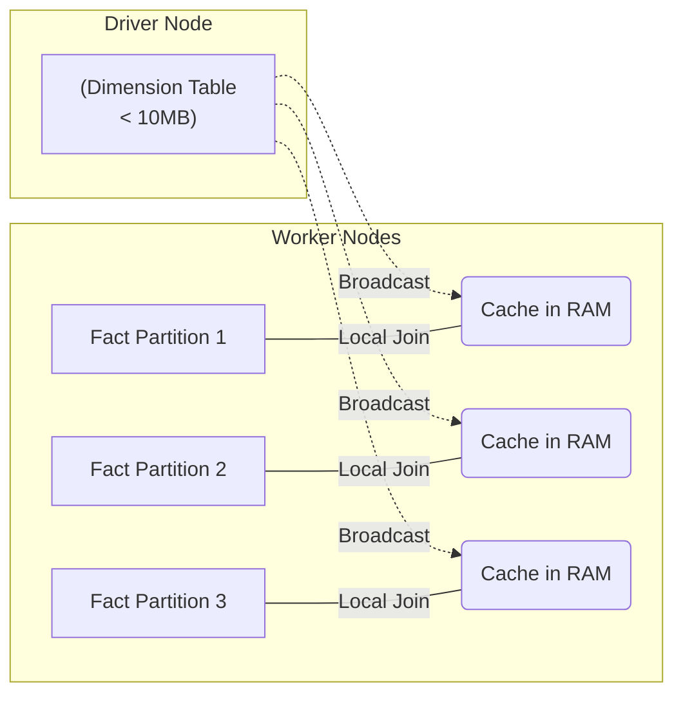

Nếu bạn mở một bảng sự kiện (Fact Table) và chỉ thấy những con số như `customer_id = 992` hay `product_id = 811`, dữ liệu đó hoàn toàn vô nghĩa đối với bộ phận kinh doanh. Để cung cấp ngữ cảnh (Who, What, Where, When), chúng ta cần **Dimension Table (Bảng chiều)**. 

Tuy nhiên, dưới góc nhìn của một Data Engineer, Dimension Table không chỉ dừng lại ở các định nghĩa lý thuyết. Ở quy mô lớn, cách bạn thiết kế Surrogate Keys, quản lý lịch sử thay đổi (SCD), và tối ưu hóa Physical Execution (như Broadcast Joins) sẽ quyết định hệ thống của bạn sống sót hay sập vì OOM (Out Of Memory).

---

## 1. Bản chất Kiến trúc của Dimension Table (Engineering Perspective)

Khác với các chuẩn thiết kế CSDL OLTP (chuẩn 3NF), Dimension Table trong Data Warehouse được cố tình **Denormalize (Phi chuẩn hóa)** thành các bảng rất rộng (Wide) và phẳng (Flat).

* **Rộng (Wide) & Nông (Shallow):** Một Dimension Table có thể chứa tới hàng trăm cột (thuộc tính) kiểu chuỗi (String/Varchar) dùng để group, filter. Bảng thường có số lượng row nhỏ (từ vài nghìn đến vài triệu) so với hàng tỷ row của Fact Table.
* **Tối ưu Hóa I/O:** Trong các columnar database (như Parquet, Snowflake, BigQuery), việc tạo các bảng rộng không tốn kém tài nguyên đọc vì query engine chỉ quét (scan) các cột được chỉ định trong câu lệnh `SELECT`.

### Surrogate Keys (Khóa Nhân Tạo) trong Hệ thống Phân tán
Lý thuyết nói rằng Dimension Table nên dùng Surrogate Key (Thường là Auto-increment Integer) để thay thế Natural Key (Ví dụ: `CMND`, `Mã NV`) nhằm tối ưu join và xử lý SCD. Tuy nhiên, trong môi trường tính toán phân tán (Distributed Computing) như Spark hay Snowflake:

* **Auto-increment Integer Bottleneck:** Việc sinh ra một chuỗi số tuần tự (Monotonically increasing ID) trên một cluster nhiều node đòi hỏi phải có một "Coordinator Lock" hoặc gửi dữ liệu về một node duy nhất, gây thắt cổ chai cực lớn.
* **Giải pháp Thực chiến:** Các hệ thống hiện đại ưu tiên sử dụng hàm Hash (như `md5()`, `sha256()`, `farm_fingerprint()`) băm từ Natural Key (và có thể cả Timestamp) để tạo Surrogate Key tĩnh (Deterministic), cho phép các worker nodes tự do sinh key song song mà không cần giao tiếp với nhau.

---

## 2. Xử lý Lịch sử với SCD Type 2 (Slowly Changing Dimension Type 2)

Dữ liệu trong bảng chiều sẽ thay đổi (Ví dụ: Khách hàng chuyển nhà). **SCD Type 2** là chuẩn công nghiệp để lưu trữ toàn bộ lịch sử biến động bằng cách tạo ra một record mới (Row proliferation) thay vì ghi đè (Overwrite - Type 1).

### 2.1. Cấu trúc Thực tế
Một bảng SCD Type 2 luôn cần 4 cột metadata tối thiểu:
1. `surrogate_key` (Primary Key - Hash hoặc UUID).
2. `natural_key` (Business Key từ hệ thống gốc).
3. `valid_from` (Timestamp bắt đầu có hiệu lực).
4. `valid_to` (Timestamp kết thúc hiệu lực - thường set bằng `9999-12-31` cho record hiện tại).
5. `is_current` (Boolean flag để query nhanh trạng thái hiện tại).

### 2.2. Pipeline Xử lý SCD Type 2 (SCD2 Merge Architecture)

Việc cập nhật SCD2 không dùng `UPDATE` hay `INSERT` rời rạc mà sử dụng lệnh `MERGE` (Upsert) để đảm bảo tính ACID và nguyên vẹn dữ liệu.

```mermaid
flowchart TD
    S["(Source DB)"] -->|CDC("Debezium")| K["Kafka"]
    K -->|Spark Structured Streaming| STG["Staging Table("Delta/Iceberg")"]
    STG -->|MERGE INTO| DIM["(SCD Type 2 Dimension)"]
    
    DIM -.->|Expired Record| D1("Update valid_to = now("), is_current = false)
    DIM -.->|New Record| D2("Insert valid_from = now("), is_current = true)
```

**Code Thực chiến: `SQL MERGE` trên Delta Lake/Snowflake**

Tuyệt đối không dùng logic vòng lặp để cập nhật. Dưới đây là kiến trúc thực thi chuẩn để Merge SCD2 bằng một câu lệnh duy nhất:

```sql
-- Bước 1: MERGE để đóng (Expire) các record cũ bị thay đổi
MERGE INTO dim_customer target
USING staging_customer source
ON target.natural_key = source.natural_key 
   AND target.is_current = TRUE
WHEN MATCHED AND (target.address <> source.address) THEN
  UPDATE SET 
    valid_to = CURRENT_TIMESTAMP(),
    is_current = FALSE;

-- Bước 2: INSERT các record mới (Bao gồm Khách hàng mới & Phiên bản mới của KH cũ)
INSERT INTO dim_customer (
  surrogate_key, natural_key, address, valid_from, valid_to, is_current
)
SELECT 
  MD5(CONCAT(source.natural_key, CURRENT_TIMESTAMP())), -- Deterministic Hash Key
  source.natural_key, 
  source.address, 
  CURRENT_TIMESTAMP(), 
  '9999-12-31'::TIMESTAMP, 
  TRUE
FROM staging_customer source
LEFT JOIN dim_customer current_dim 
  ON source.natural_key = current_dim.natural_key 
  AND current_dim.is_current = TRUE
WHERE current_dim.natural_key IS NULL -- Record chưa tồn tại bản current
   OR (current_dim.address <> source.address); -- Hoặc bị thay đổi
```

---

## 3. Kiến trúc Thực thi Vật lý (Physical Execution)

Khi join Fact Table (Hàng tỷ rows) với Dimension Table, hệ thống MPP (Massively Parallel Processing) như Spark/Presto sẽ ưu tiên kỹ thuật **Broadcast Hash Join (BHJ)**.

### Cơ chế Broadcast Join
Thay vì chia nhỏ cả 2 bảng (Shuffle) qua mạng lưới các nodes (tốn network bandwidth), Master Node sẽ copy toàn bộ Dimension Table (bảng nhỏ) và đẩy (Broadcast) vào bộ nhớ RAM (Memory) của từng Worker Node chứa partition của Fact Table.



Nhờ Broadcast Join, hệ thống hoàn toàn loại bỏ được bước **Network Shuffle**, giảm Latency từ vài phút xuống còn vài giây.

---

## 4. Rủi ro Vận hành & Systemic Trade-offs

Trong môi trường Production, Dimension Table là nguyên nhân của nhiều vụ sập hệ thống (Incidents) nếu không được kiểm soát.

### 4.1. OOMKilled (Out of Memory) do Broadcast Join
* **Incident:** Khi Data Volume của Dimension Table phình to (Ví dụ: Dimension của User ID có tới 50 triệu rows), file kích thước quá lớn (> 10MB) nhưng Spark Optimizer vẫn cố gắng Broadcast nó. Kết quả: Tất cả Worker Nodes bị tràn RAM (JVM OOMKilled).
* **Khắc phục:** 
  1. Kiểm soát chặt biến `spark.sql.autoBroadcastJoinThreshold`. 
  2. Fallback về kỹ thuật **Sort Merge Join** (Chấp nhận Network Shuffle nhưng an toàn về bộ nhớ) hoặc **Shuffle Hash Join**.

### 4.2. Storage Bloat (Bùng nổ dữ liệu SCD2)
* **Incident:** Áp dụng SCD2 cho những thuộc tính biến động tính bằng giây (Ví dụ: `last_login_timestamp`). Kết quả: Dimension Table bị phình to (Row proliferation), biến thành Fact Table và làm chậm toàn bộ hệ thống.
* **Trade-off:** Data Modeling là sự đánh đổi (Storage vs. Compute). Không phải mọi cột đều đáng để lưu lịch sử SCD2. 
* **Khắc phục:** Sử dụng **SCD Type 4 (History Table)** (Đẩy cột biến động cao sang bảng Mini-Dimension hoặc tách ra một History Table độc lập), giữ Dimension chính nhẹ và sạch.

### 4.3. Cartesian Explosion (Bùng nổ Join)
* **Incident:** Trong lúc áp dụng SCD2 pipeline, lỗi logic tạo ra các khoảng thời gian `valid_from` và `valid_to` đè lên nhau (Overlapping intervals) cho cùng một Natural Key. Khi Fact Table join vào bằng điều kiện `fact.date BETWEEN dim.valid_from AND dim.valid_to`, một row của Fact bị nhân bản (Duplicate) thành nhiều rows.
* **Khắc phục:** Đặt constraint và viết các Unit Tests trong dbt (Ví dụ: dùng dbt package `dbt_utils.mutually_exclusive_ranges`) để chặn các overlapping intervals trước khi đưa vào Production.

---

## Nguồn Tham Khảo (References)

1. **Designing Data-Intensive Applications** - Martin Kleppmann (Chương 3: Storage and Retrieval)
2. [The Data Warehouse Toolkit - Ralph Kimball](https://www.kimballgroup.com/data-warehouse-business-intelligence-resources/books/data-warehouse-dw-toolkit/)
3. [Databricks - Semantic Modeling & Slowly Changing Dimensions](https://databricks.com)
4. [Netflix Tech Blog - Data Engineering at Scale](https://netflixtechblog.com/)
5. AWS Big Data Blog - Optimizing Broadcast Joins in Apache Spark.
