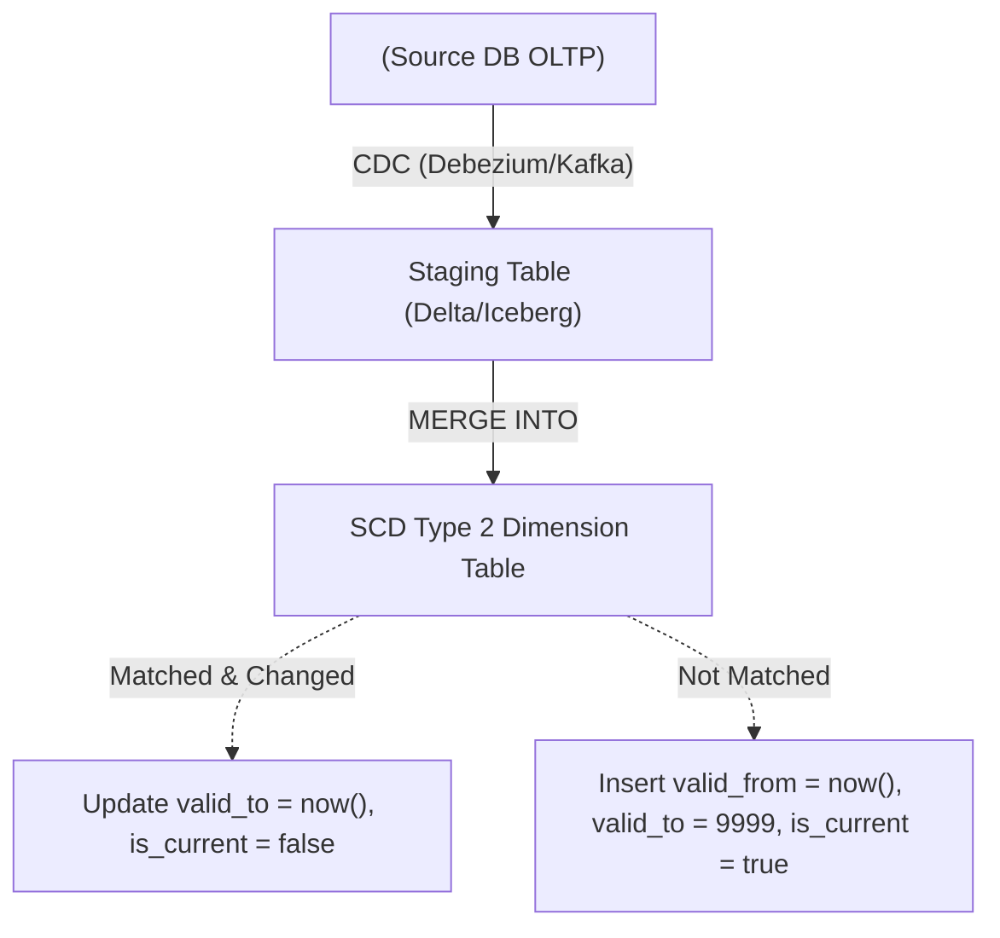
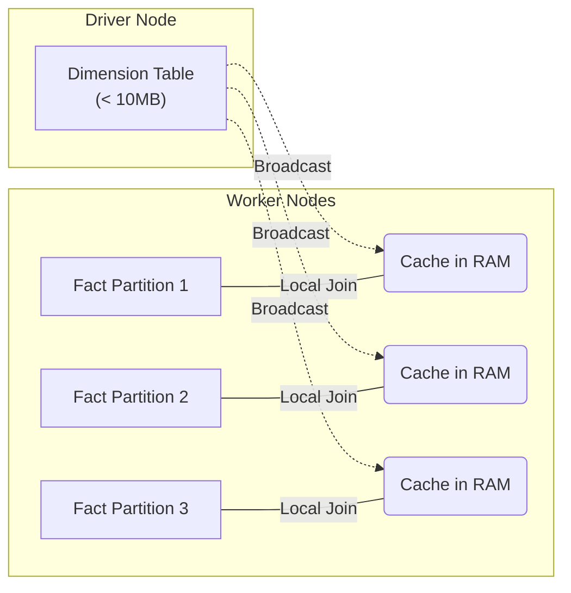

Nếu bạn mở một bảng sự kiện (Fact Table) và chỉ thấy những con số vô hồn như `customer_id = 992` hay `product_id = 811`, khối dữ liệu đó hoàn toàn vô nghĩa đối với bộ phận kinh doanh. Để cung cấp ngữ cảnh (Who, What, Where, When), chúng ta cần **Dimension Table (Bảng chiều)**. 

Tuy nhiên, dưới con mắt của một Data Engineer làm việc trong môi trường phân tán (Distributed Systems), Dimension Table không chỉ dừng lại ở các định nghĩa lý thuyết của Ralph Kimball. Ở quy mô lớn, cách bạn thiết kế Surrogate Keys, quản lý lịch sử thay đổi (SCD), và tối ưu hóa Physical Execution (như Broadcast Joins) sẽ quyết định hệ thống của bạn sống sót qua mùa Black Friday hay sập toàn tập vì OOM (Out Of Memory).

---

## 1. Bản chất Kiến trúc của Dimension Table (Engineering Perspective)

Khác với các chuẩn thiết kế CSDL OLTP (chuẩn 3NF), Dimension Table trong Data Warehouse được cố tình **Denormalize (Phi chuẩn hóa)** thành các bảng rất rộng (Wide) và phẳng (Flat).

- **Rộng (Wide) & Nông (Shallow):** Một Dimension Table có thể chứa tới hàng trăm cột thuộc tính kiểu chuỗi (String/Varchar) dùng để group, filter. Số lượng row (dòng) của nó tương đối nhỏ (từ vài nghìn đến vài chục triệu) so với hàng tỷ row của Fact Table.
- **Tối ưu Hóa I/O:** Trong các Columnar Database (như Parquet, Snowflake, Databricks Delta), việc tạo các bảng rộng không tốn kém tài nguyên đọc vì query engine chỉ quét (Scan) đúng các cột được chỉ định trong câu lệnh `SELECT`.

### 1.1. Khóa nhân tạo (Surrogate Keys) trong Hệ thống Phân tán
Lý thuyết sách giáo khoa nói rằng Dimension Table nên dùng Surrogate Key (Thường là một chuỗi Auto-increment Integer như `1, 2, 3...`) để thay thế Natural Key (Ví dụ: `CMND`, `Mã NV`) nhằm tối ưu tốc độ Join. Tuy nhiên, trong môi trường tính toán phân tán (Spark hay Snowflake):

- **Auto-increment Integer Bottleneck (Nút thắt cổ chai):** Việc sinh ra một chuỗi số tuần tự (Monotonically increasing ID) trên một cluster gồm 100 nodes đòi hỏi phải có một "Global Coordinator Lock" hoặc dồn dữ liệu về một node duy nhất (Driver). Điều này vô tình giết chết tính song song (Parallelism).
- **Giải pháp Thực chiến (Deterministic Hashing):** Các hệ thống Big Data hiện đại ưu tiên sử dụng hàm Hash (như `MD5()`, `SHA-256()`, `farm_fingerprint()`) băm từ Natural Key (và có thể cả Timestamp) để tạo Surrogate Key tĩnh (Deterministic). Điều này cho phép hàng ngàn worker nodes tự do sinh key song song mà không cần giao tiếp mạng với nhau.

---

## 2. Quản trị Lịch sử với SCD Type 2 (Slowly Changing Dimension Type 2)

Dữ liệu trong bảng chiều luôn biến động (Ví dụ: Khách hàng đổi địa chỉ, Nhân viên chuyển phòng ban). **SCD Type 2** là chuẩn công nghiệp để lưu trữ toàn bộ lịch sử biến động bằng cách tạo ra một Record mới (Row proliferation) thay vì ghi đè trực tiếp (Overwrite - Type 1).

### 2.1. Cấu trúc Bảng SCD Type 2 Thực tế
Một bảng SCD Type 2 chuẩn Production luôn cần 4 cột metadata tối thiểu:
1. `surrogate_key` (Primary Key - Thường là Hash String).
2. `natural_key` (Business Key từ hệ thống gốc - Ví dụ: `email`).
3. `valid_from` (Timestamp bắt đầu có hiệu lực).
4. `valid_to` (Timestamp kết thúc hiệu lực - thường set bằng `9999-12-31` cho bản ghi hiện tại).
5. `is_current` (Boolean flag để query nhanh trạng thái hiện hành).

### 2.2. Pipeline Xử lý SCD Type 2 (SCD2 Merge Architecture)

Việc cập nhật SCD2 không dùng `UPDATE` hay `INSERT` rời rạc mà sử dụng lệnh `MERGE` (Upsert) để đảm bảo tính ACID và nguyên vẹn dữ liệu.



**Code Thực chiến: SQL `MERGE` trên Databricks Delta Lake / Snowflake**

Tuyệt đối không dùng logic vòng lặp để cập nhật từng dòng. Dưới đây là kiến trúc thực thi chuẩn để Merge SCD2 bằng một câu lệnh duy nhất (Idempotent):

```sql
-- Bước 1: MERGE để đóng (Expire) các record cũ bị thay đổi
MERGE INTO dim_customer AS target
USING staging_customer AS source
ON target.natural_key = source.natural_key 
   AND target.is_current = TRUE
WHEN MATCHED AND (target.address <> source.address) THEN
  UPDATE SET 
    valid_to = CURRENT_TIMESTAMP(),
    is_current = FALSE;

-- Bước 2: INSERT các record mới (Bao gồm Khách hàng mới & Phiên bản mới của KH cũ)
INSERT INTO dim_customer (
  surrogate_key, natural_key, address, valid_from, valid_to, is_current
)
SELECT 
  MD5(CONCAT(source.natural_key, CAST(CURRENT_TIMESTAMP() AS STRING))), -- Deterministic Hash Key
  source.natural_key, 
  source.address, 
  CURRENT_TIMESTAMP(), 
  '9999-12-31'::TIMESTAMP, 
  TRUE
FROM staging_customer source
LEFT JOIN dim_customer current_dim 
  ON source.natural_key = current_dim.natural_key 
  AND current_dim.is_current = TRUE
WHERE current_dim.natural_key IS NULL -- Record chưa tồn tại bản current
   OR (current_dim.address <> source.address); -- Hoặc bị thay đổi
```

---

## 3. Kiến trúc Thực thi Vật lý (Physical Execution)

Khi join Fact Table (Hàng chục tỷ rows) với Dimension Table (Hàng triệu rows), hệ thống MPP (Massively Parallel Processing) như Spark hoặc Presto sẽ ưu tiên kỹ thuật **Broadcast Hash Join (BHJ)**.

### 3.1. Cơ chế Broadcast Join
Thay vì chia nhỏ cả 2 bảng (Shuffle) qua mạng lưới các nodes (tốn network bandwidth và disk I/O khủng khiếp), Master Node (Driver) sẽ copy toàn bộ Dimension Table (bảng nhỏ) và đẩy (Broadcast) vào bộ nhớ RAM (Memory) của từng Worker Node chứa partition của Fact Table.



Nhờ Broadcast Join, hệ thống hoàn toàn loại bỏ được bước **Network Shuffle**, giảm Latency của câu query từ vài phút xuống còn vài giây.

---

## 4. Rủi ro Vận hành & Systemic Trade-offs

Trong môi trường Production, Dimension Table là nguyên nhân của vô số vụ sập hệ thống [Data Incidents] nếu kỹ sư thiết kế không hiểu rõ bản chất vật lý.

### 4.1. OOMKilled (Out of Memory) do Broadcast Join
- **Incident:** Khi Data Volume của Dimension Table phình to quá mức (Ví dụ: Dimension của User ID có tới 50 triệu rows), file kích thước quá lớn (> 20MB) nhưng Spark Optimizer vẫn lầm tưởng nó nhỏ và cố gắng Broadcast. Kết quả: Tất cả Worker Nodes bị nhồi nhét quá mức và tràn RAM, JVM báo lỗi `OOMKilled` (Exit Code 137).
- **Khắc phục (Remediation):** 
  1. Kiểm soát chặt biến `spark.sql.autoBroadcastJoinThreshold`. 
  2. Bắt buộc engine sử dụng kỹ thuật **Sort Merge Join** thông qua SQL Hint (Chấp nhận Network Shuffle để đổi lấy sự an toàn tuyệt đối về bộ nhớ).
  3. Kích hoạt tính năng **AQE (Adaptive Query Execution)** trong Spark 3+ để tối ưu join lúc runtime.

### 4.2. Storage Bloat (Bùng nổ dữ liệu SCD2)
- **Incident:** Áp dụng SCD2 một cách máy móc cho những thuộc tính biến động tính bằng giây (Ví dụ: `last_login_timestamp` hoặc `current_location`). Kết quả: Dimension Table bị phình to khủng khiếp (Row proliferation), biến thành Fact Table thứ 2 và làm chậm toàn bộ các hệ thống join với nó.
- **Trade-off:** Data Modeling là sự đánh đổi (Storage vs. Compute). Không phải mọi cột đều xứng đáng để lưu lịch sử SCD2. 
- **Khắc phục:** Áp dụng **SCD Type 4 (History Table)** (Đẩy cột biến động cao sang bảng Mini-Dimension hoặc tách ra một bảng lịch sử độc lập), giữ Dimension chính nhẹ và sạch sẽ.

### 4.3. Cartesian Explosion (Bùng nổ Sinh đôi)
- **Incident:** Trong lúc chạy pipeline SCD2, lỗi logic tạo ra các khoảng thời gian `valid_from` và `valid_to` đè lên nhau (Overlapping intervals) cho cùng một `natural_key`. Khi Fact Table join vào bằng điều kiện `fact.date BETWEEN dim.valid_from AND dim.valid_to`, một row của Fact bị thỏa mãn điều kiện join 2 lần và nhân bản thành 2 rows. Con số doanh thu đột nhiên x2 trên báo cáo.
- **Khắc phục:** Cài đặt các **Data Contracts** và Unit Tests trong `dbt` (Ví dụ: dùng dbt package `dbt_utils.mutually_exclusive_ranges`) để hard-block các overlapping intervals trước khi cho phép MERGE vào bảng Production.

---

## Nguồn Tham Khảo (References)

1. **Designing Data-Intensive Applications** - Martin Kleppmann (Chương 3: Storage and Retrieval)
2. [The Data Warehouse Toolkit - Ralph Kimball][https://www.kimballgroup.com/data-warehouse-business-intelligence-resources/books/data-warehouse-dw-toolkit/]
3. [Databricks - Semantic Modeling & Slowly Changing Dimensions][https://databricks.com/blog/2021/06/09/how-to-implement-a-dimensional-data-warehouse-on-databricks-sql.html]
4. [Efficient Upserts into Data Lakes with Databricks Delta][https://www.databricks.com/blog/2019/03/19/efficient-upserts-into-data-lakes-databricks-delta.html]
5. [Netflix Tech Blog - Data Engineering at Scale](https://netflixtechblog.com/]
