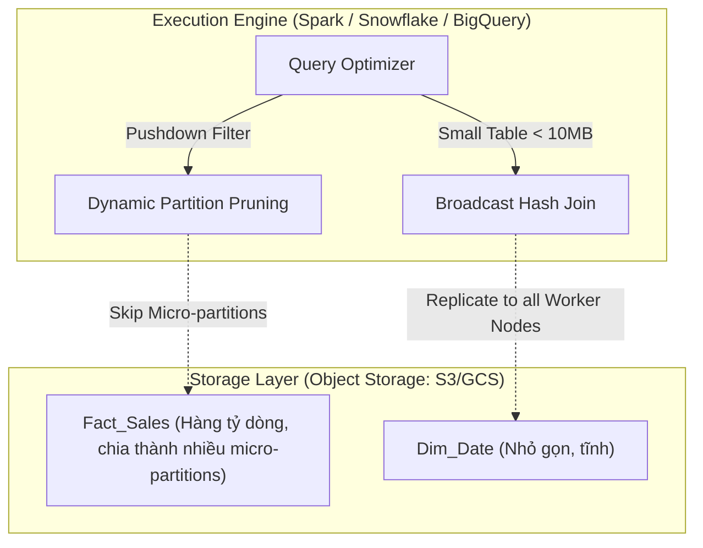

Mô hình hóa dữ liệu đa chiều (Dimensional Modeling) đã tồn tại từ những năm 90 qua cuốn sách kinh điển của Ralph Kimball. Tuy nhiên, nếu bạn mang nguyên xi tư duy thiết kế của Oracle/SQL Server lên các nền tảng phân tán hiện đại như Databricks (Delta Lake), Snowflake hay BigQuery, hệ thống của bạn sẽ sớm sụp đổ vì OOMKilled (Tràn RAM) hoặc chi phí I/O (Storage/Scan Cost) tăng vọt.

Bài viết này mổ xẻ kiến trúc vật lý (Physical Execution) của Star Schema trên môi trường phân tán, so sánh các trường phái Data Modeling (Kimball, Inmon, Data Vault, OBT), và cách xử lý Slowly Changing Dimension ở Data Scale lớn.

---

## 1. Các Trường Phái Kiến Trúc (Data Modeling Approaches)

Việc chọn kiến trúc phụ thuộc vào sự cân bằng giữa tính linh hoạt (agility), độ phức tạp và hiệu năng.

### 1.1. Kimball (Dimensional Modeling)
*   **Triết lý:** Bottom-up. Tổ chức dữ liệu thành các bảng **Fact** (chứa các sự kiện định lượng) và **Dimension** (chứa thông tin mô tả, ngữ cảnh) theo mô hình **Star Schema** hoặc **Snowflake Schema**.
*   **Điểm mạnh:** Cực kỳ trực quan cho Business Users và hệ thống BI. Được coi là chuẩn mực cho tầng "Gold" (Serving Layer).
*   **Điểm yếu:** Khó tích hợp dữ liệu từ quá nhiều nguồn dị đồng nhất (Heterogeneous sources) nếu không có sự chuẩn hóa kỹ lưỡng.

### 1.2. Inmon (Enterprise Data Warehouse)
*   **Triết lý:** Top-down. Dữ liệu phải được tích hợp vào một kho trung tâm chuẩn hóa cao độ (thường là 3NF - Third Normal Form) - hay còn gọi là "Corporate Information Factory". Các Data Marts sau đó mới được rút ra từ đây.
*   **Điểm mạnh:** Đảm bảo "Single version of the truth", giảm thiểu dư thừa dữ liệu (Data redundancy).
*   **Điểm yếu:** Triển khai cực kỳ chậm chạp và đắt đỏ. Ít được sử dụng nguyên bản trong các Cloud Data Warehouse hiện đại.

### 1.3. Data Vault 2.0
*   **Triết lý:** Hybrid. Chia dữ liệu thành **Hubs** (Định danh Business Keys), **Links** (Mối quan hệ giữa các Hub), và **Satellites** (Thuộc tính và lịch sử biến động).
*   **Điểm mạnh:** Tính auditability tuyệt đối. Rất linh hoạt khi thêm nguồn dữ liệu mới mà không làm vỡ cấu trúc hiện tại. Thường được sử dụng làm tầng "Silver" hoặc "Integration Layer" ở các tập đoàn tài chính/ngân hàng.
*   **Điểm yếu:** Query cực kỳ phức tạp (phải JOIN hàng chục bảng để lấy được một view có ý nghĩa).

### 1.4. OBT (One Big Table)
*   **Triết lý:** Phi chuẩn hóa (Denormalize) toàn bộ Fact và Dimension thành một bảng siêu rộng (Wide Table) duy nhất.
*   **Điểm mạnh:** Tốc độ truy vấn siêu tốc độ vì loại bỏ hoàn toàn lệnh JOIN. Dễ sử dụng cho Data Science và ad-hoc analytics.
*   **Điểm yếu:** Dư thừa dữ liệu khổng lồ (Lưu trữ đắt). Việc cập nhật (Data Mutability) một thuộc tính nhỏ (ví dụ đổi tên Thành phố) đòi hỏi phải rewrite hàng tỷ bản ghi.

---

## 2. Kiến trúc Vật lý (Physical Execution) của Star Schema trên Lakehouse

Trong kiến trúc Medallion (Lakehouse), Star Schema thường được hiện thực hóa tại **Gold Layer**. Dữ liệu ở đây không lưu dưới dạng Row-based như OLTP mà là Columnar-based (Parquet).

Khi thiết kế Star Schema, bạn không chỉ tạo khóa ngoại (Foreign Keys) để Business Users kéo/thả báo cáo trên Power BI, mà bạn đang thiết kế **Data Layout** (Cách dữ liệu phân bổ trên đĩa) để bộ tối ưu hóa (Optimizer) có thể loại bỏ dữ liệu rác nhanh nhất có thể.



**Tại sao Star Schema lại có hiệu năng "vô đối" trên Distributed Systems?**

1. **Loại bỏ hoàn toàn Network Shuffle [Broadcast Join]:** Các bảng Dimension thường có kích thước rất nhỏ. Spark/Snowflake Optimizer sẽ đẩy toàn bộ bảng Dimension lên RAM của tất cả các Worker Nodes. Quá trình JOIN với bảng Fact khổng lồ diễn ra hoàn toàn trên cục bộ (Local), giúp loại bỏ quá trình Xáo trộn mạng (Network Shuffle) - tác nhân số 1 gây nghẽn cổ chai.
2. **Dynamic Partition Pruning (DPP):** Giả sử Query là `SELECT ... WHERE dim_date.year = 2024`. Đầu tiên, Engine filter bảng Dimension để lấy ra danh sách các `date_id` tương ứng với năm 2024. Danh sách ID này lập tức được tiêm (inject) ngược xuống tầng Scan của bảng Fact. Nhờ vậy, Engine bỏ qua hoàn toàn việc quét (I/O) các file Parquet chứa dữ liệu của năm 2023.

---

## 3. Platform Considerations: BigQuery vs Snowflake vs Databricks

Việc lựa chọn chiến lược Modeling phụ thuộc nhiều vào kiến trúc hạ tầng bên dưới:

| Nền tảng | Kiến trúc vật lý (Physical Architecture) | Chiến lược Data Modeling tối ưu |
| :--- | :--- | :--- |
| **BigQuery** | Serverless, Columnar, tính tiền theo số Byte quét (Scan). Chạy dựa trên Dremel execution engine. |" **OBT (One Big Table)** và **Nested Records** cực kỳ tỏa sáng nhờ sức mạnh xử lý song song khổng lồ. Việc JOIN lớn có thể đắt đỏ, nên việc phi chuẩn hóa mang lại hiệu quả cao. "|
| **Snowflake** | Tách biệt Storage và Compute, lưu trữ dữ liệu dưới dạng **Micro-partitions**. Có bộ đệm (Caching) cực mạnh. |" Phù hợp nhất cho **Star Schema (Kimball)** truyền thống. Optimizer của Snowflake xử lý JOIN và Dynamic Pruning cực kỳ xuất sắc. "|
| **Databricks** | Lakehouse (Delta Lake). Spark Engine. Tối ưu cho ML và Data Engineering phức tạp. | Phù hợp với **Data Vault 2.0** ở tầng Silver và **Star Schema** ở tầng Gold. Cung cấp **Liquid Clustering** để tự động tổ chức file layout. |

### Thực Chiến Databricks: Liquid Clustering
Thay vì dùng `PARTITIONED BY` tĩnh dễ dẫn đến lỗi Small File Problem (quá nhiều file nhỏ do over-partitioning), Databricks cung cấp Liquid Clustering để gom cụm đa chiều:

```sql
-- Tạo bảng Fact với Delta Liquid Clustering trên Databricks
CREATE TABLE gold.fact_sales (
    sale_sk BIGINT GENERATED ALWAYS AS IDENTITY, -- Surrogate Key
    customer_sk BIGINT,
    product_sk BIGINT,
    store_sk BIGINT,
    sale_date DATE,
    quantity INT,
    total_amount DECIMAL(18,2)
)
USING DELTA
-- Engine tự động gom cụm các file parquet dựa trên các cột này
CLUSTER BY (sale_date, store_sk, product_sk);
```

---

## 4. Thực thi Slowly Changing Dimension (SCD Type 2) ở Scale lớn

SCD Type 2 đòi hỏi bạn giữ lại toàn bộ lịch sử biến động của một Dimension. Ở môi trường phân tán (Databricks, Snowflake), thực thi SCD Type 2 bằng `MERGE INTO` là một bài toán Heavy Merge vì bạn phải xử lý đồng thời hai trạng thái: **Đóng (Update)** dòng cũ và **Mở (Insert)** dòng mới.

Dưới đây là kỹ thuật UNION kinh điển trong Spark SQL/Delta Lake (hoặc Snowflake) để xử lý gọn SCD Type 2 trong một `MERGE` duy nhất:

```sql
-- Dữ liệu Upsert từ tầng Silver
WITH silver_updates AS (
    SELECT customer_id, address, phone, current_timestamp() as valid_from
    FROM silver.customer_events
    WHERE event_date = current_date()
),
merge_source AS (
    -- 1. Tập bản ghi để Mở (INSERT). Dùng customer_id làm merge_key
    SELECT customer_id AS merge_key, customer_id, address, phone, valid_from
    FROM silver_updates
    
    UNION ALL
    
    -- 2. Tập bản ghi để Đóng (UPDATE). Dùng NULL làm merge_key để đánh văng ra khỏi MATCHED của đợt Insert
    SELECT NULL AS merge_key, u.customer_id, u.address, u.phone, u.valid_from
    FROM silver_updates u
    JOIN gold.dim_customer target 
        ON u.customer_id = target.customer_id 
        AND target.is_current = true 
        AND (u.address <> target.address OR u.phone <> target.phone)
)

-- Bắt đầu Heavy Merge
MERGE INTO gold.dim_customer AS target
USING merge_source AS source
ON target.customer_id = source.merge_key

-- WHEN MATCHED (Bản ghi cũ cần đóng lại)
WHEN MATCHED AND target.is_current = true 
    AND (target.address <> source.address OR target.phone <> source.phone) THEN
    UPDATE SET 
        target.is_current = false, 
        target.valid_to = source.valid_from

-- WHEN NOT MATCHED (Bản ghi mới tinh hoặc phiên bản mới của KH cũ)
WHEN NOT MATCHED THEN
    INSERT (customer_id, address, phone, valid_from, valid_to, is_current)
    VALUES (
        source.customer_id, source.address, source.phone, 
        source.valid_from, cast('9999-12-31' AS timestamp), true
    );
```

**Rủi ro Vận hành (Real-world Incident): Cartesian Explosion / Retry Storms**
Nếu hệ thống Upstream gửi xuống các bản ghi trùng lặp (ví dụ `customer_id=123` xuất hiện 2 lần trong `silver_updates`), lệnh MERGE sẽ ngay lập tức gây ra lỗi `Multiple matches found` đối với Delta Lake hoặc Snowflake.
*Cách khắc phục:* Luôn luôn dùng Window Function (như `row_number() over(partition by id order by event_time desc)`) ở tập nguồn để Deduplicate trước khi đưa vào mệnh đề `MERGE`.

---

## 5. Tổng kết Kiến Trúc (Architectural Summary)

Không có một mô hình nào thống trị tuyệt đối. Lựa chọn kiến trúc tốt nhất trong thời đại Cloud Data Warehouse là sự kết hợp lai (Hybrid):
1. Dùng **Data Vault 2.0** hoặc chuẩn hóa ở tầng Ingestion/Staging (Raw/Silver) để quản lý lịch sử linh hoạt.
2. Dùng **Kimball (Star Schema)** ở tầng Serving (Gold) để BI Tools truy vấn mượt mà qua Broadcast Join và Caching.
3. Chuyển sang **OBT (One Big Table)** hoặc Denormalized Views khi chạy các workload Machine Learning hoặc khi xử lý trên BigQuery nếu Join Cost quá đắt đỏ.

## Nguồn Tham Khảo
- [Dimensional modeling in Amazon Redshift - AWS Architecture Blog](https://aws.amazon.com/blogs/architecture/dimensional-modeling-in-amazon-redshift/)
- [Implementing a dimensional data warehouse with Databricks SQL - Databricks Blog](https://www.databricks.com/blog/2022/06/24/implementing-a-dimensional-data-warehouse-with-databricks-sql-part-1.html)
- [Databricks Lakehouse Data Modeling: Myths, Truths, and Best Practices - Databricks Blog](https://www.databricks.com/blog/2022/05/20/databricks-lakehouse-data-modeling-myths-truths-and-best-practices.html)
- *The Data Warehouse Toolkit - Ralph Kimball*
