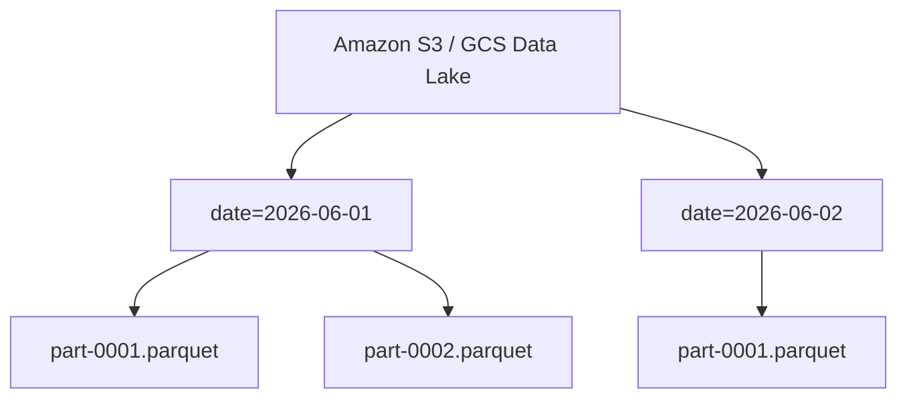

Khi hệ thống mở rộng đến hàng Terabyte hoặc Petabyte dữ liệu, định nghĩa sách giáo khoa *"Fact Table là bảng chứa các con số đo lường"* không còn đủ để giúp bạn sinh tồn. Dưới góc nhìn của một Staff Data Engineer, Fact Table không chỉ là một bảng logic trong Star Schema, mà thực chất là **một tập hợp các khối dữ liệu vật lý (thường là Parquet/ORC files)** phân tán trên S3, GCS hoặc HDFS.

Thiết kế một Fact Table ở scale lớn (như Uber, Netflix hay Databricks) là một bài toán đánh đổi liên tục giữa **Storage Cost** (chi phí lưu trữ), **Compute Cost** (chi phí tính toán) và **Read/Write Latency**.

---

## 1. Bản chất Vật lý (Physical Execution & Storage)

### Sự sụp đổ của Relational Database truyền thống
Trong một Data Warehouse truyền thống (RDBMS), Fact Table được lưu theo hàng (Row-oriented) trên disk. Tuy nhiên, khi Fact Table phình to đến hàng tỷ dòng, việc quét (scan) toàn bộ bảng để tính tổng doanh thu (`SUM(sales)`) trở thành thảm họa I/O.

Đó là lý do các hệ thống hiện đại như **Amazon Redshift, Google BigQuery, hay Databricks** đều sử dụng kiến trúc lưu trữ dạng cột (Columnar Storage). 

**Trade-off cốt lõi:**
- **Write Penalty:** Lưu theo cột khiến việc ghi (Insert/Update) chậm hơn vì dữ liệu phải được phân mảnh và nén thành các blocks/files riêng biệt.
- **Read Analytics:** Bù lại, các truy vấn phân tích (OLAP) cực kỳ nhanh. Hệ thống chỉ lấy đúng các cột cần thiết (Column Pruning) và đẩy các phép lọc xuống tận tầng lưu trữ (Predicate Pushdown).

### Phân vùng (Partitioning) & Vấn đề Small Files
Fact table thường được phân vùng theo `date` hoặc `month`. 



**Incident Thực tế: Tràn ngập file nhỏ (Small Files Problem)**
Nếu data ingestion pipeline của bạn là Streaming (ví dụ Kafka -> Spark Structured Streaming) xả data liên tục mỗi 1 phút vào Data Lake, Fact Table sẽ chứa hàng triệu file Parquet dung lượng winy (vài KB). 
Khi truy vấn, NameNode (hoặc S3 metadata server) sẽ bị quá tải khi mở từng file (Metadata Overhead), kéo theo hiệu năng truy vấn sụt giảm thê thảm.

**Giải pháp (FinOps & Performance):**
Dùng tính năng **Auto Compaction** hoặc chạy job tối ưu hóa định kỳ để gom các file nhỏ thành file lớn (khoảng 128MB - 256MB).

```sql
-- Trên Delta Lake (Databricks)
OPTIMIZE events_fact_table;
```

---

## 2. Fact Table trong Lakehouse & Medallion Architecture

Uber từng gặp khủng hoảng khi Fact tables tĩnh (Parquet thô) không thể giải quyết hiệu quả bài toán **Late-arriving data** (Dữ liệu đến trễ) hoặc cập nhật trạng thái chuyến đi (Ride status). Giải pháp của họ là sinh ra Apache Hudi. Ngày nay, bộ ba **Delta Lake, Apache Iceberg và Apache Hudi** mang tính năng ACID transactions vào Data Lake, thay đổi hoàn toàn cách chúng ta thiết kế Fact Table.

Kiến trúc chuẩn hiện nay là **Medallion Architecture**. Fact Table hiếm khi nằm ở lớp Bronze.


- **Bronze Layer:** Immutable Append-only (Lưu trữ raw events). Chưa phải Fact Table.
- **Silver Layer:** Cleansed and Conformed. **ĐÂY LÀ NƠI FACT TABLE XUẤT HIỆN.** Dữ liệu đã được chuẩn hóa độ hạt (Grain), deduplicated, và có Schema chặt chẽ.
- **Gold Layer:** Business-level Aggregates (Bảng Fact tổng hợp - *Cumulative/Aggregate Fact Tables*), tối ưu cho BI Dashboards.

### Xử lý Incremental Updates (Upsert) với Delta Lake
Thay vì chạy lại toàn bộ Batch ETL tốn kém, chúng ta dùng `MERGE INTO` để cập nhật Fact table.

```sql
-- Thực thi MERGE INTO xử lý Late-Arriving Data trong Silver Fact Table
MERGE INTO silver.sales_fact AS target
USING bronze.sales_stream_vw AS source
ON target.order_id = source.order_id 
   AND target.date = source.date -- Bắt buộc có Partition Key để chống Full Table Scan
WHEN MATCHED AND source.status = 'CANCELLED' THEN 
    UPDATE SET 
        target.status = source.status,
        target.updated_at = current_timestamp()
WHEN NOT MATCHED THEN 
    INSERT (order_id, customer_sk, product_sk, amount, date, status)
    VALUES (source.order_id, source.customer_sk, source.product_sk, source.amount, source.date, source.status);
```

> [!WARNING] 
> **Performance Trap:** Khệnh khạng dùng `MERGE INTO` mà không đính kèm **Partition Key** (`date`) trong mệnh đề `ON`. Spark sẽ thực hiện quét lại toàn bộ Petabyte Fact Table để tìm ra bản ghi `order_id` trùng khớp, tiêu tốn hàng nghìn đô la compute AWS chỉ cho một truy vấn nhỏ.

---

## 3. Độ hạt (Grain) & Các lỗi Vận hành (Operational Risks)

Xác định Grain không chỉ là lý thuyết, nó quyết định hệ thống của bạn có sống sót hay không. *"Một dòng trong Fact Table đại diện cho cái gì?"*

### Incident: Cartesian Explosion (Vụ nổ Tích Đề Cát)
Giả sử bạn có Fact Table lưu trữ "Lượt Click Ads" với Grain: *1 dòng = 1 lượt click của User trên 1 Campaign*.
Khi Data Analyst join bảng này với Dimension Table `Dim_User` (nơi 1 User lỡ bị lặp lại 3 lần do thiết kế SCD Type 2 lỗi, chưa lọc ngày hiệu lực `is_current = True`).

Kết quả: Bảng Fact 1 tỷ dòng x 3 = 3 tỷ dòng (Data Amplification). Dữ liệu tính doanh thu bị phình to (Double-counting), kéo theo sai lệch báo cáo tài chính. Hơn nữa, Spark Cluster sẽ phình RAM, dẫn đến lỗi **JVM OOMKilled** kinh điển.

```python
# CODE THỰC CHIẾN: Cách an toàn trước khi Join Fact và Dimension
from pyspark.sql.functions import col

# Đảm bảo Dimension Table chỉ có 1 bản ghi active cho mỗi khóa tự nhiên
dim_user_active = dim_user.filter(col("is_current") == True).dropDuplicates(["natural_user_id"])

# Bây giờ mới an toàn để Join với Fact
fact_enriched = fact_clicks.join(
    dim_user_active,
    fact_clicks.user_sk == dim_user_active.user_sk,
    "inner"
)
```

---

## 4. Tối ưu Mạng và I/O (Network Shuffle & Z-Ordering)

### Broadcast Hash Join chống Shuffle
Khi JOIN một Fact table khổng lồ với một Dimension table nhỏ, nếu cấu hình không đúng, Spark sẽ thực hiện **Sort Merge Join**, ép toàn bộ cụm máy chủ phải trao đổi dữ liệu qua mạng (Network Shuffle). Quá trình này tạo ra I/O cực lớn và thường xuyên sập cụm.

**Cách giải quyết:** Ép Spark dùng Broadcast Join, gửi bản copy của bảng Dimension đến từng node chứa Fact table.

```python
from pyspark.sql.functions import broadcast

# Ép Broadcast Join. (Yêu cầu bảng Dimension nhỏ hơn tham số spark.sql.autoBroadcastJoinThreshold - mặc định 10MB)
df_result = df_fact.join(broadcast(df_dimension), "product_key")
```

### Z-Ordering: Đánh bại Nút thắt Phân mảnh (Data Skipping)
Nếu bạn query bảng Fact theo nhiều chiều liên tục (như vừa query theo `customer_id`, vừa query theo `product_id`), Partitioning đơn thuần là không đủ vì dữ liệu bên trong mỗi file Parquet bị phân tán ngẫu nhiên.

**Z-Ordering** (có trên Delta Lake) cấu trúc lại dữ liệu vật lý sao cho các records có chung `customer_id` và `product_id` nằm cạnh nhau trên cùng một Parquet block. Khi query, engine sẽ dễ dàng bỏ qua (Skip) các block không liên quan (Data Skipping).

```sql
-- Tối ưu hóa Fact table cho các truy vấn lọc đa chiều
OPTIMIZE sales_fact ZORDER BY (customer_id, product_id);
```
*Trade-off: Z-Ordering tốn rất nhiều Compute để sắp xếp lại dữ liệu. Tuyệt đối không chạy Z-Order trên các Fact tables theo kiểu realtime. Thường chỉ chạy vào ban đêm (Off-peak hours).*

---

## Nguồn Tham Khảo
1. [Databricks - What is a Medallion Architecture?](https://www.databricks.com/glossary/medallion-architecture)
2. [Uber Engineering Blog - Apache Hudi Design](https://eng.uber.com/hudi/)
3. Kleppmann, M. (2017). *Designing Data-Intensive Applications*. O'Reilly Media.
4. [Amazon Redshift - Optimizing for Star Schemas](https://aws.amazon.com/blogs/big-data/optimizing-for-star-schemas-and-interleaved-sorting-on-amazon-redshift/)
