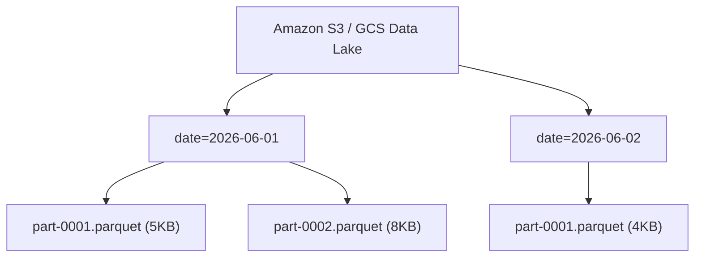

Khi hệ thống mở rộng đến hàng Terabyte hoặc Petabyte dữ liệu, định nghĩa sách giáo khoa *"Fact Table là bảng chứa các con số đo lường"* không còn đủ để giúp hệ thống của bạn sinh tồn. 

Dưới góc nhìn của một Staff Data Engineer, **Fact Table (Bảng Sự kiện)** không chỉ là một bảng logic trong mô hình Star Schema. Ở tầng vật lý, nó là **một tập hợp các khối dữ liệu (thường là hàng triệu file Parquet/ORC)** phân tán rải rác trên S3, GCS hoặc hạ tầng lưu trữ của Snowflake. Thiết kế một Fact Table ở scale lớn là một bài toán đánh đổi liên tục giữa **Storage Cost** (Chi phí lưu trữ), **Compute Cost** (Chi phí tính toán) và **Read/Write Latency** (Độ trễ đọc/ghi).

---

## 1. Bản chất Vật lý (Physical Execution & Storage)

### Sự sụp đổ của RDBMS truyền thống và Kỷ nguyên Columnar
Trong một Relational Database truyền thống (PostgreSQL, MySQL), dữ liệu được lưu theo hàng (Row-oriented) trên ổ cứng. Tuy nhiên, khi Fact Table phình to đến hàng tỷ dòng, việc quét toàn bộ bảng chỉ để tính tổng doanh thu (`SELECT SUM(sales)`) trở thành thảm họa I/O.

Các hệ thống hiện đại như **Snowflake, BigQuery, hay Databricks** giải quyết bài toán này bằng kiến trúc lưu trữ dạng cột (Columnar Storage). 

**Trade-off cốt lõi:**
- **Read Analytics (OLAP):** Cực kỳ nhanh. Hệ thống chỉ lấy đúng các cột được chỉ định (Column Pruning) và đẩy các phép lọc xuống tận tầng phần cứng lưu trữ (Predicate Pushdown).
- **Write Penalty:** Việc ghi (Insert/Update) chậm hơn và tốn Compute hơn vì dữ liệu phải được phân mảnh, áp dụng thuật toán nén (Dictionary Encoding, RLE) và ghi thành các blocks riêng biệt. Do đó, Fact Table thường được tối ưu theo hướng **Append-only** (Chỉ chèn thêm).

### Sự cố "Thảm họa File nhỏ" (Small Files Problem)
Fact table thường được phân vùng (Partitioned) theo `date` hoặc `month`. 



Nếu Data Pipeline của bạn là Streaming (ví dụ: Kafka xả data liên tục mỗi 1 phút vào Data Lake), Fact Table sẽ bị nát vụn thành hàng triệu file Parquet dung lượng tí hon (vài KB). Khi truy vấn, hệ thống sẽ bị thắt cổ chai ở khâu đọc Metadata (Metadata Overhead), kéo theo hiệu năng truy vấn sụt giảm thê thảm.
**Giải pháp (FinOps & Performance):** Dùng tính năng **Auto Compaction** hoặc chạy Job tối ưu hóa định kỳ (vào ban đêm) để gom các file nhỏ thành file lớn (chuẩn là 128MB - 256MB).
```sql
-- Trên Delta Lake (Databricks)
OPTIMIZE events_fact_table;
```

---

## 2. Các Loại Bảng Fact và Khái niệm "Grain"

Thiết kế Fact Table bắt đầu bằng việc định nghĩa **Grain [Hạt Dữ Liệu]**: *Chính xác thì một dòng trong bảng đại diện cho sự kiện gì?* Trộn lẫn nhiều Grain trong cùng một bảng Fact là cách nhanh nhất để hủy diệt Data Warehouse của bạn.

Có 4 loại Fact Table kinh điển:
1. **Transaction Fact:** Ghi nhận sự kiện ngay khi nó xảy ra ở mức độ chi tiết nhất. VD: 1 dòng = 1 lượt click quảng cáo.
2. **Periodic Snapshot Fact:** Chụp lại trạng thái tại những khoảng thời gian cố định. VD: Bảng sao kê số dư tài khoản ngân hàng cuối mỗi ngày. Rất hiệu quả để tránh phải quét toàn bộ lịch sử giao dịch.
3. **Accumulating Snapshot Fact:** Theo dõi vòng đời của một quy trình hữu hạn. VD: Trạng thái Đơn hàng (Cột `ordered_at`, `shipped_at`, `delivered_at` sẽ được `UPDATE` liên tục).
4. **Factless Fact Table:** Ghi nhận một sự kiện xảy ra nhưng không có bất kỳ con số đo lường nào (No numeric metrics). VD: Sinh viên A đăng ký Khóa học B. Thường dùng để đo lường Coverage (Độ phủ).

**Best Practice: Khóa nhân tạo (Surrogate Keys) và Degenerate Dimensions**
Trong Fact table, mọi khóa liên kết (Foreign Keys) trỏ ra Dimension Table phải là **Surrogate Keys** (Khóa nhân tạo kiểu INT/BIGINT). Tuy nhiên, các mã giao dịch nghiệp vụ (như `invoice_number`, `order_id`) không có Dimension đi kèm nhưng vẫn cần lưu trữ để dò lỗi. Chúng được gọi là **Degenerate Dimensions (Chiều suy biến)** và được lưu trực tiếp dưới dạng Text trong Fact Table.

---

## 3. Fact Table trong Medallion Architecture

Trong kiến trúc Lakehouse hiện đại, Fact Table thường nằm ở lớp **Gold (Presentation Layer)**, được tinh chế từ lớp Silver.

### Xử lý Incremental Updates (Upsert) và Cạm bẫy Full Table Scan
Khi xử lý **Late-Arriving Data** (Dữ liệu sự kiện đến trễ vài ngày do lỗi mạng IoT), ta dùng `MERGE INTO` để cập nhật Fact table.

```sql
-- Thực thi MERGE INTO xử lý Late-Arriving Data
MERGE INTO gold.sales_fact AS target
USING silver.sales_stream_vw AS source
ON target.order_id = source.order_id 
   AND target.date >= current_date() - interval 7 days -- BẮT BUỘC PHẢI CÓ
WHEN MATCHED AND source.status = 'CANCELLED' THEN 
    UPDATE SET 
        target.status = source.status,
        target.updated_at = current_timestamp()
WHEN NOT MATCHED THEN 
    INSERT (order_id, customer_sk, product_sk, amount, date, status)
    VALUES (source.order_id, source.customer_sk, source.product_sk, source.amount, source.date, source.status);
```

> [!CAUTION] 
> **Performance Trap (Bẫy Hiệu năng]:** Rất nhiều Kỹ sư ngây thơ dùng `MERGE INTO` chỉ với điều kiện `ON target.order_id = source.order_id`. Query Engine sẽ buộc phải quét lại **toàn bộ Petabyte Fact Table (Full Table Scan)** để tìm kiếm `order_id`. Bạn bắt buộc phải đính kèm **Partition Key** (thường là `date`) vào mệnh đề `ON` để giới hạn phạm vi quét (Pruning) xuống mức nhỏ nhất có thể.

---

## 4. Operational Risks: Sự Cố Vận Hành Kinh Điển

### Incident: Cartesian Explosion (Vụ Nổ Tích Đề-Các)
Xảy ra khi Analyst thực hiện JOIN bảng Fact tỷ dòng với một bảng Dimension bị lỗi lặp khóa (Lỗi SCD Type 2 do quên lọc thời gian `is_current = True`).
- **Hậu quả:** 1 dòng Fact join trúng 3 dòng Dimension tạo ra 3 dòng output. Bảng kết quả phình to gấp 3 lần (Data Amplification), doanh thu báo cáo bị x3 (Sai lệch tài chính nghiêm trọng). Đồng thời, Compute Node cạn kiệt RAM và văng lỗi **JVM OOMKilled** (Out of Memory).

```python
# CODE THỰC CHIẾN PYSPARK: Cách an toàn trước khi Join Fact và Dimension
from pyspark.sql.functions import col, broadcast

# 1. Đảm bảo Dimension Table chỉ có 1 bản ghi active cho mỗi khóa
dim_user_active = dim_user.filter(col("is_current") == True).dropDuplicates(["customer_sk"])

# 2. Thực hiện Broadcast Hash Join để ép Dimension nhỏ lên RAM, tránh Shuffle bảng Fact
fact_enriched = fact_clicks.join(
    broadcast(dim_user_active),
    fact_clicks.customer_sk == dim_user_active.customer_sk,
    "inner"
)
```

---

## 5. Tối Ưu Hóa Mạng và Đĩa cứng [FinOps Tuning]

### Z-Ordering / Clustering (Đánh bại Nút thắt Phân mảnh)
Nếu Fact table của bạn được query theo nhiều chiều khác nhau (ví dụ: Marketing team lọc theo `campaign_id`, trong khi Sales team lọc theo `store_id`), Partitioning đơn thuần theo `date` không giải quyết được vấn đề quét rác bên trong mỗi partition.

**Z-Ordering (Databricks) hoặc Automatic Clustering (Snowflake)** sẽ sắp xếp lại layout dữ liệu vật lý theo cấu trúc đa chiều. Các records có chung `campaign_id` và `store_id` sẽ nằm cạnh nhau. Khi query, Engine dễ dàng bỏ qua (Skip) tới 90% số file Parquet không chứa dữ liệu cần tìm.

```sql
-- Tối ưu hóa Fact table cho các truy vấn lọc đa chiều (Delta Lake)
OPTIMIZE sales_fact ZORDER BY (campaign_id, store_id);
```
*(Lưu ý FinOps: Quá trình Z-Order tốn rất nhiều Compute CPU để sắp xếp lại data. Chỉ nên cấu hình chạy vào giờ thấp điểm ban đêm).*

## Nguồn Tham Khảo (References)
* [Databricks - What is a Medallion Architecture?][https://www.databricks.com/glossary/medallion-architecture]
* [Snowflake - Understanding Micro-partitions and Automatic Clustering][https://docs.snowflake.com/en/user-guide/tables-clustering-micropartitions]
* [The Data Warehouse Toolkit (Ralph Kimball] - Fact Table Techniques][https://www.kimballgroup.com/data-warehouse-business-intelligence-resources/kimball-techniques/dimensional-modeling-techniques/]
* [Uber Engineering Blog - Apache Hudi Design for Analytical Data Lakes](https://eng.uber.com/hudi/]
