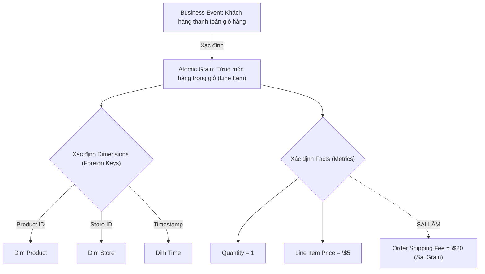

Khi thiết kế mô hình dữ liệu (Dimensional Modeling) theo chuẩn Ralph Kimball, bước "Xác định Grain" (Choose the Grain) thường bị các kỹ sư trẻ xem nhẹ cho đến khi hệ thống Data Warehouse đạt quy mô hàng chục Terabytes. Dưới góc nhìn kiến trúc hệ thống (System Architecture), **Grain** không chỉ mang ý nghĩa business là "một dòng dữ liệu đại diện cho cái gì". 

Nó thực chất là một **Bản hợp đồng ràng buộc (Binding Contract)**. Nó quyết định cách thức phân phối dữ liệu vật lý (Physical Data Distribution), cường độ Network Shuffle giữa các Cluster nodes, và giới hạn hiệu năng tuyệt đối của toàn bộ Compute Engine (Spark, BigQuery, Snowflake).

Trong bài viết này, chúng ta sẽ mổ xẻ **Atomic Grain** dưới góc độ kỹ thuật sâu (Hardcore Engineering), phân tích các rủi ro vận hành (như Fan Trap, Chasm Trap, Cartesian Explosion) khi thiết kế sai, và cách đánh đổi (Trade-offs) trong môi trường xử lý phân tán.

## 1. Kiến Trúc Vật Lý: Atomic Grain vs. Aggregated Grain

Grain quy định mức độ chi tiết nhất (Atomic level) của một bảng Fact. Nếu Grain được chốt là *"Một dòng tương ứng với một lần quét mã vạch của một sản phẩm tại quầy thu ngân"*, thì Fact Table đó bắt buộc phải bao gồm các khóa ngoại (Foreign Keys) trỏ tới `dim_product`, `dim_store`, `dim_date`, và `dim_time`.

Nếu Data Engineer cố tình nhồi nhét một cột như `order_shipping_fee` (Phí ship - vốn mang ý nghĩa cấp độ toàn bộ Đơn hàng) vào bảng Fact cấp độ Sản phẩm này, họ đang trắng trợn phá vỡ "Binding Contract".



## 2. Cạm Bẫy Chết Người: Fan Trap và Chasm Trap

Thiết kế sai Grain không chỉ làm sai lệch số liệu báo cáo, nó còn sinh ra các cạm bẫy mô hình hóa (Connection Traps) làm sụp đổ các Compute Engine phân tán.

### 2.1. Fan Trap (Bẫy Quạt / Nhân Bản Dữ Liệu)
**Bản chất vật lý:** Fan Trap xảy ra khi một bảng cha có mối quan hệ One-to-Many (1-N) với HAI bảng con khác nhau, và bạn cố tình JOIN cả 3 bảng lại với nhau trong một truy vấn duy nhất.
- **Hậu quả (Cartesian Explosion):** Các Metrics (chỉ số) bị "quạt" (Fanned out) và nhân bản vô tội vạ. Ví dụ: Bảng `Branch` (Chi nhánh) có nhiều `Salespersons` (Nhân viên) và có nhiều `Customers` (Khách hàng). Nếu bạn JOIN 3 bảng này lại để tính tổng doanh số của chi nhánh, mỗi nhân viên sẽ bị JOIN chéo với mọi khách hàng của chi nhánh đó.
- **Biểu hiện Hệ thống:** Trong Apache Spark, thao tác này sẽ kích hoạt thuật toán `CartesianProduct` hoặc `BroadcastNestedLoopJoin`. Hàng tỷ dòng rác được sinh ra trên RAM, gây ra hiện tượng Garbage Collection kéo dài và cuối cùng Executor bị bắn hạ (OOMKilled).

**Code Thực chiến (Xử lý Fan Trap bằng CTE):**
Tuyệt đối không JOIN thẳng các bảng 1-N. Phải Aggregate (Gom nhóm) chúng về chung một Grain (Cấp độ Branch) TRƯỚC KHI thực hiện JOIN.

```sql
-- Kỹ thuật xử lý Fan Trap: Gom nhóm (Aggregate) trước khi Join
WITH branch_sales_cte AS (
    SELECT branch_id, SUM(sales_amount) as total_sales
    FROM fact_salespersons
    GROUP BY branch_id
),
branch_customers_cte AS (
    SELECT branch_id, COUNT(customer_id) as total_customers
    FROM fact_customers
    GROUP BY branch_id
)
SELECT 
    b.branch_name, 
    s.total_sales, 
    c.total_customers
FROM dim_branch b
LEFT JOIN branch_sales_cte s ON b.branch_id = s.branch_id
LEFT JOIN branch_customers_cte c ON b.branch_id = c.branch_id;
```

### 2.2. Chasm Trap (Bẫy Vực Sâu)
**Bản chất vật lý:** Xảy ra khi hai bảng Fact có cùng một Dimension chung (VD: `fact_sales` và `fact_budget` cùng trỏ về `dim_date`), nhưng bản thân hai bảng Fact này KHÔNG có đường dẫn liên kết trực tiếp với nhau. Khi Analyst cố gắng query so sánh Sales và Budget thông qua `dim_date`, kết quả sẽ thiếu sót nghiêm trọng hoặc sinh ra phép Cross-Join khổng lồ trên những ngày không có Sales nhưng lại có Budget.
- **Cách khắc phục:** Sử dụng kỹ thuật Conformed Dimensions và Multi-fact Queries (Full Outer Join trên bộ khóa Dimension chung) thông qua Semantic Layer (như LookML hoặc dbt).

### 2.3. Lỗi Mixed Grain (Phân Bổ Sai Trọng Số)
Quay lại ví dụ đưa `shipping_fee` (Phí ship của cả đơn hàng) xuống từng `order_line` (Chi tiết mặt hàng). Khi sếp yêu cầu tính `SUM(shipping_fee)`, con số sẽ bị nhân đôi hoặc nhân ba tùy theo số lượng mặt hàng trong đơn.

**Khắc phục bằng Allocation (Phân bổ tỷ trọng):**
Nếu bắt buộc phải đưa Metric của Grain to xuống Grain nhỏ, bạn KHÔNG được copy y nguyên giá trị, mà phải phân bổ (Allocate) nó dựa trên trọng số (Ví dụ: tỷ trọng doanh thu của món hàng đó trong tổng đơn).

```sql
-- Tối ưu hóa phân bổ (Allocation) Metric từ Order xuống Order Line
SELECT 
    l.order_id,
    l.product_id,
    l.line_revenue,
    o.shipping_fee * (l.line_revenue / SUM(l.line_revenue) OVER (PARTITION BY l.order_id)) AS allocated_shipping_fee
FROM fact_order_line l
JOIN fact_orders o ON l.order_id = o.order_id
```

## 3. Systemic Trade-offs: Đánh đổi Kiến Trúc Hệ Thống

Thiết kế Grain luôn là trò chơi đánh đổi vô nhẫn giữa **Storage Cost** (Chi phí lưu trữ), **Compute Latency** (Độ trễ tính toán), và **Flexibility** (Sự linh hoạt Slicing & Dicing).

### 3.1. Atomic Grain: Lợi Ích Khám Phá vs. Áp Lực Network Shuffle
Ralph Kimball luôn khuyên: *"Lưu trữ ở mức Atomic Grain thấp nhất có thể"*. Nó cho phép các Data Scientist khoan [Drill-down] sâu tận đáy dữ liệu để chạy Machine Learning.
- **Đánh đổi Hệ thống:** Bảng Fact sẽ phình to lên hàng trăm tỷ dòng. Mỗi câu lệnh `GROUP BY` của BI Dashboard sẽ ép Compute Engine (như Dremel của BigQuery) phải scan hàng Terabyte dữ liệu và gây ra **Network Shuffle** khổng lồ để gom nhóm (Hash Aggregate).
- **Khắc phục Vật lý:** Phải tối ưu hóa lớp Storage bằng cách sử dụng Z-Ordering, Clustering Key, hoặc Partitioning theo Time-based dimension để kích hoạt tính năng **Data Skipping** (Bỏ qua file không cần đọc) của Parquet/Iceberg.

```sql
-- Code Thực chiến: Tối ưu hóa đọc dữ liệu Atomic Grain trên Delta Lake
CREATE TABLE fact_retail_sales (
    transaction_id STRING,
    product_id INT,
    store_id INT,
    sale_ts TIMESTAMP,
    quantity INT
)
USING DELTA
PARTITIONED BY (DATE(sale_ts));

-- Sắp xếp không gian vật lý theo Z-Curve để giảm Network Shuffle khi Query
OPTIMIZE fact_retail_sales
ZORDER BY (store_id, product_id);
```

### 3.2. Aggregated Grain: Tốc Độ Phản Hồi vs. Dữ Liệu Cũ (Data Stale)
Để phục vụ Dashboard Real-time (Sub-second latency) cho C-Level, các kỹ sư tạo ra các bảng tổng hợp (Periodic Snapshot Grain) - ví dụ: Tổng doanh thu theo ngày theo cửa hàng.
- **Đánh đổi Hệ thống:** Đánh mất sự linh hoạt. C-Level không thể click vào Dashboard để xem chi tiết sản phẩm nào bán chạy (Drill-down) vì Snapshot đã làm mất Grain sản phẩm. Hơn nữa, quá trình Incremental Load duy trì các bảng Aggregated này liên tục tốn tài nguyên Compute và gây ra độ trễ (Data Freshness giảm).
- **Thực tiễn (Enterprise Best Practice):** Tuyệt đối giữ Atomic Grain ở tầng Silver/Gold trong Data Lakehouse như một Single Source of Truth (SSOT). Chỉ tạo Aggregated Grain ở lớp phục vụ (Serving Layer) bằng Materialized Views hoặc Semantic Layer.

```yaml
# Định nghĩa Aggregated Grain thông qua dbt (Data Build Tool)
# Tận dụng Incremental Materialization để tiết kiệm Compute Cost
models:
  marts:
    sales:
      agg_store_daily_sales:
        +materialized: incremental
        +unique_key: ['store_id', 'date_key']
        +cluster_by: ['store_id']
```

## Kết Luận

Việc chọn Grain không phải là một quyết định lý thuyết suông trên giấy của Data Analyst. Nó là một bản vẽ kỹ thuật quyết định sự sống còn của phần cứng vật lý: Từ cường độ Disk I/O, Network Bandwidth cho đến lỗi tràn bộ nhớ [OOM]. 

Một Data Engineer/Staff Engineer xuất sắc phải biết cách kiên quyết bảo vệ Atomic Grain để duy trì sự vẹn toàn của dữ liệu, phòng chống Fan Trap/Chasm Trap ngay từ trong trứng nước, đồng thời che lấp đi các điểm yếu về Query Latency bằng những thủ thuật Physical Tuning (Z-Order, Partitioning) và Materialized Views.

## Nguồn Tham Khảo (References)

* [The Data Warehouse Toolkit - Ralph Kimball Group][https://www.kimballgroup.com/data-warehouse-business-intelligence-resources/books/data-warehouse-dw-toolkit/]
* [Databricks: Data Modeling and Z-Ordering in Delta Lake][https://docs.databricks.com/en/delta/data-skipping.html]
* [Netflix Tech Blog: Data Engineering at Scale][https://netflixtechblog.com/]
* [AWS Architecture Blog: Real-time Analytics & Dimensional Modeling](https://aws.amazon.com/blogs/architecture/]
* **Designing Data-Intensive Applications** - Martin Kleppmann (Chương: Batch Processing & Physical Data Storage).
