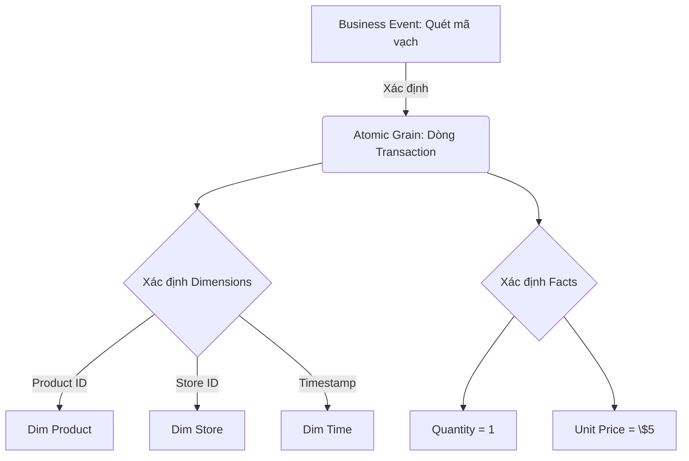

Khi thiết kế mô hình dữ liệu (Dimensional Modeling), bước "chọn Grain" thường bị xem nhẹ cho đến khi hệ thống Data Warehouse của bạn đạt quy mô Terabytes. Dưới góc nhìn kiến trúc hệ thống, **Grain** không chỉ là "một dòng dữ liệu đại diện cho cái gì", mà nó là một bản hợp đồng ràng buộc (Binding Contract) quyết định phân phối dữ liệu vật lý (Physical Data Distribution), cường độ Network Shuffle, và giới hạn hiệu năng của Compute Engine.

Trong bài viết này, chúng ta sẽ mổ xẻ **Atomic Grain** dưới góc độ kỹ thuật sâu (Hardcore Engineering), phân tích các rủi ro vận hành (Operational Risks) khi thiết kế sai, và cách đánh đổi (Trade-offs) trong môi trường xử lý phân tán như Apache Spark, BigQuery, Snowflake.

## Kiến Trúc Vật Lý: Atomic Grain vs. Aggregated Grain


*Hình 1: Mô hình Star Schema tiêu chuẩn. Grain quyết định khóa chính (Primary Key) của Fact Table và các ràng buộc tham chiếu (Foreign Keys).*

### 1. The Binding Contract (Bản Hợp Đồng Ràng Buộc)
Grain quy định mức độ chi tiết nhất (Atomic level) của bảng Fact. Nếu Grain là "mỗi lần quét mã vạch" (Transactional), thì Fact Table phải bao gồm các khóa ngoại trỏ tới `dim_product`, `dim_store`, `dim_date`, và `dim_time`. Nếu có bất kỳ column nào vi phạm Grain này (VD: `order_shipping_fee` mang ý nghĩa cấp độ đơn hàng), bạn đang phá vỡ "Binding Contract".



### 2. Sự Cố Vận Hành: Cartesian Explosion & Double-Counting
Lỗi phổ biến nhất của các kỹ sư dữ liệu là **Mixed Grain** (Trộn lẫn nhiều mức độ chi tiết trong cùng một bảng). Ví dụ, đẩy phí vận chuyển `shipping_fee` (thuộc cấp độ Order) xuống cấp độ Order-Line (Chi tiết mặt hàng).

Khi Data Analyst thực hiện truy vấn `SUM(shipping_fee)` group by Store, doanh thu sẽ bị nhân đôi hoặc nhân ba. Ở mức độ Compute Engine, khi JOIN một Fact Table có Mixed Grain với các Dimension Tables khổng lồ, hệ thống có thể đối mặt với **Cartesian Explosion**. 

Trong Apache Spark, việc JOIN sai lệch Grain sẽ ép Spark thực hiện Cross-Join hoặc BroadCastNestedLoopJoin, khiến RAM của Executors cạn kiệt và dẫn tới lỗi **JVM OOMKilled**:

```python
# Ví dụ về lỗi phát sinh do vi phạm Grain trên PySpark
# order_df có grain là Order, order_line_df có grain là Order Line
# JOIN 1-N thiếu điều kiện hoặc mang thuộc tính cha xuống con làm sinh lặp dữ liệu

# Cách khắc phục bằng Allocation (Phân bổ giá trị)
# Phân bổ phí ship bằng tỷ trọng doanh thu của line item
allocated_df = spark.sql("""
    SELECT 
        l.order_id,
        l.product_id,
        l.line_revenue,
        o.shipping_fee * (l.line_revenue / SUM(l.line_revenue) OVER (PARTITION BY l.order_id)) AS allocated_shipping_fee
    FROM order_line l
    JOIN orders o ON l.order_id = o.order_id
""")
```

## Systemic Trade-offs: Đánh đổi Kiến Trúc Hệ Thống

Thiết kế Grain là trò chơi của sự đánh đổi giữa **Storage**, **Compute Latency**, và **Flexibility**.

### 1. Atomic Grain: Flexibility vs. Compute Cost (Network Shuffle)
Lưu trữ ở mức **Atomic Grain** (Transaction) cho phép Slicing & Dicing vô hạn, phục vụ Machine Learning và Exploratory Data Analysis. 
- **Đánh đổi:** Kích thước bảng phình to cực nhanh. Khi query, Compute Engine (Ví dụ: BigQuery Dremel, Spark) phải scan toàn bộ block dữ liệu và thực hiện **Network Shuffle** lớn (Hash Aggregate).
- **Khắc phục:** Sử dụng Clustering, Z-Ordering, hoặc Partitioning theo Time-based dimension.

```sql
-- Delta Lake Z-Ordering để giảm Shuffle khi query Atomic Grain
CREATE TABLE fact_retail_sales (
    transaction_id STRING,
    product_id INT,
    store_id INT,
    sale_ts TIMESTAMP,
    quantity INT
)
USING DELTA
PARTITIONED BY (DATE(sale_ts));

-- Tối ưu hóa đọc dữ liệu (Data Skipping) bằng Z-Order
OPTIMIZE fact_retail_sales
ZORDER BY (store_id, product_id);
```

### 2. Aggregated Grain: Query Latency vs. Data Freshness
Để phục vụ Dashboard Real-time (Sub-second latency), các kỹ sư tạo ra các bảng tổng hợp (Periodic Snapshot Grain).
- **Đánh đổi:** Mất đi sự linh hoạt. Bạn không thể "khoan" (Drill-down) xuống xem chi tiết sản phẩm nếu Snapshot chỉ lưu tổng doanh thu theo Store. Hơn nữa, việc duy trì Aggregated Tables liên tục tốn tài nguyên và tăng Data Stale (Dữ liệu cũ, giảm Freshness).
- **Thực tiễn (Best Practice):** Giữ Atomic Grain trong Data Lakehouse/Warehouse như một Single Source of Truth (SSOT). Chỉ tạo Aggregated Grain ở lớp phục vụ (Serving Layer) bằng Materialized Views hoặc Semantic Layer (dùng dbt).

```yaml
# Định nghĩa Aggregated Grain thông qua dbt (Data Build Tool)
# dbt_project.yml
models:
  marts:
    sales:
      agg_store_daily_sales:
        +materialized: incremental
        +unique_key: ['store_id', 'date_key']
        +cluster_by: ['store_id']
```

## Giải Quyết Bài Toán Accumulating Snapshot Grain

Đối với các pipeline có vòng đời dài (VD: Xử lý đơn hàng E-commerce, Claim bảo hiểm), chúngua sử dụng **Accumulating Snapshot Grain**. Một dòng đại diện cho toàn bộ vòng đời của thực thể, và liên tục được UPDATE khi thực thể chuyển state.

Dưới góc nhìn kiến trúc phân tán (HDFS/S3), việc UPDATE liên tục một dòng là **Anti-pattern** vì dữ liệu là Immutable (không thể thay đổi). Các định dạng bảng hiện đại như Apache Iceberg, Delta Lake sử dụng **SCD Type 1/Type 2** kết hợp `MERGE INTO` để giải quyết:

```sql
-- Thực hiện Update Accumulating Snapshot Grain bằng MERGE trên Databricks Delta
MERGE INTO fact_order_fulfillment AS target
USING stream_order_updates AS source
ON target.order_id = source.order_id
WHEN MATCHED AND source.status = 'SHIPPED' THEN
  UPDATE SET 
    target.shipped_date_key = source.date_key,
    target.lag_pack_to_ship_days = DATEDIFF(source.date_key, target.packed_date_key),
    target.updated_at = current_timestamp()
WHEN NOT MATCHED THEN
  INSERT (order_id, created_date_key, status, updated_at)
  VALUES (source.order_id, source.date_key, source.status, current_timestamp());
```

## Những Rủi Ro Vận Hành Khác

1. **Consumer Lag trong Streaming:** Nếu bạn chọn Grain quá nhỏ (Ví dụ: Clickstream Events ở mức Millisecond) cho Kafka -> Flink -> Iceberg Pipeline, hệ thống sẽ đối mặt với Write Amplification lớn (Tạo ra quá nhiều file nhỏ - Small Files Problem). Cách xử lý là Micro-batching hoặc tăng `flush.size` để tối ưu I/O.
2. **Dimension Churn (Trôi dạt chiều):** Nếu Grain của Fact Table liên kết với một Dimension thay đổi quá nhanh (Rapidly Changing Dimension), bảng Fact sẽ phải gánh áp lực lưu trữ các Surrogate Keys. Tách các cột biến động nhanh thành Mini-Dimension.

## Kết Luận

Thiết kế Grain không phải là một quyết định lý thuyết của DA. Nó ảnh hưởng trực tiếp đến hiệu suất phần cứng vật lý: Từ cường độ I/O, Network Shuffle cho đến OOM (Out-of-Memory). 
Một Data Engineer xuất sắc phải biết cách lựa chọn Atomic Grain để đảm bảo sự vẹn toàn của dữ liệu, đồng thời sử dụng các kỹ thuật như Z-Ordering, Partitioning, Materialized Views để che lấp đi các điểm yếu về Query Latency.

---

## Nguồn Tham Khảo (References)
* [The Data Warehouse Toolkit - Ralph Kimball Group](https://www.kimballgroup.com/data-warehouse-business-intelligence-resources/books/data-warehouse-dw-toolkit/)
* [Databricks: Data Modeling and Z-Ordering in Delta Lake](https://docs.databricks.com/en/delta/data-skipping.html)
* [Netflix Tech Blog: Data Engineering at Scale](https://netflixtechblog.com/)
* [AWS Architecture Blog: Real-time Analytics & Dimensional Modeling](https://aws.amazon.com/blogs/architecture/)
* **Designing Data-Intensive Applications** - Martin Kleppmann. (Chương: Batch Processing & Physical Data Storage).
