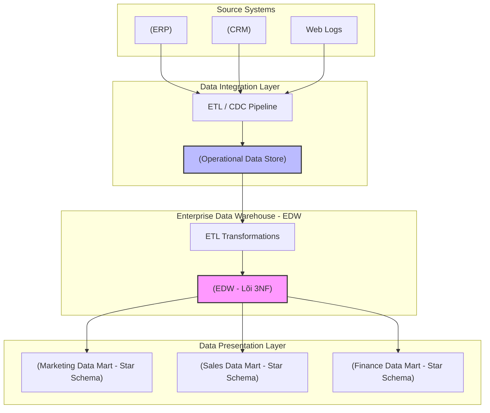

Khi nói về Bill Inmon - "Cha đẻ của Data Warehouse", chúng ta thường nghe đến câu thần chú: *Subject-Oriented, Integrated, Time-Variant, Non-Volatile*. Tuy nhiên, dưới góc nhìn của một Data Engineer hoặc System Architect, phương pháp luận **Corporate Information Factory (CIF)** của Inmon không chỉ là một định nghĩa lý thuyết, mà là một bản thiết kế hệ thống phân tán (distributed system design) đòi hỏi sự đánh đổi khốc liệt giữa **Write Heavy (Tính toàn vẹn khi ghi)** và **Read Heavy (Tốc độ khi truy vấn)**.

Bài viết này sẽ mổ xẻ kiến trúc CIF theo hướng Top-Down, phân tích các rủi ro vận hành khi thiết kế Enterprise Data Warehouse (EDW) ở chuẩn 3NF và cách các khái niệm này vẫn đang ngầm định hình Modern Data Stack ngày nay.

## 1. Kiến trúc Thực thi Vật lý (Physical Execution Architecture)

Inmon áp dụng chiến lược **Top-Down** (Từ trên xuống dưới). Khác với Kimball (Bottom-up) tập trung vào việc xây dựng nhanh các Data Mart phục vụ Business, Inmon yêu cầu xây dựng một lõi dữ liệu trung tâm (EDW) hoàn toàn chuẩn hóa (Normalized - thường là chuẩn 3NF) trước khi cung cấp dữ liệu cho bất kỳ hệ thống phân tích nào.

Mục tiêu tối thượng của Inmon là tạo ra một **Single Version of the Truth** (Phiên bản duy nhất của sự thật) bất biến ở cấp độ toàn doanh nghiệp (Enterprise-wide).



### Các Component Cốt Lõi:
1. **Operational Data Store (ODS):** Lưu trữ dữ liệu transaction gần thời gian thực (near real-time) từ source. ODS thường có độ trễ thấp (low latency) và cấu trúc schema gần giống với Source System. Nhiệm vụ của nó là gánh tải query cho các hệ thống vận hành, tránh làm sập cơ sở dữ liệu OLTP gốc (Ví dụ: Ứng dụng tra cứu lịch sử đơn hàng của Customer Service).
2. **Enterprise Data Warehouse (EDW - 3NF):** Trái tim của hệ thống. Dữ liệu từ ODS được làm sạch, đồng nhất mã hóa, và đưa vào cấu trúc 3rd Normal Form. Lớp này lưu trữ dữ liệu lịch sử một cách toàn vẹn. Tuyệt đối không cho phép end-user hoặc Dashboard truy vấn trực tiếp vào đây vì schema cực kỳ phức tạp với hàng trăm bảng.
3. **Data Marts (Lớp Phục vụ):** Dữ liệu 3NF từ EDW được trích xuất và phi chuẩn hóa (denormalized) thành các mô hình đa chiều (Dimensional Models - Star/Snowflake Schema). Đây là nơi các công cụ BI (Tableau, PowerBI) kết nối vào để có *Read Throughput* cực cao.

## 2. Mã nguồn Thực chiến: Thiết kế Schema 3NF

Để hiểu tại sao 3NF lại khắt khe, hãy xem cách một kỹ sư định nghĩa DDL cho lõi EDW theo chuẩn Inmon. Không có sự lặp lại dữ liệu (Data Redundancy) nào được cho phép.

```sql
-- DDL cho Lõi EDW (PostgreSQL / Snowflake) theo chuẩn 3NF
CREATE TABLE edw.customers (
    customer_hk VARCHAR(64) PRIMARY KEY, -- Hash Key
    customer_id VARCHAR(50) NOT NULL,    -- Natural Key
    first_name VARCHAR(100),
    last_name VARCHAR(100),
    email VARCHAR(255) UNIQUE,
    created_at TIMESTAMP,
    updated_at TIMESTAMP
);

CREATE TABLE edw.customer_addresses (
    address_hk VARCHAR(64) PRIMARY KEY,
    customer_hk VARCHAR(64) REFERENCES edw.customers(customer_hk),
    street_address VARCHAR(255),
    city VARCHAR(100),
    state VARCHAR(50),
    zip_code VARCHAR(20),
    effective_start_date TIMESTAMP,
    effective_end_date TIMESTAMP
);

CREATE TABLE edw.sales_transactions (
    transaction_hk VARCHAR(64) PRIMARY KEY,
    customer_hk VARCHAR(64) REFERENCES edw.customers(customer_hk),
    transaction_timestamp TIMESTAMP,
    amount DECIMAL(15, 2),
    currency VARCHAR(3)
);
```
Trong cấu trúc này, nếu Khách hàng đổi địa chỉ, chúng ta không `UPDATE` bảng `customers`. Chúng ta thêm một dòng mới vào bảng `customer_addresses` và đóng lịch sử (Expire old record) dựa trên `effective_end_date`. Điều này đảm bảo tính vẹn toàn tuyệt đối của Audit Trail.

## 3. Systemic Trade-offs & Rủi ro Vận hành (Operational Risks)

Thiết kế EDW theo chuẩn 3NF của Inmon giải quyết triệt để bài toán **Update Anomalies** (bất thường khi cập nhật) và Data Integrity, nhưng lại đẩy hệ thống vào những rủi ro cực lớn về năng lực tính toán (Compute Cost).

### 3.1. Nút thắt cổ chai ETL (ETL Bottlenecks) & Độ trễ (Latency)
Dữ liệu phải trải qua vòng đời rất dài: `Source -> ODS -> EDW (3NF) -> Data Mart`. 
* **Trade-off:** Kiến trúc này đánh đổi **Data Freshness** (độ trễ cao) để lấy **Data Consistency** (tính nhất quán). 
* **Incident Thực tế:** Trong các hệ thống lớn (Ví dụ: Ngân hàng Core Banking), quá trình load dữ liệu hàng ngày (Daily Batch EOD) từ ODS vào hàng nghìn bảng 3NF của EDW có thể kéo dài 6-8 tiếng. Nếu một batch thất bại lúc 2h sáng do lỗi Schema Drift từ Upstream, hiệu ứng dây chuyền (domino effect) sẽ khiến toàn bộ Data Mart bị trễ hạn (SLA Breach) vào buổi sáng, làm gián đoạn mọi báo cáo tài chính.

### 3.2. Cartesian Explosion và Nỗi ám ảnh Cascading Joins
Để tạo ra một Data Mart từ lõi 3NF, bạn phải thực hiện một truy vấn `SELECT` với hàng chục phép `JOIN`.
* Trong môi trường xử lý song song phân tán (MPP) như Snowflake, BigQuery, hoặc Spark, việc JOIN quá nhiều bảng lớn sẽ dẫn đến **Network Shuffle** khổng lồ. Các node compute phải đẩy dữ liệu qua lại qua mạng để khớp khóa (Key matching).
* **Rủi ro OOMKilled:** Nếu các khóa JOIN không được phân phối đều (Data Skew - Lệch dữ liệu), một vài node sẽ phải gánh bộ nhớ quá lớn, dẫn đến hiện tượng *Spill-to-disk* (ghi tạm ra ổ cứng làm giảm I/O trầm trọng) hoặc Crash tiến trình (*JVM OOMKilled*).

## 4. Inmon Trong Kỷ Nguyên Modern Data Stack

Triết lý của Inmon không hề lỗi thời; nó chỉ được thay đổi hình hài vật lý để phù hợp với kiến trúc điện toán đám mây (Cloud Computing).

### 4.1. Data Vault 2.0: Sự tiến hóa của 3NF
Việc bảo trì một mô hình 3NF khổng lồ với các Foreign Keys ràng buộc chặt chẽ là quá cứng nhắc và khó scale up. **Data Vault 2.0** (do Dan Linstedt thiết kế) đã tái cấu trúc lõi EDW của Inmon thành Hubs (Khóa nghiệp vụ), Links (Quan hệ) và Satellites (Thuộc tính). 

Data Vault sử dụng Hash Keys (MD5/SHA) thay vì Surrogate Keys (Auto-increment), cho phép load dữ liệu song song (Parallel Load) cực nhanh vào lõi EDW, giải quyết điểm yếu lớn nhất của Inmon là ETL Bottleneck.

### 4.2. Sự tương đồng với Medallion Architecture (Lakehouse)
Nếu nhìn vào kiến trúc Medallion (Bronze -> Silver -> Gold) của Databricks, ta thấy tư tưởng Top-Down của Inmon được kế thừa hoàn hảo:

* **Lớp Bronze (Raw):** Tương đương với ODS. Dữ liệu thô, Append-only.
* **Lớp Silver (Curated):** Hoạt động chính xác như định nghĩa của Inmon về EDW 3NF: Dữ liệu đã được làm sạch, deduplicated, đồng nhất mã hóa, đóng vai trò Single Source of Truth.
* **Lớp Gold (Consumption):** Tương đương với Data Marts, chứa các Star Schemas phục vụ Reporting.

Sự khác biệt duy nhất là ngày nay chúng ta tận dụng "Schema-on-read" và lưu trữ đám mây giá rẻ (S3/GCS) để bypass chi phí đắt đỏ của hệ quản trị cơ sở dữ liệu (RDBMS) truyền thống.

## 5. Tổng Kết

Corporate Information Factory (CIF) của Bill Inmon là một tuyệt tác về System Design. Bất chấp những thách thức về **ETL bottlenecks** hay chi phí tính toán mạng (Network Shuffle) khi thực hiện **Cascading Joins**, tư duy tổ chức dữ liệu theo chiều dọc (Top-Down) và bảo vệ "Phiên bản duy nhất của sự thật" [Single Version of the Truth] ở lõi hệ thống vẫn là tiêu chuẩn vàng (Gold Standard) cho các kỹ sư dữ liệu cấp cao khi thiết kế Data Platform quy mô Enterprise.

## 6. Nguồn Tham Khảo (References)
* [Building the Data Warehouse (4th Edition] - W.H. Inmon][https://www.wiley.com/en-us/Building+the+Data+Warehouse%2C+4th+Edition-p-9780764599446]
* [AWS Whitepapers: Data Warehousing Concepts][https://docs.aws.amazon.com/whitepapers/latest/building-data-lakes/data-warehousing-concepts.html]
* Kleppmann, M. (2017). *Designing Data-Intensive Applications*. O'Reilly Media.
* [Databricks Academy - Data Modeling Strategies: Data Vault 2.0 and Lakehouse](https://www.databricks.com/discover/data-vault]
