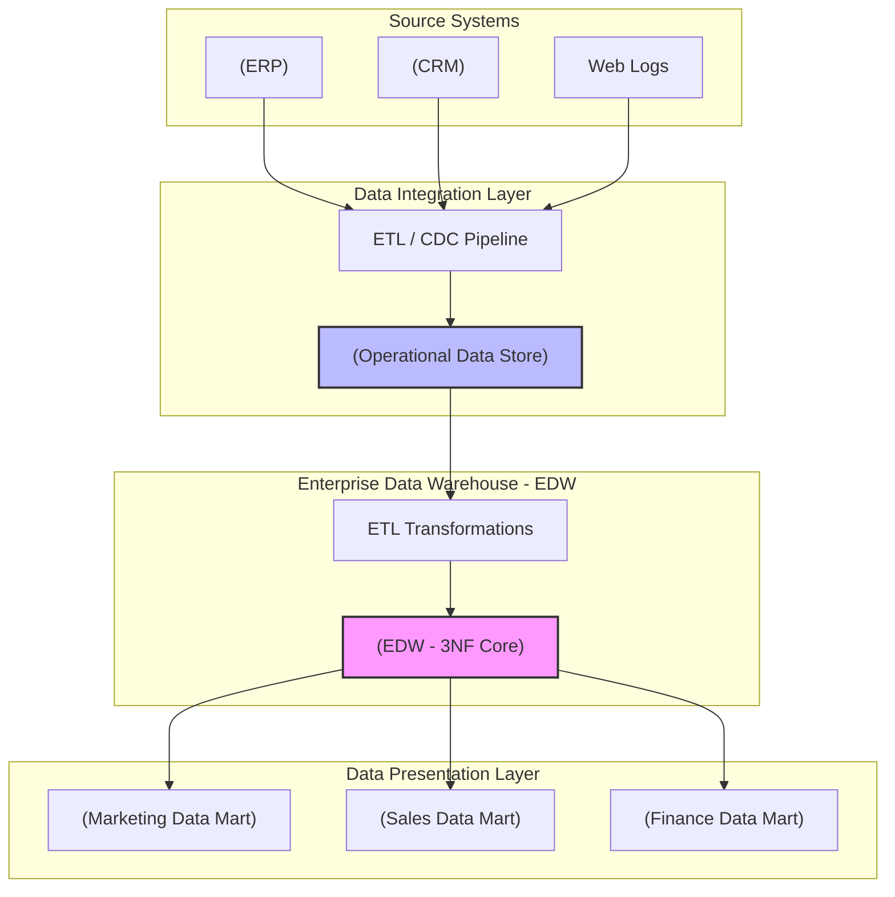

Khi nói về Bill Inmon - "Cha đẻ của Data Warehouse", chúng ta thường nghe đến câu thần chú: *Subject-Oriented, Integrated, Time-Variant, Non-Volatile*. Tuy nhiên, dưới góc nhìn của một Data Engineer hoặc System Architect, phương pháp luận **Corporate Information Factory (CIF)** của Inmon không chỉ là một định nghĩa lý thuyết, mà là một bản thiết kế hệ thống phân tán (distributed system design) đòi hỏi sự đánh đổi khốc liệt giữa **Write Heavy (ETL)** và **Read Heavy (Analytics)**.

Bài viết này sẽ mổ xẻ kiến trúc CIF theo hướng Top-Down, phân tích các rủi ro vận hành khi thiết kế Enterprise Data Warehouse (EDW) ở chuẩn 3NF và cách các khái niệm này vẫn đang ngầm định hình Modern Data Stack ngày nay.

## 1. Kiến trúc Thực thi Vật lý (Physical Execution Architecture)

Inmon áp dụng chiến lược **Top-Down**, nghĩa là phải xây dựng một lõi dữ liệu trung tâm (EDW) hoàn toàn chuẩn hóa (Normalized - thường là 3NF) trước khi cung cấp dữ liệu cho các Data Marts (dạng Dimensional).



### Các Component Cốt Lõi:
1. **Operational Data Store (ODS):** Lưu trữ dữ liệu transaction gần thời gian thực (near real-time) từ source. ODS thường có độ trễ thấp (low latency) và cấu trúc schema gần giống với Source System. Nhiệm vụ của nó là gánh tải query cho các hệ thống vận hành, tránh làm sập DB OLTP gốc.
2. **Enterprise Data Warehouse (EDW - 3NF):** Trái tim của hệ thống. Dữ liệu từ ODS được làm sạch, đồng nhất mã hóa, và đưa vào cấu trúc 3rd Normal Form. Lớp này hoạt động như một *Single Source of Truth* bất biến. Tuyệt đối không cho phép end-user truy vấn trực tiếp vào đây vì số lượng bảng liên kết là khổng lồ.
3. **Data Marts (Star/Snowflake Schema):** Lớp phục vụ (Serving layer). Dữ liệu 3NF từ EDW được phi chuẩn hóa (denormalized) thành các bảng Fact và Dimension để tối ưu hóa *Read Throughput* cho các công cụ BI.

## 2. Systemic Trade-offs & Rủi ro Vận hành (Operational Risks)

Thiết kế EDW theo chuẩn 3NF của Inmon giải quyết triệt để bài toán **Update Anomalies** (bất thường khi cập nhật) và tiết kiệm không gian lưu trữ (Storage Cost), nhưng lại đẩy hệ thống vào những rủi ro về năng lực tính toán (Compute Cost).

### 2.1. Nút thắt cổ chai ETL (ETL Bottlenecks) & Độ trễ (Latency)
Dữ liệu phải trải qua ít nhất 3 lần biến đổi: `Source -> ODS -> EDW (3NF) -> Data Mart`. 
* **Trade-off:** Kiến trúc này đánh đổi **Data Freshness** (độ trễ cao) để lấy **Data Consistency** (tính nhất quán tuyệt đối). 
* **Incident Thực tế:** Trong các hệ thống lớn, quá trình load dữ liệu hàng ngày (Daily Batch) từ ODS vào hàng nghìn bảng 3NF của EDW có thể kéo dài vượt quá *SLA Window*. Nếu một batch thất bại lúc 2h sáng, hiệu ứng dây chuyền (domino effect) sẽ khiến toàn bộ Data Mart bị trễ hạn vào buổi sáng.

### 2.2. Cartesian Explosion và Nỗi ám ảnh Cascading Joins
Khi bạn cố gắng truy vấn dữ liệu từ lớp EDW 3NF để cấp cho Data Mart, bạn phải thực hiện hàng chục phép `JOIN`.
* Trong môi trường xử lý song song phân tán (MPP) như Snowflake hay BigQuery, việc JOIN quá nhiều bảng lớn sẽ dẫn đến **Network Shuffle** khổng lồ. Các node compute phải đẩy dữ liệu qua lại qua mạng để khớp khóa (Key matching).
* **Rủi ro OOMKilled:** Nếu các khóa JOIN không được phân phối đều (Data Skew), một vài node sẽ phải gánh bộ nhớ quá lớn, dẫn đến hiện tượng *Spill-to-disk* (ghi tạm ra ổ cứng làm giảm I/O trầm trọng) hoặc Crash tiến trình (*JVM OOMKilled* trong Spark).

## 3. Triển khai Thực chiến (Show, Don't Tell): Load dữ liệu vào EDW 3NF

Để duy trì tính Time-Variant (Biến thiên theo thời gian) trong Inmon EDW, chúng ta áp dụng mô hình Slowly Changing Dimensions (SCD) Type 2 trên chuẩn 3NF.

Dưới đây là một pattern `SQL MERGE` kinh điển (chạy trên Snowflake/Databricks) để cập nhật thông tin khách hàng từ lớp Staging vào lõi EDW, duy trì lịch sử biến động mà không ghi đè dữ liệu cũ.

```sql
-- Pattern SCD Type 2 vào lõi EDW 3NF
MERGE INTO edw.customer_3nf AS target
USING (
    -- Bước 1: Xác định các record thay đổi hoặc thêm mới
    SELECT 
        customer_id, 
        customer_name, 
        address,
        'ACTIVE' as is_active,
        CURRENT_TIMESTAMP() as effective_date,
        '9999-12-31'::DATE as end_date
    FROM staging.customer_updates
) AS source
ON target.customer_id = source.customer_id

-- Bước 2: Đóng lịch sử của record cũ (Expire old record)
WHEN MATCHED 
    AND (target.customer_name != source.customer_name OR target.address != source.address)
    AND target.is_active = 'ACTIVE'
THEN UPDATE SET 
    target.is_active = 'INACTIVE',
    target.end_date = CURRENT_TIMESTAMP()

-- Bước 3: Insert record mới (mọi trường hợp thay đổi hoặc chưa có)
WHEN NOT MATCHED THEN
INSERT (
    customer_id, 
    customer_name, 
    address, 
    is_active, 
    effective_date, 
    end_date
)
VALUES (
    source.customer_id, 
    source.customer_name, 
    source.address, 
    source.is_active, 
    source.effective_date, 
    source.end_date
);
```

> [!WARNING]
> Lệnh `MERGE` là một thao tác rất đắt đỏ (Costly Operation) trên định dạng cột (Columnar Storage) như Parquet/Iceberg vì nó yêu cầu đọc - ghi lại toàn bộ file. Nếu dữ liệu thay đổi quá nhiều (High churn), thao tác này sẽ dẫn đến **Small File Problem** và **Fragmentation**, đòi hỏi phải chạy `OPTIMIZE` hoặc `VACUUM` (Z-Ordering) thường xuyên.

## 4. Inmon Trong Kỷ Nguyên Modern Data Stack

Triết lý của Inmon không hề lỗi thời; nó chỉ được thay đổi hình hài vật lý để phù hợp với kiến trúc điện toán đám mây.

### 4.1. Data Vault 2.0: Sự tiến hóa của 3NF
Việc bảo trì một mô hình 3NF khổng lồ quá cứng nhắc và khó thêm nguồn dữ liệu mới. **Data Vault 2.0** (do Dan Linstedt thiết kế) đã tái cấu trúc lõi EDW của Inmon thành Hubs (Khóa nghiệp vụ), Links (Quan hệ) và Satellites (Thuộc tính). Data Vault cho phép load dữ liệu song song cực nhanh và linh hoạt tuyệt đối khi scale, giải quyết điểm yếu lớn nhất của Inmon.

### 4.2. Medallion Architecture (Databricks)
Nếu nhìn vào kiến trúc Medallion (Bronze -> Silver -> Gold) của Lakehouse, ta có thể thấy hình bóng của Inmon hiện diện rõ rệt.


* **Lớp Silver (Curated):** Hoạt động chính xác như định nghĩa của Inmon về một EDW lõi: Dữ liệu đã được làm sạch, đồng nhất, và đóng vai trò Single Source of Truth. Mặc dù không bắt buộc phải ở dạng 3NF khắt khe, triết lý "Tích hợp trước" vẫn được giữ nguyên.
* **Lớp Gold (Consumption):** Tương đương với Data Marts, được tối ưu hóa cho Aggregation và Reporting.

Sự khác biệt duy nhất là ngày nay chúng ta tận dụng "Schema-on-read" và lưu trữ giá rẻ (S3/GCS) để bypass chi phí đắt đỏ của RDBMS truyền thống, cho phép Data Engineer đẩy dữ liệu vào Data Lakehouse thô trước rồi mới "chuẩn hóa" dần theo từng lớp.

## Tổng Kết

Corporate Information Factory (CIF) của Bill Inmon là bài học kinh điển về thiết kế hệ thống dữ liệu. Bất chấp những thách thức về **ETL bottlenecks** hay chi phí tính toán **Cascading Joins**, tư duy tổ chức dữ liệu theo chiều dọc (Top-Down) và bảo vệ "Phiên bản duy nhất của sự thật" (Single Version of the Truth) ở lõi hệ thống vẫn là kim chỉ nam cho các kỹ sư dữ liệu cấp cao khi thiết kế Data Platform quy mô Enterprise.

## Nguồn Tham Khảo
* [Building the Data Warehouse (4th Edition) - W.H. Inmon](https://www.wiley.com/en-us/Building+the+Data+Warehouse%2C+4th+Edition-p-9780764599446)
* [Databricks Academy - Data Modeling Strategies: Data Vault 2.0 and Lakehouse](https://www.databricks.com/discover/data-vault)
* [AWS Architecture Blog: Modern Data Architecture Rationales on AWS](https://aws.amazon.com/blogs/architecture/)
* Sách *Designing Data-Intensive Applications* - Martin Kleppmann (Chương 3: Storage and Retrieval - Phân tích về Columnar và OLAP).
