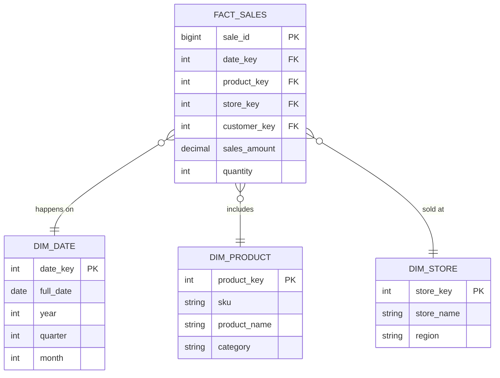

Phương pháp luận **Kimball (Dimensional Modeling)**, được định hình bởi Ralph Kimball, không chỉ là một lý thuyết thiết kế Data Warehouse truyền thống mà còn là nền tảng cốt lõi (mental model) cho các Data Engineer hiện đại khi xây dựng lớp dữ liệu phục vụ phân tích (Serving/Gold Layer). 

Thay vì cố gắng chuẩn hóa toàn bộ dữ liệu tổ chức theo hướng Top-Down (như phương pháp Inmon - 3NF), Kimball tiếp cận theo hướng **Bottom-Up**: xây dựng các **Data Marts** phi chuẩn hóa (Denormalized) tập trung vào từng quy trình nghiệp vụ cụ thể, sau đó liên kết chúng lại bằng các chiều dữ liệu dùng chung (**Conformed Dimensions**).

---

## 1. Kiến trúc Thực thi Vật lý (Physical Execution Architecture)

Trái tim của Kimball là **Star Schema** (Lược đồ hình sao). Nó phân tách dữ liệu thành 2 loại bảng: **Fact Tables** (chứa metrics/sự kiện đo lường) và **Dimension Tables** (chứa ngữ cảnh mô tả sự kiện).



### 1.1. Tại sao Star Schema "khớp" với Columnar Databases?
Các OLAP Database hiện đại (BigQuery, ClickHouse, Snowflake, Redshift) lưu trữ dữ liệu dạng **Columnar** (theo cột) thay vì Row-based.
- **Vectorized Execution:** Khi bạn thực thi truy vấn `SELECT SUM(sales_amount) FROM FACT_SALES JOIN DIM_PRODUCT WHERE category = 'Electronics'`, engine chỉ quét đúng cột `sales_amount`, `product_key` và `category`.
- **Predicate Pushdown & Compression:** Dimension tables thường có cardinality thấp (ví dụ: `region` chỉ có vài chục giá trị). Columnar DB nén các cột này bằng kỹ thuật như Run-Length Encoding (RLE) hay Dictionary Encoding rất hiệu quả, giúp thao tác Scan và JOIN (đặc biệt là Hash JOIN) diễn ra hoàn toàn trên RAM (In-memory).

### 1.2. Hạt Dữ Liệu (Grain) & Các Loại Fact Tables
Xác định **Grain (mức độ chi tiết nhất)** là bước sống còn. Sai lầm phổ biến là pre-aggregate (tổng hợp trước) dữ liệu vào Fact table, dẫn đến hiện tượng mất chi tiết khi BI Engineer cần drill-down (khoan sâu).

Có 3 loại Fact phổ biến:
1. **Transaction Fact:** Mỗi dòng là một sự kiện giao dịch (ví dụ: 1 dòng = 1 item trong hóa đơn). Khối lượng dữ liệu cực lớn, Insert-only.
2. **Periodic Snapshot Fact:** Chụp lại trạng thái định kỳ (ví dụ: Tồn kho cuối ngày). Thường dùng để tránh phải tính toán lại toàn bộ lịch sử giao dịch.
3. **Accumulating Snapshot Fact:** Theo dõi vòng đời của một thực thể. (Ví dụ: Trạng thái đơn hàng `Created -> Shipped -> Delivered`). Cần update liên tục các cột timestamp.

---

## 2. Thách thức Kỹ thuật: Slowly Changing Dimensions (SCD)

Trong thế giới thực, Dimension thay đổi (khách hàng đổi địa chỉ, sản phẩm đổi danh mục). Để duy trì tính nhất quán của lịch sử (Historical Consistency), ta dùng **SCD Type 2**.

### Code Thực chiến: Xử lý SCD Type 2 với Delta Lake (SQL MERGE)
Việc implement SCD2 bằng SQL thô rất phức tạp và dễ gây lỗi **Data Duplication**. Dưới đây là cách sử dụng `MERGE` statement chuẩn mực trên Databricks để đóng mốc thời gian bản ghi cũ và insert bản ghi mới:

```sql
-- Dữ liệu nguồn CDC (Change Data Capture)
WITH source_data AS (
  SELECT id, name, address, current_timestamp() as update_time 
  FROM stg_customers
),
-- Tạo tập dữ liệu kết hợp để vừa UPDATE bản ghi cũ, vừa INSERT bản ghi mới
merge_data AS (
  SELECT * FROM source_data
  UNION ALL
  SELECT * FROM source_data 
  -- JOIN với bảng đích để tìm các bản ghi đã thay đổi thuộc tính
  JOIN target_dim_customers t ON source_data.id = t.id
  WHERE t.is_current = true AND t.address <> source_data.address
)

MERGE INTO target_dim_customers AS t
USING merge_data AS s
ON t.id = s.id AND t.is_current = true
-- Đóng bản ghi cũ
WHEN MATCHED AND t.address <> s.address THEN
  UPDATE SET t.is_current = false, t.valid_to = s.update_time
-- Chèn bản ghi mới
WHEN NOT MATCHED THEN
  INSERT (id, name, address, valid_from, valid_to, is_current)
  VALUES (s.id, s.name, s.address, s.update_time, '9999-12-31', true);
```

### dbt Snapshots: Cách giải quyết hiện đại
Thay vì viết SQL MERGE phức tạp, Modern Data Stack sử dụng `dbt snapshots` để tự động hóa quá trình SCD Type 2 bằng cấu hình YAML:

```yaml
# snapshots/dim_customer.yml
snapshots:
  - name: dim_customer_snapshot
    config:
      target_schema: snapshots
      unique_key: customer_id
      strategy: timestamp
      updated_at: updated_at # Trường theo dõi sự thay đổi
```
Khi chạy `dbt snapshot`, dbt sẽ tự động generate ra DDL/DML tương ứng để duy trì cột `dbt_valid_from` và `dbt_valid_to`.

---

## 3. Systemic Trade-offs & Operational Risks (Đánh đổi Hệ thống)

Việc áp dụng Kimball không phải là "viên đạn bạc". Nó mang lại những rủi ro vận hành (Operational Risks) đặc thù:

### 3.1. Cartesian Explosion & Choke Points
- **Nguyên nhân:** Khi bạn thiết kế Fact Table không cẩn thận và thực hiện JOIN với quá nhiều Dimension Tables lớn, Query Planner của database có thể chọn sai thuật toán JOIN (Nested Loop thay vì Hash JOIN), dẫn đến bùng nổ tổ hợp (Cartesian Explosion).
- **Hệ quả:** Truy vấn bị treo (Hung query), **OOMKilled (Out of Memory)** trên các worker nodes (ví dụ trên Spark hoặc Trino), hoặc **Spill-to-disk** làm tăng độ trễ (Latency) lên hàng chục lần.

### 3.2. Cơn ác mộng "Late Arriving Facts & Dimensions"
- Dữ liệu Fact có thể đến trước khi hệ thống tạo xong Dimension (ví dụ: thiết bị IoT gửi metric nhưng chưa được đăng ký trong DB).
- **Cách xử lý:** Trong pipeline ELT, thay vì loại bỏ (Drop) Fact, ta tạo một **Dummy Dimension** (với `SK = -1`, `Name = 'Unknown'`). Khi Dimension thực sự xuất hiện, quá trình ETL sẽ cập nhật lại Dummy Record này.

### 3.3. Bottleneck trong Cập nhật SCD
- Sử dụng **SCD Type 2** làm tăng khối lượng dữ liệu lưu trữ một cách chóng mặt (Storage Cost) nếu thuộc tính thay đổi liên tục (ví dụ: trạng thái online/offline của tài xế Uber).
- **Trade-off:** Chuyển sang dùng Fact table để lưu trạng thái (Status Fact) thay vì nhồi nhét vào Dimension.

---

## 4. Kimball trong Hệ sinh thái Data Lakehouse (Uber, Netflix, Databricks)

### 4.1. Sự giao thoa với Medallion Architecture
Tại các công ty công nghệ lớn, kiến trúc Kimball được tích hợp một cách mượt mà vào **Medallion Architecture (Bronze - Silver - Gold)**:


- **Silver Layer:** Thường đóng vai trò lưu trữ Enterprise Data (tương tự khái niệm Inmon), giữ lịch sử toàn vẹn.
- **Gold Layer:** Nơi **Kimball** tỏa sáng. Dữ liệu được phi chuẩn hóa thành các bảng Dimension và Fact, sẵn sàng cho công cụ BI (Tableau, Superset) quét với tốc độ ánh sáng.

### 4.2. Từ Star Schema đến OBT (One Big Table)
Với sức mạnh tính toán khổng lồ của Cloud Data Warehouse (BigQuery, Snowflake), nhiều Data Engineer đang dịch chuyển từ Star Schema sang **One Big Table (OBT)** — join sẵn tất cả Fact và Dimension thành một bảng phẳng (Flat table) duy nhất thông qua các pipeline dbt/Airflow chạy vào ban đêm.
- **Trade-off:**
  - **Star Schema:** Tối ưu Storage, dễ maintain Dimension, nhưng tốn Compute cost khi query vì phải JOIN liên tục.
  - **OBT:** Loại bỏ hoàn toàn chi phí JOIN khi query (Zero-join), Dashboard load siêu nhanh. Đánh đổi lại là tăng mạnh chi phí Storage (do trùng lặp dữ liệu) và chi phí Compute ở khâu ETL/ELT.

Tại **Uber** và **Netflix**, họ sử dụng một hybrid model. Dữ liệu core vẫn được thiết kế chuẩn chỉ theo entities (Eaters, Riders, Trips) ở dạng Dimension/Fact, nhưng đối với các Dashboard quan trọng (Tier 1), pipeline sẽ tự động materialization (cụ thể hóa) chúng thành OBT để giảm thiểu tối đa Query Latency.

---

## 5. Kết Luận
Ralph Kimball đã để lại một di sản vượt thời gian. Bất kể bạn đang sử dụng Hadoop cổ điển, Data Warehouse hay Modern Data Lakehouse, việc thấu hiểu **Grain, Fact, Dimension và SCD** là kỹ năng bắt buộc để tổ chức dữ liệu một cách logic, ngăn chặn hệ thống trở thành một "Data Swamp" (Đầm lầy dữ liệu) hỗn loạn.

## Nguồn Tham Khảo (References)
- [The Data Warehouse Toolkit: The Definitive Guide to Dimensional Modeling - Ralph Kimball & Margy Ross](https://www.amazon.com/Data-Warehouse-Toolkit-Definitive-Dimensional/dp/1118530802)
- [Medallion Architecture by Databricks](https://www.databricks.com/glossary/medallion-architecture)
- [Uber Data Architecture](https://www.uber.com/en-VN/blog/data-infrastructure/)
- [Netflix Data Mesh and Architecture Tech Blogs](https://netflixtechblog.com/)
