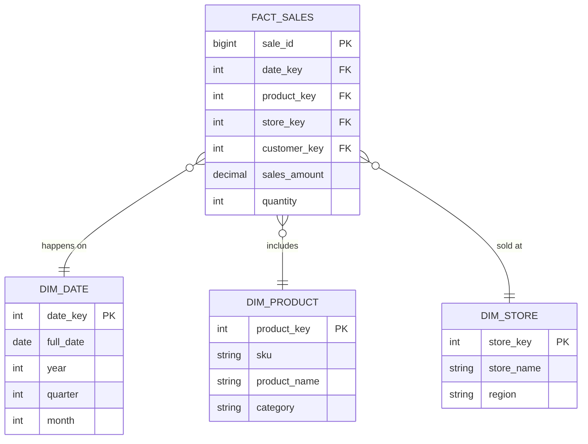

Phương pháp luận **Kimball (Dimensional Modeling)**, được định hình bởi Ralph Kimball vào thập niên 90, không chỉ là một lý thuyết thiết kế Data Warehouse truyền thống mà còn là nền tảng cốt lõi (Mental Model) cho các Data Engineer hiện đại khi xây dựng lớp dữ liệu phục vụ phân tích (Serving/Gold Layer). 

Thay vì cố gắng chuẩn hóa toàn bộ dữ liệu tổ chức theo hướng từ trên xuống (Top-Down) như phương pháp Inmon (Chuẩn hóa 3NF), Kimball tiếp cận theo hướng **từ dưới lên (Bottom-Up)**: Xây dựng các **Data Marts** phi chuẩn hóa (Denormalized) tập trung giải quyết từng quy trình nghiệp vụ cụ thể (như Bán hàng, Tồn kho), sau đó liên kết chúng lại bằng các chiều dữ liệu dùng chung (**Conformed Dimensions**).

---

## 1. Kiến trúc Thực thi Vật lý (Physical Execution Architecture)

Trái tim của phương pháp Kimball là **Star Schema** (Lược đồ hình sao). Nó phân tách dữ liệu thành 2 loại bảng: **Fact Tables** (Bảng Sự kiện: chứa các số liệu đo lường định lượng) và **Dimension Tables** (Bảng Chiều: chứa ngữ cảnh mô tả sự kiện, Who, What, Where, When).



### 1.1. Sự Đồng Điệu với Columnar Databases
Tại sao kiến trúc từ 30 năm trước vẫn là "Vua" trên các Cloud Data Warehouse hiện đại (BigQuery, Snowflake, Databricks)? Câu trả lời nằm ở định dạng lưu trữ **Columnar (Theo cột)**.
- **Vectorized Execution:** Khi bạn chạy truy vấn `SELECT SUM(sales_amount) FROM FACT_SALES JOIN DIM_PRODUCT WHERE category = 'Electronics'`, Engine chỉ quét (Scan) đúng cột `sales_amount`, `product_key` và `category`. Nó hoàn toàn bỏ qua hàng chục cột khác trong bảng, tiết kiệm 90% Disk I/O so với Row-based Database (như Postgres/MySQL).
- **Predicate Pushdown & Compression:** Các Dimension Tables thường có Cardinality (số lượng giá trị phân biệt) thấp (VD: cột `region` chỉ có vài chục giá trị). Columnar DB nén các cột này bằng kỹ thuật Dictionary Encoding cực kỳ hiệu quả, cho phép các thao tác Lọc (Filter) và JOIN diễn ra hoàn toàn trên RAM (In-memory) với tốc độ ánh sáng.

### 1.2. Xác định "Hạt" Dữ Liệu (Grain) & Các Loại Fact Tables
Xác định **Grain (Mức độ chi tiết nhất của một dòng trong bảng Fact)** là quyết định sống còn. Sai lầm kinh điển của các kỹ sư mới là "tổng hợp trước" (Pre-aggregate) dữ liệu vào Fact table để query nhanh hơn, dẫn đến hệ thống mất khả năng "khoan sâu" (Drill-down) khi Business User cần phân tích chi tiết.

Có 3 loại Bảng Fact:
1. **Transaction Fact (Sự kiện giao dịch):** Mỗi dòng là một giao dịch riêng biệt (VD: 1 dòng = 1 sản phẩm trong giỏ hàng). Khối lượng dữ liệu cực lớn, chỉ Insert (Append-only).
2. **Periodic Snapshot Fact (Trạng thái định kỳ):** Chụp lại trạng thái tại một thời điểm (VD: Số dư tài khoản cuối ngày, Tồn kho cuối tháng). Rất hữu ích để tránh phải tính toán SUM lại từ đầu lịch sử giao dịch.
3. **Accumulating Snapshot Fact (Trạng thái vòng đời):** Theo dõi vòng đời của một thực thể hữu hạn. (VD: Đơn hàng `Đã tạo -> Đang giao -> Hoàn thành`). Đòi hỏi UPDATE liên tục các cột timestamp khi thực thể chuyển trạng thái.

---

## 2. Cuộc Chiến Kiến Trúc: Kimball vs. Inmon vs. Data Vault

Trong Kỷ nguyên Modern Data Stack, chúng ta không chọn một "tôn giáo" duy nhất. Các hệ thống hàng đầu thế giới sử dụng phương pháp **Hybrid (Lai)**, kết hợp sức mạnh của cả 3 phương pháp.

Đặc biệt trên nền tảng **Databricks Lakehouse**, mô hình này khớp hoàn hảo với kiến trúc **Medallion (Bronze - Silver - Gold)**:

1. **Bronze (Raw Layer):** Lưu trữ dữ liệu gốc, nguyên bản từ Source.
2. **Silver (Integration Layer):** Đây là nơi **Data Vault 2.0** tỏa sáng. Data Vault chia dữ liệu thành Hubs (Khóa định danh), Links (Mối quan hệ) và Satellites (Ngữ cảnh lịch sử). Nó là kiến trúc linh hoạt nhất, dễ mở rộng nhất để tích hợp dữ liệu từ hàng chục nguồn khác nhau mà không sợ gãy vỡ (Agility & Auditability), tương đương với tư tưởng của Inmon về một "Single Source of Truth". Tuy nhiên, Data Vault rất khó để query trực tiếp.
3. **Gold (Presentation Layer):** Đây là sân nhà của **Kimball**. Dữ liệu từ Data Vault (Silver) được phi chuẩn hóa (Denormalized) thành các bảng **Star Schema** cực kỳ trực quan, tối ưu cho tốc độ Query của các công cụ BI (Power BI, Tableau) và người dùng cuối.

---

## 3. Thách thức Kỹ thuật: Slowly Changing Dimensions (SCD)

Trong thế giới thực, Dimension thay đổi liên tục (khách hàng đổi địa chỉ, sản phẩm đổi ngành hàng). Để duy trì tính nhất quán của lịch sử (Historical Consistency) - ví dụ: doanh thu tháng trước phải gắn với địa chỉ cũ của khách hàng - ta dùng **SCD Type 2**.

### Code Thực chiến: Xử lý SCD Type 2 với dbt (Data Build Tool)
Việc viết SQL `MERGE` thủ công để theo dõi sự thay đổi là cơn ác mộng bảo trì và dễ gây ra lỗi Data Duplication (nhân đôi dữ liệu). Trong Modern Data Stack, chúng ta sử dụng **dbt snapshots** để tự động hóa hoàn toàn quy trình này.

Chỉ cần cấu hình YAML:
```yaml
# snapshots/dim_customer.yml
snapshots:
  - name: dim_customer_snapshot
    config:
      target_schema: snapshots
      unique_key: customer_id
      strategy: timestamp
      updated_at: updated_at # Engine sẽ theo dõi cột này để biết dòng nào đã thay đổi
```
Khi chạy `dbt snapshot`, dbt sẽ tự động sinh ra mã DDL/DML, so sánh dữ liệu mới và cũ, sau đó tạo ra 2 cột tự động là `dbt_valid_from` và `dbt_valid_to`. Nó sẽ "đóng băng" (Expire) bản ghi cũ (set `valid_to = current_timestamp`) và Insert bản ghi mới (set `valid_to = NULL`).

---

## 4. Systemic Trade-offs & Operational Risks (Đánh đổi Hệ thống)

Việc áp dụng Kimball mang lại những rủi ro vận hành (Operational Risks) đặc thù nếu thiết kế vật lý sai lầm:

### 4.1. Cartesian Explosion & Choke Points
- **Nguyên nhân:** Khi bạn thiết kế Fact Table không cẩn thận và thực hiện JOIN với quá nhiều Dimension Tables lớn, Query Planner của Database có thể dự đoán sai thuật toán JOIN (chọn Nested Loop thay vì Hash JOIN), dẫn đến bùng nổ tổ hợp (Cartesian Explosion).
- **Hệ quả:** Truy vấn bị treo (Hung query), văng lỗi **OOMKilled (Out of Memory)** trên các Worker nodes, hoặc **Spill-to-disk** làm tăng độ trễ (Latency) lên hàng chục lần.

### 4.2. Cơn ác mộng "Late Arriving Facts"
- **Vấn đề:** Dữ liệu Fact đến kho trước khi hệ thống tạo xong Dimension (VD: Thiết bị IoT gửi metric nhưng chưa được đăng ký trong CSDL người dùng). Nếu Fact lookup không thấy Dimension Key, nó sẽ văng lỗi hoặc mất dữ liệu.
- **Cách xử lý:** Trong Pipeline ELT, thay vì loại bỏ (Drop) dòng Fact đó, ta chèn một **Dummy Dimension (Chiều giả lập)** (với `Surrogate_Key = -1`, `Name = 'Unknown'`) vào bảng Dim. Khi Dimension thực sự xuất hiện trong đợt load sau, quá trình ETL sẽ cập nhật đè lại bản ghi Dummy này. Đảm bảo dữ liệu không bao giờ bị rớt.

### 4.3. Từ Star Schema đến One Big Table (OBT)
- Ở quy quy mô siêu lớn (Uber, Netflix), việc JOIN liên tục trên Star Schema tốn quá nhiều Compute Cost. Họ thường xây dựng thêm một bước cuối cùng: Làm dẹt (Flatten) toàn bộ Fact và Dimension thành **One Big Table (OBT)**.
- **Trade-off:** OBT giảm Query Latency xuống gần Zero (chỉ việc Scan, không cần Join), Dashboard load tức thì. Nhưng đánh đổi lại là phí Storage khổng lồ (dữ liệu chữ bị lặp lại hàng tỷ lần) và rủi ro Inconsistency (nếu Dimension thay đổi, phải UPDATE hàng triệu dòng OBT).

---

## 5. Kết Luận
Ralph Kimball đã để lại một di sản vượt thời gian. Bất kể bạn đang sử dụng Hadoop cổ điển, Data Warehouse cục bộ hay Modern Data Lakehouse, việc thấu hiểu **Grain, Fact, Dimension và SCD** là kỹ năng "sống còn" để tổ chức dữ liệu một cách logic, ngăn chặn Data Platform của bạn trở thành một "Data Swamp" [Đầm lầy dữ liệu] hỗn loạn không ai dám dùng.

## Nguồn Tham Khảo (References)
- [The Data Warehouse Toolkit: The Definitive Guide to Dimensional Modeling - Ralph Kimball](https://www.amazon.com/Data-Warehouse-Toolkit-Definitive-Dimensional/dp/1118530802)
- [Medallion Architecture by Databricks](https://www.databricks.com/glossary/medallion-architecture)
- [dbt Labs: Snapshots and SCD Type 2](https://docs.getdbt.com/docs/build/snapshots)
- [Data Vault vs Kimball vs Inmon - Modern Data Stack](https://www.scalefree.com/)
