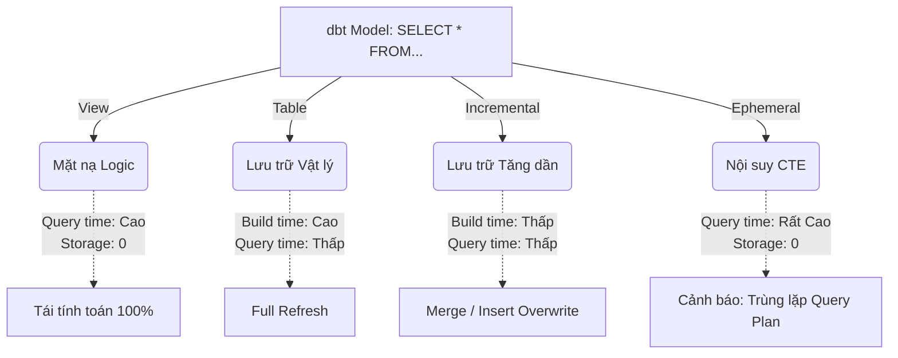

Khi bạn viết một mô hình dbt, bạn đang định nghĩa logic nghiệp vụ qua một câu lệnh `SELECT`. Nhưng đối với một Data Engineer, câu hỏi cốt lõi không phải là "SELECT cái gì?" mà là **"Kết quả của lệnh SELECT này được vật chất hóa (Materialized) xuống ổ cứng hay nằm trên RAM của Data Warehouse như thế nào?"**

Sự đánh đổi ở đây cực kỳ khắc nghiệt: Bạn sẵn sàng trả tiền cho **Compute Cost** (tính toán lại mỗi lần có truy vấn) hay **Storage Cost** (lưu sẵn kết quả xuống ổ cứng) và **Pipeline Latency** (thời gian chạy batch ETL)?

## 1. Kiến trúc Thực thi Vật lý (Physical Execution)

dbt hỗ trợ 4 chiến lược materialization cơ bản. Dưới góc độ hệ thống, chúng ta sẽ xem xét cách Engine của Data Warehouse (như BigQuery Dremel, Snowflake Virtual Warehouse) xử lý chúng.

### Sơ đồ Kiến trúc Đánh đổi (Trade-off Matrix)



### 1.1. Ephemeral: Cạm bẫy của Nội suy CTE
Khi cấu hình `materialized='ephemeral'`, dbt KHÔNG tạo ra bất kỳ object nào trong database. Nó lấy mã SQL của bạn, bọc trong một `WITH` clause (CTE), và inject thẳng vào các model downstream.

**Rủi ro Vận hành (Operational Risk):**
Nếu một model Ephemeral được `ref()` bởi 3 model khác nhau trong cùng một luồng, Query Optimizer của Data Warehouse có thể sẽ không đủ thông minh để cache lại CTE đó. Kết quả là **bộ nhớ và CPU bị bạo chi** do phải đánh giá lại CTE 3 lần (Multiple Evaluations).
*Quy tắc ngón tay cái:* Chỉ dùng Ephemeral cho các bước transformation cực nhẹ (cast type, rename) và chỉ được downstream model `ref()` **đúng 1 lần**.

### 1.2. View: Đánh đổi Storage lấy Compute
`CREATE OR REPLACE VIEW` chỉ lưu metadata. 
- **Ưu điểm:** Zero build time. Data luôn Real-time với upstream.
- **Điểm chết (Bottleneck):** Mỗi lần BI Tool (như Tableau/Superset) gửi query, Data Warehouse phải quét lại (scan) toàn bộ data từ các bảng gốc, thực hiện lại toàn bộ phép JOIN và Aggregation. Điều này tạo ra **Compute Spill-to-disk** nếu RAM của warehouse không đủ, gây tắc nghẽn queue.

### 1.3. Table: Đánh đổi Compute lấy Performance
`CREATE OR REPLACE TABLE`. Toàn bộ dữ liệu được tính toán một lần lúc chạy pipeline và ghi xuống đĩa (Full Refresh).
- **Lợi ích:** BI Tool truy vấn cực nhanh (Microseconds/Milliseconds).
- **Điểm chết:** Khi bảng fact vượt quá mốc trăm triệu rows, việc chạy `dbt run` có thể mất hàng giờ. Tiêu tốn cực lớn Compute Cost cho việc ghi lại (Rewrite) 99% dữ liệu cũ không hề thay đổi.

## 2. The Incremental Beast: Merge vs Insert Overwrite

Khi `table` trở nên quá nặng, Staff Engineer sẽ chuyển sang `incremental`. Đây là lúc kiến trúc thực sự phức tạp. Thay vì drop và tạo lại bảng, dbt chỉ xử lý **Delta Data** (dữ liệu mới).

Dưới nắp capo, dbt cung cấp 2 chiến lược vật lý chính (đặc biệt quan trọng trên BigQuery và Snowflake):

### 2.1. Chiến lược `merge` (Upsert)
dbt sử dụng câu lệnh `MERGE INTO` để đối chiếu dữ liệu mới với dữ liệu cũ thông qua `unique_key`.

**Real-world Incident: Cartesian Explosion & Full Table Scan**
Nếu bạn sử dụng `merge` trên một bảng 10 tỷ dòng mà **KHÔNG** đánh Index / Cluster / Partition đúng cách, Data Warehouse buộc phải thực hiện **Full Table Scan** để tìm ra dòng cần update. Chi phí lúc này còn **đắt hơn cả việc chạy Full Refresh (Table)**.

**Cấu hình thực chiến (Snowflake/BigQuery):**
```sql
{{ config(
    materialized='incremental',
    unique_key='transaction_id',
    incremental_strategy='merge',
    cluster_by=['date_id', 'merchant_id'] -- BẮT BUỘC để tránh Full Scan
) }}

SELECT * FROM {{ ref('stg_transactions') }}

    WHERE processed_at > (SELECT MAX(processed_at) FROM {{ this }})

```

### 2.2. Chiến lược `insert_overwrite` (Partition Replacement)
Đây là chiến lược **thống trị** trong các hệ thống Data quy mô lớn. Thay vì tốn CPU để so khớp từng dòng (row-level match), `insert_overwrite` hoạt động ở cấp độ Block/Partition. dbt sẽ xóa toàn bộ Partition cũ (ví dụ: partition của ngày hôm qua) và ghi đè bằng data mới.

**Tại sao nó vô địch về Cost/Performance?**
Nó biến một phép cập nhật phức tạp thành một phép Write-only. Storage engine chỉ việc drop metadata của partition cũ và trỏ sang file Parquet/Capacitor mới. Zero-cost cho việc checking `unique_key`.

**Code thực chiến (BigQuery):**
```sql
{{ config(
    materialized='incremental',
    incremental_strategy='insert_overwrite',
    partition_by={
      "field": "created_date",
      "data_type": "date",
      "granularity": "day"
    },
    require_partition_filter=true
) }}

SELECT 
    DATE(created_at) as created_date,
    * 
FROM {{ ref('stg_events') }}

    -- Chỉ xử lý dữ liệu của 3 ngày gần nhất để ghi đè partition
    WHERE DATE(created_at) >= DATE_SUB(CURRENT_DATE(), INTERVAL 3 DAY)

```

## 3. Best Practices & System Tuning

Để không làm sập (OOMKilled) Data Warehouse hay nhận hóa đơn tiền tỷ vào cuối tháng, hãy áp dụng các nguyên tắc sau:

1. **Chuỗi Materialization Chuẩn mực:**
   - **Lớp Staging (Source -> Bronze):** Luôn là `view`. Đừng tốn tiền lưu trữ một bản copy 1:1 của Raw Data.
   - **Lớp Intermediate (Bronze -> Silver):** Dùng `ephemeral` nếu phép tính rất nhỏ (chỉ filter/cast type). Nếu có JOIN phức tạp, dùng `table` hoặc `view` tùy thuộc vào tần suất query downstream.
   - **Lớp Marts/Presentation (Silver -> Gold):** Luôn là `table` (nếu < 10GB) hoặc `incremental` (nếu > 10GB). Đây là lớp phục vụ End-user, Latency phải bằng 0.

2. **Dbt Project Global Tuning:**
Thay vì cấu hình rải rác từng file, hãy set chuẩn mực ở `dbt_project.yml`.
```yaml
models:
  my_data_platform:
    staging:
      +materialized: view
    marts:
      core:
        +materialized: incremental
        +incremental_strategy: insert_overwrite
      finance:
        +materialized: table
```

3. **Cẩn thận với Schema Evolution:**
Đối với `incremental`, khi upstream thêm một cột mới, `merge` hoặc `insert_overwrite` có thể bị lỗi mismtach columns. Hãy định cấu hình `on_schema_change: 'append_new_columns'` hoặc `'sync_all_columns'` một cách chủ động.

## Nguồn Tham Khảo
* [dbt Documentation - Materializations](https://docs.getdbt.com/docs/build/materializations)
* [dbt Developer Blog - Incremental Models](https://getdbt.com/blog)
* **Fundamentals of Data Engineering - Joe Reis & Matt Housley**
* [Designing Data-Intensive Applications - Martin Kleppmann](https://dataintensive.net/)
* [Data Engineering at Scale: Netflix Tech Blog](https://netflixtechblog.com/)
