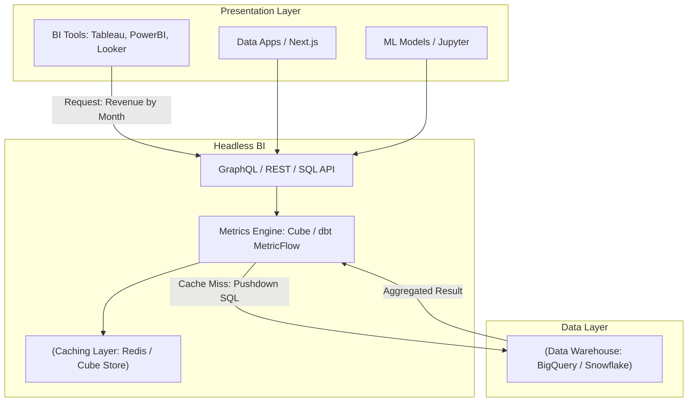

Không có "Kỷ nguyên số" hay "Dữ liệu là dầu mỏ" ở đây. Trong thực tế vận hành hệ thống dữ liệu, cảnh tượng "đẫm máu" nhất không phải là Data Warehouse bị sập, mà là khi báo cáo của Marketing và Sales lệch nhau 20% doanh thu trong cuộc họp Board of Directors. 

Nguyên nhân gốc rễ? Định nghĩa logic (Business Logic) bị kẹt cứng (lock-in) ở tầng Presentation: DAX của PowerBI, LookML của Looker, Calculated Fields của Tableau, hoặc tồi tệ hơn là rải rác trong hàng chục script SQL cronjob khác nhau. Đây là hội chứng **Spaghetti Logic**.

**Metrics Layer** (hay Semantic Layer, Headless BI) sinh ra để giải quyết bài toán này bằng cách tách bạch tầng Định nghĩa (Definition) khỏi tầng Hiển thị (Presentation).

## 1. Kiến trúc Vật lý (Physical Architecture)

Trong kiến trúc có Metrics Layer, các BI Tools hay Data Apps **không bao giờ** được query trực tiếp xuống Data Warehouse. Chúng phải đi qua một API Gateway do Metrics Engine cung cấp (được gọi là Headless BI, vì phần "thân" - data modeling được giữ nguyên, còn cái "đầu" - BI tool thì có thể tháo lắp tùy ý).



Metrics Layer đóng vai trò như một **Query Compiler**:
1. Nhận request từ client (VD: *Lấy doanh thu gộp nhóm theo tháng*).
2. Tra cứu cấu hình Metrics as Code.
3. Sinh ra câu SQL phức tạp tương ứng với dialect của Data Warehouse đang dùng (BigQuery SQL, Snowflake SQL).
4. Kiểm tra Caching Layer xem dữ liệu đã được tính toán sẵn (Pre-aggregated) chưa.
5. Trả kết quả về cho client.

## 2. Nguồn Cội Big Tech: Airbnb Minerva & Uber uMetric

Trước khi các khái niệm Headless BI trở nên phổ biến trên thị trường, các gã khổng lồ công nghệ đã phải tự xây dựng hạ tầng nội bộ để giải quyết bài toán Single Source of Truth ở quy mô Petabyte.

### 2.1. Airbnb: Nền tảng Minerva
Airbnb là một trong những công ty tiên phong với nền tảng **Minerva**. Thay vì để các phòng ban tự định nghĩa metric, Minerva ép buộc mọi Data Engineer phải khai báo metric qua một repo tập trung. Minerva phục vụ không chỉ BI Dashboards mà còn là nguồn dữ liệu chuẩn cho hệ thống A/B Testing (Experimentation) và Machine Learning.

### 2.2. Uber: Tách biệt Telemetry và Business Semantic (uMetric)
Tại Uber, do quy mô dữ liệu khổng lồ (hàng tỷ metrics sinh ra mỗi giây), họ tách hệ thống làm 2:
1. **M3 Platform**: Một database Time-series phân tán chuyên dùng để xử lý **Technical Metrics** (CPU, RAM, API Latency) với mục đích Observability.
2. **uMetric**: Semantic Layer chuyên dùng cho **Business Metrics** (Số cuốc xe, Doanh thu, Khuyến mãi). Hệ thống này quản lý vòng đời của metrics kinh doanh và ngăn chặn việc các team Data Analyst tự định nghĩa lại "Thế nào là một chuyến xe thành công?".

## 3. Quản lý Chỉ số như Code [Metrics as Code] với dbt

Để hiện thực hóa Single Source of Truth (SSOT), Metrics Layer bắt buộc phải quản lý logic dưới dạng Code (thường là YAML) và nằm trong Git, đảm bảo quy trình CI/CD.

Dưới đây là một ví dụ thực chiến cấu hình chỉ số bằng **dbt Semantic Layer (MetricFlow)**:

```yaml
# models/marts/core/semantic_models.yml
semantic_models:
  - name: fct_orders
    defaults:
      agg_time_dimension: created_at
    description: Bảng fact chứa thông tin đơn hàng
    model: ref('fct_orders')
    entities:
      - name: order_id
        type: primary
      - name: customer_id
        type: foreign
    dimensions:
      - name: created_at
        type: time
        type_params:
          time_granularity: day
      - name: order_status
        type: categorical
    measures:
      - name: total_revenue
        description: Tổng doanh thu từ các đơn hàng
        expr: amount_usd
        agg: sum

metrics:
  - name: successful_revenue
    description: Doanh thu thực tế (chỉ tính đơn hàng đã giao)
    type: simple
    label: Doanh thu thành công
    type_params:
      measure: total_revenue
    filter: |
      {{ dimension('order_status') }} = 'COMPLETED'
```

Khi một Data Scientist chạy lệnh lấy metric, dbt sẽ tự động dịch cấu hình YAML thành một câu truy vấn SQL hoàn chỉnh. Nó tập trung vào **Định nghĩa (Definition)** và dựa vào Data Warehouse để thực thi tính toán.

## 4. Physical Execution & Caching Strategy với Cube

Nếu đẩy 100% request trực tiếp xuống Cloud Data Warehouse (Pushdown Execution), Compute Cost (chi phí quét dữ liệu) sẽ bùng nổ, đồng thời Latency (độ trễ) sẽ nằm ở mức 2-5 giây, hoàn toàn không phù hợp cho các Dashboard Data Apps nhúng trực tiếp trên web (Customer-facing Analytics).

Để giải quyết vấn đề hiệu năng, các nền tảng như **Cube** giới thiệu khái niệm **Pre-aggregations (Rollup Caching)**:

```javascript
// schema/Orders.js (Định nghĩa trên hệ thống Cube.js)
cube(`Orders`, {
  sql: `SELECT * FROM raw_orders`,

  measures: {
    revenue: {
      sql: `amount`,
      type: `sum`
    }
  },

  dimensions: {
    status: { sql: `status`, type: `string` },
    createdAt: { sql: `created_at`, type: `time` }
  },

  // Caching Strategy
  preAggregations: {
    revenueByMonth: {
      type: `rollup`,
      measureReferences: [revenue],
      timeDimensionReference: createdAt,
      granularity: `month`,
      refreshKey: {
        every: `1 hour`
      }
    }
  }
}];
```

Trong ví dụ trên, Cube sẽ đóng vai trò là một **Serving Layer**. Nó âm thầm chạy các cronjob mỗi giờ một lần để tổng hợp trước dữ liệu theo tháng và lưu vào **Cube Store** (một hệ thống lưu trữ phân tán, siêu nhanh). Khi user mở Dashboard, dữ liệu được serve (phục vụ) từ Cube Store với latency dưới 100ms mà không tốn một đồng Compute Scan nào ở Data Warehouse.

## 5. Rủi ro Vận hành (Operational Risks) & Trade-offs

### 5.1. Compute Cost vs Storage Cost vs Data Freshness
Sử dụng Pre-aggregation làm giảm triệt để Compute Cost tại DWH do không phải quét lại bảng Fact hàng tỷ dòng, nhưng bù lại, bạn phải trả chi phí lưu trữ (Storage Cost) cho Caching Layer. Hơn nữa, dữ liệu từ Cache siêu nhanh nhưng luôn có độ trễ (Staleness). Nếu bạn set refresh 1 giờ, báo cáo có thể bị lỗi nhịp 60 phút.

### 5.2. Cartesian Explosion (Bùng nổ tích Đề-các)
Khi user cố gắng gọi các metric và filter qua nhiều dimension thuộc về nhiều bảng không có quan hệ rõ ràng, Metrics Engine có thể sinh ra câu lệnh `CROSS JOIN` ngầm khi biên dịch SQL. Kết quả là DWH phải xử lý một tập dữ liệu $N \times M$ tỷ dòng, gây ra lỗi **OOMKilled** (Out of Memory) trên Spark hoặc làm treo BigQuery.
*Khắc phục:* Cấu hình các ràng buộc Join (Join paths) chặt chẽ và tắt tính năng kết nối đa chiều không an toàn.

### 5.3. Cache Invalidation Storm
Nếu cấu trúc dữ liệu thô thay đổi (chạy lịch sử Backfill dữ liệu 1 năm trước), toàn bộ các Rollups (Pre-aggregations) đang lưu trong Cache bị vô hiệu hóa cùng lúc. Hàng loạt truy vấn dồn dập bị "Cache Miss" và đẩy thẳng SQL rác xuống DWH, tạo ra hiện tượng **Thundering Herd**, làm sập DWH hoặc tiêu tốn hàng nghìn USD tài nguyên.
*Khắc phục:* Cấu hình Warm-up Cache từ từ hoặc giới hạn Concurrency đẩy xuống DWH khi Cache Miss.

---

## Nguồn Tham Khảo [References]
* [The Headless BI Architecture - Cube.dev][https://cube.dev/blog/headless-bi]
* [dbt Semantic Layer Documentation - MetricFlow][https://docs.getdbt.com/docs/use-dbt-semantic-layer/dbt-sl]
* [Airbnb Minerva: Metrics Infrastructure][https://medium.com/airbnb-engineering/how-airbnb-achieved-metric-consistency-at-scale-f23cc53dea70]
* [Uber uMetric: A Unified Platform for Business Metrics](https://www.uber.com/en-VN/blog/umetric/]
* *Fundamentals of Data Engineering* - Joe Reis & Matt Housley.
