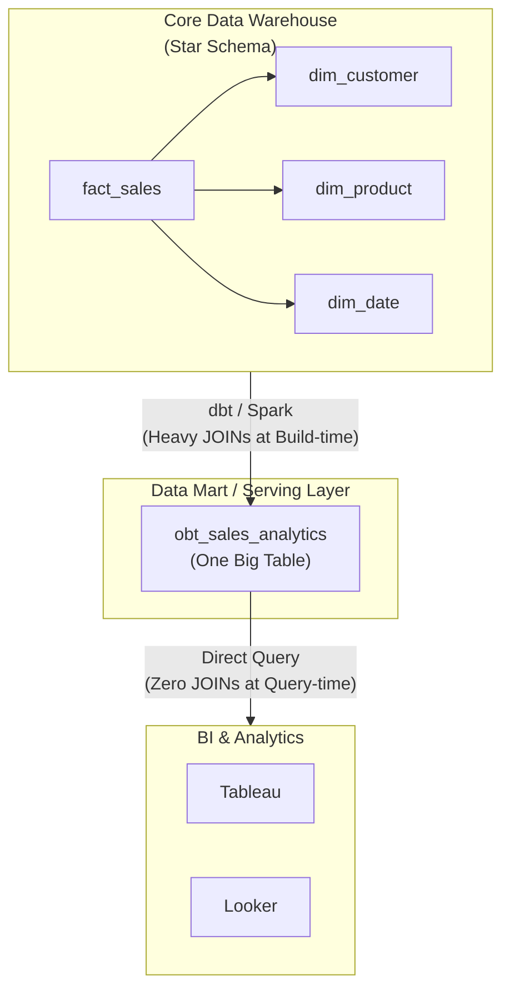

One Big Table (OBT) là một mẫu thiết kế (Design Pattern) phi chuẩn hóa (Denormalization) cực đoan. Trong mô hình này, toàn bộ dữ liệu đa chiều (bao gồm Fact và các bảng Dimensions) được "ép" (Pre-join) thành một bảng phẳng (Flat Table) duy nhất, khổng lồ và vô cùng rộng (Wide Table). 

Trong lịch sử Database, OBT từng bị các kỹ sư hệ thống coi là "Anti-pattern" đối với Row-oriented RDBMS (như MySQL, PostgreSQL) do chi phí đọc/ghi toàn bộ dòng quá lớn và dữ liệu bị lặp lại (Data Redundancy) phung phí. Tuy nhiên, sự dịch chuyển sang **Columnar Storage (Lưu trữ dạng cột)** và kiến trúc **Decoupled Compute & Storage** của các Cloud Data Warehouse hiện đại (BigQuery, Snowflake, Databricks) đã "hồi sinh" OBT, đưa nó trở thành lựa chọn hàng đầu cho lớp Consumption/Data Mart nhằm tối ưu hóa cực độ Query Latency (Độ trễ truy vấn).

## 1. Kiến trúc Vật lý (Physical Architecture) của OBT

Sự trỗi dậy của OBT gắn liền chặt chẽ với bản chất vật lý của Columnar Storage. Tại sao một bảng rộng tới 2,000 cột lại có thể truy vấn nhanh hơn một mô hình Star Schema chuẩn mực ở quy mô Petabyte?

1. **Columnar I/O Projection (Quét cột chọn lọc):** Khi một bảng OBT có 2,000 cột, một truy vấn BI (`SELECT user_id, SUM(revenue)`) trên hệ thống Columnar (ví dụ: định dạng Parquet, ORC, hay Capacitor của BigQuery) sẽ chỉ thực hiện Disk I/O để đọc ĐÚNG 2 file/block vật lý chứa 2 cột đó. 1,998 cột còn lại hoàn toàn bị bỏ qua. Hệ quả vật lý: **Bảng càng rộng không làm chậm đi những truy vấn hẹp.**
2. **Compression Algorithms (Thuật toán nén):** Dữ liệu trong OBT bị lặp lại rất nhiều (Ví dụ: `customer_name = 'Nguyen Van A'` được lặp lại trên mỗi dòng giao dịch của khách hàng đó). Tuy nhiên, các kỹ thuật nén cấp thấp như **Run-length Encoding (RLE)**, **Dictionary Encoding** hay **Delta Encoding** hoạt động cực kỳ hiệu quả trên dữ liệu lặp lại nằm cùng một cột, giúp triệt tiêu gần như 90% chi phí lưu trữ của sự trùng lặp này.
3. **Mạng máy tính (Distributed Network Shuffle):** Trong hệ thống phân tán, lệnh `JOIN` là cơn ác mộng. Nó đòi hỏi phải xáo trộn dữ liệu (Shuffle) qua lại giữa các Node tính toán thông qua băng thông mạng (Network Bandwidth) cực kỳ đắt đỏ và chậm chạp. OBT loại bỏ hoàn toàn `JOIN` lúc truy vấn (Query-time), đổi lại bằng việc tiêu tốn dung lượng ổ cứng S3/GCS rẻ bèo (~$20/TB/tháng). OBT chính là bài toán đánh đổi kinh điển: **Đốt Storage rẻ tiền để cứu rỗi Compute đắt đỏ.**



## 2. Systemic Trade-offs & Operational Risks (Đánh đổi Hệ thống)

Bất kỳ thiết kế hệ thống nào cũng đòi hỏi sự đánh đổi. OBT giải quyết triệt để bài toán Query Latency nhưng đẩy gánh nặng khổng lồ sang Data Quality và Pipeline Maintainability.

### 2.1. Build-time Bottleneck vs Query-time Latency
OBT không hề tiêu diệt lệnh `JOIN`. Nó chỉ dời (Shift) gánh nặng `JOIN` từ lúc User chạy truy vấn (Query-time) sang lúc Data Pipeline chạy (Build-time).
- **Đánh đổi Hệ thống:** Pipeline tạo OBT (ví dụ qua dbt hoặc Spark) sẽ phải thực hiện các phép `JOIN` khổng lồ định kỳ (Batch). Nếu data quá lớn, Job ETL này có thể chạy mất 4 tiếng đồng hồ, tiêu tốn lượng Compute credit khổng lồ. 

### 2.2. Sự cố Tràn RAM (OOMKilled) & Cartesian Explosion
Khi `JOIN` nhiều bảng Dimension vào bảng Fact để tạo OBT, nếu Data Engineer lơ là khiến một bảng Dimension không duy trì đúng thuộc tính Primary Key (nghĩa là có dữ liệu trùng lặp ở cột Key).
- **Hệ lụy vật lý:** Xảy ra hiện tượng **Fan-out (Cartesian Explosion)**. 1 triệu dòng Fact có thể bùng nổ thành 10 triệu dòng trên OBT. Các hàm tính toán như `SUM(revenue)` trên BI sẽ ra kết quả sai lệch (Double-counting). Trên các Compute Engine như Apache Spark, điều này dẫn đến `Network Shuffle` bùng nổ, RAM cạn kiệt, rớt node (Executor `OOMKilled`) hoặc `Spill-to-disk` làm Job treo vĩnh viễn.

### 2.3. Cơn ác mộng Slowly Changing Dimensions (SCD)
Xử lý SCD Type 2 trên OBT là một thử thách khủng khiếp về Data Consistency.
- Giả sử khách hàng chuyển địa chỉ từ Hà Nội sang TP.HCM. Trong Star Schema, bạn chỉ Insert một dòng mới vào `dim_customer`. 
- Nhưng trên OBT, bạn đối mặt với thảm họa:
  1. Nếu muốn giữ lịch sử: Phải dùng các điều kiện `JOIN` phức tạp `ON fact.date >= dim.start_date AND fact.date < dim.end_date` lúc build OBT. Điều này ép hệ thống phải Broadcast/Shuffle lại toàn bộ bảng khổng lồ.
  2. Nếu muốn ghi đè (SCD Type 1): Phải chạy một lệnh `UPDATE` hoặc `MERGE` khổng lồ quét qua hàng trăm triệu dòng giao dịch cũ để cập nhật địa chỉ mới. Row-level mutation (Sửa từng dòng) trên Columnar DB là một thao tác Anti-pattern cực kỳ chậm và tốn kém I/O.

## 3. Thực chiến: Xây dựng OBT tối ưu với dbt và BigQuery

Để xử lý bài toán hiệu năng và chi phí khi build OBT trên BigQuery, Data Engineer KHÔNG BAO GIỜ dùng bảng vật lý (`TABLE`) quét lại toàn bộ dữ liệu (Full Refresh) mỗi ngày. Thay vào đó, bắt buộc áp dụng **Incremental Models** kết hợp **Partitioning** và **Clustering**.

Dưới đây là một mô hình dbt (Data Build Tool) thực chiến cấp độ Enterprise:

```sql
-- File: models/marts/obt_sales_analytics.sql
{{
    config(
        materialized = 'incremental',
        unique_key = 'order_id',
        partition_by = {
            "field": "order_date",
            "data_type": "date",
            "granularity": "day"
        },
        cluster_by = ['customer_region', 'product_category']
    ]
}}

WITH fact_sales AS (
    SELECT * FROM {{ ref('fct_orders') }}
    
    -- Kỹ thuật: Chỉ lấy các giao dịch trong 3 ngày gần nhất (Lookback Window) 
    -- để xử lý Update/Insert, giảm thiểu tuyệt đối Full Table Scan khổng lồ
    WHERE order_date >= DATE_SUB(CURRENT_DATE(), INTERVAL 3 DAY)
    
),
dim_customer AS (
    SELECT * FROM {{ ref('dim_customers') }}
),
dim_product AS (
    SELECT * FROM {{ ref('dim_products') }}
)

SELECT
    f.order_id,
    f.order_date,
    f.sales_amount,
    
    -- Denormalize (Trải phẳng) Customer Dimension
    c.customer_id,
    c.customer_name,
    c.customer_region,
    c.customer_tier,
    
    -- Denormalize (Trải phẳng) Product Dimension
    p.product_id,
    p.product_category,
    p.brand_name
FROM fact_sales f
LEFT JOIN dim_customer c 
    ON f.customer_id = c.customer_id
LEFT JOIN dim_product p 
    ON f.product_id = p.product_id
```

### Kiến trúc "Super OBT" bằng Dữ liệu Lồng (Nested Data / Array Structs)
Để xử lý triệt để bài toán **Fan-out** (Quan hệ 1-Nhiều) thay vì flat join làm tăng số lượng dòng, ta có thể dùng tính năng `ARRAY<STRUCT>` (Nested Data) hỗ trợ native trong BigQuery và Snowflake.

```sql
-- Kỹ thuật Super OBT với Nested Data
SELECT 
    o.order_id,
    o.customer_id,
    o.total_order_value,
    -- Gom toàn bộ Item vào một mảng (Array), giữ nguyên Grain tĩnh của bảng là Order
    ARRAY_AGG(
        STRUCT(
            i.item_id, 
            i.product_id, 
            i.quantity, 
            i.price
        )
    ) as order_items
FROM {{ ref('stg_orders') }} o
LEFT JOIN {{ ref('stg_order_items') }} i 
    ON o.order_id = i.order_id
GROUP BY 1, 2, 3
```
Kỹ thuật này giữ cho OBT siêu gọn nhẹ (số lượng dòng không bị phình to), ngăn ngừa tuyệt đối sai lệch khi dùng hàm `SUM()`, đồng thời khai thác triệt để sức mạnh quét của Columnar Storage.

## Kết luận

OBT (One Big Table) đại diện cho triết lý thiết kế Data Warehouse hiện đại: **Đẩy độ phức tạp xuống tầng xử lý ngầm (Data Pipeline / Batch Jobs) và bày ra một giao diện query "ngu ngốc nhưng siêu tốc" cho người dùng cuối [Business Users].** 

Kiến trúc chuẩn mực (Enterprise Best Practice) hiện nay là một mô hình Hybrid:
* Duy trì sự toàn vẹn, nguyên lý chuẩn hóa chặt chẽ (Data Vault / Star Schema) ở **Core Data Warehouse**.
* Triển khai OBT ở lớp **Consumption / Data Mart** phục vụ riêng biệt cho BI Tools.

## Nguồn Tham Khảo (References)

* Thiết kế Hệ thống Dữ liệu Chuyên sâu (Designing Data-Intensive Applications) - Martin Kleppmann (Chương phân tích Column-Oriented Storage).
* [The Data Warehouse Toolkit - Ralph Kimball Group][https://www.kimballgroup.com/]
* [Databricks: Data Modeling for the Lakehouse][https://www.databricks.com/discover/data-lakes/data-modeling]
* [Fivetran: Star Schema vs. OBT][https://fivetran.com/blog/star-schema-vs-obt]
* [BigQuery Architecture and Nested Data (Google Cloud Blog]](https://cloud.google.com/blog/products/data-analytics/)
