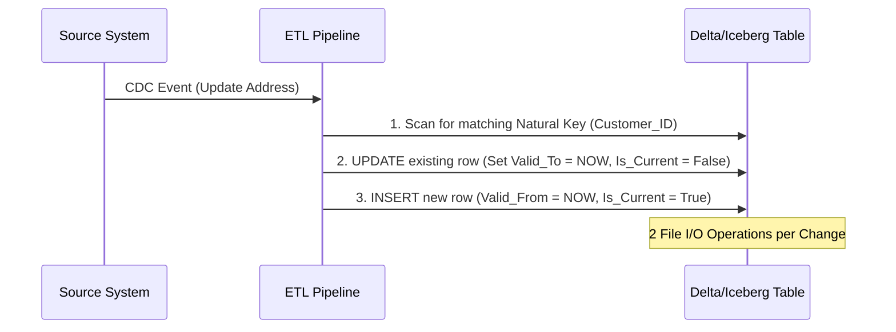

Khi xây dựng Data Warehouse, **Slowly Changing Dimension (SCD)** là bài toán kinh điển về quản lý trạng thái dữ liệu (state management) theo thời gian. 

Đối với các Data Engineer ở level Mid-Senior, chúng ta không chỉ dừng lại ở việc hiểu SCD Type 1 hay Type 2 là gì. Bài toán thực sự nằm ở **Physical Execution (Kiến trúc thực thi vật lý)**: Làm sao để cập nhật (UPDATE/MERGE) hàng tỷ dòng lịch sử mà không làm sập hệ thống (OOMKilled), không gây ra tình trạng phân mảnh dữ liệu (Small Files Problem), và không làm phình to I/O penalty trên các định dạng lưu trữ như Delta Lake hay Apache Iceberg.

Bài viết này mổ xẻ SCD dưới lăng kính System Architecture và các Trade-offs thực chiến trên Modern Data Stack.

---

## 1. Bản chất Vật lý của SCD (Physical Nature of SCD)

Trong môi trường lưu trữ Immutable (như HDFS, S3 sử dụng Parquet/ORC), **không có khái niệm "UPDATE" thực sự**. Mỗi thao tác cập nhật dimension (ví dụ: đổi địa chỉ khách hàng) về bản chất vật lý là một quá trình:
1. Đọc (Scan) file dữ liệu cũ.
2. Lọc và ghi file mới (Copy-on-Write) hoặc ghi file log thay đổi (Merge-on-Read).
3. Cập nhật Metadata (bảng pointer trỏ tới file mới).

Do đó, cách bạn chọn chiến lược SCD sẽ ảnh hưởng trực tiếp đến **I/O Throughput** và **Storage Cost**.

### Các Mô Hình SCD Phổ Biến & Đánh Đổi (Trade-offs)

#### SCD Type 1 (Overwrite)
Ghi đè giá trị mới nhất, xóa bỏ lịch sử.
- **Physical Execution:** Trong RDBMS truyền thống là một lệnh `UPDATE` in-place (chỉnh sửa trực tiếp trên page memory). Trong Data Lake, nó kích hoạt Copy-on-Write: ghi lại toàn bộ file Parquet chỉ để sửa 1 dòng.
- **Trade-off:** Rẻ về mặt logic và storage, nhưng đắt về I/O update và **mất hoàn toàn khả năng Audit/Time-travel**.

#### SCD Type 2 (Row Versioning)
Mỗi sự thay đổi sinh ra một dòng (record) mới với `Valid_From`, `Valid_To` và `Is_Current`. 
- **Physical Execution:** Dòng cũ được `UPDATE` (đóng `Valid_To`), dòng mới được `INSERT`. Đây là một thao tác `UPSERT` / `MERGE`.
- **Trade-off:** Đảm bảo tính toàn vẹn của Event-driven time-series. Tuy nhiên, nó dẫn đến sự bùng nổ dữ liệu (Data Bloat) và làm chậm các câu lệnh `JOIN` (do cardinality của dimension table tăng lên gấp nhiều lần).



#### SCD Type 6 (Hybrid: 1 + 2 + 3)
Kết hợp thêm dòng mới (Type 2), thêm cột lưu lịch sử (Type 3) và ghi đè giá trị hiện tại lên tất cả dòng cũ (Type 1).
- **Physical Execution:** Cực kỳ tốn kém. Một sự thay đổi của khách hàng kích hoạt `UPDATE` trên **tất cả** các dòng lịch sử của khách hàng đó trong quá khứ.
- **Trade-off:** Cung cấp trải nghiệm Query tuyệt vời nhất cho Data Analyst (họ có thể Group By cả địa chỉ cũ lẫn địa chỉ mới mà không cần JOIN phức tạp), nhưng Data Engineer sẽ phải gánh I/O Penalty khổng lồ.

---

## 2. Kiến trúc Thực thi Vật lý trên Modern Data Stack

Các hệ thống hiện đại giải quyết bài toán SCD Type 2 không phải bằng vòng lặp FOR từng dòng, mà thông qua các engine tính toán phân tán.

### 2.1. Databricks & Delta Lake: `APPLY CHANGES INTO`
Databricks cung cấp framework **Delta Live Tables (DLT)** với cú pháp `APPLY CHANGES INTO`. Dưới nền tảng, DLT tự động quản lý logic SCD Type 1 và Type 2 từ một luồng CDC (Change Data Capture - ví dụ từ Debezium).

**Code Thực Chiến (DLT SCD Type 2):**
```sql
-- Khai báo bảng đích (Target Table)
CREATE OR REFRESH STREAMING LIVE TABLE dim_customers_scd2;

-- Áp dụng thay đổi từ luồng CDC vào bảng đích
APPLY CHANGES INTO live.dim_customers_scd2
FROM stream(live.bronze_customer_cdc_events)
KEYS (customer_id)
SEQUENCE BY modified_at -- Đảm bảo thứ tự sự kiện, giải quyết Out-of-order events
STORED AS SCD TYPE 2
TRACK HISTORY ON address, segment; -- Chỉ trigger Type 2 khi đổi Address hoặc Segment
```
*Lưu ý kiến trúc:* Delta Lake sẽ thực hiện thao tác `MERGE INTO` khổng lồ ở backend. Để tăng tốc, DLT thường dùng Watermarking và Micro-batching.

### 2.2. Apache Iceberg: Metadata-Driven SCD (Change Log Views)
Iceberg có một cách tiếp cận hoàn toàn khác biệt. Thay vì viết lại file dữ liệu liên tục để cập nhật SCD, Iceberg cho phép khai thác **Change Log Views** (lấy lịch sử trực tiếp từ metadata của bảng).

Bằng cách truy vấn bảng metadata `table.history` hoặc `table.changes`, Iceberg có thể tái tạo lại SCD Type 2 mà không cần duy trì một bảng SCD Type 2 vật lý riêng biệt (giảm chi phí lưu trữ và I/O).

---

## 3. Rủi ro Vận hành & Troubleshooting (Operational Risks)

Khi triển khai SCD Type 2 ở scale lớn (hàng triệu transaction mỗi ngày), bạn sẽ đối mặt với những thảm họa kiến trúc sau:

### 3.1. Thảm họa phân mảnh file (The Small Files Problem)
- **Vấn đề:** Các pipeline Streaming / Micro-batch ghi dữ liệu SCD2 liên tục vào Data Lake. Mỗi batch chỉ vài MB nhưng sinh ra hàng ngàn file Parquet nhỏ. Khi truy vấn, Engine mất nhiều thời gian đọc Metadata (List objects) hơn là đọc Data thực tế, gây nghẽn cổ chai I/O.
- **Triệu chứng:** Query chậm dần đều sau vài tháng. Lệnh `MERGE` chạy mất hàng giờ. Thậm chí gây ra **OOM (Out Of Memory)** trên Driver Node khi cố gắng nạp metadata của quá nhiều file vào RAM.
- **Giải pháp (Physical Tuning):**
  1. **Auto-Compaction:** Trên Databricks Unity Catalog, bật `autoOptimize.autoCompact = true` để tự động gom file nhỏ.
  2. **Predictive Optimization / OPTIMIZE:** Chạy định kỳ lệnh `OPTIMIZE dim_customers;` để gộp file. 
  3. **Liquid Clustering (Khuyến nghị mới nhất):** Thay vì dùng Z-Ordering (dễ bị lock và tốn compute), Databricks khuyến nghị dùng Liquid Clustering `CLUSTER BY (customer_id)` cho các bảng SCD2. Nó giúp Data Skipping hoạt động tối ưu ngay cả khi dữ liệu liên tục được append.

```sql
-- Ví dụ tạo bảng với Liquid Clustering cho SCD2
CREATE TABLE dim_customers (
  customer_sk BIGINT GENERATED ALWAYS AS IDENTITY,
  customer_id STRING,
  address STRING,
  valid_from TIMESTAMP,
  valid_to TIMESTAMP
)
CLUSTER BY (customer_id); -- Tối ưu hóa đọc/ghi cho SCD
```

### 3.2. Cartesian Explosion trong JOIN
- **Vấn đề:** Khi `JOIN` Fact table (hàng tỷ dòng) với SCD2 Dimension (nhiều version cho mỗi ID). Nếu điều kiện JOIN thời gian `Fact.date BETWEEN Dim.valid_from AND Dim.valid_to` không được tối ưu, nó có thể dẫn đến Nested Loop Join hoặc Cartesian Explosion.
- **Giải pháp:** 
  - Đảm bảo khoảng thời gian (`valid_from`, `valid_to`) không bao giờ bị overlap (chồng chéo) cho cùng một Natural Key.
  - Sử dụng Surrogate Key (ID tự tăng sinh ra tại lúc load dữ liệu vào DW) được gán vào Fact Table ngay từ khâu ETL. Lúc này, lúc query chỉ cần thực hiện `Equi-Join` trên Surrogate Key thay vì `Range Join` trên thời gian, biến truy vấn từ đắt đỏ thành rẻ bèo.

### 3.3. Dbt Snapshots và OOMKilled
Nếu dùng **dbt snapshots** cho SCD2, dbt mặc định sẽ so sánh toàn bộ các cột (hash comparison) để tìm ra sự thay đổi. 
- **Rủi ro:** Khi bảng lớn, phép so sánh Hash trên Hàng trăm cột gây tràn RAM (OOMKilled) tại Worker nodes.
- **Giải pháp:** Chỉ định rõ cột `check_cols` thay vì dùng `check_cols='all'`.

```yaml
# dbt snapshot configuration
snapshots:
  - name: dim_customer_snapshot
    config:
      target_schema: snapshots
      unique_key: customer_id
      strategy: check
      check_cols: ['address', 'segment'] # Tối ưu compute: Chỉ check 2 cột này
```

---

## 4. Kết luận Đánh đổi (Architectural Summary)

Không có kiến trúc nào là hoàn hảo. Việc triển khai SCD đòi hỏi Data Engineer phải cân bằng giữa 3 yếu tố:
1. **Query Performance (Latency):** Type 6 tốt nhất cho Analyst nhưng đắt nhất cho hệ thống. Type 2 với Surrogate Key là "Sweet Spot" (điểm cân bằng).
2. **Storage/Compute Cost (FinOps):** Update liên tục (Type 2/6) trên Data Lake tốn Compute. Cần có chiến lược Compaction (OPTIMIZE) nghiêm ngặt để giải quyết Small Files.
3. **Data Integrity:** Đảm bảo tính toàn vẹn của Time-travel và Audit bằng cách sử dụng các framework chuẩn như DLT `APPLY CHANGES` hoặc `dbt snapshots` thay vì tự viết vòng lặp xử lý thủ công.

---

## Nguồn Tham Khảo (References)
* [Databricks - Slowly Changing Dimensions with Delta Live Tables](https://docs.databricks.com/en/delta-live-tables/scd.html)
* [Databricks Blog - Solving the Small File Problem in Delta Lake](https://www.databricks.com/blog/2021/08/25/solving-the-small-file-problem-in-delta-lake.html)
* [AWS Big Data Blog - Implement historical record lookup and Slowly Changing Dimensions Type-2 using Apache Iceberg](https://aws.amazon.com/blogs/big-data/implement-historical-record-lookup-and-slowly-changing-dimensions-type-2-using-apache-iceberg/)
* [dbt Documentation - Snapshots](https://docs.getdbt.com/docs/build/snapshots)
* Designing Data-Intensive Applications - Martin Kleppmann (Phân tích về Storage I/O và Immutable Data).
