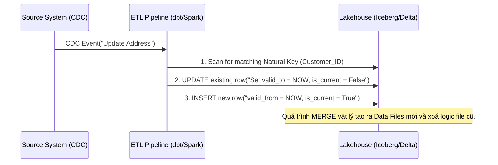

Khi xây dựng Data Warehouse, **Slowly Changing Dimension (SCD)** là bài toán kinh điển về quản lý trạng thái dữ liệu (state management) theo thời gian. 

Đối với các Data Engineer ở level Staff/Senior, chúng ta không chỉ dừng lại ở việc hiểu định nghĩa SCD Type 1 hay Type 2 là gì. Bài toán thực sự nằm ở **Physical Execution (Kiến trúc thực thi vật lý)**: Làm sao để cập nhật (UPDATE/MERGE) hàng tỷ dòng lịch sử mà không làm sập hệ thống (OOMKilled), không gây ra tình trạng phân mảnh dữ liệu (Small Files Problem), và không làm phình to I/O penalty trên các định dạng lưu trữ hiện đại như Delta Lake hay Apache Iceberg.

Bài viết này mổ xẻ SCD dưới lăng kính System Architecture và các Trade-offs thực chiến trên Modern Data Stack.

## 1. Bản chất Vật lý của SCD (Physical Nature of SCD)

Trong môi trường lưu trữ Immutable Data Lake (như HDFS, AWS S3 sử dụng định dạng Parquet/ORC), **không có khái niệm "UPDATE" thực sự**. Khác với RDBMS nơi bạn có thể sửa trực tiếp một byte trên đĩa cứng, mỗi thao tác cập nhật dimension (ví dụ: khách hàng đổi địa chỉ) về bản chất vật lý là một quá trình:
1. Đọc (Scan) file dữ liệu cũ.
2. Viết lại toàn bộ file mới có chứa bản ghi đã sửa (Copy-on-Write) hoặc ghi một file log nhỏ chứa thông tin xóa/thêm mới (Merge-on-Read).
3. Cập nhật Metadata (bảng pointer trỏ tới file mới để query engine biết).

Do đó, cách bạn chọn chiến lược SCD sẽ ảnh hưởng trực tiếp đến **I/O Throughput** và **Storage Cost**.

### Các Mô Hình SCD Phổ Biến & Đánh Đổi (Trade-offs)

#### SCD Type 1 (Overwrite)
Ghi đè giá trị mới nhất, xóa bỏ lịch sử.
- **Physical Execution:** Trong Data Lake, nó kích hoạt quá trình Copy-on-Write: ghi lại toàn bộ file Parquet chỉ để sửa 1 dòng.
- **Trade-off:** Rẻ về mặt query (không bị phình to số dòng), nhưng đắt về I/O update và **mất hoàn toàn khả năng Audit/Time-travel**. Nếu một nhà phân tích muốn biết khách hàng sống ở đâu vào năm ngoái để train Machine Learning model, hệ thống sẽ mù tịt.

#### SCD Type 2 (Row Versioning)
Mỗi sự thay đổi sinh ra một dòng (record) mới với `valid_from`, `valid_to` và `is_current`. 
- **Physical Execution:** Dòng cũ được `UPDATE` (đóng `valid_to`), dòng mới được `INSERT`. Đây là một thao tác `UPSERT` / `MERGE`.
- **Trade-off:** Đảm bảo tính toàn vẹn của Event-driven time-series. Tuy nhiên, nó dẫn đến sự bùng nổ dữ liệu (Data Bloat) và làm chậm các câu lệnh `JOIN` (do cardinality của dimension table tăng lên gấp nhiều lần).



## 2. Kiến trúc Thực thi Vật lý trên Modern Data Stack

Các hệ thống hiện đại giải quyết bài toán SCD Type 2 không phải bằng vòng lặp FOR từng dòng, mà thông qua các engine tính toán phân tán với các cơ chế tối ưu riêng biệt.

### 2.1. Apache Iceberg: Merge-on-Read (MoR) vs Copy-on-Write (CoW)
Iceberg hỗ trợ hai chiến lược ghi cho SCD:
- **Copy-on-Write:** Mỗi lần `MERGE` SCD2, Iceberg đọc file Parquet chứa dòng cần `UPDATE`, ghi ra một file Parquet hoàn toàn mới, và đổi con trỏ metadata. Tối ưu cho Read (Query cực nhanh) nhưng làm chậm quá trình Write.
- **Merge-on-Read:** Iceberg chỉ ghi các thay đổi vào những "Delete files" (chứa ID của dòng bị đóng `valid_to`) và "Data files" mới (cho dòng `INSERT`). Quá trình Write cực kỳ nhanh, nhưng khi Query, Engine (như Trino, Athena) phải tự động "hòa trộn" [merge] các file này lại trên RAM.

**Mã nguồn Thực chiến (Iceberg MERGE cho SCD2):**
```sql
-- Cập nhật SCD Type 2 sử dụng SQL MERGE chuẩn trên Iceberg
MERGE INTO prod.dim_customers t
USING (
  -- Source bao gồm cả dữ liệu update (cần đóng version cũ) và dữ liệu mới
  SELECT customer_id, address, segment, updated_at FROM staging.cdc_customers
) s
ON t.customer_id = s.customer_id AND t.is_current = true
WHEN MATCHED AND t.address != s.address THEN
  -- Đóng record cũ
  UPDATE SET is_current = false, valid_to = s.updated_at
WHEN NOT MATCHED THEN
  -- Insert record hoàn toàn mới
  INSERT (customer_id, address, segment, valid_from, valid_to, is_current)
  VALUES (s.customer_id, s.address, s.segment, s.updated_at, '9999-12-31', true);
```
*(Lưu ý: Để MERGE hoạt động nguyên tử trong 1 pass, Iceberg yêu cầu thiết kế query phức tạp hơn với `UNION` để vừa UPDATE vừa INSERT cùng 1 `customer_id`, đoạn code trên minh họa concept logic).*

### 2.2. dbt Snapshots: Tư duy Khai báo (Declarative)
Thay vì tự viết câu lệnh `MERGE` phức tạp, **dbt snapshots** tự động hóa hoàn toàn việc theo dõi sự thay đổi theo thời gian.

**Mã nguồn Thực chiến (dbt Snapshot config):**
```yaml
# snapshots/dim_customer_snapshot.sql

{{
    config(
      target_schema='snapshots',
      unique_key='customer_id',
      strategy='check',
      -- Tối ưu compute: Chỉ check 2 cột thay vì check_cols='all'
      check_cols=['address', 'segment'] 
    ]
}}
SELECT * FROM {{ source('raw', 'customers') }}

```

## 3. Rủi ro Vận hành & Troubleshooting (Operational Risks)

Khi triển khai SCD Type 2 ở scale lớn (hàng triệu transaction mỗi ngày), bạn sẽ đối mặt với những thảm họa kiến trúc sau:

### 3.1. Thảm họa phân mảnh file (The Small Files Problem)
- **Vấn đề:** Các pipeline chạy dbt snapshot hoặc streaming ghi dữ liệu SCD2 liên tục hàng giờ. Mỗi batch chỉ vài MB nhưng sinh ra hàng ngàn file Parquet nhỏ. Khi truy vấn, Engine mất nhiều thời gian đọc Metadata (List objects trên S3) hơn là đọc Data thực tế, gây nghẽn cổ chai I/O.
- **Triệu chứng:** Query chậm dần đều sau vài tháng. Lệnh `MERGE` chạy mất hàng giờ. Thậm chí gây ra **OOM (Out Of Memory)** trên Driver Node khi cố gắng nạp metadata của hàng triệu file vào RAM.
- **Giải pháp (Physical Tuning):**
  1. **LakeOps / Maintenance:** Bắt buộc phải có một lịch trình chạy `OPTIMIZE` (trên Delta) hoặc `REWRITE DATA FILES` (trên Iceberg) để gộp các file nhỏ thành file lớn (khoảng 128MB - 256MB).
  2. Bật tính năng **Hidden Partitioning** của Iceberg để thu hẹp phạm vi scan metadata.

### 3.2. Cartesian Explosion trong JOIN
- **Vấn đề:** Khi `JOIN` Fact table (10 tỷ dòng) với SCD2 Dimension (nhiều version cho mỗi ID). Nếu điều kiện JOIN thời gian `Fact.order_date >= Dim.valid_from AND Fact.order_date < Dim.valid_to` không được tối ưu, Spark Optimizer sẽ đánh giá nó là một `Non-Equi Join`, dẫn đến thuật toán Broadcast Nested Loop Join hoặc Cartesian Explosion làm sập toàn bộ cluster.
- **Giải pháp:** 
  Sử dụng **Surrogate Key (Khóa thay thế)**. Trong quá trình sinh ra Fact table, hãy thực hiện lookup để lấy ra Surrogate Key của bảng Dimension tại đúng thời điểm đó, và lưu Surrogate Key vào Fact. Khi Query BI, bạn chỉ cần thực hiện `Equi-Join` (`ON Fact.customer_sk = Dim.customer_sk`), biến truy vấn từ đắt đỏ thành rẻ bèo.

### 3.3. Dbt Snapshots và OOMKilled trên Worker Node
Nếu dùng dbt snapshots cho SCD2 với cấu hình `check_cols: 'all'`, dbt mặc định sẽ băm (hash) toàn bộ các cột để tìm ra sự thay đổi. 
- **Rủi ro:** Khi bảng lớn có hàng trăm cột (ví dụ bảng Salesforce), phép so sánh Hash String khổng lồ gây tràn RAM (OOMKilled) tại các Worker nodes của Snowflake/BigQuery.
- **Giải pháp:** Phải tường minh khai báo các cột mang ý nghĩa nghiệp vụ cần track trong mảng `check_cols` như ví dụ ở mục 2.2.

## 4. Kết luận Đánh đổi (Architectural Summary)

Không có kiến trúc nào là hoàn hảo. Việc triển khai SCD đòi hỏi Staff Engineer phải cân bằng giữa 3 yếu tố:
1. **Query Performance (Latency):** SCD Type 2 kết hợp Surrogate Key là "Sweet Spot" [điểm cân bằng] tốt nhất cho BI và Data Warehouse.
2. **Storage/Compute Cost (FinOps):** Quá trình MERGE liên tục trên Data Lake (Lakehouse) tốn Compute. Cần có chiến lược Compaction nghiêm ngặt để giải quyết Small Files.
3. **Data Integrity:** Bỏ qua việc tự viết SQL vòng lặp thủ công. Hãy sử dụng các framework chuẩn có sẵn tính năng ACID (như dbt snapshots, Delta Live Tables, Apache Iceberg) để đảm bảo an toàn cho dữ liệu lịch sử.

## 5. Nguồn Tham Khảo (References)
* [dbt Documentation - Snapshots](https://docs.getdbt.com/docs/build/snapshots)
* [AWS Big Data Blog - Implement Slowly Changing Dimensions Type-2 using Apache Iceberg](https://aws.amazon.com/blogs/big-data/implement-historical-record-lookup-and-slowly-changing-dimensions-type-2-using-apache-iceberg/)
* [LakeOps Blog - Iceberg vs Delta Lake Trade-offs](https://www.lakeops.dev/blog/iceberg-delta-lake-tradeoffs)
* Designing Data-Intensive Applications - Martin Kleppmann (Phân tích về Storage I/O và Immutable Data).
