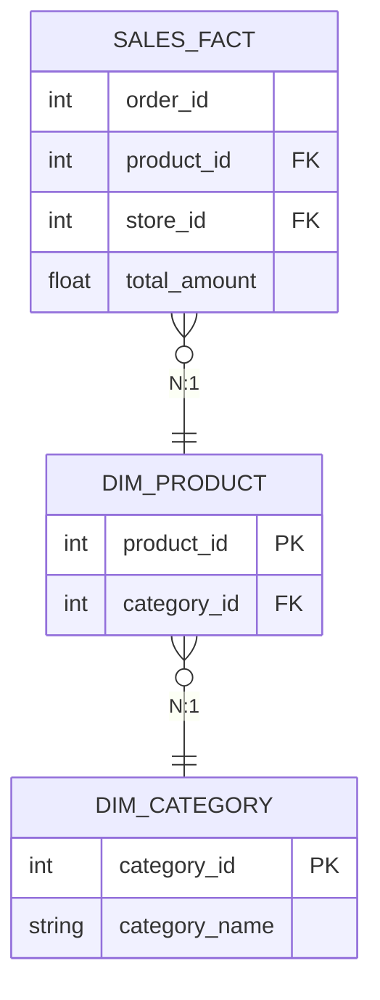

Snowflake Schema là một kiến trúc Dimensional Modeling trong Data Warehouse, sinh ra với mục tiêu **chuẩn hóa (Normalization)** các bảng chiều (Dimension) của mô hình Star Schema thành các phân cấp thứ bậc (hierarchy) tương tự như chuẩn 3NF (Third Normal Form) trong cơ sở dữ liệu quan hệ.

> [!NOTE]
> Khác với Star Schema (hy sinh không gian lưu trữ để giảm bớt số lần JOIN), Snowflake Schema đặt nặng tính **toàn vẹn dữ liệu (Data Integrity)** và giảm thiểu I/O thông qua việc thu hẹp kích thước bản ghi (record size). Nhưng ở kỷ nguyên của Cloud Data Warehouse (BigQuery, Redshift, Snowflake), nơi Storage cực rẻ và Compute (CPU) cực đắt, Snowflake Schema mang lại những Systemic Trade-offs vô cùng lớn.

## 1. Kiến trúc Thực thi Vật lý (Physical Execution)

Trong Snowflake Schema, các Dimension không còn là một bảng phẳng (flat table - denormalized) mà bị vỡ ra thành nhiều Sub-dimension riêng biệt.


*Kiến trúc Lược đồ bông tuyết (Nguồn: Wikimedia).*

Khi một câu lệnh SQL từ công cụ BI (Tableau, PowerBI) request dữ liệu từ Fact table, Optimizer của cơ sở dữ liệu phải thực hiện chuỗi các phép `JOIN` bậc thang (Cascading Joins) từ Fact -> Dim -> Sub-Dim.



Dưới góc nhìn vật lý, nếu `SALES_FACT` có 10 tỷ dòng và `DIM_PRODUCT` có 50 triệu dòng, việc thực thi `JOIN` đòi hỏi query engine phải thực hiện **Network Shuffle** (xáo trộn dữ liệu qua mạng giữa các node) hoặc **Broadcast** (gửi toàn bộ bảng bé sang mọi node). Với Snowflake Schema, số lượng phép JOIN tăng lên tỷ lệ thuận với số lượng nhánh Sub-dimensions, dẫn tới lãng phí tài nguyên Compute khổng lồ.

## 2. Rủi ro Vận hành (Operational Risks)

Sử dụng Snowflake Schema trong hệ thống Data Warehouse hiện đại đối mặt với những hiểm họa thực chiến nào?

### 2.1. Cartesian Explosion & OOMKilled
Khi thực hiện JOIN qua quá nhiều cấp Sub-dimension, Optimizer (đặc biệt là các Cost-Based Optimizer thế hệ cũ) rất dễ đánh giá sai Cardinality (độ phân tán và phân phối dữ liệu).
- Nếu `DIM_CITY` join với `DIM_STORE` nhưng bị thiếu khóa logic hoặc quan hệ bị biến tướng thành M:N (many-to-many) thay vì 1:N, kết quả trung gian (Intermediate Result) trên bộ nhớ RAM sẽ bùng nổ theo cấp số nhân (Cartesian Explosion).
- Hậu quả: Executor Node bị cạn kiệt bộ nhớ, dẫn đến việc hệ thống kill process với lỗi **JVM OOMKilled** (Out of Memory) hoặc ép Engine chuyển sang cơ chế **Spill-to-disk** (tràn RAM ra ổ cứng - làm IOPS sụt giảm và tốc độ query chậm đi hàng chục lần).

### 2.2. BI Tools Bottleneck (Nút thắt cổ chai từ công cụ BI)
Các nền tảng phân tích Self-service như Tableau, Looker hay Superset sinh ra SQL tự động dựa trên Data Model định nghĩa sẵn. Khi đối mặt với Snowflake Schema, query sinh ra sẽ là một ma trận `LEFT JOIN` khổng lồ, không được tối ưu.

```sql
-- Đoạn mã query do BI Tool sinh tự động có thể phá nát hiệu năng
SELECT 
    d.department_name, 
    SUM(f.total_amount) AS total_revenue
FROM SALES_FACT f
LEFT JOIN DIM_PRODUCT p ON f.product_id = p.product_id
LEFT JOIN DIM_CATEGORY c ON p.category_id = c.category_id
LEFT JOIN DIM_DEPARTMENT d ON c.department_id = d.department_id
-- Mỗi LEFT JOIN là một lần cấp phát bộ nhớ để build Hash Table 
-- trong thuật toán Hash Join của Database Engine.
GROUP BY d.department_name;
```

## 3. Sự Đánh đổi Hệ thống (Systemic Trade-offs)

| Yếu tố | Snowflake Schema | Star Schema (Denormalized) | Phân tích thực chiến (Real-world) |
| :--- | :--- | :--- | :--- |
| **Compute vs Storage** | Tối ưu Storage, đốt Compute | Tốn Storage, tối ưu Compute | Ngày nay Storage (S3/GCS) rất rẻ. Định dạng Columnar (Parquet/ORC) hỗ trợ nén dữ liệu lặp lại cực tốt (Dictionary Encoding, Run-Length Encoding). Lợi thế "tiết kiệm ổ cứng" của Snowflake gần như bị triệt tiêu hoàn toàn. |
| **Data Consistency** | Hoàn hảo (Chuẩn hóa 3NF) | Dễ bất đồng bộ (Anomaly) | Với Star Schema, đổi tên 1 phòng ban phải `UPDATE` hàng triệu record trong `DIM_PRODUCT`. Snowflake chỉ cần `UPDATE` 1 dòng duy nhất ở `DIM_DEPARTMENT`. |
| **Data Ingestion** | Phức tạp (Cần DAG chạy tuần tự) | Đơn giản, tính cô lập cao | Để ETL vào Snowflake, Airflow DAG phải thiết lập: Load Sub-Dim -> Load Dim -> Load Fact. Rất dễ dính lỗi **Dependency Hell** nếu một nhánh fail. |

## 4. Staff Engineer: Khi nào buộc phải dùng Snowflake Schema?

Mặc dù Star Schema đang là chuẩn mực tối thượng, Snowflake Schema vẫn là lựa chọn sống còn trong một số Use-case đặc thù:

**1. Xử lý Slowly Changing Dimensions (SCD) khổng lồ:**
Nếu bạn có bảng `DIM_CUSTOMER` nặng 5TB với hàng trăm cột thuộc tính. Việc chạy SCD Type 2 (thêm dòng mới mỗi khi một thuộc tính thay đổi) sẽ đẩy Storage Cost và I/O lên mức báo động. 
*Giải pháp*: Tách các thuộc tính hay thay đổi (Fast-changing attributes - ví dụ như Tình trạng hôn nhân, Thu nhập) thành một Sub-Dimension độc lập dạng Snowflake.

**2. Null Density (Dữ liệu quá thưa - Sparse Data):**
Nếu một Dimension có 150 cột nhưng ở một số dòng cụ thể, 120 cột trong số đó mang giá trị `NULL` (ví dụ: Thuộc tính đặc thù của một mặt hàng điện tử nằm chung bảng với quần áo). Việc phi chuẩn hóa vào 1 bảng Star Schema sẽ tạo ra độ thưa lớn. Tách các phân cấp thuộc tính này thành các bảng nhánh (Snowflaking) sẽ cứu cánh cho Storage Engine khi đọc/quét cột.

**3. Single Source of Truth (SSOT) trong Kiến trúc Data Mesh:**
Trong kiến trúc phân tán như Data Mesh ở các Big Tech (Uber, Netflix), một thực thể như `DIM_CITY` thường được quản lý tập trung bởi một Location Domain. Nó sẽ được expose dưới dạng Data Product cho các Domain khác query. Khi đó, `DIM_CITY` phải đứng độc lập (như một mảnh Sub-dim của Snowflake) thay vì bị "bake" vĩnh viễn vào bên trong các bảng Dimension của Domain khác.

## 5. Dbt Workflow Thực chiến: Lai tạo sức mạnh (Hybrid)

Trong Data Engineering hiện đại, thay vì bắt BI Tools tự gánh chịu chi phí `JOIN` khi query Snowflake Schema, các kỹ sư sử dụng **dbt (data build tool)** để thiết kế luồng tiền tính toán (Pre-compute). Dữ liệu thô giữ ở cấu trúc Snowflake (để dễ Data Quality & Ingestion), nhưng được materialize thành Star Schema (dạng bảng Denormalized) ở tầng Serving cho End-user.

```yaml
# dbt_project.yml (Biến Snowflake thành Star bằng Materialization)
models:
  my_project:
    marts:
      core:
        dim_product_denormalized:
          +materialized: table 
          # Tối ưu hóa Zone Map / Min-Max pruning khi đọc dữ liệu
          +cluster_by: "category_name" 
```

```sql
-- models/marts/core/dim_product_denormalized.sql
-- Chạy vào ban đêm để gánh vác các phép JOIN đắt đỏ của Snowflake
WITH product AS (
    SELECT * FROM {{ ref('stg_dim_product') }}
),
category AS (
    SELECT * FROM {{ ref('stg_dim_category') }}
)
SELECT 
    p.product_id,
    p.product_name,
    c.category_name
FROM product p
LEFT JOIN category c 
    ON p.category_id = c.category_id;
```

## 6. Nguồn Tham Khảo (References)

* [Designing Data-Intensive Applications - Martin Kleppmann (O'Reilly)](https://dataintensive.net/)
* [AWS Architecture Blog - Design Patterns for Amazon Redshift](https://aws.amazon.com/blogs/architecture/)
* [Netflix Tech Blog: Data Engineering and Data Modeling at Scale](https://netflixtechblog.com/)
* [Fundamentals of Data Engineering - Joe Reis & Matt Housley](https://www.oreilly.com/library/view/fundamentals-of-data/9781098108298/)

