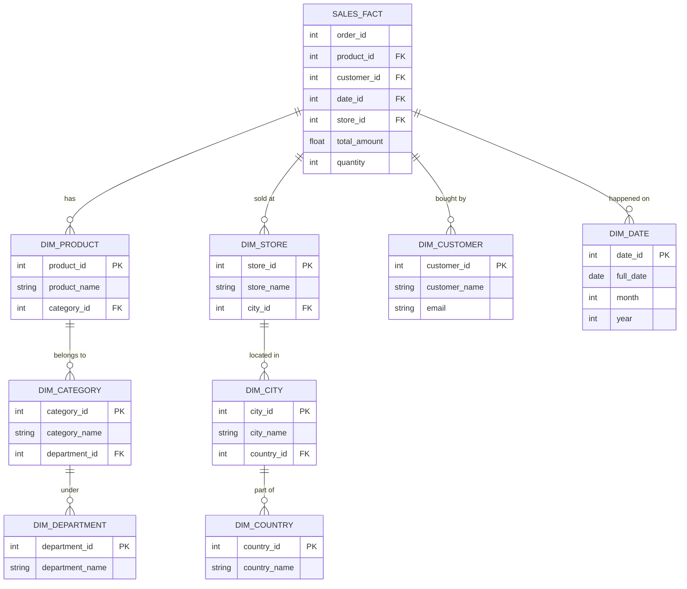

Khi xây dựng mô hình dữ liệu (Data Modeling) cho Data Warehouse (Kho dữ liệu), **Lược đồ bông tuyết (Snowflake Schema)** là một kiến trúc khá phổ biến được phát triển từ lược đồ hình sao (Star Schema). Lược đồ này lấy tên từ hình dạng trực quan của nó: khi các bảng dimension (bảng chiều) được liên kết với nhau, mô hình tổng thể giống như một bông tuyết với một tâm là fact table và các nhánh tủa ra bên ngoài.

Khác với Star Schema (nơi mà mọi dimension table đều phi chuẩn hóa - denormalized), Snowflake Schema đi theo hướng **chuẩn hóa (normalization)** dữ liệu cho các dimension tables. Điều này có nghĩa là dữ liệu chiều sẽ được chia thành nhiều bảng nhỏ hơn dựa trên các cấp độ phân cấp (hierarchy) để giảm thiểu tối đa việc lặp lại dữ liệu (data redundancy).

## Đặc điểm chính (Core Characteristics)

1. **Fact Table (Bảng sự kiện)**: Vẫn giữ vị trí trung tâm, chứa các giá trị có thể đo lường (metrics/measures) và các khóa ngoại (foreign keys) liên kết với các bảng chiều (dimension tables).
2. **Dimension Tables (Bảng chiều)**: Khác với Star Schema, các bảng chiều trong Snowflake Schema được phân tách theo quy tắc chuẩn hóa (thường là 3NF - Third Normal Form).
3. **Hierarchy (Phân cấp phân nhánh)**: Dữ liệu chiều có tính phân cấp sẽ được tách thành các bảng riêng. Ví dụ: thay vì lưu thông tin `Quốc gia`, `Thành phố`, `Cửa hàng` vào chung một bảng `Cửa hàng`, Snowflake schema sẽ tách ra làm ba bảng: `Bảng Quốc gia`, `Bảng Thành phố`, và `Bảng Cửa hàng`.

## Ví dụ minh họa Lược đồ Bông Tuyết (Example)

Hãy xem xét một ví dụ về dữ liệu bán hàng. Để theo dõi thông tin sản phẩm và cửa hàng thay vì lưu tất cả thông tin vào các bảng lớn, dữ liệu được chia nhỏ thành các mức phân cấp:

Như có thể thấy, Bảng `DIM_PRODUCT` được chuẩn hóa thành `DIM_CATEGORY` và `DIM_DEPARTMENT`. Tương tự, `DIM_STORE` được chuẩn hóa thành `DIM_CITY` và `DIM_COUNTRY`. Kết quả là biểu đồ lan rộng ra nhiều nhánh, hình thành nên cấu trúc "Bông tuyết".

## So sánh Snowflake Schema và Star Schema

| Tiêu chí | Star Schema (Lược đồ hình sao) | Snowflake Schema (Lược đồ bông tuyết) |
|----------|--------------------------------|---------------------------------------|
| **Cấu trúc bảng** | Các bảng chiều bị phi chuẩn hóa (Denormalized) - dữ liệu gộp chung. | Các bảng chiều được chuẩn hóa (Normalized) - tách thành nhiều bảng. |
| **Tính dư thừa (Redundancy)** | Cao. Nhiều thông tin lặp lại trong bảng chiều. | Rất thấp. Thông tin không bị lặp lại. |
| **Dung lượng lưu trữ** | Lớn hơn do phải lưu trữ dữ liệu dư thừa. | Nhỏ hơn, tiết kiệm không gian đĩa. |
| **Độ phức tạp của Query** | Đơn giản. Thường chỉ cần JOIN 1 lần từ Fact ra Dimension. | Phức tạp. Cần nhiều câu lệnh JOIN (tầng qua tầng) để lấy dữ liệu. |
| **Hiệu suất truy vấn (Query Performance)** | Thường nhanh hơn (đặc biệt khi đọc dữ liệu phân tích). | Thường chậm hơn do chi phí thực thi các phép JOIN liên tiếp. |
| **Bảo trì dữ liệu (Maintenance)** | Có thể gặp rủi ro bất đồng bộ (data anomalies) khi cập nhật. | Dễ dàng cập nhật, đảm bảo tính nhất quán dữ liệu do tính chuẩn hóa cao. |

## Ưu điểm (Advantages)

* **Tiết kiệm dung lượng lưu trữ (Storage Efficiency)**: Bằng cách loại bỏ sự dư thừa, không gian đĩa cần thiết được giảm xuống đáng kể. Trong các hệ thống nơi chi phí lưu trữ là vấn đề, đây là một điểm cộng lớn.
* **Tính toàn vẹn dữ liệu (Data Integrity)**: Nhờ tuân thủ chuẩn hóa, việc thêm, xóa, hoặc cập nhật dữ liệu trở nên an toàn hơn, hạn chế các lỗi bất đồng bộ. Ví dụ, nếu tên của một phòng ban thay đổi, bạn chỉ cần cập nhật 1 dòng duy nhất ở bảng `DIM_DEPARTMENT` thay vì hàng nghìn dòng ở `DIM_PRODUCT`.
* **Dễ dàng bảo trì (Easier Maintenance)**: Các kiến trúc chuẩn hóa vốn rất quen thuộc với những kỹ sư quản trị cơ sở dữ liệu quan hệ (RDBMS).

## Nhược điểm (Disadvantages)

* **Thiết kế phức tạp (Complexity)**: Số lượng bảng tăng lên đáng kể, làm cho lược đồ trở nên phức tạp. Đối với những người dùng Business (Business Users) hoặc Data Analysts viết truy vấn ad-hoc, nó đòi hỏi hiểu biết sâu hơn về cấu trúc dữ liệu.
* **Hiệu suất truy vấn suy giảm (Slower Performance)**: Các công cụ BI (Business Intelligence) hoặc các câu query tổng hợp sẽ phải thực hiện một chuỗi các phép JOIN đắt đỏ. Đối với các tập dữ liệu lớn, việc "join qua nhiều cấp" sẽ tạo ra nút thắt cổ chai về mặt hiệu năng.

## Khi nào nên sử dụng Snowflake Schema?

Mặc dù Star Schema đang thống trị mô hình dimensional modeling cho Data Warehouse hiện đại, Snowflake Schema vẫn là lựa chọn phù hợp trong một số trường hợp cụ thể:

1. **Dữ liệu có hệ thống phân cấp phức tạp và đồ sộ**: Nếu các cấp phân nhánh của dimension (như cấu trúc tổ chức của doanh nghiệp lớn) rất rộng và thường xuyên biến động, việc chuẩn hóa giúp kiểm soát chất lượng dữ liệu an toàn nhất.
2. **Hệ thống bị hạn chế nghiêm ngặt về không gian lưu trữ**: Mặc dù lưu trữ đám mây ngày nay khá rẻ, nhưng trong các hệ thống on-premise cũ hoặc hệ thống chi phí đắt đỏ, việc giảm không gian lưu trữ đôi khi được ưu tiên hơn tối ưu hiệu năng CPU.
3. **Các bảng chiều (Dimension Tables) khổng lồ**: Khi một bảng chiều có kích thước cực kỳ lớn với hàng trăm thuộc tính có khả năng phân tách, giữ nó dưới dạng phi chuẩn hóa (Star Schema) có thể gây phình kích thước dữ liệu nghiêm trọng và ảnh hưởng đến cả I/O, trong khi Snowflake sẽ là giải pháp phân chia hợp lý.
4. **Công cụ tự động hóa OLAP**: Một số công cụ báo cáo và BI có khả năng tự động tạo ra và tối ưu truy vấn cực tốt cho các cấu trúc chuẩn hóa, qua đó vô hiệu hóa điểm yếu của Snowflake Schema.

## Tổng kết

Snowflake Schema mang lại tính toàn vẹn và tối ưu không gian đĩa nhờ kỹ thuật chuẩn hóa, nhưng đổi lại phải đánh đổi bằng sự phức tạp trong thiết kế và suy giảm tốc độ truy vấn. 

Trong bối cảnh hạ tầng phần cứng ngày nay, khi chi phí lưu trữ đã giảm đáng kể trong khi yêu cầu về tốc độ truy xuất dữ liệu lại tăng cao, **Star Schema** có phần được ưa chuộng và sử dụng phổ biến hơn. Tuy nhiên, việc nắm vững nguyên lý hoạt động của Snowflake Schema giúp các Kỹ sư dữ liệu (Data Engineers) linh hoạt áp dụng mô hình **Lai (Hybrid)** – chuẩn hóa những dimension có độ biến động cao và phi chuẩn hóa những dimension thường xuyên được truy vấn báo cáo.

## Tài Liệu Tham Khảo

* **Fundamentals of Data Engineering - Joe Reis & Matt Housley**
* [Designing Data-Intensive Applications - Martin Kleppmann](https://dataintensive.net/)
* [The Pragmatic Engineer - Gergely Orosz](https://blog.pragmaticengineer.com/)
* **Data Engineering at Scale: Netflix Tech Blog**
* **Building Data Infrastructure at Airbnb**
