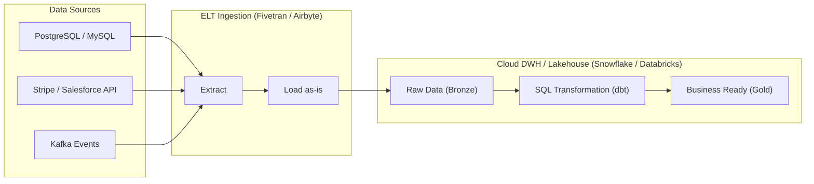
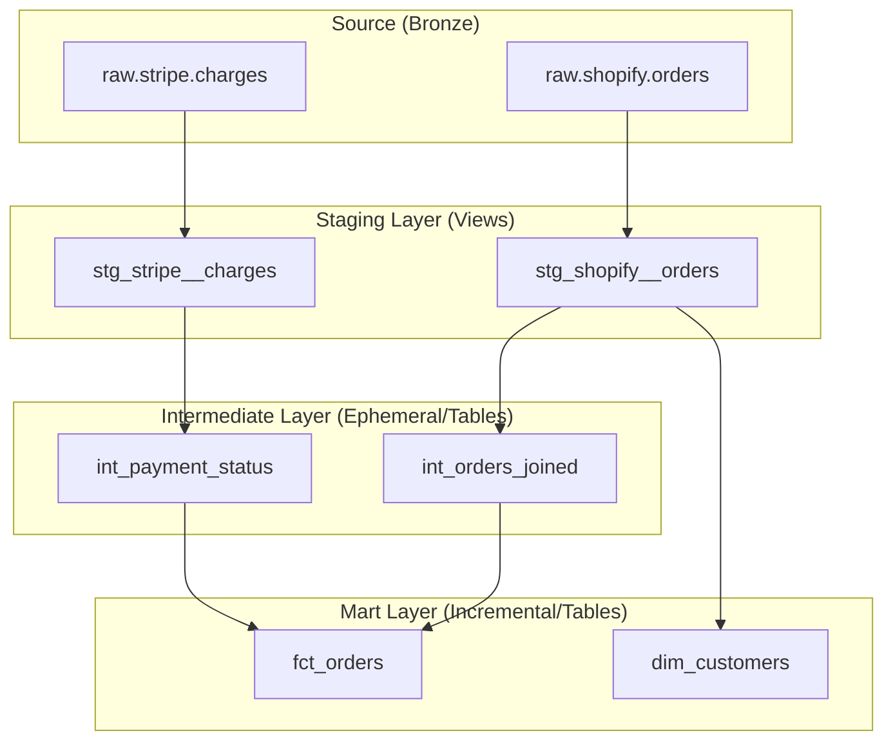

Trong Kỷ nguyên Modern Data Stack, SQL không đơn thuần là ngôn ngữ để "rút trích dữ liệu" (Querying) mà đã tiến hóa thành động cơ cốt lõi cho **Data Transformation**. Sự dịch chuyển này bắt nguồn từ sự thay đổi trong kiến trúc vật lý của các Cloud Data Warehouse hiện đại (Snowflake, BigQuery) và Data Lakehouse (Databricks).

Bài viết này mổ xẻ SQL Transformation dưới góc nhìn của một Kỹ sư Hệ thống: Từ việc cấu trúc DAG bằng **dbt (data build tool)**, thiết kế logic xử lý trạng thái (Stateful Incremental Loads) đến các kỹ thuật tối ưu hóa Memory và CPU khi xử lý hàng tỷ bản ghi.

---

## 1. Kiến trúc Thực thi Vật lý: Sự thống trị của ELT

Trong quá khứ, mô hình **ETL (Extract - Transform - Load)** yêu cầu một Cụm máy chủ chuyên dụng (như Hadoop/Spark, Informatica) ở giữa để Transform dữ liệu trước khi nạp vào Kho dữ liệu (DWH). Lý do? Các DWH truyền thống (On-premise) có kiến trúc **Coupled Compute & Storage** (Tính toán và Lưu trữ dính liền), khiến năng lực tính toán cực kỳ giới hạn và đắt đỏ.

Với kiến trúc **Decoupled Compute & Storage** của Cloud DWH hiện đại, tài nguyên Compute có thể scale (mở rộng) độc lập với Storage chỉ trong vài giây. Điều này sinh ra mô hình **ELT (Extract - Load - Transform)**.



**Trade-offs của ELT:**
* **Ưu điểm:** Khai thác tối đa sức mạnh MPP (Massively Parallel Processing) của DWH. Giảm độ phức tạp vận hành mạng lưới (không cần chuyển dữ liệu ra ngoài để xử lý).
* **Nhược điểm (FinOps Risks):** Nếu Analytics Engineer viết SQL kém, bạn có thể dễ dàng đốt hàng ngàn USD tiền Compute mỗi tháng do các phép **JOIN bùng nổ** hoặc **Network Shuffle** vô tội vạ.

---

## 2. Tổ chức Codebase với dbt (Layered Architecture)

Viết một câu SQL dài 2000 dòng với hàng chục Subqueries lồng nhau là một **Anti-pattern** kinh điển, dẫn đến tình trạng *Spaghetti Code* và không thể debug. **dbt** giải quyết bài toán này bằng cách áp dụng các nguyên tắc Software Engineering vào SQL.

Kiến trúc chuẩn của một dbt project tuân theo **Layered Architecture (Kiến trúc phân tầng)**:



1. **Staging Layer (`stg_`)**: Ánh xạ 1:1 với source. Nhiệm vụ: Ép kiểu (Type casting), đổi tên cột, xử lý chuỗi và timezone. **Tuyệt đối không có JOIN ở layer này.** Thường materialize dưới dạng `view`.
2. **Intermediate Layer (`int_`)**: Chứa logic nghiệp vụ phức tạp. Xử lý các phép JOIN lớn, tính toán Metric trung gian.
3. **Mart Layer (`fct_`, `dim_`)**: Cấu trúc thành Star Schema phục vụ trực tiếp cho BI Dashboard. Dữ liệu ở đây phải cực kỳ "sạch" và materialize dưới dạng `table` hoặc `incremental`.

---

## 3. Nghệ Thuật Tối Ưu Hiệu Năng (Systemic Performance)

Khi viết SQL trong dbt, Data Engineer phải thấu hiểu cách **Query Optimizer** và **Execution Engine** xử lý dữ liệu dưới hạ tầng vật lý. Dưới đây là những "Sát thủ hiệu năng" kinh điển.

### 3.1. Cuộc chiến CTEs vs. Materialization
Nhiều kỹ sư lạm dụng CTEs (`WITH` clauses) để làm "code đẹp". Thực tế, nếu một CTE phức tạp bị gọi lại nhiều lần trong cùng một query, một số Engine (như Snowflake) có thể phải tính toán lại CTE đó nhiều lần, hoặc tệ hơn, Query Optimizer bị quá tải (Overhead) khi biên dịch một Execution Plan khổng lồ (Nested CTEs > 5 tầng).

**Giải pháp Thực chiến (The Trade-off):**
- Đừng cố nhồi nhét tất cả vào một file `.sql` dài thòng lọng với hàng tá CTEs.
- Tách các CTE nặng nề thành các file dbt model riêng biệt.
- Sử dụng cấu hình `materialized='ephemeral'` cho các logic đơn giản (pass-through).
- Chuyển sang `materialized='table'` hoặc `incremental` cho các khối logic nặng để ép Engine phải lưu kết quả vật lý xuống đĩa (Cache), giúp các model downstream chạy nhanh hơn vạn lần.

### 3.2. Window Functions và Thảm họa Tràn RAM (Spill-to-disk)
Window Functions (`ROW_NUMBER()`, `LEAD()`) là công cụ tối thượng để làm sạch dữ liệu (Deduplication) theo chuỗi thời gian.

```sql
-- Lấy event mới nhất của mỗi user
SELECT * FROM (
    SELECT event_id, user_id, timestamp,
        ROW_NUMBER() OVER (PARTITION BY user_id ORDER BY timestamp DESC) as rn
    FROM events
) WHERE rn = 1;
```

**Rủi ro Vật lý (Systemic Risk):** 
Mệnh đề `PARTITION BY user_id` buộc Engine phải thực hiện **Network Shuffle** (chuyển đổi dữ liệu qua lại giữa các Node) để gom tất cả events của cùng một `user_id` vào chung một Compute Node nhằm thực hiện phép Sort (`ORDER BY`).
- **Sự cố Data Skew:** Nếu có một tài khoản bot (system user) sinh ra 90% lượng event, Node phụ trách xử lý `user_id` đó sẽ cạn kiệt RAM. Dữ liệu bắt buộc phải xả tạm xuống ổ cứng (**Spill-to-disk / Spill to Remote Storage**). Tốc độ I/O đĩa cực chậm khiến truy vấn bị "treo" (Hang) hoặc sập hệ thống (OOM).
- **Khắc phục:** Filter chặn các bot users ở Staging layer, hoặc áp dụng kỹ thuật **Salting** (thêm tiền tố ngẫu nhiên vào khóa Partition để chia đều tải).

### 3.3. Cartesian Explosion trong JOIN
Lỗi phổ biến nhất làm "cháy ví" [FinOps Disaster] là JOIN tạo ra tích Đề-các.
Ví dụ: Bảng A có 100,000 dòng, Bảng B có 100,000 dòng. Nếu JOIN bị lặp khóa (Many-to-Many), hệ thống sẽ phải sinh ra 10,000,000,000 dòng dữ liệu rác trên RAM.
**Luật bất thành văn:** Luôn `GROUP BY` hoặc Deduplicate dữ liệu thành khóa Unique trước khi JOIN (đưa về One-to-Many). Bắt buộc viết dbt tests (`unique`, `not_null`) trên các cột dùng để JOIN.

---

## 4. Xử lý Incremental Load ở Scale Lớn

Khi dữ liệu lên mốc Terabytes, lệnh `FULL REFRESH` (xóa và tính lại toàn bộ) mỗi đêm là sự lãng phí tiền bạc khủng khiếp. Bạn phải dùng **Incremental Processing** (chỉ xử lý dữ liệu Delta).

### 4.1. Cơ chế MERGE (UPSERT)
dbt xử lý Incremental bằng cách tự động sinh ra lệnh `MERGE`.

```sql
-- Cấu hình dbt incremental
{{ config(
    materialized='incremental',
    unique_key='order_id'
) }}

SELECT order_id, status, updated_at
FROM {{ ref('stg_orders') }}


  -- Chỉ lấy các orders có sự thay đổi kể từ lần chạy cuối
  WHERE updated_at >= (SELECT MAX(updated_at) FROM {{ this }})

```

### 4.2. Kết hợp với Clustering (Phân cụm Vật lý)
Để câu lệnh `MERGE` chạy nhanh, Engine phải tìm được bản ghi cũ nhanh nhất.
- **Databricks:** Áp dụng **Liquid Clustering** trên cột `unique_key`. Engine sẽ tự động gom các bản ghi có ID gần nhau vào cùng một file Parquet, giúp giảm 90% lượng dữ liệu phải quét khi MERGE.
- **Snowflake:** Cấu hình **Automatic Clustering** hoặc sử dụng tính năng **Dynamic Tables** để Snowflake tự động quản lý State ngầm bên dưới mà không cần tự viết logic Incremental phức tạp.

---

## 5. Kết Luận
Viết SQL Transformation không đơn giản là gõ `SELECT ... FROM ...`. Trong kiến trúc phân tán (Distributed Architecture), mỗi mệnh đề `JOIN`, `PARTITION BY` hay `CTE` đều kích hoạt các luồng luân chuyển dữ liệu khổng lồ (Shuffle) và đốt tiền Compute (FinOps). 

Bằng cách áp dụng **dbt** để kiến trúc DAG nhiều lớp, quản lý Incremental State thông minh, và thấu hiểu giới hạn vật lý của Engine (Spill-to-disk, Data Skew), Analytics Engineer có thể xây dựng những đường ống xử lý dữ liệu bền bỉ và tối ưu chi phí ở quy mô Petabyte.

## Nguồn Tham Khảo (References)
* [dbt Best Practices: Structuring your project](https://docs.getdbt.com/best-practices/how-we-structure/1-guide-overview)
* [Snowflake: Query Profile & Spill to Disk Optimization](https://docs.snowflake.com/en/user-guide/ui-query-profile)
* [Databricks: Liquid Clustering for Delta Lake](https://docs.databricks.com/en/delta/clustering.html)
* **Designing Data-Intensive Applications** - Martin Kleppmann (Chương 10: Batch Processing).
