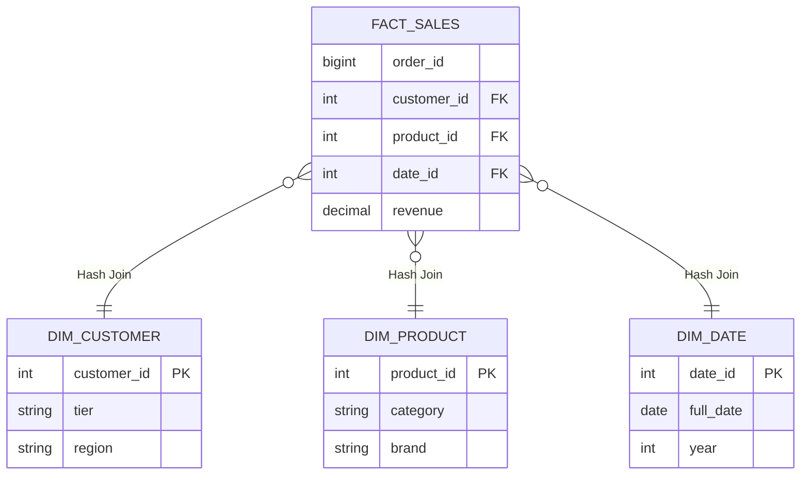

Trong thiết kế kho dữ liệu hiện đại, **Star Schema (Lược đồ hình sao)** không chỉ là một khái niệm logic của Dimensional Modeling, mà nó còn là bài toán tối ưu hóa Physical Execution (thực thi vật lý) trên các Distributed Compute Engines (như Spark, Snowflake, BigQuery).

Thay vì những định nghĩa sách giáo khoa "Bảng Fact là gì? Bảng Dim là gì?", bài viết này sẽ mổ xẻ cấu trúc vật lý của Star Schema, các sự cố tràn RAM (`Spill-to-disk` / `OOM`) khi thực thi Join, và cách các Cloud Data Warehouse hiện đại tối ưu hóa kiến trúc này thông qua Broadcast Hash Join hay Liquid Clustering.

## 1. Kiến trúc Thực thi Vật lý (Physical Execution)

Về mặt logic, Star Schema là một Fact Table trung tâm bao quanh bởi các Dimension Tables. Nhưng ở tầng vật lý, khi bạn chạy một câu lệnh `SELECT`, Compute Engine phải đối mặt với bài toán kinh điển: **Distributed Join**.



### Broadcast Hash Join (BHJ)
Trong môi trường phân tán (ví dụ: Apache Spark / Databricks), Star Schema cực kỳ tỏa sáng nhờ cơ chế **Broadcast Hash Join**. 

Vì các bảng Dimension thường nhỏ, engine sẽ sao chép (broadcast) toàn bộ bảng Dimension lên RAM của tất cả các Worker nodes. 
Bảng Fact (có thể lến tới vài Terabytes) sẽ được chia nhỏ thành các partitions và stream qua các Worker. Khi stream đến đâu, dữ liệu sẽ lookup vào bảng Dimension đang nằm trên RAM (tổ chức dưới dạng Hash Map) đến đó. 
**Kết quả:** Hoàn toàn không xảy ra `Network Shuffle` cho bảng Fact. Dữ liệu chỉ đọc và trả về, cho Latency siêu thấp.

```yaml
# Cấu hình Spark/Databricks để force Broadcast Join cho bảng Dimension
# Tăng ngưỡng broadcast lên 100MB (Mặc định thường là 10MB) để nạp lọt các bảng Dim lớn
spark.sql.autoBroadcastJoinThreshold: 104857600 
```

## 2. Rủi ro Vận hành (Operational Risks & Incidents)

Dù lý thuyết thiết kế rất đẹp, khi scale hệ thống lên hàng tỷ records, Star Schema sẽ gặp những sự cố thực tế sau:

### 2.1. OOMKilled (Out of Memory) & Spill-to-Disk
Khi một bảng Dimension phình to vượt quá giới hạn cấp phát bộ nhớ RAM của một Worker node (ví dụ bảng `dim_users` lên tới 100 triệu bản ghi tương đương 10GB), quá trình Broadcast sẽ thất bại. Engine buộc phải fallback về thuật toán **Sort-Merge Join (SMJ)**.

Lúc này, toàn bộ bảng Fact khổng lồ sẽ bị ép phải `Shuffle` qua mạng để gom các keys về cùng một node tiến hành sort. 
**Hậu quả:**
1. **Network IO Bottleneck:** Hàng Terabyte dữ liệu bị đẩy qua lại giữa các node, làm bão hòa băng thông mạng của Cluster.
2. **Spill-to-disk:** Vùng nhớ RAM của Worker bị đầy, dữ liệu phải xả tạm xuống ổ cứng (Disk). Lệnh truy vấn từ 5 giây biến thành 5 tiếng.

**Khắc phục thực chiến:**
- **Databricks:** Bật `Liquid Clustering` trên các Join Keys (thay thế cho kỹ thuật Z-Ordering cũ) để gom cụm dữ liệu vật lý một cách linh hoạt, giảm thiểu lượng dữ liệu phải scan khi join.
- **Snowflake:** Cấu hình `Automatic Clustering` trên khóa ngoại của bảng Fact để prune micro-partitions.

### 2.2. Cartesian Explosion (Bùng nổ tích Đề-các)
Thường xảy ra khi cập nhật Dimension bằng SCD Type 2. Nếu thiết kế Surrogate Key không chuẩn, hoặc engineer quên viết mệnh đề lọc khoảng thời gian (`valid_from` <= `fact.date` < `valid_to`), một dòng Fact có thể join trúng 3 versions lịch sử của cùng một bản ghi Dimension. Kết quả bảng output x3 dung lượng và làm sập (Crash) toàn bộ luồng pipeline phía sau.

## 3. Code Thực Chiến: Cập nhật Dimension với SCD Type 2

Khi thiết kế Star Schema, bài toán hóc búa nhất (và tốn resource nhất) là quản lý sự thay đổi của bảng chiều (Slowly Changing Dimensions). 
Dưới đây là một pattern `MERGE` kinh điển (viết bằng Snowflake SQL) để xử lý SCD Type 2 - lưu giữ toàn bộ lịch sử thay đổi thông tin khách hàng mà không ghi đè dữ liệu cũ.

```sql
-- Pattern thực tế tại các Enterprise Data Warehouse để upsert dữ liệu
MERGE INTO target.dim_customer t
USING (
    SELECT 
        customer_id,
        tier,
        region,
        current_timestamp() as updated_at
    FROM staging.raw_customer_cdc
) s
ON t.customer_id = s.customer_id 
   AND t.is_active = TRUE
   
WHEN MATCHED AND (t.tier != s.tier OR t.region != s.region) THEN 
    -- Bước 1: Đóng băng bản ghi cũ (Expire) thay vì xóa bỏ
    UPDATE SET 
        is_active = FALSE,
        valid_to = s.updated_at

WHEN NOT MATCHED THEN 
    -- Bước 2: Insert bản ghi hoàn toàn mới
    INSERT (customer_id, tier, region, is_active, valid_from, valid_to)
    VALUES (s.customer_id, s.tier, s.region, TRUE, s.updated_at, '9999-12-31');
```
*(Lưu ý: Trong pipeline thực tế với dbt, logic này được đóng gói gọn gàng bằng tính năng `dbt snapshots`, tự động phát hiện delta và sinh mã `MERGE` tối ưu cho từng loại Engine).*

## 4. Systemic Trade-offs: Star Schema vs. OBT (One Big Table)

Trong kỷ nguyên của Cloud Data Warehouse nơi giá Storage rẻ đi đáng kể (như BigQuery, Snowflake), một mô hình đối nghịch đang lên ngôi: **One Big Table (OBT)** - gom toàn bộ Fact và Dimension thành một bảng siêu rộng (Denormalization hoàn toàn).

Đứng dưới góc nhìn đánh đổi hệ thống (Systemic Trade-offs), đây là so sánh lõi:

| Tiêu Chí | Star Schema (Normalized Dimensions) | One Big Table (OBT) |
| :--- | :--- | :--- |
| **Compute Cost (CPU/RAM)** | Cao (Tốn Compute Cycle để Join liên tục tại Runtime). | Thấp (Dữ liệu đã dẹt, CPU chỉ việc tuần tự SCAN và Aggregation). |
| **Storage Cost & I/O** | Thấp (Dữ liệu Dimension không lặp lại). | Rất Cao (Thông tin chuỗi string của Dimension lặp lại hàng tỷ lần, tăng Disk I/O). |
| **Data Consistency (ACID)** | Tuyệt đối (Cập nhật 1 lần ở Dimension là toàn bộ Fact nhận ngữ cảnh mới). | Yếu (Cập nhật 1 Region của Customer phải quét và UPDATE lại hàng triệu dòng Fact, nguy cơ Write Amplification). |
| **Concurrency / Lock Contention** | Ít bị lock do bảng Dimension cập nhật độc lập. | Nguy cơ khóa bảng (Table Locks) cực cao khi chạy UPDATE/MERGE trên các Node đồng thời. |

**Thiết kế chuẩn mực (Architecture Best Practice):** 
Các công ty công nghệ có quy mô data lớn (Uber, Netflix) thường áp dụng mô hình **Hybrid**. 
Họ vẫn duy trì `Core Data Warehouse` bằng **Star Schema** để đảm bảo Governance, Data Quality và lưu trữ lịch sử SCD. Tuy nhiên, trước khi đẩy dữ liệu ra Data Mart phục vụ Machine Learning Feature Store hoặc bảng Dashboard (Tableau/Superset), họ sẽ thiết kế Data Pipeline (thường dùng Spark, Airflow hoặc dbt) để flatten (làm dẹt) Star Schema thành các OBT. Điều này giúp hệ thống phục vụ các truy vấn Point-in-time cho BI Users với độ trễ tính bằng mili-giây.

## 5. Tối ưu Chi phí (FinOps) cho Lược đồ Hình Sao

Nếu hệ thống của bạn sử dụng Snowflake hoặc BigQuery, join Star Schema sai cách có thể đốt hàng ngàn USD tiền Compute mỗi tháng:
- **Nguyên tắc "Just enough":** Tuyệt đối tránh thói quen `SELECT *` qua nhiều bảng Dimension. Chỉ select những thuộc tính cần thiết. Càng lấy nhiều cột từ Dimension, payload khi Join càng lớn, đẩy lượng memory usage của Worker lên cao và dễ gây ra hiện tượng `Spill to Remote Storage` (tràn RAM ra object storage) - làm tăng chi phí Compute Warehouse một cách khủng khiếp.
- **Tận dụng Join Elimination:** Snowflake Optimizer rất thông minh. Nếu bạn join Fact với `Dim_Product` nhưng mệnh đề `SELECT` cuối cùng không gọi bất kỳ cột nào của `Dim_Product` ra kết quả, engine sẽ tự động loại bỏ lệnh Join đó khỏi DAG thực thi. Hãy lợi dụng tính năng này khi xây dựng các `Semantic Views` dùng chung cho toàn công ty.

## 6. Nguồn Tham Khảo (References)
* [Databricks: Five Best Practices for Data Modeling on Delta Lake](https://www.databricks.com/blog/2022/05/20/five-best-practices-for-data-modeling-on-delta-lake.html)
* [Snowflake: Understanding Micro-partitions and Automatic Clustering](https://docs.snowflake.com/en/user-guide/tables-clustering-micropartitions)
* [Netflix Tech Blog: Data Mesh & Dimensional Modeling Patterns](https://netflixtechblog.com/)
* [dbt Labs: Star Schema vs OBT in modern cloud architectures](https://www.getdbt.com/blog/star-schema-vs-obt/)
